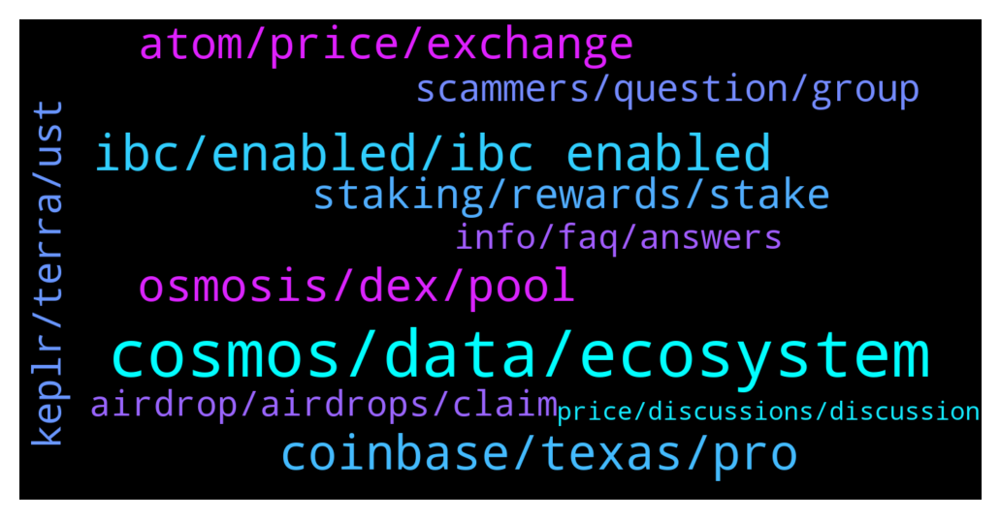

# **@cosmosproject**
 ## Analysis for **2022-01-07** - **2022-01-08**.

---

## 📊 **Basic Stats**

**n_messages_sent**: 525

---

---

## 🔝 **Top keywords and related messages**

1. **cosmos, data, ecosystem**

    @Crypto_V1 --- *Looks like the #Stargate upgrade is gaining traction! $SWTH 45% up in current market conditions thanks to the awesome Cosmos family! ⚛ 🚀  The community sponsored celebration giveaway is now worth $1,250. Looking forward to be part of the Cosmos ecosystem!   https://twitter.com/CryptoRanger9/status/1479800475222478849?s=20* **--->** [TG Discussion](https://t.me/cosmosproject/470729)

    @DAD_DEFI --- *Why BSC not included in the Cosmos ecosystem? Its built on Cosmos SDK right?* **--->** [TG Discussion](https://t.me/cosmosproject/469404)

    @JoeD1rt --- *When is next cosmos upgrade scheduled for?* **--->** [TG Discussion](https://t.me/cosmosproject/470169)

    @KellySlaterKook --- *Guys do we have any project that acts like cross chain layer 2 solution and connects ETH cosmos and other chains?* **--->** [TG Discussion](https://t.me/cosmosproject/469915)

    @badcapitan02 --- *Cosmos resists the market downturn well* **--->** [TG Discussion](https://t.me/cosmosproject/470873)

    @cosmicmatt --- *Got it. There’s several articles/posts going around with Mar 31st date. Though no hard date for now* **--->** [TG Discussion](https://t.me/cosmosproject/470211)

2. **ibc, enabled, ibc enabled**

    @bkc1111 --- *Is there a link where I can find all the blockchain channel IDs for IBC transfer in the cosmos ecosystem? I have this link: https://medium.com/chainapsis/getting-started-with-ibc-transfers-276e9ce91e17  But I can't seem to find the channel IDs in here.* **--->** [TG Discussion](https://t.me/cosmosproject/469170)

    @ZoltanAtom --- *You might start with Cosmos official website;  https://cosmos.network/ecosystem/tokens  IBC-enabled chains are at mapofzones.com* **--->** [TG Discussion](https://t.me/cosmosproject/470104)

    @Sephirote --- *Thanks, that's interesting.  So if I understand correctly, being IBC enabled allows for better interoperability between an IBC enabled chain (let's say Terra) and another IBC enabled chain (let's say Osmosis). In this case, devs could easily create a Dapp to move Luna tokens to Osmosis without needing a bridge?* **--->** [TG Discussion](https://t.me/cosmosproject/469446)

    @Pastashooter105 --- *LOL. You never used a Bridge, obviously. IBC transfers are relatively smooth compared to bridges* **--->** [TG Discussion](https://t.me/cosmosproject/470248)

    @AtomJazz --- *This feature will be available once Kava and Umee connect to IBC later this month* **--->** [TG Discussion](https://t.me/cosmosproject/469773)

    @Crypto_V1 --- *EVM is months away. Stargate upgrade first. Then IBC integration!* **--->** [TG Discussion](https://t.me/cosmosproject/470800)

3. **coinbase, texas, pro**

    @degen_salty_sam --- *…it does work like that. Use a quality vpn like mullvad* **--->** [TG Discussion](https://t.me/cosmosproject/470457)

    @Stan --- *Thanks, I will go with Coinbase* **--->** [TG Discussion](https://t.me/cosmosproject/469605)

    @devilal_jaat_01 --- *shows all transations of that coin* **--->** [TG Discussion](https://t.me/cosmosproject/469919)

    @TicoJohnny --- *I missed this conversation, what exchange are you using that’s now allowed in Texas* **--->** [TG Discussion](https://t.me/cosmosproject/470473)

    @TicoJohnny --- *I buy on Coinbase pro, it is native, it’s Binance that is not* **--->** [TG Discussion](https://t.me/cosmosproject/470465)

    @Graphicals --- *It is but coinbase isnt native, its mostly, if not, all ERC-20, not ideal haha* **--->** [TG Discussion](https://t.me/cosmosproject/470464)

4. **osmosis, dex, pool**

    @Hodl --- *Can you give me the one min pitch of what osmosis is?  Is it just a dex for cosmos ?* **--->** [TG Discussion](https://t.me/cosmosproject/470192)

    @Ian --- *I can’t believe how seemless osmosis is* **--->** [TG Discussion](https://t.me/cosmosproject/469167)

    @TicoJohnny --- *feel free to head over to https://t.me/osmosis_chat they have lots of detailed information on how osmosis works* **--->** [TG Discussion](https://t.me/cosmosproject/469261)

    @TicoJohnny --- *Osmosis has a good tutorial here: https://t.me/osmosis_chat/405529* **--->** [TG Discussion](https://t.me/cosmosproject/469222)

    @nicholasds --- *Guys, where can i stake on Osmosis?* **--->** [TG Discussion](https://t.me/cosmosproject/469979)

    @TicoJohnny --- *If you haven't checked out Osmosis, you should 😗* **--->** [TG Discussion](https://t.me/cosmosproject/469293)

5. **atom, price, exchange**

    @StudentForAllMyLife --- *Comparing ATOM to ETH what is the level of ATOM decentralization?  Higher, lower and why?* **--->** [TG Discussion](https://t.me/cosmosproject/469266)

    @AtomJazz --- *ATOM is available on all major exchanges, including Coinbase, Kraken, Binance and Cryptocom* **--->** [TG Discussion](https://t.me/cosmosproject/469086)

    @ZoltanAtom --- *Hey,I think you can’t get Atom without any exchange. Unless if you have any assets at your exchange and swap to Atom.* **--->** [TG Discussion](https://t.me/cosmosproject/469938)

    @Nicolejustin --- *Hey, what did you think about atom* **--->** [TG Discussion](https://t.me/cosmosproject/469965)

    @oguzhan01010101 --- *İ have atom. Where can i swap to USD?* **--->** [TG Discussion](https://t.me/cosmosproject/470120)

    @koriagi --- *admin welp how to buy atom?* **--->** [TG Discussion](https://t.me/cosmosproject/470534)

6. **staking, rewards, stake**

    @Jokrogge --- *Is Always better get rewards from staking each day or someone wait 2/3 days for get rewards?* **--->** [TG Discussion](https://t.me/cosmosproject/470318)

    @perry11741 --- *Other projects offering high APR staking are OSMOSIS & JUNO* **--->** [TG Discussion](https://t.me/cosmosproject/469709)

    @AGoodProject --- *Using ATOM for loan collateral......  What is the staking % ? Is there anything I can read about staking?* **--->** [TG Discussion](https://t.me/cosmosproject/469769)

    @Tony_Smart --- *thanks. where's the best place to stake?* **--->** [TG Discussion](https://t.me/cosmosproject/469683)

    @m00nm4chine --- *when you stake ATOM do you get a tradable receipt? like sATOM or something* **--->** [TG Discussion](https://t.me/cosmosproject/470390)

    @Geoffrey --- *Good evening ! By any chance does someone have a ledger discount/referral code ? Décided to secure my Atoms 😁* **--->** [TG Discussion](https://t.me/cosmosproject/469121)

7. **keplr, terra, ust**

    @Irontigerr --- *I want to add tokens to keplr but i dont have the add token button on the menu* **--->** [TG Discussion](https://t.me/cosmosproject/469865)

    @AtomJazz --- *Yeah you can't do that afaik, but I'm not an expert on Keplr related stuff tbh 😁* **--->** [TG Discussion](https://t.me/cosmosproject/470312)

    @shadow_dweller --- *Hey guys, while using Keplr if I’ve deployed LP how can I see accrued interest etc, also the in bonding period, for instance if I selected 7 days unbonding how do I see when that period is completed ? Thanks* **--->** [TG Discussion](https://t.me/cosmosproject/469660)

    @comingla --- *How can I send Ust from keplr to terra station?* **--->** [TG Discussion](https://t.me/cosmosproject/469221)

    @AtomJazz --- *You can sure. You can also export your mnemonic code from trust wallet to Keplr* **--->** [TG Discussion](https://t.me/cosmosproject/469805)

    @bkc1111 --- *It looks like it. Let's say I manually want to add Osmosis on the Keplr wallet via new IBC transfer channel. So the channel no. is 141 then?* **--->** [TG Discussion](https://t.me/cosmosproject/469182)

8. **scammers, question, group**

    @AtomJazz --- *Oh god, that will get you tons of scam DMs. Pls be careful* **--->** [TG Discussion](https://t.me/cosmosproject/469122)

    @Hodl --- *I'm also assuming all the ppl in my DMs since i posted a question here are scammers? Is that correct lol. Just stick to ppl talking to me in here* **--->** [TG Discussion](https://t.me/cosmosproject/470254)

    @Common_Cents_Crypto --- *Damn, these scammers are relentless. Already received 3 or 4 DM’s…   To save all you soulless f’ers some time, stop DMing me asking how you can help, when all I need is a public response to a public question!   Stay safe out there fellow Cosmonauts! ✌🏻😎* **--->** [TG Discussion](https://t.me/cosmosproject/470423)

    @Moswongton --- *Oh man full of scammers on here* **--->** [TG Discussion](https://t.me/cosmosproject/469332)

    @rafaelp_eth --- *Scammers get out of my DM* **--->** [TG Discussion](https://t.me/cosmosproject/469417)

    @Artyom --- *Is it really usefull to report the scammers ? I just block them* **--->** [TG Discussion](https://t.me/cosmosproject/470910)

9. **airdrop, airdrops, claim**

    @benroth --- *Aswell as an airdrop wallet checker to see what i've missed?* **--->** [TG Discussion](https://t.me/cosmosproject/470206)

    @trotskiiiiiy --- *Hello! How to get an airdrop by staking atom and scrt?* **--->** [TG Discussion](https://t.me/cosmosproject/469577)

    @ZoltanAtom --- *Hello,just stake them at Keplr or cosmotation. That’s all. Also join airdrop community channel.   https://t.me/CosmosAirdrops* **--->** [TG Discussion](https://t.me/cosmosproject/469579)

    @MisterKeki --- *Seen some airdrop eligibility searchs where you could put in just 1 type of address, for example ATOM, and it would find if you had both ATOM and OSMO. Seems to me it has to be some way to do it. I dno* **--->** [TG Discussion](https://t.me/cosmosproject/470304)

    @TicoJohnny --- *It's kind of a good idea to put in 5 or so to meet some recent airdrop eligibility requirements* **--->** [TG Discussion](https://t.me/cosmosproject/469434)

    @Ogechl --- *Hello please is there any ongoing Airdrop    Because I have one counting in my Dapps right now* **--->** [TG Discussion](https://t.me/cosmosproject/470385)

10. **info, faq, answers**

    @TicoJohnny --- *This is a good start: https://docs.akash.network/guides/deploy* **--->** [TG Discussion](https://t.me/cosmosproject/469478)

    @TicoJohnny --- *Head here for more info: https://t.me/osmosis_chat* **--->** [TG Discussion](https://t.me/cosmosproject/470195)

    @AtomJazz --- *You can go over FAQ. Maybe you'll find some helpful info https://faq.keplr.app/* **--->** [TG Discussion](https://t.me/cosmosproject/470323)

    @AtomJazz --- *You're going to have to be a bit more specific.* **--->** [TG Discussion](https://t.me/cosmosproject/469850)

    @TicoJohnny --- *Hopefully you got these answers in the FAQ, let me know if you have further questions* **--->** [TG Discussion](https://t.me/cosmosproject/469418)

    @Graphicals --- *go on their website, it explains it all* **--->** [TG Discussion](https://t.me/cosmosproject/469348)

