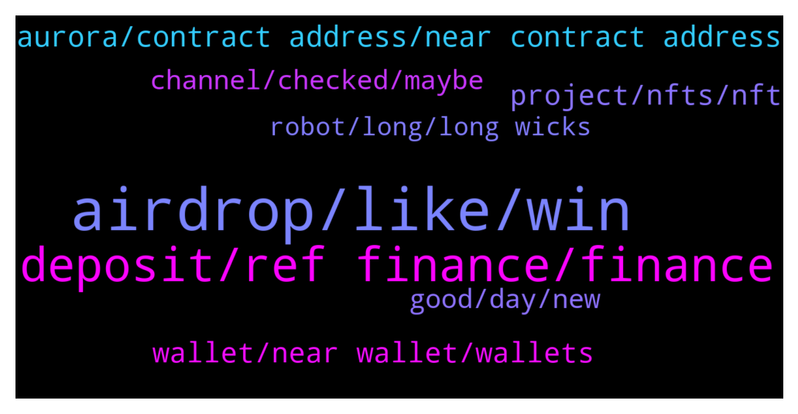

# **@cryptonear**
 ## Analysis for **2022-01-07** - **2022-01-08**.

---

## 📊 **Basic Stats**

**n_messages_sent**: 322

---

---

## 🔝 **Top keywords and related messages**

1. **airdrop, like, win**

    @TheGo1denBull --- *@Donsingh876 screenshot the airdrop info please* **--->** [TG Discussion](https://t.me/cryptonear/279392)

    @bailey_12 --- *Hey team,   If you looking for airdrop, do join the podcast for a chance to win an airdrop bois  https://twitter.com/BaileyVu12/status/1479376715252043777* **--->** [TG Discussion](https://t.me/cryptonear/278615)

    @NEARverse_xd --- *Yeah there should be a different group of airdrops and testnet events to stay alert. Maybe in future 🙌* **--->** [TG Discussion](https://t.me/cryptonear/278746)

    @rahulgoel007 --- *Ahhh there is no such criteria like that.  Ref announced Airdrop for users who swapped and did from farm. Apart from that there are some testnet events which you can take part in.* **--->** [TG Discussion](https://t.me/cryptonear/278722)

    @fynyc --- *Hello guys, in the future near stackers will have some airdrops?* **--->** [TG Discussion](https://t.me/cryptonear/280091)

    @Stelcy_Chelsey --- *Yeah 🤩 Followed up your program today but didn't get an airdrop ☺️* **--->** [TG Discussion](https://t.me/cryptonear/279414)

2. **deposit, ref finance, finance**

    @John --- *let's say you want to swap wNEAR to USDC - is there an option to transfer that USDC to an exchange from ref.finance?* **--->** [TG Discussion](https://t.me/cryptonear/279199)

    @John --- *@rahulgoel007 @NEARverse_xd Guys - in ref.finance - can you 1) deposit Near (receive wNear) 2) Swap wNear for USDC ---> it looks like you can from the UI - but then how would you withdraw that USDC ?* **--->** [TG Discussion](https://t.me/cryptonear/279192)

    @rahulgoel007 --- *You can get the transaction from https://explorer.mainnet.near.org/ but haven't tried to download that in CSV  @larry_lang @Kripto_Raptor* **--->** [TG Discussion](https://t.me/cryptonear/278903)

    @badidif --- *Ye the problem is i dont see my wallet worth from ref finance* **--->** [TG Discussion](https://t.me/cryptonear/277826)

    @SamuelOwen8 --- *What am trying to say is that how can I withdraw to my trust wallet account* **--->** [TG Discussion](https://t.me/cryptonear/279048)

    @kv9990 --- *There's a deposit page on ref :) use it* **--->** [TG Discussion](https://t.me/cryptonear/277829)

3. **aurora, contract address, near contract address**

    @cuongdcc --- *sell it for usdt then transfer to Aurora via https://synapseprotocol.com/* **--->** [TG Discussion](https://t.me/cryptonear/280193)

    @Gokubaba --- *For accepted proposals refund of 0.1near is given if i am not wrong😅* **--->** [TG Discussion](https://t.me/cryptonear/279918)

    @y_bob --- *does anyone know a way to swap the near token from BSC to Aurora or NEAR?* **--->** [TG Discussion](https://t.me/cryptonear/280190)

    @iamkemoo --- *Here is a list of DApps where you can stake or farm with $NEAR  Near Network ▶️https://app.ref.finance/ (Near Mainnet) ▶️https://metapool.app/dapp/mainnet/meta/ (Near Mainnet) ▶️https://app.cheddar.farm/  Aurora Network ▶️https://app.rose.fi/#/ (Aurora) ▶️https://www.trisolaris.io/ (Aurora) ▶️https://wannaswap.finance/ (Aurora)* **--->** [TG Discussion](https://t.me/cryptonear/279022)

    @Apeinpeace --- *Sers, what's the tool to remove approval in Aurora, Debank seems not support yet* **--->** [TG Discussion](https://t.me/cryptonear/279252)

    @Kaiguy69 --- *hey guys how do i check wallet distribution for a project called empyrean launched on aurora yesterday?* **--->** [TG Discussion](https://t.me/cryptonear/279157)

4. **wallet, near wallet, wallets**

    @badidif --- *Can some1 help me with near wallet* **--->** [TG Discussion](https://t.me/cryptonear/277813)

    @a1sunny --- *Hello  I am new here. And have near in my near wallet. I hold NEAR for long term  Can you please guide me how can i get extra benifits by near. Like Airdrops etc.  Thanks 😊* **--->** [TG Discussion](https://t.me/cryptonear/278690)

    @Tony_sharks --- *I try to login my wallet by passphrase. But it can’t. I dont know why.* **--->** [TG Discussion](https://t.me/cryptonear/279688)

    @Tony_sharks --- *Hello, i have a trouble with my near wallet. Where can i find the help? Please. Thank you* **--->** [TG Discussion](https://t.me/cryptonear/279668)

    @israel_igboze --- *Yes, presently having that issue.  Out proposal didn't cover onboarding funds for multiple wallets.  Now can't actualize the number if wallets to be created* **--->** [TG Discussion](https://t.me/cryptonear/278081)

    @israel_igboze --- *Please is there a way of creating wallets without initial funding?* **--->** [TG Discussion](https://t.me/cryptonear/278061)

5. **project, nfts, nft**

    @AkatsukiRedSun --- *Near project as a whole 😁* **--->** [TG Discussion](https://t.me/cryptonear/278303)

    @larry_lang --- *u meant the NEAR nfts or near project? if it about NEAR project then i like ref.finance the most=)))* **--->** [TG Discussion](https://t.me/cryptonear/278302)

    @naveenkandwal --- *Want to know more about NFTs??  How to convert your songs at art to NFTs and sell??  Best market place to sell your NFTs??  Want to know more about NEAR BLOCKCHAIN??  Don't miss this AMA hosted by NEAR Nigeria (NPKGUILD) team where the C1 FOUNDATION will explain everything about NFTs on NEAR blockchain, what they are into and Future plans including future of NFTs.  Venue: https://t.me/NPKGUILD  For more info follow us: https://twitter.com/nearprotocolng  GIVEAWAY: *Free NFTs for all attendees** **--->** [TG Discussion](https://t.me/cryptonear/279301)

    @AkatsukiRedSun --- *That's great to hear.. I believe its still a newly established project and could go further expansion* **--->** [TG Discussion](https://t.me/cryptonear/278308)

    @kv9990 --- *It's a NFT in your wallet 👀✌️ Keep it, might be worth a fortune one day 😉😁* **--->** [TG Discussion](https://t.me/cryptonear/280147)

    @Rakesh1259ApeSwap --- *Sir can i get a link how to sell nft in near market* **--->** [TG Discussion](https://t.me/cryptonear/280009)

6. **channel, checked, maybe**

    @DanoZoZo --- *Have you checked Cheddar? I think it's on Mainnet now* **--->** [TG Discussion](https://t.me/cryptonear/279024)

    @bennychang --- *Any ideas where I can find it?* **--->** [TG Discussion](https://t.me/cryptonear/280214)

    @larry_lang --- *maybe this can help u out* **--->** [TG Discussion](https://t.me/cryptonear/278724)

    @bennychang --- *Is there any info on berry club? How do you get bananas?* **--->** [TG Discussion](https://t.me/cryptonear/280201)

    @lekagod --- *Thanks, but can not find the IDO category* **--->** [TG Discussion](https://t.me/cryptonear/279672)

    @larry_lang --- *perharps, u can seek it in this channel if i am not wrong. https://t.me/merchantsofnear* **--->** [TG Discussion](https://t.me/cryptonear/278604)

7. **good, day, new**

    @bailey_12 --- *Oh hey man,  My duty is on our Reddit sub recently so I am mostly there* **--->** [TG Discussion](https://t.me/cryptonear/278118)

    @bailey_12 --- *hi @Stelcy_Chelsey, long time no see.  Hope you doing all good..* **--->** [TG Discussion](https://t.me/cryptonear/279233)

    @TheGo1denBull --- *Anything exciting I missed out on since I've been away?  @FritzWagner* **--->** [TG Discussion](https://t.me/cryptonear/279352)

    @bailey_12 --- *Oh woah, hello .. haha welcome to Near train !!* **--->** [TG Discussion](https://t.me/cryptonear/279703)

    @israel_igboze --- *Hello! Been a while. How have you been?* **--->** [TG Discussion](https://t.me/cryptonear/278113)

    @TheGo1denBull --- *Yeah I've been taking painkillers throughout the day. Long Cold showers help bring down my fevers. Trying my best to chug water as much as possible but my taste buds are off now. Drinking green tea now. This is awake for me to get back to working out again. Since being a new dad I've been lazy with fitness.* **--->** [TG Discussion](https://t.me/cryptonear/279480)

