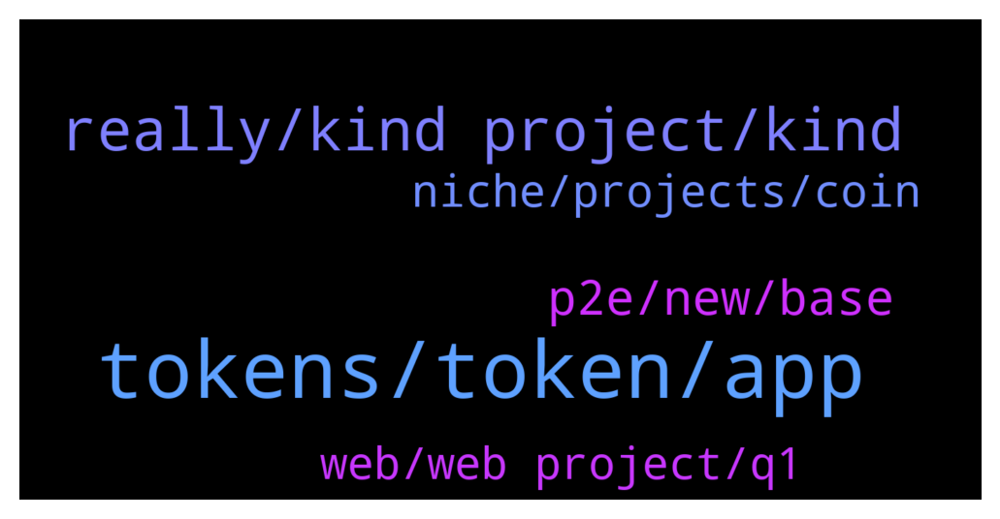

# **@defisearchpublic**
 ## Analysis for **2022-01-06** - **2022-01-08**.

---

## 📊 **Basic Stats**

**n_messages_sent**: 83

---

---

## 🔝 **Top keywords and related messages**

1. **tokens, token, app**

    @danizsw --- *it is where you can create your tokens and have the latest news of tokens to be listed* **--->** [TG Discussion](https://t.me/defisearchpublic/240958)

    @mikaztirf --- *project offers staking and a token rewards of every bet* **--->** [TG Discussion](https://t.me/defisearchpublic/240912)

    @GioFlorin --- *may I know whats their token first?* **--->** [TG Discussion](https://t.me/defisearchpublic/240929)

    @mikaztirf --- *those tokens you earn can be stake to participate the governance in the future* **--->** [TG Discussion](https://t.me/defisearchpublic/240922)

    @GioFlorin --- *what do you mean token rewards?* **--->** [TG Discussion](https://t.me/defisearchpublic/240913)

    @dionieP --- *exactly 😂 everyone loves earning through game* **--->** [TG Discussion](https://t.me/defisearchpublic/240901)

2. **really, kind project, kind**

    @danizsw --- *how does the project works I know its a blockchain lol* **--->** [TG Discussion](https://t.me/defisearchpublic/240973)

    @danizsw --- *what kind of project is this?* **--->** [TG Discussion](https://t.me/defisearchpublic/240968)

    @wenmis01 --- *Really that huge. This seems a potential project for this year* **--->** [TG Discussion](https://t.me/defisearchpublic/240888)

    @jeshug01 --- *Yes. Many projects going to launch this quarter.* **--->** [TG Discussion](https://t.me/defisearchpublic/240877)

    @mykillandgelo --- *this looks like a data transferring* **--->** [TG Discussion](https://t.me/defisearchpublic/240976)

    @GioFlorin --- *ya know just to check about who trust them before I jump on their project* **--->** [TG Discussion](https://t.me/defisearchpublic/240920)

3. **p2e, new, base**

    @mykillandgelo --- *new game turn base p2e, ROI isn't that big but looks good since its freshly released* **--->** [TG Discussion](https://t.me/defisearchpublic/240963)

    @mykillandgelo --- *what are you spotting right now?* **--->** [TG Discussion](https://t.me/defisearchpublic/240960)

    @jwongjts --- *yup what p2e you're playing right now?* **--->** [TG Discussion](https://t.me/defisearchpublic/240902)

    @GioFlorin --- *what kind of p2e youre looking my friend?* **--->** [TG Discussion](https://t.me/defisearchpublic/240898)

    @GioFlorin --- *its a new p2e turn base gameplay* **--->** [TG Discussion](https://t.me/defisearchpublic/240906)

    @dionieP --- *currenty playing axie and looking for more nft p2e* **--->** [TG Discussion](https://t.me/defisearchpublic/240903)

4. **web, web project, q1**

    @purestofpure --- *new blockchain releasing its q1 in the next 3 months* **--->** [TG Discussion](https://t.me/defisearchpublic/240967)

    @danizsw --- *can you tell me the difference about 2.0 and 3.0?* **--->** [TG Discussion](https://t.me/defisearchpublic/240981)

    @mykillandgelo --- *great! I'll check this one since I am also looking for some new web 3.0 project* **--->** [TG Discussion](https://t.me/defisearchpublic/240988)

    @purestofpure --- *2.0 is the most common web like what we are using today* **--->** [TG Discussion](https://t.me/defisearchpublic/240982)

    @danizsw --- *so its another web 3.0 project* **--->** [TG Discussion](https://t.me/defisearchpublic/240980)

    @jeshug01 --- *This Q1. But Testnet is already live so you may see it now.* **--->** [TG Discussion](https://t.me/defisearchpublic/240891)

5. **niche, projects, coin**

    @mykillandgelo --- *new coin to invest guys suggest it now* **--->** [TG Discussion](https://t.me/defisearchpublic/240953)

    @Mylesctty --- *One very good thing I have come to learn about crypto-currency is not to quickly wave a project off because of the niche the project belongs to or how poor other projects in the niche are doing, Stabila coin is by far one of the most promising projects out there now and you are entitled to do your research about that fact. Dyor on stabilastb* **--->** [TG Discussion](https://t.me/defisearchpublic/240950)

    @mikaztirf --- *yep that's right, if you're familiar of future trading* **--->** [TG Discussion](https://t.me/defisearchpublic/240916)

    @mikaztirf --- *it is made to bet the prices of crypto assets like avax* **--->** [TG Discussion](https://t.me/defisearchpublic/240911)

    @dionieP --- *anything bro as long as good profit* **--->** [TG Discussion](https://t.me/defisearchpublic/240904)

    @mikaztirf --- *like for example you wanted to bet on BTC, ETH, SOL etc* **--->** [TG Discussion](https://t.me/defisearchpublic/240928)

