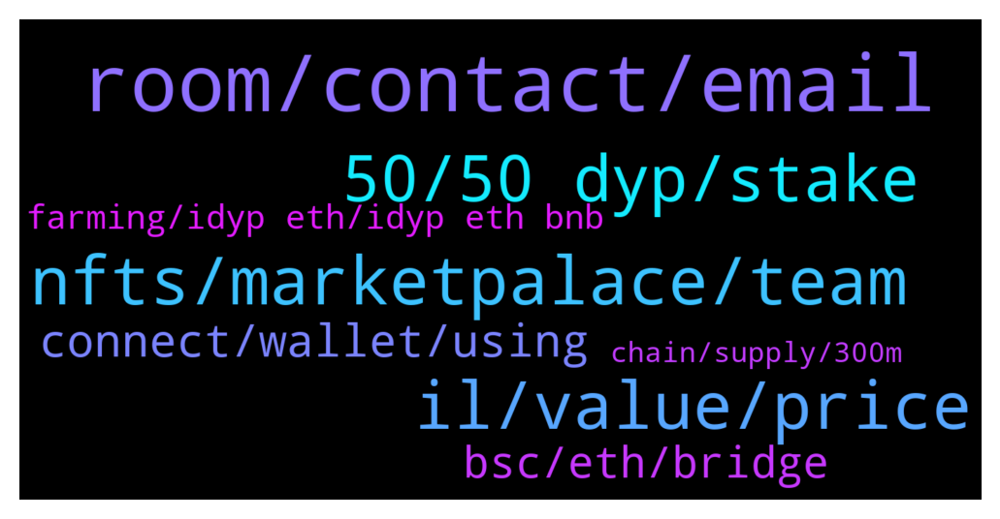

# **@dypfinance**
 ## Analysis for **2022-01-07** - **2022-01-08**.

---

## 📊 **Basic Stats**

**n_messages_sent**: 190

---

---

## 🔝 **Top keywords and related messages**

1. **room, contact, email**

    @Oye_Blockchain_Writer --- *I'm experienced and skilled Blockchain/Metaverse/Nfts/Defi/Cryptocurrency PR and Wordsworth with impeccable service in writing style.  I am also an expert in writing whitepaper, Technical Writing, Copywriting, AI(Artificial Intelligence) and ICO marketing content composing.  I am optimistic that my technique set will shape and provide informative and instructional content for the blockchain/cryptocurrency community.* **--->** [TG Discussion](https://t.me/dypfinance/237962)

    @mohammadnickeghbal --- *I new in group , how can earn income from defi  daily ? Can guide  me , thanks* **--->** [TG Discussion](https://t.me/dypfinance/237701)

    @Noun --- *Please provide me the group link* **--->** [TG Discussion](https://t.me/dypfinance/237677)

    @Disguy125 --- *Yeah for sure....I want to get atleast 10 people in the room for here to start with a catchy title/topic to get others to join in.* **--->** [TG Discussion](https://t.me/dypfinance/237778)

    @Disguy125 --- *Someone can make a room but when the room closes its over its live social voice chat. Should we do one tonight in like 4-5 hours? Anyone can start one.* **--->** [TG Discussion](https://t.me/dypfinance/237772)

    @herbie1996 --- *Is this a permanent group or something that expires? I downloaded clubhouse but couldn’t find nothing dyp related* **--->** [TG Discussion](https://t.me/dypfinance/237766)

2. **nfts, marketpalace, team**

    @DhoniMSD516 --- *It will done mate, this month all the pending from 2021 will be coming.* **--->** [TG Discussion](https://t.me/dypfinance/237871)

    @Nji_jalen --- *👍. I am wait for thats sir.. Hope core team work fastly.. So all roadmap can be done soon* **--->** [TG Discussion](https://t.me/dypfinance/237872)

    @Nji_jalen --- *Still wait all 2021 roadmap done...😊* **--->** [TG Discussion](https://t.me/dypfinance/237870)

    @Hello --- *Any update on the listing yet?* **--->** [TG Discussion](https://t.me/dypfinance/237820)

    @Jackmambaaa --- *So only thing is patience and trust the process 🙂* **--->** [TG Discussion](https://t.me/dypfinance/237891)

    @Nji_jalen --- *@mihaiDYP please make ama before marketpalace launch* **--->** [TG Discussion](https://t.me/dypfinance/237887)

3. **il, value, price**

    @jtrevorchapman --- *I invested 200k USD and only have 60k now.* **--->** [TG Discussion](https://t.me/dypfinance/237555)

    @BaSVER --- *Hi, why is idyp always going down and coinmarketcap shows that trading started only on December 27th, I invested $ 2700 and now I only have 1600$* **--->** [TG Discussion](https://t.me/dypfinance/237498)

    @shinigamikami --- *Give it time mate, you’re not that down due to the rewards and IL is only temporary. My $6k deposit on bsc buyback peaked $19k now it’s barley $1500 but I’m not really bothered cause I plan to leave it there for at least 5 months* **--->** [TG Discussion](https://t.me/dypfinance/237472)

    @Craig --- *Thanks for the article. Back to my original post - what's the short description on how IL fluctuates? I have a hard time understanding why it would hit a 100% at any time and what would cause it to improve back.* **--->** [TG Discussion](https://t.me/dypfinance/237491)

    @iamJubi --- *As the value of the tokens involved went down the LP value went down, vice versa if it goes high, your LP value goes high . You might have entered the farm when iDYP price is at peak.* **--->** [TG Discussion](https://t.me/dypfinance/237914)

    @shinigamikami --- *Means the huge sell pressure won’t last that long* **--->** [TG Discussion](https://t.me/dypfinance/237501)

4. **50, 50 dyp, stake**

    @Craig --- *Over the past 5 weeks I've deposited $100K worth of assets into this protocol. I've received $18,195 in rewards since. That's the good news. The bad news is I've incurred $21,191 in impermanent losses. Combine that with the fees and I'm losing my ass with this protocol. Was very excited about DYP when I began, but had no idea the amount of IL I'd be suffering. I expected some IL, but not more than the value of my deposited assets into a protocol.* **--->** [TG Discussion](https://t.me/dypfinance/237455)

    @melodywaisted --- *How will they know that we hold at least 50 dyp I bought on KuCoin* **--->** [TG Discussion](https://t.me/dypfinance/237603)

    @iamJubi --- *50 DYP holdings should be on your private wallet like metamask.* **--->** [TG Discussion](https://t.me/dypfinance/237604)

    @Vl_investor --- *We have the last governance proposal for burning some #DYP tokens on the #Avalanche pools V1.  Cast your vote right now! 🔥🔥 https://gov-avax.dyp.finance/proposals/2   Guys please vote to burn DYP coins 🔥🔥🔥🔥🔥🔥🔥🔥🔥🔥🔥🔥🔥* **--->** [TG Discussion](https://t.me/dypfinance/237992)

    @hemanrock --- *@Lordofsales please keep discussion to DYP* **--->** [TG Discussion](https://t.me/dypfinance/237732)

    @A --- *Besides holding 50 Dyp  What else gets us whitened* **--->** [TG Discussion](https://t.me/dypfinance/237581)

5. **connect, wallet, using**

    @fightinamish --- *Got it reinvested, thank you.  It does a weird thing (especially on iPhone) where you click idyp allocation and it goes to the page for 1-2 seconds and then snaps back to connect wallet.  I can access everything on site through my phone except for idyp.  Then on mac I can get it to work but after multiple attempts.  Nothing major, just an fyi* **--->** [TG Discussion](https://t.me/dypfinance/237452)

    @hemanrock --- *Please make sure you are well connected to right Wall and right network.* **--->** [TG Discussion](https://t.me/dypfinance/237450)

    @Aliceasdf --- *Why can't I always connect when I link my wallet?* **--->** [TG Discussion](https://t.me/dypfinance/237618)

    @Aliceasdf --- *But what should I do if I can't connect to the wallet* **--->** [TG Discussion](https://t.me/dypfinance/237622)

    @fightinamish --- *Idyp allocation page isn’t working on my desktop (won’t load, unable to see balance or reinvest).  Any work being done internally?* **--->** [TG Discussion](https://t.me/dypfinance/237449)

    @DhoniMSD516 --- *You need to connect everytime you visit our website this is for security purpose, we cannot have you connected always* **--->** [TG Discussion](https://t.me/dypfinance/237621)

6. **bsc, eth, bridge**

    @Craig --- *All of them - BSC, ETH and AVAX.* **--->** [TG Discussion](https://t.me/dypfinance/237458)

    @panda_999999 --- *This bridge is too inconvenient, hope it can be improved in the future* **--->** [TG Discussion](https://t.me/dypfinance/237864)

    @BJevery632 --- *hi guys, noob here.  So this is in Eth mainnet?* **--->** [TG Discussion](https://t.me/dypfinance/237829)

    @iamJubi --- *DYP is on 3 chains which is ETh, BSC, and Avalanche chain* **--->** [TG Discussion](https://t.me/dypfinance/237830)

    @panda_999999 --- *How do I use the bridge to get from BSC to AVax* **--->** [TG Discussion](https://t.me/dypfinance/237862)

    @DhoniMSD516 --- *So if you want to move BSC to AVAX BSC-ETH-AVAX is the route* **--->** [TG Discussion](https://t.me/dypfinance/237861)

7. **farming, idyp eth, idyp eth bnb**

    @shinigamikami --- *Read my messages again, I’m farming in all chains and staking in two chains* **--->** [TG Discussion](https://t.me/dypfinance/237483)

    @Craig --- *We're comparing apples to oranges. I'm farming and you're staking, so different IL's taking place.* **--->** [TG Discussion](https://t.me/dypfinance/237482)

    @Craig --- *I see the option - what's the difference between this and farming, basically?* **--->** [TG Discussion](https://t.me/dypfinance/237480)

    @Paulus --- *Hmm, WAVAX farming 3 days lock seem keep losing.* **--->** [TG Discussion](https://t.me/dypfinance/237974)

    @iamJubi --- *APY is dynamic. Also consider the anti manipulation feature. You can check this link find farming for more details https://link.medium.com/2nXyI0UkPlb* **--->** [TG Discussion](https://t.me/dypfinance/237836)

    @shinigamikami --- *Farming can only be 100% down if iDYP, ETH,BNB,AVAX and DYP goes to zero* **--->** [TG Discussion](https://t.me/dypfinance/237494)

8. **chain, supply, 300m**

    @profit984 --- *but i saw in each chain theres 300m total supply* **--->** [TG Discussion](https://t.me/dypfinance/237539)

    @profit984 --- *x4 chain will be 1.2b total supply?* **--->** [TG Discussion](https://t.me/dypfinance/237537)

    @iamJubi --- *Cmc reflects datas, including total supply in ALL chains. https://coinmarketcap.com/currencies/idefiyieldprotocol/* **--->** [TG Discussion](https://t.me/dypfinance/237548)

    @iamJubi --- *As I said reflected by data sites as 300m in every chain but the supply is not 300m supply for each chain.* **--->** [TG Discussion](https://t.me/dypfinance/237547)

    @iamJubi --- *Where? As I said total supply is 300M. it is just reflected 300M in every chain does not mean 300M each chain.* **--->** [TG Discussion](https://t.me/dypfinance/237540)

    @iamJubi --- *No. This is for all chain.* **--->** [TG Discussion](https://t.me/dypfinance/237538)

