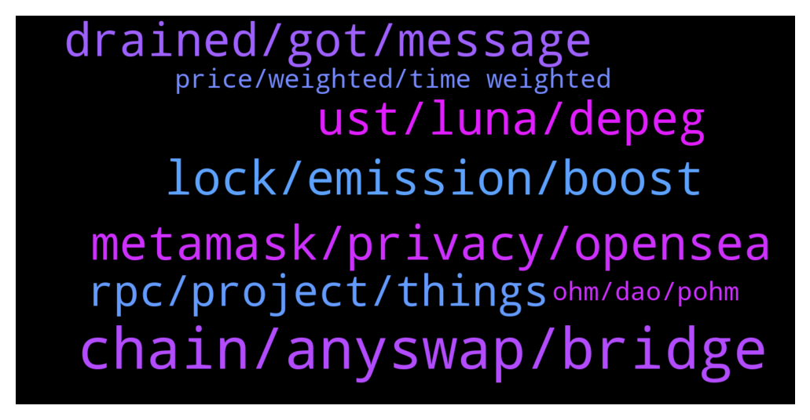

# **@lobsters_chat**
 ## Analysis for **2022-01-07** - **2022-01-08**.

---

## 📊 **Basic Stats**

**n_messages_sent**: 418

---

---

## 🔝 **Top keywords and related messages**

1. **chain, anyswap, bridge**

    @juju1234534 --- *Any Cosmos/Polkadot (Substrate) people here? Do these give you more flexibility for building an app specific chain? Or are all Cosmos/para chains also using the same execution clients? (With the customization not going beyond basic parameters such as block size/time etc?)* **--->** [TG Discussion](https://t.me/lobsters_chat/313359)

    @rahemanAli --- *yeah but anyswap/multichain has about 6B$ in TVL, which means it can support large volume cross-chain swaps which is v cool and hard to compete with.* **--->** [TG Discussion](https://t.me/lobsters_chat/313423)

    @Joe_C1 --- *Is there a sort of roadmap for multi chain pairs? Like when will we be able to trade usdc on Fantom for eth on ethereum? Or would this even be implemented and they’d only let you trade usdc on Fantom for weth on ethereum* **--->** [TG Discussion](https://t.me/lobsters_chat/313546)

    @juju1234534 --- *Does Avalanche have something similar to Cosmos/Substrate for their subnets? I.e. an easy and fast way to build compatible chains (application specific chains etc.)  Please more elaborate answers than „yes“ 😉  PS: I guess they don’t since Avalanche itself is just a gETH copy essentially and only their consensus design is custom. Or maybe I’m overestimating the power of something like substrate and in reality each substrate chain is effectively the same execution client as well (and customizability is only for basic parameters such as block size and block time etc.?)* **--->** [TG Discussion](https://t.me/lobsters_chat/313350)

    @enderwiggins1 --- *Okay, noob question: Can't you just make an eternal adapter in chainlink and peg to that? I guess the question is how much can you trust that one api endpoint chainlink is calling.* **--->** [TG Discussion](https://t.me/lobsters_chat/313402)

    @anisopteran --- *Yeah, centralized exchanges already exist. They provide a service that some people find useful.* **--->** [TG Discussion](https://t.me/lobsters_chat/313738)

2. **lock, emission, boost**

    @ivangbi --- *Please help me understand.  In CRV despite big emissions, you pretty much need to lock up a major part to stay up with x2.5 boost and not lose your share. The “ve lockers get proportionally increased” pretty much nullifies that and makes sure I can have my stake being diluted much slower + just keep selling rewards, so not the same feedback loop. Or no?* **--->** [TG Discussion](https://t.me/lobsters_chat/313591)

    @ssmccul --- *This is something I wish all ve-locks had* **--->** [TG Discussion](https://t.me/lobsters_chat/313274)

    @ivangbi --- *When convex gets bribed to vote, where the bribes go? For cvxCRV stakers to claim, or just go intotreasury somehow? (so it is like in a joint pool you can’t redeem from or every cvxCRV staker can claim?)* **--->** [TG Discussion](https://t.me/lobsters_chat/313697)

    @tandeloff --- *>By tokenizing the lock position this allows a single address to own more than one lock, locks balances are cumulative and each lock contributes to the overall ve balance  Will allow for nonlinear unlock schedule, could be used for more nuanced unlocking curves packed into NFT* **--->** [TG Discussion](https://t.me/lobsters_chat/313329)

    @laconeat --- *Hey yo, can anyone explain this basic assumption, what’s the reason to have a full emission when ve locked = 0, and have 0 emission when ve locked = 100%* **--->** [TG Discussion](https://t.me/lobsters_chat/313667)

    @ivangbi --- *How does this improve tho - you are using some veCRV to optimize and also take your own cut, but you don’t give any extra token… unless you just gib also a token then, which makes you convex?* **--->** [TG Discussion](https://t.me/lobsters_chat/313753)

3. **metamask, privacy, opensea**

    @JonathanDoe --- *Good read! Now the question is how do we change things?   For me, not being a software engineer, Web3 means that I am able to access dApps without having to create an username and a password, just with my private keys stored on a local “wallet” app.   But it is troublesome that MetaMask has the possibility to link my otherwise totally separated addresses, sending my privacy to shit. Or that OpenSea provides the API for viewing my jpeg NFTs, and that once they are removed from OpenSea, they cannot be viewed from my “wallet” app as well.   What is the solution? Does anyone of the leading devs in this space even care about these things? Or we’re all just chasing dough under the pretext of decentralized finance (no pun intended for our members here)?* **--->** [TG Discussion](https://t.me/lobsters_chat/313669)

    @alxdc --- *He still has a point. People in this community probably care of these things. And we're still majority in this space. However, if the usage spreads, average joe won't care about decentralization as written above. At that point, platforms having the best ease of use (at the cost of decentralization) will accumulate users. The more they grow the more power they get, to the point they can bend and dictate what gets developed next and which direction it takes, google-like.* **--->** [TG Discussion](https://t.me/lobsters_chat/313736)

    @anisopteran --- *the point is that you don't need metamask or opensea or anyone.* **--->** [TG Discussion](https://t.me/lobsters_chat/313686)

    @anisopteran --- *Metamask isn’t the only wallet in existence, and if you’re concerned that loading all of your keys into the same instance of an app allows them to be linked together, then don’t do that. Load them into separate instances of the app or different apps.* **--->** [TG Discussion](https://t.me/lobsters_chat/313723)

    @JonathanDoe --- *You don’t get it, do you? Average Joe uses MetaMask and OpenSea by default thinking they’re private and decentralized…* **--->** [TG Discussion](https://t.me/lobsters_chat/313729)

    @centralnarcoticsbureau --- *imo average joe doesn't care about privacy or decentralization* **--->** [TG Discussion](https://t.me/lobsters_chat/313732)

4. **ust, luna, depeg**

    @tiequan --- *yield only needs to drop ~2% APY to stabilize yield reserve.  No significant amount of capital is going to leave b/c of that.  Also there’s plenty of insurance options including ramping up of native ozone insurance for cheap if you’re worried about depeg or smart contract risk.  Anchor was never meant to permanently be at 20%, just at a fixed rate that represented the fixed staking rewards of the overcollateralized assets underlying.  Also in the nuke from ~55K to 42K BTC in an hour, the oracle for UST never went below 1* **--->** [TG Discussion](https://t.me/lobsters_chat/313574)

    @juju1234534 --- *The collapse of UST will be the biggest catastrophe that the space has seen yet.* **--->** [TG Discussion](https://t.me/lobsters_chat/313526)

    @tiequan --- *yeah and I’m saying that unless you are aware of some other risk other than UST depeg + underlying smart contract exploit risk, that ozone will cover that for 2%.  So really it’s just current APR - 2% to be fully hedged.  I agree if / when UST stable pool grows faster than collateral, yields will compress.  I see 15% as probably the lowest it would need to go in the mid term.  They can do other things ala Badger where you need to stake x veANC to get full yield, or fiddle with LTV requirements, onboard bSOL and bATOM etc.  From a facts based POV, ever since they made changes since last May + addition of Kujira & liquidation queue, UST doesn’t even depeg to 0.99 in a 30% BTC move in minutes* **--->** [TG Discussion](https://t.me/lobsters_chat/313585)

    @juju1234534 --- *We’re not talking about a temporary depeg. We’re talking about the edge case of a proper bank run where both UST and Luna go to zero. The insurance you’re talking about is not able to cover that case 🙃 (hint: look at the MC of UST)* **--->** [TG Discussion](https://t.me/lobsters_chat/313632)

    @bout3fiddy --- *Hi! I tried to gather some thoughts on Abracadabra’s degenbox strategy, the biking attack it imposes on Terra’s Anchor yield teserves and how it could potentially impact markets and curve pool pegs.  https://twitter.com/_bout3fiddy_/status/1479537871711264768?s=21  Please enjoy. If you think I am wrong anywhere, more than happy to listen to how I could improve my analysis!* **--->** [TG Discussion](https://t.me/lobsters_chat/313572)

    @juju1234534 --- *UST is built on a house of Luna. Once people collectively (in panic) decide that they don’t want to hold Luna, this house transforms into a house of air -> no way down „to derisk“. Rather a Pop 🧼🪡* **--->** [TG Discussion](https://t.me/lobsters_chat/313633)

5. **drained, got, message**

    @phil_muhbags --- *They signed a message or something. I forget the exact details. However people got their accounts drained* **--->** [TG Discussion](https://t.me/lobsters_chat/313565)

    @strategyofconflict --- *no, because that's still no proof lel; show me the compromised infra or protocol* **--->** [TG Discussion](https://t.me/lobsters_chat/313808)

    @da0man --- *they could just say it’s to block hackers or smth* **--->** [TG Discussion](https://t.me/lobsters_chat/313784)

    @svenblockchain --- *You think that bug is proof of it being a honeypot?* **--->** [TG Discussion](https://t.me/lobsters_chat/313816)

    @rocket_fuel --- *lel, I guess you never heard about the signal's eavesdropping "bug" either?* **--->** [TG Discussion](https://t.me/lobsters_chat/313810)

    @lefterisjp --- *God forbid you mention crypto, social media will attack you for wanting to destroy the environment until you retract: https://twitter.com/mozilla/status/1479143340159422468* **--->** [TG Discussion](https://t.me/lobsters_chat/313309)

6. **rpc, project, things**

    @Light --- *Hey guys, I'm a web2 software engineer, and unfortunately the past 2 years i was isolated from technology, so I wanted to ask, how can I catch up with everything? I have the coingecko how to defi books.. how can I learn the technicals of blockchain development and l1s and l2s chains and stuff... sorry for the beginner and kinda general question, any guidance in any direction is highly appreacited 🙏* **--->** [TG Discussion](https://t.me/lobsters_chat/313684)

    @MorriganIV --- *Lately I suggest https://www.web3.university/ for beginners as it has updated and organized info* **--->** [TG Discussion](https://t.me/lobsters_chat/313690)

    @Darrenlautf --- *https://twitter.com/PatrickAlphaC/status/1435981334502064131 heres a soldiity one thats pretty good* **--->** [TG Discussion](https://t.me/lobsters_chat/313700)

    @ivangbi --- *Will listen in background while working and let u know if worth it* **--->** [TG Discussion](https://t.me/lobsters_chat/313828)

    @Darrenlautf --- *https://thedailyape.notion.site/Coding-e6389ca272154727bc5b1a06b6e4e312 its a bit of a mess i'll need to reorg this notion but heres some guides* **--->** [TG Discussion](https://t.me/lobsters_chat/313699)

    @Pantani0x --- *This isn't a bad starting point either: https://web3.smsunarto.com/#c3eb3a5640c9404fbe27078d56efd51d* **--->** [TG Discussion](https://t.me/lobsters_chat/313691)

7. **price, weighted, time weighted**

    @iuriivv --- *Hi, guys. I am thinking about relatively stable coin which represents time weighted changes in Bitcoin price. Or whatever assets. I think projects like synthetics can do this. So having time interval is long enough we can have a coin which is stable same as FIAT currencies relative to goods prices. The problem to solve here is to have a stable coin without USD and other fiat currencies addiction.    Do you see any problems designing it? #tws* **--->** [TG Discussion](https://t.me/lobsters_chat/313392)

    @iuriivv --- *The problem of oracles is clear and I don't have questions about it. For me the question is how we can ensure that users will trade it according to the value.  With USD there is now problem, because you just create a pair on curve and you clearly see the demand and you can control the value. If the price  is a timeweighted value of an assets it is might be more difficult to control the market.   What do you think about this point?* **--->** [TG Discussion](https://t.me/lobsters_chat/313406)

    @iuriivv --- *The question is not about which asset to choose but how to make the peg time weighted.* **--->** [TG Discussion](https://t.me/lobsters_chat/313399)

    @em_dot --- *I think FLOAT is doing just that but wrt time weighted changes in ETH price* **--->** [TG Discussion](https://t.me/lobsters_chat/313396)

    @ivangbi --- *-> time weighted changes in Bitcoin price Wdym, or asking for oracle manipulations?* **--->** [TG Discussion](https://t.me/lobsters_chat/313394)

    @enderwiggins1 --- *if you are doing that, why not do it peg it to gold price.* **--->** [TG Discussion](https://t.me/lobsters_chat/313395)

