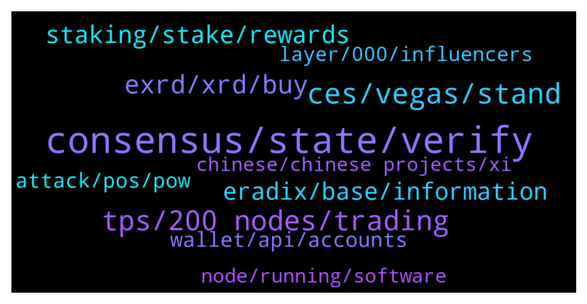

# **@radix_dlt**
 ## Analysis for **2022-01-07** - **2022-01-08**.

---

## 📊 **Basic Stats**

**n_messages_sent**: 904

---

---

## 🔝 **Top keywords and related messages**

1. **consensus, state, verify**

    @S --- *Right, but then how was I wrong? In BTC, you don't have to trust 'consensus'. You can verify every single transaction by yourself. In a sharded system, you have to 'trust' that consensus is honest.* **--->** [TG Discussion](https://t.me/radix_dlt/335585)

    @DefiYields --- *Right, ok.  I find this infographic to be very helpful.  https://www.radixdlt.com/post/cerberus-infographic-series-chapter-i  Of course, you are right that in sharding the global state is not stored anywhere. But that is why you have a consensus mechanism. As far as I’m aware, Saito doesn’t have a true consensus mechanism at all so it cannot shard.* **--->** [TG Discussion](https://t.me/radix_dlt/335582)

    @S --- *What if I approve a double spend on my shard, to 2 other shards, with a malevolent consensus? They cannot verify my malevolent shard and will approve the double spend.* **--->** [TG Discussion](https://t.me/radix_dlt/335608)

    @S --- *Right. So you assume that consensus will always be honest. Which is perfectly fine.* **--->** [TG Discussion](https://t.me/radix_dlt/335612)

    @S --- *What I was saying was never proven wrong.* **--->** [TG Discussion](https://t.me/radix_dlt/335658)

    @S --- *With sharding, you lose that property. Of being able to verify the entire state; which is why BTC will prob. always be the safest* **--->** [TG Discussion](https://t.me/radix_dlt/335557)

2. **ces, vegas, stand**

    @coolcukecumber --- *Hey all, anyone know of Moxie Marlinspike? a friend sent his blog post critiquing web 3 to me, was wondering what the community thinks: https://moxie.org/2022/01/07/web3-first-impressions.html* **--->** [TG Discussion](https://t.me/radix_dlt/336175)

    @radixmatt --- *I'm sure somebody from our marketing team can talk about the many activities we have going on. Many of them are in Las Vegas at CES right now in fact.* **--->** [TG Discussion](https://t.me/radix_dlt/335989)

    @Avaunt --- *Did Charles Hoskinson stop by? He's there* **--->** [TG Discussion](https://t.me/radix_dlt/336061)

    @Adam_XRD --- *I have not seen him, although I am short, always talking to someone, and we have constant crowds round our stand* **--->** [TG Discussion](https://t.me/radix_dlt/336066)

    @Jazzer9F --- *New Competition has just launched!🚀  Memes, poems, paintings, or stage plays. The choices are endless.  Let's see what you can do!  Full Details: https://www.radixdlt.com/post/alexandria-launch-creative-competition* **--->** [TG Discussion](https://t.me/radix_dlt/336165)

    @Baldyo7 --- *Don’t think she fully understood but she’s now part of the crew lol* **--->** [TG Discussion](https://t.me/radix_dlt/336554)

3. **tps, 200 nodes, trading**

    @Magal36 --- *"What is the tps in the real world trading?" - There's no "trading tps" because smart contracts are not live yet. Network tps is limited to 50 (optimazable to 100-150) until X'ian release when it's sharded and unlimited scalable.  And how much is the fee? - Fixed at ~ 0.1 XRD send and 0.6 XRD to stake/unstake. The fee is hardc oded and can be lowered by an update if price rises. In the future the intent is to keep it pegged to the dollar cent or lower range.  How’s the trading latency? - Finality is sub 5s in the worst case, generally under 1s.  does it have privacy? - No, but it might be added in the future after current roadmapo is delivered  Just try to figure out if the tps is that huge why the world can’t see it? - huge tps was in Tempo tests. Current production network is unsharded and will not show big tps. Altrhough we know the potential of Cerberus to scale unilimitedly while keeping atomic composability after X'ian release.* **--->** [TG Discussion](https://t.me/radix_dlt/335694)

    @Shang En --- *Feels like promising here, thank you for the reply! I know what you talking about, but back to tps,although talking about this is a little  different from your opinion. There’s still a limit number of highest tps. And what I’m curious is, how much tps would be enough for daily life trading in next five years? Or even in 2030? Any body want to discuss? Cause in my opinion, yeah 1 million tps is great but if we only need 100k tps? Or we achieve 1 million tps but sacrifice privacy? I think it’s a fun question.* **--->** [TG Discussion](https://t.me/radix_dlt/335833)

    @Shang En --- *More questions here, seems no one reply me the tps number. What I’m curious is, If we retain the time to finality under one second, how much tps is enough for daily life trading in next five years? (Like buying food,car,smart phone) How much is enough for 2025? Or even in 2030? Any body want to discuss? I think it’s a fun question. What is your opinion? Let’s discuss it:)* **--->** [TG Discussion](https://t.me/radix_dlt/335890)

    @Shang En --- *What is the tps in the real world trading? And how much is the fee? How’s the trading latency? does it have privacy? Just try to figure out if the tps is that huge why the world can’t see it? It’s only 0.23usd…* **--->** [TG Discussion](https://t.me/radix_dlt/335684)

    @Inspector_Crypto --- *Lets just say overall tps can be an almighty large number* **--->** [TG Discussion](https://t.me/radix_dlt/335482)

    @Shang En --- *How tps impact the smart contract?* **--->** [TG Discussion](https://t.me/radix_dlt/336227)

4. **exrd, xrd, buy**

    @Radstakes --- *You can buy XRD directly at Bitfinex, or buy eXRD at any of the exchanges listed here /buy and then swap for XRD using Instabridge.io or Bitfinex's currency conversion tool* **--->** [TG Discussion](https://t.me/radix_dlt/335413)

    @Hasan --- *Is buying eXrd directly through usdt in kU coin a bad strategy if then guide plz* **--->** [TG Discussion](https://t.me/radix_dlt/336081)

    @Azmaray --- *is 80 exrd a fixed price no matter the amount of exrd you want to transfer and the same across all exchanges?* **--->** [TG Discussion](https://t.me/radix_dlt/335993)

    @Dee --- *Where other than Bitfinex (a little too complicated) can I purchase XRD please?* **--->** [TG Discussion](https://t.me/radix_dlt/335344)

    @cuppatea4 --- *What’s the best way to get my exrd staked. Currently on kucoin. Presume send to Bitfiniex and convert to xrd then send on to radix wallet etc. However what’s the most efficient way without losing out to too many fees?* **--->** [TG Discussion](https://t.me/radix_dlt/336277)

    @Azmaray --- *The cheapest way to buy eXRD on KuCoin is to buy LTC or XRP via another exchange and then sending it to your KuCoin LTC or XRP wallet and after that swapping the XRP or LTC to USDT to buy eXRD on spot right?* **--->** [TG Discussion](https://t.me/radix_dlt/335983)

5. **staking, stake, rewards**

    @Taco_Bell_London --- *Stupid question: can somebody explain why staking is necessary to keep the network running? I am trying to understand why (in the long term) my staking rewards are “justified” and not just a Ponzi like idea that I will get paid from an ever larger base of fomo-ing  investors. I’m sure there’s an answer but can somebody articulate it?* **--->** [TG Discussion](https://t.me/radix_dlt/336348)

    @S --- *Hmmm okay. Well, again, how would you know? If I just split my 10% stake into 20 little staking pools via proper money laundering...* **--->** [TG Discussion](https://t.me/radix_dlt/335185)

    @Radstakes --- *also a Ponzi would imply that your rewards are paid by new entrants, that's not true as the protocol emits 300M XRD annually regardless of how many people are staking* **--->** [TG Discussion](https://t.me/radix_dlt/336353)

    @Baldyo7 --- *How long will staking stay at 10% (or just over)* **--->** [TG Discussion](https://t.me/radix_dlt/336368)

    @S --- *Or just go for Binance staking pool... but that's a centralization risk.* **--->** [TG Discussion](https://t.me/radix_dlt/335189)

    @nicolassssssssssssssss --- *thx. is there a way to check received rewards?* **--->** [TG Discussion](https://t.me/radix_dlt/336505)

6. **eradix, base, information**

    @Amit_K1 --- *Details of how the Radix emissions work can be found here: https://www.radixdlt.com/post/radix-staking-and-incentive-rewards-guide* **--->** [TG Discussion](https://t.me/radix_dlt/336346)

    @Cpt_Charles --- *Answer from Piers in a Q & A:  Radix is Latin for "Root", its also a term in number theory meaning "base" - e.g., binary is radix 2 (or base 2). We like to say Radix is the root of the financial system of the future* **--->** [TG Discussion](https://t.me/radix_dlt/335112)

    @Ben_XRD --- *In addition: - Rad is also a synonym of cool - Radically different approach than blockchains - Radical impact on finance and tech  - Radix as synonym of base is a nod to the mathematical basis on which Radix is constructed - Two syllables, has an X, and sounds kinda cool* **--->** [TG Discussion](https://t.me/radix_dlt/335118)

    @DefiYields --- *Absolutely agree. Look at the value even of a DEX on Avax: https://www.coingecko.com/en/search_redirect?id=pangolin&type=coin* **--->** [TG Discussion](https://t.me/radix_dlt/336427)

    @crypt_punk --- *so radix work by 33% instead of 51%?* **--->** [TG Discussion](https://t.me/radix_dlt/335292)

    @satoshixy --- *The value of the DEXs on Radix will increase as well.. like $OCI* **--->** [TG Discussion](https://t.me/radix_dlt/336425)

7. **attack, pos, pow**

    @crypt_punk --- *yes true  but in permissionless system ,sybil attack can be occur all time we can not prevent it 100% but we try limit it to have acceptable network in first stage we must do KYC (like polkadot) when we reach to huge number of locked money , we'll fix it it's 2022 we can't start network like BTC from 0 without any KYC  , if do it at first stage we lost our network , and attacker make it useless* **--->** [TG Discussion](https://t.me/radix_dlt/335209)

    @S --- *Well like I said, Eth classic could keep going after a 51% attack* **--->** [TG Discussion](https://t.me/radix_dlt/335634)

    @S --- *Well, Eth classic suffered multiple 51% attacks, and it's still going* **--->** [TG Discussion](https://t.me/radix_dlt/335617)

    @S --- *I actually don't know how bad a sybil attack in PoS is. In PoW, it's bad, but you'll probably recover and it mostly comes down to the network becoming unusable for a while* **--->** [TG Discussion](https://t.me/radix_dlt/335210)

    @fpieper --- *? Well, thats why high stake is important (which we have). No, then your network is broken basically.  But yeah, you need a lot attack Radix right now. No worries* **--->** [TG Discussion](https://t.me/radix_dlt/335274)

    @fpieper --- *Well Radix would still going after an attack too, but similar to ETH classic the guarantees regarding immutable, double spends etc. wouldn't be there anymore.  After your network was successfully attacked you can't guarantee integrity anymore.* **--->** [TG Discussion](https://t.me/radix_dlt/335640)

8. **wallet, api, accounts**

    @conorbyrne1234 --- *Better to get it right the first time than have to spend hours in future on specific support for each unique api.  That time can then be used on growing the overall system* **--->** [TG Discussion](https://t.me/radix_dlt/336304)

    @Shebeaa --- *As far as i know the api is finished* **--->** [TG Discussion](https://t.me/radix_dlt/336487)

    @Amit_K1 --- *💯. The API refactor has become something of an infamous topic, but I couldn't agree anymore with this. It's a huge upgrade, which was always going to take time* **--->** [TG Discussion](https://t.me/radix_dlt/336308)

    @conorbyrne1234 --- *Yeah think we are close now (touch wood)  1. We were told end of the month for the wallet api by adam a while ago.  2. Matt mentioned that the exchange api had been sent to exchanges for testing around mid December* **--->** [TG Discussion](https://t.me/radix_dlt/336313)

    @radixmatt --- *Fortunately the next wallet version coming out will let you hide tokens that you're not interested in.* **--->** [TG Discussion](https://t.me/radix_dlt/335941)

    @fpieper --- *He is right, that the core API is nearly finished and released as release candidate / beta* **--->** [TG Discussion](https://t.me/radix_dlt/336493)

9. **layer, 000, influencers**

    @Ja_mie --- *Yeah it's embarrassing. Not sure how this could ever be described as next gen crypto. It seems worse than ETH. May as well give up now as it's so fundamentally inferior* **--->** [TG Discussion](https://t.me/radix_dlt/336385)

    @mx471 --- *Crypto is only a marginal topic at CES. Most are interested in the big companies (AMD, Intel, NVIDIA, etc.).* **--->** [TG Discussion](https://t.me/radix_dlt/335099)

    @fpieper --- *That a lot of crypto users/investors know very little about crypto, few now a bit more and very few know a lot.  This leads to the current retail - influencers - devs hierarchy  The retail listens to influencers, the influencers listen to DLT developers  Besides that, a lot of influencers are just blindly following their chosen project. This makes it very easy to push new layer 1 networks which are really not special (their devs probably know that), but they are trying to make a quick buck out of it.* **--->** [TG Discussion](https://t.me/radix_dlt/336455)

    @mx471 --- *Do you think I should put t.me/radix_dlt/336147 in the Cryptopedia? Or is that a bit too harsh?* **--->** [TG Discussion](https://t.me/radix_dlt/336541)

    @Blind5ight --- *Good one to maybe ask the opinion of by the team via AMA ;) It’s great we have so many passionate cryptonians that follow the developments within this space. We cover more ground like this: the spider’s web reaches everywhere ;)* **--->** [TG Discussion](https://t.me/radix_dlt/335979)

    @Cousygirl --- *Yes after listening to the crypto nite  interview...we definitely can...💗💗* **--->** [TG Discussion](https://t.me/radix_dlt/336023)

10. **node, running, software**

    @Shang En --- *When I transfer will I become a node?* **--->** [TG Discussion](https://t.me/radix_dlt/335873)

    @Shang En --- *I mean when I buy something in the meanwhile I become a node?* **--->** [TG Discussion](https://t.me/radix_dlt/335876)

    @Shang En --- *A stupid question here, what is a node?* **--->** [TG Discussion](https://t.me/radix_dlt/335872)

    @Shang En --- *So basically a node is when I keep opening the radix software, I am a node? (Sorry English is not my native language.)* **--->** [TG Discussion](https://t.me/radix_dlt/335879)

    @crypt_punk --- *😶really? as i know in first stage just radix nodes can be active  i don't know how it accept new nodes* **--->** [TG Discussion](https://t.me/radix_dlt/335235)

    @fpieper --- *There is no special concept of radix foundation nodes. They are just normal nodes with stake* **--->** [TG Discussion](https://t.me/radix_dlt/335238)

