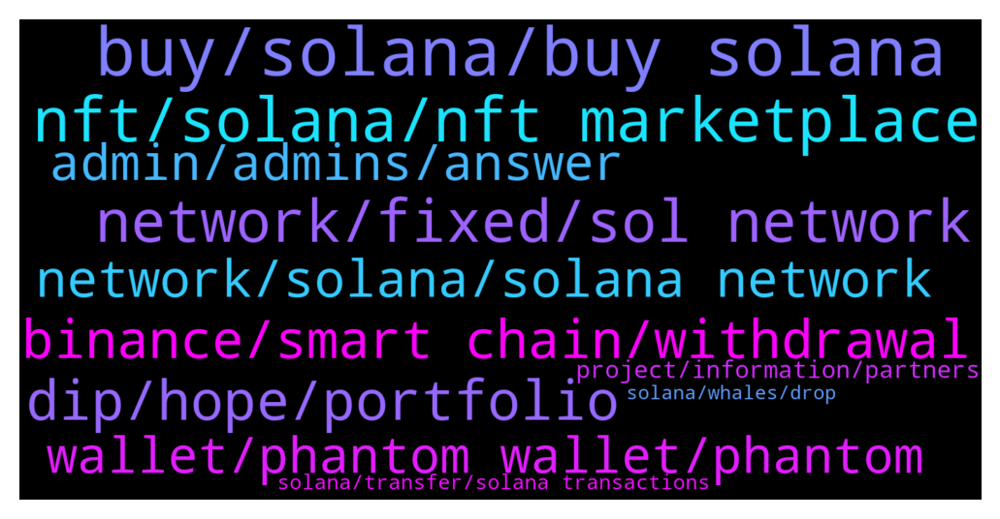

# **@solana**
 ## Analysis for **2022-01-07** - **2022-01-08**.

---

## 📊 **Basic Stats**

**n_messages_sent**: 715

---

---

## 🔝 **Top keywords and related messages**

1. **buy, solana, buy solana**

    @netblizz --- *Do you guys think Solana will still dip below $100? 😭😭😭* **--->** [TG Discussion](https://t.me/solana/893469)

    @netblizz --- *I still made decent profits as I bought Sol at $6.80 in February last year, but knowing that I was not able to sell it when it was still at its all time high is heartbreaking.* **--->** [TG Discussion](https://t.me/solana/893486)

    @manojsolanki --- *Is this the right time to buy solana. ? Just asking opinions* **--->** [TG Discussion](https://t.me/solana/895331)

    @crellic_mih --- *Can i invest in solana right now? For long term* **--->** [TG Discussion](https://t.me/solana/894691)

    @netblizz --- *I think you should hold as there’s no point of selling it at a loss. I am still bullish with Solana and the amount of institutional money pouring in the Solana ecosystem is insane. Just keep on HODL’ing there’s still light at the end of the tunnel.* **--->** [TG Discussion](https://t.me/solana/893503)

    @xynophilly88 --- *Is it the best time to buy sol* **--->** [TG Discussion](https://t.me/solana/893713)

2. **nft, solana, nft marketplace**

    @mahib45 --- *Hello 👋  This is the only official community of #Solana* **--->** [TG Discussion](https://t.me/solana/895945)

    @ericluque --- *Incredible... 10 min, 12 contacts fro people saying from Solana* **--->** [TG Discussion](https://t.me/solana/894769)

    @jaidharosenblatt --- *Can someone please direct me to a seattle USA solana group? :)* **--->** [TG Discussion](https://t.me/solana/895928)

    @Sandra --- *Here is a solana group , not a forex group* **--->** [TG Discussion](https://t.me/solana/894383)

    @Al Mahbuuuuub --- *Is anyone here with d contact address of solana web 3.0* **--->** [TG Discussion](https://t.me/solana/895811)

    @trandinhmanhlinh --- *Hi everyone. Do you know the group for Solana developer?* **--->** [TG Discussion](https://t.me/solana/895324)

3. **network, fixed, sol network**

    @akseel --- *I believe will be resolved by itself isn’t it guys?* **--->** [TG Discussion](https://t.me/solana/893531)

    @sousa79 --- *Hi guys, the networking already back?* **--->** [TG Discussion](https://t.me/solana/894669)

    @abced197 --- *when will network issue be fixed?* **--->** [TG Discussion](https://t.me/solana/894504)

    @Cakooooo17 --- *Is there any solution for these problems because we have that difficulty for almost 2 weeks. Sol network suprises a lot in a bad way😔* **--->** [TG Discussion](https://t.me/solana/894971)

    @cryptocrick --- *Is network down again. Can ot get transactions to go through   Seems line it is* **--->** [TG Discussion](https://t.me/solana/894843)

    @Robert --- *I understand the internet is down there even.* **--->** [TG Discussion](https://t.me/solana/893720)

4. **dip, hope, portfolio**

    @Michael --- *I bought at nearly ath so stupid lost literally thousands of dollars by now probably going to get out soon* **--->** [TG Discussion](https://t.me/solana/893493)

    @Tibg768 --- *Hope all of you are buying DAFI* **--->** [TG Discussion](https://t.me/solana/894010)

    @K_somai --- *Looks like it became very common 😥 don't want to fud but i'm scared about my sol investment* **--->** [TG Discussion](https://t.me/solana/894403)

    @C --- *Don’t sell the dip, always buy it and sell the news* **--->** [TG Discussion](https://t.me/solana/893092)

    @Sherry_HFX --- *Hope you’d be stacking the dip.. Imma re accumulate into my portfolio w my farm earnings 😅😅 it’s the usual price cycle. So HODL* **--->** [TG Discussion](https://t.me/solana/893738)

    @jcr712 --- *Just HODL play the long game* **--->** [TG Discussion](https://t.me/solana/893269)

5. **binance, smart chain, withdrawal**

    @bercik97 --- *hello guys, anyone knows why my transaction takes so long? I wanted to withdraw some solana to phantom from binance and it takes already 40min ~* **--->** [TG Discussion](https://t.me/solana/895831)

    @jacek_bernatek --- *Binance send SOL - 3h+ i waiting* **--->** [TG Discussion](https://t.me/solana/894617)

    @liuchao30223730 --- *Be careful, Binance would lower apy ratio during locked period. I have experienced it several times.* **--->** [TG Discussion](https://t.me/solana/894095)

    @cryptolover1987 --- *It’s working perfectly fine for me.. I just transferred my SOL from trust wallet to Binance.* **--->** [TG Discussion](https://t.me/solana/895304)

    @trexong --- *anyone has problem from withdrawal of SOL on binance? Or am I the only one?* **--->** [TG Discussion](https://t.me/solana/895108)

    @Mick --- *Sent some sol from binance to ledger but can't find it. Can someone help?* **--->** [TG Discussion](https://t.me/solana/895773)

6. **network, solana, solana network**

    @DigitalDogsStudios --- *Hello Pulsar I would love to know what the reason is.   On the Solana Status Twitter it says:  "1/ The Solana Network is currently experiencing degraded performance due to an increase in high compute transactions, which is reducing network capacity to several thousand transactions per second. This is leading to some failed transactions for users."  This sounds like it is being overloaded ?   If you know another reason i would love to know your thoughts.   Thank you.* **--->** [TG Discussion](https://t.me/solana/895270)

    @DigitalDogsStudios --- *OMG ... i love Solana but honestly right now i'm really worried i've invested so much into a platform that has so many problems ...   Why is it being overloaded all the time now? They say they are fixing this but it's been this way for months now ...* **--->** [TG Discussion](https://t.me/solana/894342)

    @Llyonsa --- *Solana has just officially announced problems with high compute txs* **--->** [TG Discussion](https://t.me/solana/895530)

    @Pawan --- *Iff Solana works on traffic congestion, network issues, DDOS then it can flip any coin out there* **--->** [TG Discussion](https://t.me/solana/893026)

    @Ali_Mohsenii --- *I don't know why some guys can't understand SOLANA is in mainnet beta..! And it's very young ecosystem... do you know what "BETA" means they still in beta phase to found this kind of problems and find a best solutions for that.* **--->** [TG Discussion](https://t.me/solana/894823)

    @sophia_marti --- *Solana has faced it's second network degraded performance this week* **--->** [TG Discussion](https://t.me/solana/893931)

7. **wallet, phantom wallet, phantom**

    @Punitkp --- *Need 0.0005$ in solana to withdraw usdt from phantom wallet* **--->** [TG Discussion](https://t.me/solana/895460)

    @Fullmeta1alchemist --- *is there anyway that i can transac on phantom wallet even tho i dont have any sol on the wallet?* **--->** [TG Discussion](https://t.me/solana/894654)

    @coly963 --- *Hey can anybody help me wirh prism please? :( i cant swap my sln* **--->** [TG Discussion](https://t.me/solana/894189)

    @Mhr2172 --- *Hello, I will use raydium swap, how much do I pay for swap sol fee?* **--->** [TG Discussion](https://t.me/solana/895527)

    @cryptolover1987 --- *Please have a look on other good wallets  https://t.me/solana/878227* **--->** [TG Discussion](https://t.me/solana/895686)

    @Iamdeadlyz --- *Connect your Ledger to a Solana wallet. Here's a list: https://t.me/solana/758519  Phantom wallet is the most known Solana desktop wallet, might want to give it a try 👍* **--->** [TG Discussion](https://t.me/solana/895776)

8. **admin, admins, answer**

    @Charles_lily --- *Can you see now, I just received text messages from someone claiming to be an admin* **--->** [TG Discussion](https://t.me/solana/893593)

    @kakawan --- *Do we have any admins here to answer question?* **--->** [TG Discussion](https://t.me/solana/894154)

    @I Love --- *And don’t forget admin or support will never dm or call first* **--->** [TG Discussion](https://t.me/solana/893541)

    @Mick --- *How do I do this (sorry)* **--->** [TG Discussion](https://t.me/solana/895784)

    @Smart_capital_Limited --- *Well I can show the full detail’s of how you can do it* **--->** [TG Discussion](https://t.me/solana/895532)

    @Dstrukta4u2 --- *Admin asking for my solano address??* **--->** [TG Discussion](https://t.me/solana/893433)

9. **project, information, partners**

    @Monterrey_Rice --- *Look at this tweet from yesterday   https://twitter.com/solanastatus/status/1479126136953053187?s=21* **--->** [TG Discussion](https://t.me/solana/894457)

    @mahib45 --- *For the latest news Please check https://twitter.com/SolanaStatus/status/1479126136953053187* **--->** [TG Discussion](https://t.me/solana/894886)

    @cryptolover1987 --- *More update on this will be announced soon. Stay tuned!* **--->** [TG Discussion](https://t.me/solana/895163)

    @Monterrey_Rice --- *Check these out!  1️⃣ https://solana.com/ecosystem  2️⃣ https://twitter.com/Solana_Mates (Latest updates on new projects)  3️⃣ https://solanabeach.io/tokens* **--->** [TG Discussion](https://t.me/solana/894482)

    @Alexandr_Zakurin --- *Where can I find information about future plans for this project?* **--->** [TG Discussion](https://t.me/solana/894473)

    @iancryptopromo --- *hello! Good day / night I'm an admin of a 5 twitter account with over 240k, 300k, 360k , 496k and 730k followers. Who can I contact for marketing purposes?* **--->** [TG Discussion](https://t.me/solana/893890)

10. **solana, transfer, solana transactions**

    @zangvogel --- *hello is there a problem with solona?? has not been possible to send them for several days is constantly under maintenance on kucoin* **--->** [TG Discussion](https://t.me/solana/895612)

    @S --- *Is it true that the problem is fixed in Solana? There is a New version and the bugs are out. It should work much bether now* **--->** [TG Discussion](https://t.me/solana/894882)

    @lian0x31 --- *Are exchange issues related to congestion?  Exodus tells me I have 3 SOL but when I try to exchange I suddenly have 0* **--->** [TG Discussion](https://t.me/solana/895564)

    @rakib3287 --- *it's not show solscan my transction* **--->** [TG Discussion](https://t.me/solana/895309)

    @Patrix_Quek --- *and also some of my friend join an allocation through Solanium, we need to allocate sol to join the allocation. But the transfaction failed.* **--->** [TG Discussion](https://t.me/solana/894377)

    @kuntal1987 --- *My Solana Transactions and Swappings are failing.  I purchased 2 .sol domains a few days back worth 2 KB and 5 KB.  Could it be because of these 2 domains ?   WHY ARE ALL MY SOLANA TRANSACTIONS AND SWAPPINGS FAILING TODAY ?   Please help me out, and thus oblige.  🙏🏻-Amen-🙏🏻* **--->** [TG Discussion](https://t.me/solana/894393)

