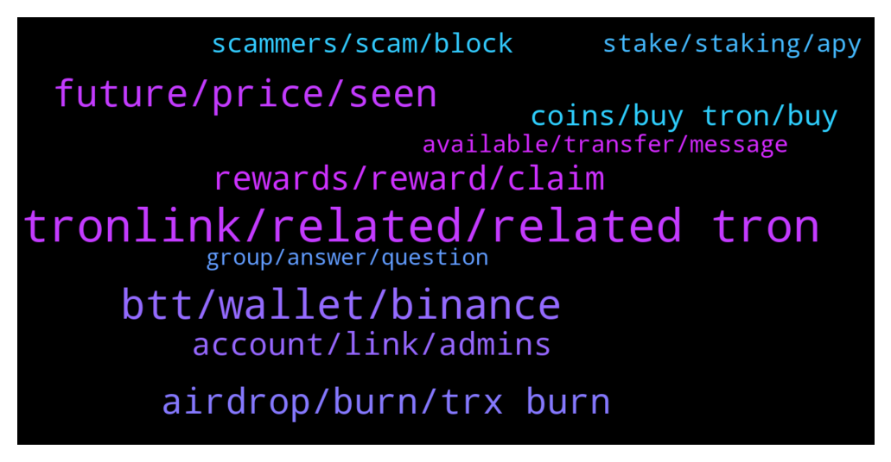

# **@tronnetworkEN**
 ## Analysis for **2022-01-07** - **2022-01-08**.

---

## 📊 **Basic Stats**

**n_messages_sent**: 277

---

---

## 🔝 **Top keywords and related messages**

1. **tronlink, related, related tron**

    @agentpiki --- *No, tron channel only talk about tron.* **--->** [TG Discussion](https://t.me/tronnetworkEN/3817279)

    @suPerJack0 --- *Ask here and keep it related to tron* **--->** [TG Discussion](https://t.me/tronnetworkEN/3816333)

    @Carlos_TRX --- *sure you can find the option there and in tronlink too* **--->** [TG Discussion](https://t.me/tronnetworkEN/3815436)

    @PiterSpain --- *TRON is a Decentralized Autonomous Organisation (DAO)  https://twitter.com/trondao/status/1478729207354368004* **--->** [TG Discussion](https://t.me/tronnetworkEN/3813287)

    @MS_MUTHU_97 --- *I need some information about tron mining platforms* **--->** [TG Discussion](https://t.me/tronnetworkEN/3817002)

    @Greg --- *Is tron and all tokens related to tron network legal in USA?* **--->** [TG Discussion](https://t.me/tronnetworkEN/3814896)

2. **btt, wallet, binance**

    @Rozzi --- *I mean the quantity  of my NFT is not showing  in my trust wallet admin plz help me* **--->** [TG Discussion](https://t.me/tronnetworkEN/3813926)

    @only1980 --- *0xd7fe8af4c372c46a6e374d8c332c6547f7fc30b7913fd55cb2078814f8a576fb you can see it on the bt scan Io explorer* **--->** [TG Discussion](https://t.me/tronnetworkEN/3815721)

    @templariotuga --- *Don't think this is a transaction in tron or btt chain* **--->** [TG Discussion](https://t.me/tronnetworkEN/3815732)

    @xPommepote --- *To activate your wallet you have to send 1.1 TRX to your address* **--->** [TG Discussion](https://t.me/tronnetworkEN/3815976)

    @xPommepote --- *There is a lot of warning on binance to send only TRC-10 BTT and not TRC-20 🤷🏼‍♂️* **--->** [TG Discussion](https://t.me/tronnetworkEN/3815948)

    @eraycolak --- *transfer from gate io exchange to binance exchange* **--->** [TG Discussion](https://t.me/tronnetworkEN/3815929)

3. **future, price, seen**

    @Carlos_TRX --- *no, nobody can predict a price, trust in the fundamentals and decide by yourself* **--->** [TG Discussion](https://t.me/tronnetworkEN/3814911)

    @Arashseven777 --- *Tron pump or dump in 1 months* **--->** [TG Discussion](https://t.me/tronnetworkEN/3813559)

    @Matthew --- *Any hope of tron value increasing sooner?* **--->** [TG Discussion](https://t.me/tronnetworkEN/3815324)

    @blindstick --- *Any idea about the price prediction sir ?* **--->** [TG Discussion](https://t.me/tronnetworkEN/3814909)

    @M💫 --- *Why  crypto is falling from 1 month ?* **--->** [TG Discussion](https://t.me/tronnetworkEN/3815195)

    @theStrangeGeneration --- *What's the price prediction of tron by the end of the month?* **--->** [TG Discussion](https://t.me/tronnetworkEN/3813372)

4. **airdrop, burn, trx burn**

    @xPommepote --- *You can buy TRX on exchanges and stake in TronLink* **--->** [TG Discussion](https://t.me/tronnetworkEN/3815988)

    @azizdevil --- *Hi.any nft or metaverse games on trx?* **--->** [TG Discussion](https://t.me/tronnetworkEN/3816269)

    @Carlos_TRX --- *TRX is being burned every day with the fees that were paid in transfers* **--->** [TG Discussion](https://t.me/tronnetworkEN/3813514)

    @Carlos_TRX --- *He answered you before, You not only have to have 100k TRX but also be a participatory person and an authentic member of the community, you have to be a trustworthy user.* **--->** [TG Discussion](https://t.me/tronnetworkEN/3816637)

    @M --- *I’ve never got an airdrop I’ve just swapped or bought everything. So I was wondering that because it was brought up in the group and nobody could give an answer and doesn’t seem to be one.* **--->** [TG Discussion](https://t.me/tronnetworkEN/3815410)

    @M💫 --- *How much eth can i mine through 8gb of ram ?* **--->** [TG Discussion](https://t.me/tronnetworkEN/3817268)

5. **rewards, reward, claim**

    @HBIHBI64 --- *thats New for me. I bought tron in 2019. I change vote with tronscan org and ledger. Is there a claim Button too? or can i see - unclaimed Rewards in tronscan* **--->** [TG Discussion](https://t.me/tronnetworkEN/3815418)

    @MaQBiLLionz --- *Can i claim my reword in 3 days after voting* **--->** [TG Discussion](https://t.me/tronnetworkEN/3816640)

    @PiterSpain --- *Maybe you have rewards to claim* **--->** [TG Discussion](https://t.me/tronnetworkEN/3815415)

    @Carlos_TRX --- *yes, to receive the rewards for some SR you have to claim* **--->** [TG Discussion](https://t.me/tronnetworkEN/3815423)

    @MaQBiLLionz --- *I mean just like just like unstaking after 3day* **--->** [TG Discussion](https://t.me/tronnetworkEN/3816669)

    @agentpiki --- *You can claim reward once a day* **--->** [TG Discussion](https://t.me/tronnetworkEN/3816663)

6. **account, link, admins**

    @Pawanrangila --- *Admin will you help us one Please* **--->** [TG Discussion](https://t.me/tronnetworkEN/3816332)

    @Daniello_DestinyWorld_Fortis --- *First close your mouse, it's only a star not verified account And secondly I asked admins, not you* **--->** [TG Discussion](https://t.me/tronnetworkEN/3817270)

    @David --- *Someone is trying to help me with account issues. And give me a link witch is asking my account sentence to reconnect my account ? Is it a scame please ?* **--->** [TG Discussion](https://t.me/tronnetworkEN/3817205)

    @templariotuga --- *Then you should reach their support* **--->** [TG Discussion](https://t.me/tronnetworkEN/3815711)

    @Carlos_TRX --- *No, he told you that you had a suspicious link in your profile and and that made you an untrustworthy user, and then I told you that you must be a participatory user since you have been participating in the group for a very short time.* **--->** [TG Discussion](https://t.me/tronnetworkEN/3816822)

    @Pawanrangila --- *Since we have asked questions here, we have been getting many calls and messages too.* **--->** [TG Discussion](https://t.me/tronnetworkEN/3816366)

7. **coins, buy tron, buy**

    @PiterSpain --- *Use Chrome and the bridge is normal, something common for all coins since time ago.* **--->** [TG Discussion](https://t.me/tronnetworkEN/3815632)

    @Skyetimz --- *How can I trade my coins?? And make profit* **--->** [TG Discussion](https://t.me/tronnetworkEN/3816561)

    @eraycolak --- *I have a coin left on the tron ​​network* **--->** [TG Discussion](https://t.me/tronnetworkEN/3815880)

    @zoyahafeez777 --- *Anyone into crypto mining over here?* **--->** [TG Discussion](https://t.me/tronnetworkEN/3815265)

    @PHHH13 --- *this is the adress which witdrew my coins : TVKGoqdkitzk6LL6ig2Zpb3e7AJKmrWErb* **--->** [TG Discussion](https://t.me/tronnetworkEN/3817453)

    @agentpiki --- *Coinmarketcap.com  Go there to check full listing* **--->** [TG Discussion](https://t.me/tronnetworkEN/3816973)

8. **scammers, scam, block**

    @simon866 --- *Pure scam bro report and block him* **--->** [TG Discussion](https://t.me/tronnetworkEN/3817206)

    @Terra1001 --- *Watch out for scammers they give false information.* **--->** [TG Discussion](https://t.me/tronnetworkEN/3817252)

    @Zavala61 --- *B: Why are they sending me message  They must be a scam* **--->** [TG Discussion](https://t.me/tronnetworkEN/3815832)

    @Shivers7w --- *This man is a scammer massage private  @Ancen19677* **--->** [TG Discussion](https://t.me/tronnetworkEN/3815737)

    @ccmedianetwork --- *Scammers, private info - only you, not share to other. This 100% scam* **--->** [TG Discussion](https://t.me/tronnetworkEN/3814617)

    @agentpiki --- *Ignore scammers. Block user and report spam.  All block* **--->** [TG Discussion](https://t.me/tronnetworkEN/3816370)

9. **stake, staking, apy**

    @The_Influencerr --- *Can I stake to earn Klever?* **--->** [TG Discussion](https://t.me/tronnetworkEN/3814810)

    @xPommepote --- *It depends on the APY and how much you stake 🤷🏼‍♂️ But we recommend you to stake using TronLink for better APY.* **--->** [TG Discussion](https://t.me/tronnetworkEN/3813499)

    @azizdevil --- *It is the same staking in trust wallet and trinlink wallet?* **--->** [TG Discussion](https://t.me/tronnetworkEN/3813513)

    @bee1128 --- *Ok I will just stake it* **--->** [TG Discussion](https://t.me/tronnetworkEN/3815991)

    @simon866 --- *Yes only by staking and voting on the klever SR will do this, most others reward in TRX* **--->** [TG Discussion](https://t.me/tronnetworkEN/3814979)

    @PiterSpain --- *Free money? 😅 Buy and /staking* **--->** [TG Discussion](https://t.me/tronnetworkEN/3813283)

10. **available, transfer, message**

    @PiterSpain --- *True but you can skip this requirement using exchanges. More info in t.me/ApenftEN* **--->** [TG Discussion](https://t.me/tronnetworkEN/3815401)

    @Pawanrangila --- *Ok Thank you having at least 50 will transfer* **--->** [TG Discussion](https://t.me/tronnetworkEN/3816369)

    @itsyourRaaj --- *How can we send sashta in other address* **--->** [TG Discussion](https://t.me/tronnetworkEN/3814615)

    @cryptoguyinza --- *can swap by sending to address  details available in this post 😬  https://medium.com/@cryptoguyinza/cryptoguyinza-token-rewards-108402256b60* **--->** [TG Discussion](https://t.me/tronnetworkEN/3814711)

    @Gaziz --- *I have 10210 dec I wanted to exchange it to Trx but cant do this* **--->** [TG Discussion](https://t.me/tronnetworkEN/3814372)

    @simon866 --- *Sure, you still can contact with press@tron.network which is in charge of this stuff* **--->** [TG Discussion](https://t.me/tronnetworkEN/3817332)

