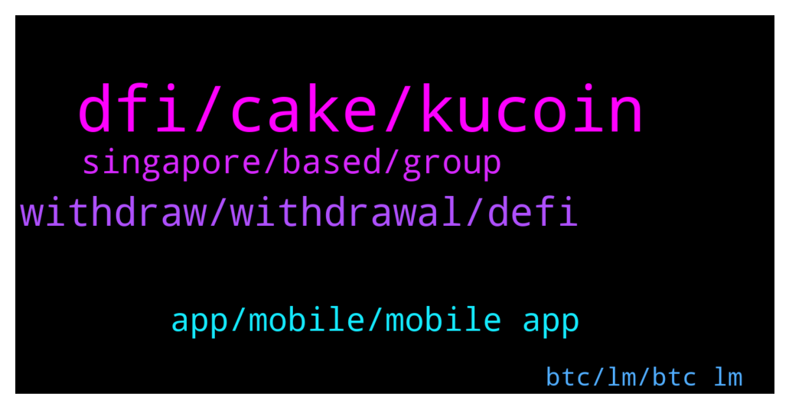

# **@CakeDeFi_EN**
 ## Analysis for **2022-01-08** - **2022-01-09**.

---

## 📊 **Basic Stats**

**n_messages_sent**: 218

---

---

## 🔝 **Top keywords and related messages**

1. **dfi, cake, kucoin**

    @cybearir --- *One question guys if I buy Defichain on Kucoin and i wanna send it to Deficake, what wallet transfer i choose to transfer ETH ERC20 or does Kucoin got Defichain blockchain transfer directly* **--->** [TG Discussion](https://t.me/CakeDeFi_EN/162068)

    @super33max --- *Scammer are getting smarter and smarter.  This is just an idea: Why moderators don’t put their username in their photo? (Like a water mark)  So, when scammer write you, you can click on their profile and see the mismatch between the username and the username written in the photo.* **--->** [TG Discussion](https://t.me/CakeDeFi_EN/162323)

    @JonD26 --- *Cheers for the reply. Seems a bit strange to shut down chat. Along with the ban on DMs doesn't instill confidence to be honest.* **--->** [TG Discussion](https://t.me/CakeDeFi_EN/162518)

    @Stephan --- *I have also been experiencing a drop of my DFI in Usd value of about 35%, whereas the price of DFI didn’t change too drastically when I bought in… I am only staking, is there some way my money can disappear like that or is it indeed DFI price?* **--->** [TG Discussion](https://t.me/CakeDeFi_EN/162519)

    @edmund_lim2981 --- *Any Malaysians here? If so, is it easy to withdraw assets from the cakedefi platform back to a local platform like Luno for example?* **--->** [TG Discussion](https://t.me/CakeDeFi_EN/162199)

    @cybearir --- *asking if i would wanna send some DFI from kucoin what network do i choose* **--->** [TG Discussion](https://t.me/CakeDeFi_EN/162395)

2. **withdraw, withdrawal, defi**

    @iAden_94 --- *Was it same day withdrawals? I’m withdrawing to a whitelisted address but still have not receive any notifications* **--->** [TG Discussion](https://t.me/CakeDeFi_EN/162155)

    @₿o₿ ₿ Y --- *Hello I deposited LTC and it has over 13 confirms and I am 100% the address is correct yet its not even on my transactions as pending....* **--->** [TG Discussion](https://t.me/CakeDeFi_EN/162383)

    @Keymtl --- *yes, the withdrawal seems to have taken place* **--->** [TG Discussion](https://t.me/CakeDeFi_EN/162439)

    @Keymtl --- *Dear admin, I made a withdrawal to the hotbit exchange, she gave the withdrawal address, my tokens were locked after I made the withdrawal, I wonder what is the reason?* **--->** [TG Discussion](https://t.me/CakeDeFi_EN/162437)

    @iAden_94 --- *Withdrawals of LTC all good ?* **--->** [TG Discussion](https://t.me/CakeDeFi_EN/162151)

    @Michael_Schredl --- *Yes, they are saying that Deposits and Withdrawals are disabled 😅* **--->** [TG Discussion](https://t.me/CakeDeFi_EN/162452)

3. **singapore, based, group**

    @TwoDsireCrypto --- *Most are Euro & Singapore based I am only mod from Aust but I have not been as active as I was* **--->** [TG Discussion](https://t.me/CakeDeFi_EN/162509)

    @senyorkripto --- *Will the group be opened for Turkey?* **--->** [TG Discussion](https://t.me/CakeDeFi_EN/162580)

    @默默啃书小凳子~ --- *!chinese if you speak chinese, can add this group* **--->** [TG Discussion](https://t.me/CakeDeFi_EN/162201)

    @JonD26 --- *Why can't people chat when it's daytime in their timezone? Are all the mods from the same country?* **--->** [TG Discussion](https://t.me/CakeDeFi_EN/162486)

    @edmund_lim2981 --- *Unfortunately I can't understand Chinese. Sorry 😅* **--->** [TG Discussion](https://t.me/CakeDeFi_EN/162203)

    @Keymtl --- *but if it is closed, how could I get an address and shoot?* **--->** [TG Discussion](https://t.me/CakeDeFi_EN/162453)

4. **app, mobile, mobile app**

    @Razali --- *Use the website.. instead of mobile app..* **--->** [TG Discussion](https://t.me/CakeDeFi_EN/162557)

    @daughterofVitalik --- *As I told you: there is just one question and two answer possibilities. I tried both of them. And none of them works* **--->** [TG Discussion](https://t.me/CakeDeFi_EN/162043)

    @aleimob --- *Thanks, I was able to login with the Opera browser VPN 🤔* **--->** [TG Discussion](https://t.me/CakeDeFi_EN/162641)

    @aleimob --- *I can't open the CakeDefi app from both web and mobile* **--->** [TG Discussion](https://t.me/CakeDeFi_EN/162632)

    @DmgBautista --- *Sometimes a different browser its all that it's needed* **--->** [TG Discussion](https://t.me/CakeDeFi_EN/162644)

    @ConfigProxy --- *I thought I was accidentally disable something* **--->** [TG Discussion](https://t.me/CakeDeFi_EN/162282)

5. **btc, lm, btc lm**

    @Michael --- *When can I remove Btc-DFi LM again? I see it’s not possible right now* **--->** [TG Discussion](https://t.me/CakeDeFi_EN/162558)

    @turbo1o1 --- *When will it be possible again to swap BTC for dBTC?* **--->** [TG Discussion](https://t.me/CakeDeFi_EN/162400)

    @PeterL1 --- *Hi, is there any news about the Btc-Dfi liquidity issue. Supports says it is maintenance. Seems they dont communicate to their users, this  issue is now for a week.* **--->** [TG Discussion](https://t.me/CakeDeFi_EN/162601)

    @Kassius84 --- *The voting on through the DeFiChain community to the dBTC issue is still running till this Tuesday. When there is a clear result, I can imagine the DFI-BTC LM-Pool will reopen soon 👍* **--->** [TG Discussion](https://t.me/CakeDeFi_EN/162562)

    @Patrick_WH --- *My BTCs have been there for a week and lose value and every day I loose rewards* **--->** [TG Discussion](https://t.me/CakeDeFi_EN/162607)

    @YyeapY --- *will the shares in LM drop when the value of the pair dropped?* **--->** [TG Discussion](https://t.me/CakeDeFi_EN/162296)

