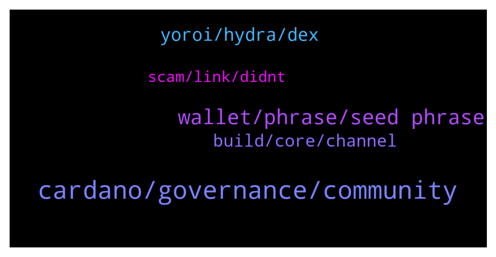

# **@Cardano**
 ## Analysis for **2022-01-08** - **2022-01-09**.

---

## 📊 **Basic Stats**

**n_messages_sent**: 100

---

---

## 🔝 **Top keywords and related messages**

1. **cardano, governance, community**

    @Ultimate_Gigachad --- *Hello all, I hope you are all well! I am writing to you to have more details on how Cardano's governance system work especially the voting part! I am doing a Taxonomy of Blockchain Governance and I am researching all the governance mechanism in all most reputable projects!* **--->** [TG Discussion](https://t.me/Cardano/766827)

    @addcrypto3 --- *It  is very poor from cardano side that private wallet is ready with dapps connector but cardano supported and funded wallet has no timeline yet.* **--->** [TG Discussion](https://t.me/Cardano/767189)

    @Dat_Me --- *Cardano Forest  funded100%, what's next?* **--->** [TG Discussion](https://t.me/Cardano/766945)

    @Yadidyah --- *I saw one news about Samsung partnering with Cardano. How true please?* **--->** [TG Discussion](https://t.me/Cardano/766950)

    @glitch04 --- *Well whatever "this" is not related to here, and the best course of action is direct with the people behind it* **--->** [TG Discussion](https://t.me/Cardano/767273)

    @klausinthehaus --- *when do you guys think cardano will be a true competitor to eth? You think this year is possible?* **--->** [TG Discussion](https://t.me/Cardano/767206)

2. **wallet, phrase, seed phrase**

    @joelouisBTC --- *Does a wallet created in Daedalus old version can be restored with seedphrase in a new wallet in Yoroi?* **--->** [TG Discussion](https://t.me/Cardano/767106)

    @torg841 --- *Good morning all.  I am getting ready to open up a NAMI wallet and have a question.  I already have a Daedulus wallet that I have been using for quite a while for staking and such.  When creating my NAMI wallet should I open it using my Daedalus seed phrase so the 2 are linked?* **--->** [TG Discussion](https://t.me/Cardano/766976)

    @Thomas --- *Hey, do you know a wallet which shows all NFTs?* **--->** [TG Discussion](https://t.me/Cardano/767136)

    @soup34 --- *If I take my coins from the pool and put them in another pool, will my NFT remain?* **--->** [TG Discussion](https://t.me/Cardano/766798)

    @glitch04 --- *I would recommend hardware devices for light wallet added security, if you have the means* **--->** [TG Discussion](https://t.me/Cardano/766925)

    @simonvenom --- *Guys my deadalus wallets keep disappearing when loading up my deadalus - is this a known issue?* **--->** [TG Discussion](https://t.me/Cardano/767004)

3. **yoroi, hydra, dex**

    @addcrypto3 --- *What is open source. Yoroi should have use some part transaction fee to enhance their product* **--->** [TG Discussion](https://t.me/Cardano/767199)

    @mostudio --- *Any updates on Yoroi working with Sundae yet?* **--->** [TG Discussion](https://t.me/Cardano/767287)

    @addcrypto3 --- *When yoroi will be compatible with dapps?* **--->** [TG Discussion](https://t.me/Cardano/767184)

    @UleC0 --- *Do u have notices abouth HYDRA?* **--->** [TG Discussion](https://t.me/Cardano/767183)

    @Crypto_minister --- *Good thx  Sundae doesnt support yoroi* **--->** [TG Discussion](https://t.me/Cardano/766921)

    @glitch04 --- *Not sure of a timeline there have been test versions available on the nightly builds* **--->** [TG Discussion](https://t.me/Cardano/767187)

4. **build, core, channel**

    @glitch04 --- *Not sure that is the goal, both are on their own path and there is plenty of room for multiple projects in the space* **--->** [TG Discussion](https://t.me/Cardano/767209)

    @glitch04 --- *That's the thing about being opensource others have time to build their own projects while the core focuses on building the core* **--->** [TG Discussion](https://t.me/Cardano/767193)

    @glitch04 --- *It already happens with some development as they build to bridge networks* **--->** [TG Discussion](https://t.me/Cardano/767220)

    @glitch04 --- *Not everything is going to be built first or best by anyone there are always options and updates* **--->** [TG Discussion](https://t.me/Cardano/767194)

    @KyR14c0s --- *The guys are rushing catching up other projects and i really believe they will screw up.... i believe SS is only marketting* **--->** [TG Discussion](https://t.me/Cardano/766764)

    @addcrypto3 --- *Then Charles is crying the people creating fud.* **--->** [TG Discussion](https://t.me/Cardano/767192)

5. **scam, link, didnt**

    @apex_pool_spo --- *no, verify at least before saying it's a scam, or don't say anything.* **--->** [TG Discussion](https://t.me/Cardano/767335)

    @yosweetmama --- *Honestly i didnt even check the link, but links are mostly scam so i said this, sorry if its not a scam😂* **--->** [TG Discussion](https://t.me/Cardano/767327)

    @apex_pool_spo --- *it is not, and you should not say about everything that it is a scam if you don't know what you are talking about.* **--->** [TG Discussion](https://t.me/Cardano/767332)

    @yosweetmama --- *So should i say sorry for 800 times or something?* **--->** [TG Discussion](https://t.me/Cardano/767333)

    @Theo --- *Idk my dog. I equate everything to default scam. But with projects that get that rep if they aren’t it drags the name and work of people thru the dirt. U apologized it should be the end weather accepted or not assuming it was genuine. But then again we’re in the wild West of the internet you yea haw! Lots of love…. Lace* **--->** [TG Discussion](https://t.me/Cardano/767411)

    @yosweetmama --- *I directly said sorry as the other guy mentioned its not scam but suddenly this guy from nowhere came even when the person shared link didnt make it a big issue lol* **--->** [TG Discussion](https://t.me/Cardano/767409)

