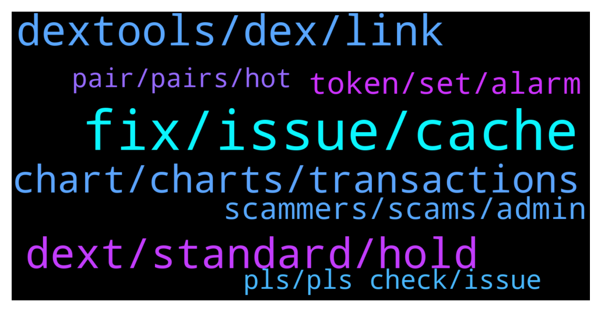

# **@DEXToolsCommunity**
 ## Analysis for **2022-01-07** - **2022-01-09**.

---

## 📊 **Basic Stats**

**n_messages_sent**: 349

---

---

## 🔝 **Top keywords and related messages**

1. **fix, issue, cache**

    @bonetky --- *Okay, because does not load since a few hours. I can load the rest of webpages* **--->** [TG Discussion](https://t.me/DEXToolsCommunity/323246)

    @bonetky --- *Okay the solution was clear cookies and site data* **--->** [TG Discussion](https://t.me/DEXToolsCommunity/323249)

    @napascual --- *Nice, we're looking into that issue closely, we will be changing some cache policies soon to fix that* **--->** [TG Discussion](https://t.me/DEXToolsCommunity/323269)

    @hmk18990 --- *also it's a possibility that an antivirus, ad-blocker (can sometimes blocks irrelevant javascripts), or some other extension blocking something in the webapp.* **--->** [TG Discussion](https://t.me/DEXToolsCommunity/322386)

    @rpoole69 --- *duh, lol, it was doing it in mobile and desktop, but all good now! Thanks* **--->** [TG Discussion](https://t.me/DEXToolsCommunity/322933)

    @bastardganpunk --- *you might need to clear your cache and try again. but the way you tried to do it is correct* **--->** [TG Discussion](https://t.me/DEXToolsCommunity/322894)

2. **dextools, dex, link**

    @hmk18990 --- *nope I'm %100 direct connection to the outer world (including dextools)* **--->** [TG Discussion](https://t.me/DEXToolsCommunity/322390)

    @sertezx --- *Look this is scam and trending in dextools* **--->** [TG Discussion](https://t.me/DEXToolsCommunity/322763)

    @Thesios --- *@napascual I been trying to get info on running ads on dextools for days with no luck* **--->** [TG Discussion](https://t.me/DEXToolsCommunity/322613)

    @bonetky --- *But Dextools runs very well always, todays was an exception* **--->** [TG Discussion](https://t.me/DEXToolsCommunity/323268)

    @stanes --- *You should probably step down from trading on DEXs until you understand how things work.  Blaming people for your own lack of research will never help you. Wish you the best 👍* **--->** [TG Discussion](https://t.me/DEXToolsCommunity/322643)

    @bonetky --- *Is there any issue in Dextools browser UI? Does not load for me* **--->** [TG Discussion](https://t.me/DEXToolsCommunity/323236)

3. **dext, standard, hold**

    @zhengshui1977 --- *I don't have to pay a monthly fee for holding 1000 dexts, does that mean? thanks* **--->** [TG Discussion](https://t.me/DEXToolsCommunity/323438)

    @fred19955 --- *I want to buy and hold 100 dext. Is that okay?* **--->** [TG Discussion](https://t.me/DEXToolsCommunity/322495)

    @zhengshui1977 --- *I already hold 1010 DEXT but I'm still on the free plan, what else do I need to do?* **--->** [TG Discussion](https://t.me/DEXToolsCommunity/323452)

    @challengingmind --- *So if you want to buy or sell (limit) we need to use this tool but first have 1k dext in the wallet and send 258 to the wallet as stated on the website    Is this correct ?* **--->** [TG Discussion](https://t.me/DEXToolsCommunity/323078)

    @zhengshui1977 --- *OK, thanks. This tool is pretty easy to use. If I only need to hold 1000, I am willing to buy it. I probably wouldn't consider it if it had to be paid monthly, thanks for the help* **--->** [TG Discussion](https://t.me/DEXToolsCommunity/323441)

    @zhengshui1977 --- *What are the requirements for a standard member now? The homepage says to pay $100 in DEXT/monthly subscription, -or -1,000 DEXT/hold. It says yes in the app 1. Hold 1.000 DEXT in the wallet 2 - Transfer 278 DEXT from your current wallet to 0x469d342e4f3d9ffbedca2e2ca8ab268a6fe973c3* **--->** [TG Discussion](https://t.me/DEXToolsCommunity/323436)

4. **chart, charts, transactions**

    @Bobolee1 --- *Yes where I have circled. How do I prevent the negatives from appearing on my chart. I think that's my problem* **--->** [TG Discussion](https://t.me/DEXToolsCommunity/322916)

    @Flashbang665 --- *hi, any admin online? (f&ckying scammers dont botther me with your dms...)  The save chart functionality doesn't work for me. When I want to load a saved chart, it doesn't list any charts* **--->** [TG Discussion](https://t.me/DEXToolsCommunity/322449)

    @mf1495 --- *No charts opening for me since the UI update* **--->** [TG Discussion](https://t.me/DEXToolsCommunity/322433)

    @Bobolee1 --- *My charts displays as a single horizontal line. I have also realized that negative figures are also displayed. How do I make my chart displays as bars?* **--->** [TG Discussion](https://t.me/DEXToolsCommunity/322854)

    @cryptoconspirator --- *Also, a dev I am working with on a project is needing to correct an issue on the chart transactions. who do I have them reach out too on this?* **--->** [TG Discussion](https://t.me/DEXToolsCommunity/322922)

    @stanes --- *Following your demand, we just integrated an option to name the charts for the price bot.  The specific command has been added to the Medium: https://dextools.medium.com/introducing-the-dextools-telegram-price-bot-21fdae07bb78* **--->** [TG Discussion](https://t.me/DEXToolsCommunity/322484)

5. **token, set, alarm**

    @OQuintero --- *Trying to swap some rose token to bnb but I can’t, any idea why?* **--->** [TG Discussion](https://t.me/DEXToolsCommunity/322505)

    @zhengshui1977 --- *I want to set the token to remind me by email and telegram when it reaches the price I specify, how should I set it, is there a tutorial, thank you* **--->** [TG Discussion](https://t.me/DEXToolsCommunity/323465)

    @NoodleSchman --- *How would I go about getting my token listed?* **--->** [TG Discussion](https://t.me/DEXToolsCommunity/323403)

    @stanes --- *You first need to give the autorisation to the contract to spend your tokens.  You only need to approve it once for each token.* **--->** [TG Discussion](https://t.me/DEXToolsCommunity/322880)

    @zhengshui1977 --- *Thanks a lot, it's all set. Just a question, can the alarm only use USD as the trigger price? I think: 1. Alarm when btrfly/eth >1.1 2. Alarm when btrfly/eth < 1 How to set it up?* **--->** [TG Discussion](https://t.me/DEXToolsCommunity/323473)

    @Caligh --- *came here to check but i guess i not the only one w > 1000 tokens a happy user since 2020 but now it shows i have 0* **--->** [TG Discussion](https://t.me/DEXToolsCommunity/323516)

6. **scammers, scams, admin**

    @stanes --- *Please DM @guillermorodriguez78 he is the person-in-charge.  Be aware of scammers, HE WILL NEVER DM YOU FIRST.* **--->** [TG Discussion](https://t.me/DEXToolsCommunity/323410)

    @NoodleSchman --- *How do i get in contact with someone from marketing?* **--->** [TG Discussion](https://t.me/DEXToolsCommunity/323409)

    @P C --- *good point. At least the obvious scams should be removed or at least flagged!* **--->** [TG Discussion](https://t.me/DEXToolsCommunity/322633)

    @duehzk_ndbb_Crejd --- *I’ve got heaps of admin messages* **--->** [TG Discussion](https://t.me/DEXToolsCommunity/323379)

    @napascual --- *Neither calling him noob nor ignoring his comment is a great solution* **--->** [TG Discussion](https://t.me/DEXToolsCommunity/322689)

    @tdm516 --- *@stanes are you a mod that can assist?* **--->** [TG Discussion](https://t.me/DEXToolsCommunity/323050)

7. **pls, pls check, issue**

    @napascual --- *Hey could you dm me before doing that?* **--->** [TG Discussion](https://t.me/DEXToolsCommunity/322591)

    @napascual --- *Feel free to dm me for the original pc issue, we could go through it now* **--->** [TG Discussion](https://t.me/DEXToolsCommunity/322593)

    @napascual --- *You can dm those contact addresses to me* **--->** [TG Discussion](https://t.me/DEXToolsCommunity/322532)

    @Thesios --- *which I am trying to get an official CPM per zone , But I have not see anything official yet* **--->** [TG Discussion](https://t.me/DEXToolsCommunity/322711)

    @CaesarCrypto --- *could you pls check my dm @TMCTG* **--->** [TG Discussion](https://t.me/DEXToolsCommunity/323102)

    @cryptoconspirator --- *can I DM you as i don't want to blast out the whole issue..* **--->** [TG Discussion](https://t.me/DEXToolsCommunity/322924)

