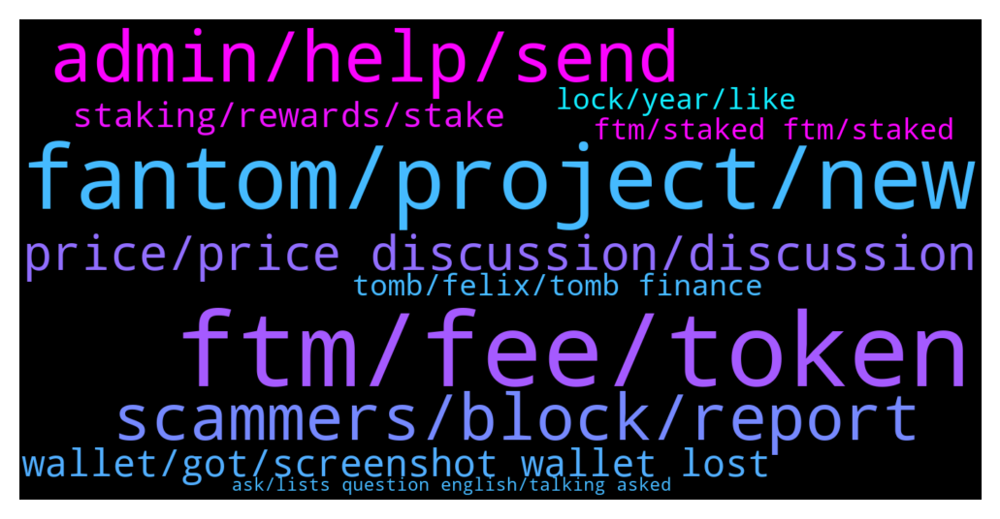

# **@Fantom_English**
 ## Analysis for **2022-01-08** - **2022-01-09**.

---

## 📊 **Basic Stats**

**n_messages_sent**: 240

---

---

## 🔝 **Top keywords and related messages**

1. **ftm, fee, token**

    @KingDaw --- *what's the easiest way to bridge eth from mainnet to FTM* **--->** [TG Discussion](https://t.me/Fantom_English/626049)

    @inacryptoworld --- *Hy guys somebody can help me please? I want to sent ftm to fantom wallet and in the wallet I see FTMet and not only FTM is it good anyway? Thanks for help* **--->** [TG Discussion](https://t.me/Fantom_English/626012)

    @Mcjig --- *Thats a scam. Ftm doesnt do airdrops* **--->** [TG Discussion](https://t.me/Fantom_English/625518)

    @ColinClark --- *Just make sure you send FTM to to wallet not ERC20. I’ve personally got some stuck at the minute that I can’t get …. It’s easy done.* **--->** [TG Discussion](https://t.me/Fantom_English/626663)

    @shibumigo --- *that is what i tried first but as I do not have FTM I cannot pay gas fee* **--->** [TG Discussion](https://t.me/Fantom_English/626191)

    @Bafaith --- *Yes I sent native FTM using the FTM network in Kucoin* **--->** [TG Discussion](https://t.me/Fantom_English/625870)

2. **fantom, project, new**

    @Chucky --- *Then I have to switch all my other coins over to fantom wallet 😅* **--->** [TG Discussion](https://t.me/Fantom_English/626649)

    @anubis3301 --- *This project will explode in 2022* **--->** [TG Discussion](https://t.me/Fantom_English/625645)

    @ColinClark --- *😆 it’s a pain keeping track your right. Fantom has an announcement today. Felix think it might be an exchange so no more buying on Binance etc* **--->** [TG Discussion](https://t.me/Fantom_English/626657)

    @Janevietani --- *sorry, projects are not allowed to shill here* **--->** [TG Discussion](https://t.me/Fantom_English/626092)

    @Ambiora --- *I am waiting Fantom to buy on Coinbase 😍😍🚀🚀* **--->** [TG Discussion](https://t.me/Fantom_English/626265)

    @BuletstormZ --- *Buy USDC on binance and bridge to fantom tgru spooky swap, and then buy fantom* **--->** [TG Discussion](https://t.me/Fantom_English/626189)

3. **admin, help, send**

    @G --- *Is there an admin that can dm me please* **--->** [TG Discussion](https://t.me/Fantom_English/625592)

    @ColinClark --- *It’s amazing I had the same over on oasis telegram didn’t answer it though* **--->** [TG Discussion](https://t.me/Fantom_English/626635)

    @Boryslav --- *kindly dm me to put you through mate* **--->** [TG Discussion](https://t.me/Fantom_English/626441)

    @hpearnbasador --- *lol who can you send a dm?😂* **--->** [TG Discussion](https://t.me/Fantom_English/626599)

    @lisaohmie --- *Who can I send a Dm please I need help* **--->** [TG Discussion](https://t.me/Fantom_English/626597)

    @Boryslav --- *don't dm any fucking body except the Admin* **--->** [TG Discussion](https://t.me/Fantom_English/626436)

4. **scammers, block, report**

    @Chucky --- *I had 3 seperate scammers call me in a row. I like to answer just to string them along. See what their pitch is like lol* **--->** [TG Discussion](https://t.me/Fantom_English/626652)

    @nobodyffff --- *One question and so many scammers jump in 🤦🏻‍♂️* **--->** [TG Discussion](https://t.me/Fantom_English/626805)

    @RealGoofyNinja --- *@depo1099 watch out for this scammer* **--->** [TG Discussion](https://t.me/Fantom_English/626825)

    @G --- *If I could kindly as for a mod to give me some advice please. I'm being bombarded by spammers and scammers* **--->** [TG Discussion](https://t.me/Fantom_English/625622)

    @Renegade --- *Anyone random message you just block them* **--->** [TG Discussion](https://t.me/Fantom_English/625625)

    @sertezx --- *Their chain but they are saying we cant do anything about scammers ;(* **--->** [TG Discussion](https://t.me/Fantom_English/625933)

5. **price, price discussion, discussion**

    @joemaxidx --- *is this exchange better than others?* **--->** [TG Discussion](https://t.me/Fantom_English/626557)

    @ColinClark --- *Ummm crypto gets you like that. Leverage is a killer in any market because the volatility is large. Price can move 40% in a day and end up where it started. Just buy and hold bud. I prey you don’t get liquidated* **--->** [TG Discussion](https://t.me/Fantom_English/626411)

    @Dylan --- *Now is the time to buy when everyone is selling* **--->** [TG Discussion](https://t.me/Fantom_English/626272)

    @eznika --- *no price talk in this channel guys* **--->** [TG Discussion](https://t.me/Fantom_English/626176)

    @Janevietani --- *take price discussion to trading group* **--->** [TG Discussion](https://t.me/Fantom_English/626078)

    @Janevietani --- *please take price discussion to trading group on discord or telegram* **--->** [TG Discussion](https://t.me/Fantom_English/626029)

6. **wallet, got, screenshot wallet lost**

    @TaschaWolf --- *But I'm using trust wallet. You got any idea how to do it? I've got 4 transactions stuck* **--->** [TG Discussion](https://t.me/Fantom_English/626061)

    @nobodyffff --- *Hello, I would like to setup wallet. Is there a guide? Which wallet and how etc?* **--->** [TG Discussion](https://t.me/Fantom_English/626803)

    @GanthaMakala --- *Can WE stak from wallet application please ? In the same delegator ? Thanks* **--->** [TG Discussion](https://t.me/Fantom_English/625651)

    @Mcjig --- *Why not? You link your ledger to fwallet* **--->** [TG Discussion](https://t.me/Fantom_English/625525)

    @AOJOA --- *I have screenshot of the wallet* **--->** [TG Discussion](https://t.me/Fantom_English/625737)

    @AOJOA --- *I lost my opera wallet mnemonic key. please who xan help* **--->** [TG Discussion](https://t.me/Fantom_English/625736)

7. **staking, rewards, stake**

    @Terry --- *Hey guys is tomb OK for staking still? I wasn't getting any reward tomb on masonry for some reason* **--->** [TG Discussion](https://t.me/Fantom_English/625731)

    @bC311 --- *When will we able to automatically get rewards on staking rewards?* **--->** [TG Discussion](https://t.me/Fantom_English/625462)

    @GanthaMakala --- *But with ledger or Razor no rewards if you stak....* **--->** [TG Discussion](https://t.me/Fantom_English/625524)

    @Lawrence --- *On staking, what has wallet validation got to do with rewards and bridging in fantom database. Scammers keep off* **--->** [TG Discussion](https://t.me/Fantom_English/625832)

    @Crypto --- *Guys what are the best Validators for staking ?* **--->** [TG Discussion](https://t.me/Fantom_English/626468)

    @bidouillelafripouille --- *Hi where is the Best place for staking ??* **--->** [TG Discussion](https://t.me/Fantom_English/626233)

8. **tomb, felix, tomb finance**

    @pajamasfreak --- *You can join tomb finance for more infos* **--->** [TG Discussion](https://t.me/Fantom_English/626526)

    @jagstock --- *Tomb finance is behind Felix ?* **--->** [TG Discussion](https://t.me/Fantom_English/626533)

    @Janevietani --- *you will get more info about Felix on Tomb group* **--->** [TG Discussion](https://t.me/Fantom_English/626632)

    @pajamasfreak --- *Harry is, most update on tomb* **--->** [TG Discussion](https://t.me/Fantom_English/626535)

    @pajamasfreak --- *You can ask on tomb discord* **--->** [TG Discussion](https://t.me/Fantom_English/625733)

    @yigit --- *from the original website? i see something like Tomb gives %260 reward idk* **--->** [TG Discussion](https://t.me/Fantom_English/625574)

9. **lock, year, like**

    @bC311 --- *i get like 11.5% - year lock.* **--->** [TG Discussion](https://t.me/Fantom_English/625566)

    @Mcjig --- *well price shop and use whatever one you want* **--->** [TG Discussion](https://t.me/Fantom_English/626846)

    @Fjody --- *Currently around 15 % on Tarot, I would say.* **--->** [TG Discussion](https://t.me/Fantom_English/626748)

    @Janevietani --- *fwallet.fantom.network lock up to a year will give around 10-13% APR* **--->** [TG Discussion](https://t.me/Fantom_English/626016)

    @bcn2021L --- *Ok, wich is the best network? ERC20 is Soooo expensive* **--->** [TG Discussion](https://t.me/Fantom_English/625847)

    @I_am_FTM_CRV_Investor --- *4.3b more to beat solana TVL* **--->** [TG Discussion](https://t.me/Fantom_English/625813)

10. **ftm, staked ftm, staked**

    @Nick --- *Is there a way I can get my staked ftm off before they do? I can see they are trying to unstake my coins* **--->** [TG Discussion](https://t.me/Fantom_English/626433)

    @zoran --- *Hello. One question How its possible to use staked ftm in defi. When i come to defi its ask just for ftm?* **--->** [TG Discussion](https://t.me/Fantom_English/626843)

    @Mcjig --- *staked ftm is just for fmint. which you can use for minting fusd. reminder fusd isnt pegged at the moment.* **--->** [TG Discussion](https://t.me/Fantom_English/626847)

    @Boryslav --- *I'm new on this ftm project I just want to know how to deposit ftm token into my ftm account to be able to stake* **--->** [TG Discussion](https://t.me/Fantom_English/626372)

    @JoshXBT --- *Where can i stake FTM on mobile* **--->** [TG Discussion](https://t.me/Fantom_English/625952)

    @JoshXBT --- *Where can i stake FTM on mobile?* **--->** [TG Discussion](https://t.me/Fantom_English/625951)

