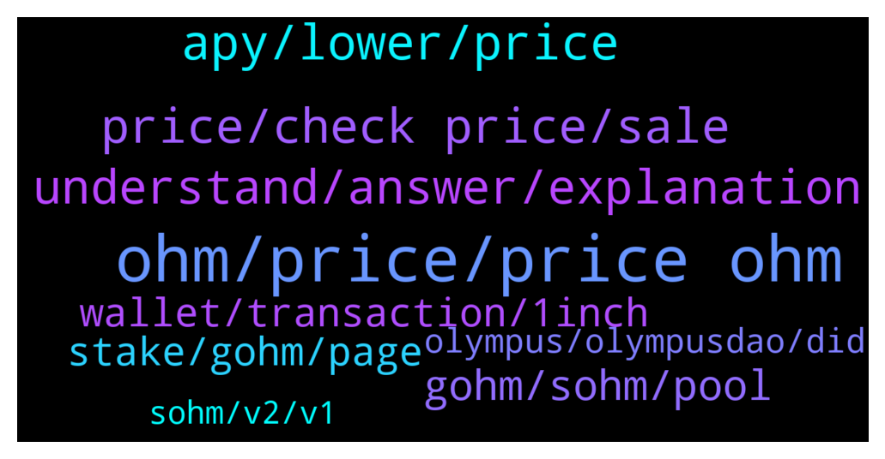

# **@OlympusTG**
 ## Analysis for **2022-01-08** - **2022-01-09**.

---

## 📊 **Basic Stats**

**n_messages_sent**: 669

---

---

## 🔝 **Top keywords and related messages**

1. **ohm, price, price ohm**

    @thinkbig777 --- *1000% a year in OHM is good. but, will our tresury growth by 1000% ? will buyers at defi's buy ohm at that level ? to keep price per ohm static* **--->** [TG Discussion](https://t.me/OlympusTG/144683)

    @thinkbig777 --- *thats the right direction of thinking above backing and as I mentioned, speed of emission, if it will be higher then speed of fulfilling treasury, backing value will keep dropping down by ohm same as price* **--->** [TG Discussion](https://t.me/OlympusTG/144705)

    @thinkbig777 --- *partnerships is good but we do emission of ohm everyday, without bringing value to it, in terms of this 2 things* **--->** [TG Discussion](https://t.me/OlympusTG/144674)

    @thinkbig777 --- *if you compare bitcoin with ohm then there is nothing to discuss huh  someone in this group has real answers on my questions?* **--->** [TG Discussion](https://t.me/OlympusTG/144694)

    @theMagicUnicorn --- *the market decides, smart investors see what ohm is, then others follow* **--->** [TG Discussion](https://t.me/OlympusTG/144688)

    @onehundredsh0tz --- *Anyone got $15 (; I got 15 ohm can’t move it lol* **--->** [TG Discussion](https://t.me/OlympusTG/145103)

2. **apy, lower, price**

    @Crypto --- *I was under the impression that as the Token price dropped you would be covered by the APY going up.   THAT DRASTICLY has not happened.  Did i miss something?* **--->** [TG Discussion](https://t.me/OlympusTG/145363)

    @Marco --- *If the price drops another 50% and APY drops down to 1000% , how long will it take to get my money back?  I bought at 600* **--->** [TG Discussion](https://t.me/OlympusTG/144556)

    @Marco --- *Hey guys is the runway APY shown on the dashboard wrong?  Dashboard says like 299+ days of 50x apy remaining (based off treasury ) .. but we are already at 38x  It seems a little misleading* **--->** [TG Discussion](https://t.me/OlympusTG/144322)

    @Bob --- *I don’t know what are you talking about?   Can you explain me please? What 0.2 ? yesterday the apy was 5071% and from yesterday the price dropped* **--->** [TG Discussion](https://t.me/OlympusTG/144386)

    @Travis --- *Maybe pressure from the community can keep apy where it is now and not go to 1k. Real bad timing for this apy reduction* **--->** [TG Discussion](https://t.me/OlympusTG/144278)

    @Marco --- *APY is just going to gradually get lower to 1000 right?* **--->** [TG Discussion](https://t.me/OlympusTG/144272)

3. **price, check price, sale**

    @xGod3 --- *Why those massive Price drops? I went all in when it was on 1.1k USD$* **--->** [TG Discussion](https://t.me/OlympusTG/145390)

    @nfwaple --- *yea of course the price fluctuates, how good would it be if something only goes up 😂* **--->** [TG Discussion](https://t.me/OlympusTG/145344)

    @noof_zx --- *Is price will fall more ?* **--->** [TG Discussion](https://t.me/OlympusTG/145049)

    @thinkbig777 --- *so even now its overpriced lol, and good time to sell  it worth less then 300$ for real  66-70$ or something* **--->** [TG Discussion](https://t.me/OlympusTG/144642)

    @cdp279 --- *It think we all need to stop checking the price so much. We all killing ourselves worrying* **--->** [TG Discussion](https://t.me/OlympusTG/144901)

    @thinkbig777 --- *yes, and there is no reason for price to go up* **--->** [TG Discussion](https://t.me/OlympusTG/144632)

4. **understand, answer, explanation**

    @nfwaple --- *and the problem that binding solves: https://twitter.com/ohmzeus/status/1479888653304303617* **--->** [TG Discussion](https://t.me/OlympusTG/145321)

    @bike4peace --- *You heard… why you don’t just read and do homework? That helps way more‘* **--->** [TG Discussion](https://t.me/OlympusTG/144938)

    @BROHMZ --- *Bro. No one understands Zeus. He is far too intelligent to be understood. TL;DR buy low sell high lmao* **--->** [TG Discussion](https://t.me/OlympusTG/145329)

    @Max --- *I don't understand any of it 😢. Isn't there some explanation for common newbies?* **--->** [TG Discussion](https://t.me/OlympusTG/145327)

    @bike4peace --- *People need more time to understand this. But yeah, those who understood: gmi* **--->** [TG Discussion](https://t.me/OlympusTG/145187)

    @Ap0l1o --- *don't worry about it, I am sure other people would want to know as well* **--->** [TG Discussion](https://t.me/OlympusTG/144147)

5. **gohm, sohm, pool**

    @Keshavlrk --- *Just One last. What will i get by buying gohm* **--->** [TG Discussion](https://t.me/OlympusTG/145302)

    @John Smith --- *I bought gOHM using Matic and it cost me 3 cents in fees 😉* **--->** [TG Discussion](https://t.me/OlympusTG/144246)

    @cdp279 --- *No difference ser. Gohm will allow you to vote on proposals.* **--->** [TG Discussion](https://t.me/OlympusTG/144158)

    @Adam_H123 --- *I still don’t understand gOHM 🤣* **--->** [TG Discussion](https://t.me/OlympusTG/145000)

    @Le_Beast --- *Just noticed that i also have gOhm next to the sOhm* **--->** [TG Discussion](https://t.me/OlympusTG/144411)

    @Al_S1919 --- *can you advise some pools with gOHM to use on a DEX?* **--->** [TG Discussion](https://t.me/OlympusTG/144214)

6. **stake, gohm, page**

    @nfwaple --- *gOHM is always staked friend, you cna go to the stake page and see your total staked balance increase every rebase, though the number of gOHM does not increase through your wallet, to check best go to the stake page.* **--->** [TG Discussion](https://t.me/OlympusTG/145165)

    @LiviuRt --- *Do i stake to recive Sohm or Gohm, i know nothing about gohm* **--->** [TG Discussion](https://t.me/OlympusTG/145309)

    @BitWealthInc --- *What is diffrence between toggling button sOHM - gOHM? Does it changes anything for staker ?* **--->** [TG Discussion](https://t.me/OlympusTG/144743)

    @steppenwiener33 --- *Quick question.  Trust Wallet recently started showing the value of my ERC20 gOhm tokens.  It seems to be less in value than what I started with.  This shouldn't be possible correct?* **--->** [TG Discussion](https://t.me/OlympusTG/145118)

    @nfwaple --- *correct, holding gOHM is enough, no need to stake* **--->** [TG Discussion](https://t.me/OlympusTG/145296)

    @Toby --- *Oh sucks my power in my house turned off before I got a chance to stake* **--->** [TG Discussion](https://t.me/OlympusTG/144796)

7. **wallet, transaction, 1inch**

    @nfwaple --- *honestly it doesn't really look like hacked wallet, usually the scammers take everything, the time gap is quite big in your wallet* **--->** [TG Discussion](https://t.me/OlympusTG/144465)

    @nfwaple --- *no bruh from your transaction it's very obvious someone transferred your assets out over a range of days* **--->** [TG Discussion](https://t.me/OlympusTG/144478)

    @nfwaple --- *And this bruh has been talking about the same thing for 3 days straight. If I lost my assets I would have freaked out the first day* **--->** [TG Discussion](https://t.me/OlympusTG/144839)

    @nfwaple --- *Anyone looks at your wallet would know it is accessible by someone else since you said you didn't swap on 1inch lol* **--->** [TG Discussion](https://t.me/OlympusTG/144835)

    @nfwaple --- *It is not, we already looked at your transaction, someone swapped your assets on 1inch, your seed phrase or device is compromised* **--->** [TG Discussion](https://t.me/OlympusTG/144830)

    @nfwaple --- *It doesn't work like that, your wallet transaction didn't look right, and it can't just become an LP* **--->** [TG Discussion](https://t.me/OlympusTG/144823)

8. **olympus, olympusdao, did**

    @Ap0l1o --- *I would just wrap the wsOhm on the Olympus app* **--->** [TG Discussion](https://t.me/OlympusTG/144186)

    @chitangxxx --- *How did you bridge it? Is there a facility to do so on olympus website?* **--->** [TG Discussion](https://t.me/OlympusTG/144161)

    @Ap0l1o --- *You need to migrate your wsOhm on the Olympus site* **--->** [TG Discussion](https://t.me/OlympusTG/144183)

    @Ga_Al123 --- *Guys, question....i approved when I migrated but now when I go back to the Olympus dapp, I have the option to approve again* **--->** [TG Discussion](https://t.me/OlympusTG/145150)

    @xtechnologylimited --- *Its a variabel. Its very based on OlympusDAO treasury* **--->** [TG Discussion](https://t.me/OlympusTG/145047)

    @Ap0l1o --- *Yeah, we had some wild rides with Olympus* **--->** [TG Discussion](https://t.me/OlympusTG/144313)

