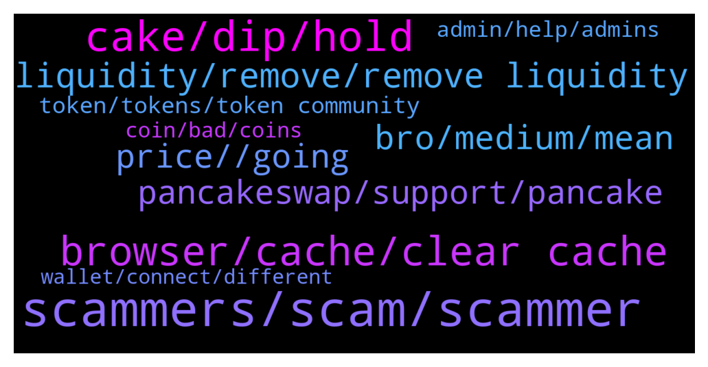

# **@PancakeSwap**
 ## Analysis for **2022-01-08** - **2022-01-09**.

---

## 📊 **Basic Stats**

**n_messages_sent**: 864

---

---

## 🔝 **Top keywords and related messages**

1. **scammers, scam, scammer**

    @dipseeker --- *Courious why they call, as i answered them and didn't ask me anything for a scam* **--->** [TG Discussion](https://t.me/PancakeSwap/2256729)

    @Ayb --- *The site was end by org i get scam i think 2 time 200 dollrs hhh thanks sir* **--->** [TG Discussion](https://t.me/PancakeSwap/2256999)

    @jaytmusic --- *I’m also confused as to why I feel like there’s nobody ever in here but a bot and scammers lol* **--->** [TG Discussion](https://t.me/PancakeSwap/2256897)

    @Ben --- *It's not a phishing site lol. I check the link every time* **--->** [TG Discussion](https://t.me/PancakeSwap/2254504)

    @Andreas9679 --- *Someone has stolen my coins from farms the day before yesterday. Fake admins do not contact me!* **--->** [TG Discussion](https://t.me/PancakeSwap/2256092)

    @shaheerufone --- *some scamer call me to help* **--->** [TG Discussion](https://t.me/PancakeSwap/2255652)

2. **cake, dip, hold**

    @creeptogrinch --- *I will repeat. Cake was already down before this bears* **--->** [TG Discussion](https://t.me/PancakeSwap/2257323)

    @creeptogrinch --- *Cake was way down before market down* **--->** [TG Discussion](https://t.me/PancakeSwap/2257318)

    @hamidmsh16 --- *bought cake at 17$ and im 60% in loss* **--->** [TG Discussion](https://t.me/PancakeSwap/2257576)

    @crytsy --- *I can hold you cake, can you hold me?* **--->** [TG Discussion](https://t.me/PancakeSwap/2258296)

    @TOOLSCUBE --- *It will hold your family too  Cake is a thing to keep for grandchildren* **--->** [TG Discussion](https://t.me/PancakeSwap/2258300)

    @crypmaster --- *Cake soon 🚀🚀🚀🚀 buy the dip or regret later* **--->** [TG Discussion](https://t.me/PancakeSwap/2254438)

3. **browser, cache, clear cache**

    @TomorrowlandForLife --- *clear cache or try a different internet connection* **--->** [TG Discussion](https://t.me/PancakeSwap/2254452)

    @nftworld012 --- *i did that even the solution 1 and 3* **--->** [TG Discussion](https://t.me/PancakeSwap/2254829)

    @TomorrowlandForLife --- *try getting WBNB, clear cache or try from a different device* **--->** [TG Discussion](https://t.me/PancakeSwap/2254678)

    @Rush_lover --- *If u have done this abofe, than i dont know.* **--->** [TG Discussion](https://t.me/PancakeSwap/2257405)

    @Ben --- *And this still doesn't answer why nothing happens when I click enable on desktop. Completely unresponsive via dessktop* **--->** [TG Discussion](https://t.me/PancakeSwap/2254507)

    @claudioivm --- *that's the problem; all of them are showing different TVL; 2b, 4.4b, 7b, etc..* **--->** [TG Discussion](https://t.me/PancakeSwap/2257032)

4. **liquidity, remove, remove liquidity**

    @LORD REVAMP --- *We cannot remove liquidity? How come? Changed to WBNB and also changed slippage* **--->** [TG Discussion](https://t.me/PancakeSwap/2257625)

    @nftworld012 --- *You don’t have liquidity in this pool yet. Add Liquidity* **--->** [TG Discussion](https://t.me/PancakeSwap/2254881)

    @peteboyo --- *Hey so I cleared my cache but rn I'm trying to remove liquidity and I can't get past the confirm part* **--->** [TG Discussion](https://t.me/PancakeSwap/2255216)

    @land --- *admin, i cann't remove my liquidity.can you help me?* **--->** [TG Discussion](https://t.me/PancakeSwap/2255631)

    @LetsfuckingGoGoGo --- *Can u tell us why we cannot remove liquidity ?* **--->** [TG Discussion](https://t.me/PancakeSwap/2254604)

    @Babs --- *Hello guys , how does the liquidity pool work ?    If I place my token price at 0.01bnb per 1,000,000 token, can someone who has more than 1,000,000 of my token swap it for bnb ?* **--->** [TG Discussion](https://t.me/PancakeSwap/2254413)

5. **bro, medium, mean**

    @akhorn --- *show me in the medium where the answer to my question is then* **--->** [TG Discussion](https://t.me/PancakeSwap/2255781)

    @TomorrowlandForLife --- *Yes, I mean that...and it's not funny* **--->** [TG Discussion](https://t.me/PancakeSwap/2256419)

    @Rush_lover --- *lol, thats not my question. But ok* **--->** [TG Discussion](https://t.me/PancakeSwap/2255430)

    @Ceddi200 --- *Bro are you lazy to read* **--->** [TG Discussion](https://t.me/PancakeSwap/2255755)

    @roeerr --- *you mean the gif? its a joke!* **--->** [TG Discussion](https://t.me/PancakeSwap/2256417)

    @roeerr --- *i have patient all good. just grabbing more!* **--->** [TG Discussion](https://t.me/PancakeSwap/2256414)

6. **price, , going**

    @Traunuoc21 --- *Hello, can i ask you a question why the price does not move since 30 minutes ? (SONY) what is happening ?  I bought it on pancakeswap 1h ago but i can not sell now. Please help !!* **--->** [TG Discussion](https://t.me/PancakeSwap/2254703)

    @creeptogrinch --- *I mean I dont give a shit about the price. Im long term hodler. I was just askin anyway* **--->** [TG Discussion](https://t.me/PancakeSwap/2257328)

    @Paintinmyeye --- *but i am buying so much these days with this price :D* **--->** [TG Discussion](https://t.me/PancakeSwap/2257336)

    @waj_io --- *Floor price rising as we speak - get one now* **--->** [TG Discussion](https://t.me/PancakeSwap/2257620)

    @DDaren6 --- *Can I get help. I bought a PETH on the 7th tangent. Quantity 1,000,000. The price went up by 1,000%. I have 10,000 PETH in my wallet now. Why .* **--->** [TG Discussion](https://t.me/PancakeSwap/2257873)

    @BotInTheHood --- *Same for people bought btc at 60k Market is down sometime and up sometime This is crypto* **--->** [TG Discussion](https://t.me/PancakeSwap/2257577)

7. **pancakeswap, support, pancake**

    @Ayoub --- *I had an issue with a swap on pancakeswap and when I tried to reach the help line they called me and sent me a link where to solve the issue asking me to provide my phrase and when I did all my funds were lost* **--->** [TG Discussion](https://t.me/PancakeSwap/2256614)

    @Ben --- *Nah.  It's pretty clear that I've just lost my money to a scammer.  Won't be using PancakeSwap again.* **--->** [TG Discussion](https://t.me/PancakeSwap/2257739)

    @ppopierre --- *Please help pancakesquads reach the moon!!! It’s incredible you don’t support community and people who support pancakeswap!!* **--->** [TG Discussion](https://t.me/PancakeSwap/2256391)

    @hoseini1364610 --- *Hello Amir, I am from Iran I had a problem converting currency in pancakeswap and an invalid session error. Gives* **--->** [TG Discussion](https://t.me/PancakeSwap/2254783)

    @HelderSepu --- *trying to make a proposal on panckaswap* **--->** [TG Discussion](https://t.me/PancakeSwap/2258059)

    @Poriisys --- *No I have a problem in pancakes that I need to send you the transaction link, solve my problem* **--->** [TG Discussion](https://t.me/PancakeSwap/2256710)

8. **token, tokens, token community**

    @TomorrowlandForLife --- *That's the route the tokens did.... The important thing is where TO finished....and is the wallet I show you 0xe6e3c73a5f686d5835167ad470fdbe1db810665b* **--->** [TG Discussion](https://t.me/PancakeSwap/2257840)

    @HAITIENLK --- *transaction is sucessfull and token is transfered to your wallet bro* **--->** [TG Discussion](https://t.me/PancakeSwap/2257448)

    @Chandana1437 --- *Just check if there is tax on that token. Ask the respective project team* **--->** [TG Discussion](https://t.me/PancakeSwap/2257238)

    @TomorrowlandForLife --- *I'm not saying anything. I've just shared a command with help to solve your issue. Ask on token's community. They should inform/help you how to operate their own token* **--->** [TG Discussion](https://t.me/PancakeSwap/2256390)

    @TomorrowlandForLife --- *your tokens are IN your wallet if the ammount is not what you bought then probably is a Rebase token Ask on their community please* **--->** [TG Discussion](https://t.me/PancakeSwap/2254642)

    @TomorrowlandForLife --- *Your tokens are IN your wallet as you can see. Check if you're added the correct contract. This is the correct one  0x0e09fabb73bd3ade0a17ecc321fd13a19e81ce82* **--->** [TG Discussion](https://t.me/PancakeSwap/2254649)

9. **admin, help, admins**

    @Pm me and get blocked --- *admin am newbie and was hacked i actually thought i have harvest and i dm hai then and spoke to him he explained to me i don’t but was rude that i wasted his time an he blocked me  why is that?* **--->** [TG Discussion](https://t.me/PancakeSwap/2255589)

    @CryptoBDINC --- *Is there any admin available who is responsible for AMA proposal?* **--->** [TG Discussion](https://t.me/PancakeSwap/2256759)

    @Pm me and get blocked --- *admin admin am newbie and was hacked i actually thought i have harvest and i dm hai then and spoke to him he explained to me i don’t but was rude that i wasted his time an he blocked me  why is that?* **--->** [TG Discussion](https://t.me/PancakeSwap/2255595)

    @Akanonu --- *how do I chat with  the admin the?* **--->** [TG Discussion](https://t.me/PancakeSwap/2257220)

    @Laurentoni --- *I got an issue  Any help team here Or admin Please i need help* **--->** [TG Discussion](https://t.me/PancakeSwap/2255419)

    @ReflectionsMakeMeRich --- *Is there an admin here I have a question* **--->** [TG Discussion](https://t.me/PancakeSwap/2258361)

10. **coin, bad, coins**

    @az6996 --- *I did that and no luck. The coins showed one time in Metamask and then almost immediately went to zero.* **--->** [TG Discussion](https://t.me/PancakeSwap/2254639)

    @MaxiMilitia --- *I still can't trade FIA protocol.... Is it a SC..am???* **--->** [TG Discussion](https://t.me/PancakeSwap/2256295)

    @Santhosh --- *Hi admin,  we bought coin from pcs but received to metamask?* **--->** [TG Discussion](https://t.me/PancakeSwap/2254635)

    @Ceddi200 --- *Probably you bought a bad coin* **--->** [TG Discussion](https://t.me/PancakeSwap/2257629)

    @Ben --- *Tried all but asking the coin issuer. No luck.  I have sold this coin in the past though* **--->** [TG Discussion](https://t.me/PancakeSwap/2257196)

    @mic_min --- *hmm.. it means you lost all your coins if you used v1..* **--->** [TG Discussion](https://t.me/PancakeSwap/2254957)

