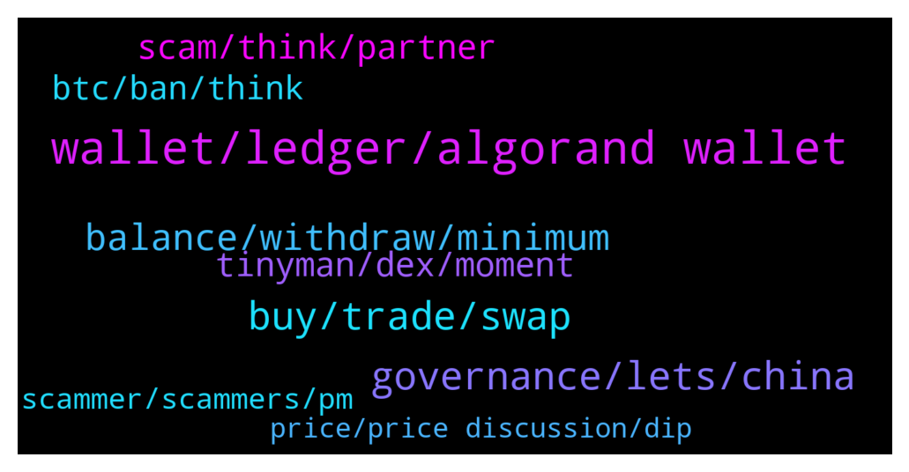

# **@algorand**
 ## Analysis for **2022-01-08** - **2022-01-09**.

---

## 📊 **Basic Stats**

**n_messages_sent**: 170

---

---

## 🔝 **Top keywords and related messages**

1. **wallet, ledger, algorand wallet**

    @Marco --- *mmm ok but ledger has 24 words not 25* **--->** [TG Discussion](https://t.me/algorand/331110)

    @ethannt --- *Hi, which Algorand wallet should I use? Algorand Wallet or My Algo? Tks* **--->** [TG Discussion](https://t.me/algorand/331099)

    @thebigbadwolf1 --- *Also, what are the advantages (if any) of holding algo in an exclusive algo wallet as opposed to metamask or trust wallet?* **--->** [TG Discussion](https://t.me/algorand/331093)

    @Otobong1200 --- *Please which wallet should I used to buy algorand tokens???* **--->** [TG Discussion](https://t.me/algorand/331019)

    @Marco --- *just my last question: on my algo wallet I do have three wallet: governace (with ledger), yieldly and planet. Yieldly and Planets have their 25 passhprhase and myalgo password. But with ledger wallett I can't check the passphrase (trough my algo) becasue the password doesn't work. Is it normal ?* **--->** [TG Discussion](https://t.me/algorand/331115)

    @thebigbadwolf1 --- *Hi guys, I hold an algorand wallet but I am unable to stake my algo from there. Thinking of moving it somewhere else. Any suggestions on where to stake?* **--->** [TG Discussion](https://t.me/algorand/331092)

2. **governance, lets, china**

    @MackDenver --- *You can find all the latest news on our announcement channel  https://t.me/algorand_announcements* **--->** [TG Discussion](https://t.me/algorand/331150)

    @Martin --- *(I believe it was supposed to take place in 2021. Is there any new date ?)* **--->** [TG Discussion](https://t.me/algorand/330962)

    @nana8869 --- *Hey, any recent news or upcoming events?* **--->** [TG Discussion](https://t.me/algorand/331149)

    @开心 --- *I'm from China, English is not good* **--->** [TG Discussion](https://t.me/algorand/330944)

    @Emi --- *Yes I though so up to yesterday because they said they will return them on 6th of January and nothing been returned so far* **--->** [TG Discussion](https://t.me/algorand/330902)

    @Emi --- *but up to now they didn't* **--->** [TG Discussion](https://t.me/algorand/330892)

3. **buy, trade, swap**

    @Otobong1200 --- *How to buy algorand tokens and how to swap them...* **--->** [TG Discussion](https://t.me/algorand/331018)

    @druidrune --- *Please how can i transfer my coins to solllet?* **--->** [TG Discussion](https://t.me/algorand/330929)

    @Asiwajushittu --- *Please apart from tyniman, where else can I swap my Kitten coins to Algo?* **--->** [TG Discussion](https://t.me/algorand/331153)

    @Yohannes --- *Where can i swap yieldy ?* **--->** [TG Discussion](https://t.me/algorand/330731)

    @NightAlgorand --- *You can buy them on many major exchange like binance etc* **--->** [TG Discussion](https://t.me/algorand/331023)

    @DouglasGamaa --- *That I can exchange USDC for AlGO* **--->** [TG Discussion](https://t.me/algorand/330981)

4. **balance, withdraw, minimum**

    @Haobui0305 --- *sir, I can't withdraw all my algo, when I press max it goes like this Failed transaction, try again later and when I adjust it lower so that the balance in the wallet is above 0.1 algo, it stays like this Remaining balance below minimum required* **--->** [TG Discussion](https://t.me/algorand/331166)

    @Haobui0305 --- *ok thank, so what can i do to withdraw my remaining algo balance* **--->** [TG Discussion](https://t.me/algorand/331154)

    @Haobui0305 --- *hello sir in my algo wallet there is 1.29 algo but i can't withdraw, it shows like this Remaining balance below minimum required* **--->** [TG Discussion](https://t.me/algorand/331151)

    @MackDenver --- *You likely have added multiple ASA, each ASA in your account increases the minimum balance that you need to maintain* **--->** [TG Discussion](https://t.me/algorand/331152)

    @Lord_Shin_Chan_2_O --- *I can't withdrawal my algo Tokens... Why sir...?* **--->** [TG Discussion](https://t.me/algorand/330842)

    @druidrune --- *I try to transfer Algo to my sollet wallet but not working* **--->** [TG Discussion](https://t.me/algorand/330936)

5. **tinyman, dex, moment**

    @NightAlgorand --- *At the moment AlgoDex is in testnet. Only Tinyman is available at the moment 🙂* **--->** [TG Discussion](https://t.me/algorand/330734)

    @angelo9007 --- *At the moment AlgoDex is in testnet. Only Tinyman is available at the moment* **--->** [TG Discussion](https://t.me/algorand/331070)

    @IwuAustinChris1 --- *Please is there any other Decentralized Exchange except tinyman on Algorand ecosystem?* **--->** [TG Discussion](https://t.me/algorand/330733)

    @fkyshow --- *Please is there any presently functional mainnet DEX on algo ecosystem?* **--->** [TG Discussion](https://t.me/algorand/331104)

    @MackDenver --- *Tinyman is the only mainnet DEX right now. A few others are already in the work* **--->** [TG Discussion](https://t.me/algorand/331106)

    @fkyshow --- *I used to use Tinyman, but now they have issues, i don't know where else to turn* **--->** [TG Discussion](https://t.me/algorand/331105)

6. **scam, think, partner**

    @Ab_Del --- *@ admins: is it planned to have a MOOCS course on Algorand development ? I think we can inspire ourselves of what Cardano is doing with their Plutus Pioneer Program (all their lectures are available for free on YouTube) to open the ecosystem and make it easier for devs to join and implement stuff on Algorand.* **--->** [TG Discussion](https://t.me/algorand/331146)

    @MackDenver --- *Perhaps you are in the wrong group. This is the Algorand community* **--->** [TG Discussion](https://t.me/algorand/330930)

    @thebigbadwolf1 --- *How do you become a governor on algorand ie what are the criteria?* **--->** [TG Discussion](https://t.me/algorand/331114)

    @Skydr4k3 --- *I would like you to see entheos The project has been awarded by the algo foundation. But i really think it s a scam. On their website they have illegal logos of italian istitutions. It is not possible that the navy, multiple municipalitis, the army and more are affiliated with this project. Please report it to the team or watch youself* **--->** [TG Discussion](https://t.me/algorand/330802)

    @bernijw --- *Why would you think it is a scam? This is a fairly large software company. They could easily have contracts with these institutions. Their work with Algorand is only a tiny portion of what they do. I see no reason at all to call them a scam...if Microsoft were to partner on something with Algorand, would you call that a scam only because they also partner with the government on different projects?* **--->** [TG Discussion](https://t.me/algorand/330804)

    @Ryan --- *ISO 20022 looking good for Algorand!* **--->** [TG Discussion](https://t.me/algorand/331027)

7. **btc, ban, think**

    @Julian --- *Isn’t there a large chance the US will just ban crypto, especially a crypto like Algorand since it poses a threat to the US Dollar. Even though Algorand is infinitely brilliant and world changing, can’t it just be banned?* **--->** [TG Discussion](https://t.me/algorand/330775)

    @NightAlgorand --- *They can ban it in the US. That’s about it* **--->** [TG Discussion](https://t.me/algorand/330776)

    @Brightmoon23 --- *Don't underestimate it , it could be next year.* **--->** [TG Discussion](https://t.me/algorand/331142)

    @khunpon --- *I don't think US wanna lose dominance in this crypto-space.* **--->** [TG Discussion](https://t.me/algorand/330801)

    @khunpon --- *after crypto come, sanction will be hard for US. as they can pivot to BTC/blah blah.* **--->** [TG Discussion](https://t.me/algorand/330800)

    @khunpon --- *I don't think US will ban crypto. before US can sanction any country. USD is very powerful.* **--->** [TG Discussion](https://t.me/algorand/330799)

8. **scammer, scammers, pm**

    @MackDenver --- *Hi there, please be aware of scammers. Let me know if there is anything I can help you.* **--->** [TG Discussion](https://t.me/algorand/330856)

    @Lord_Shin_Chan_2_O --- *Admins shouldn't respond my messages... But scammers should...😒🤦‍♂ worst sir...😒* **--->** [TG Discussion](https://t.me/algorand/330853)

    @khunpon --- *Scammer will pm you in 3 2 1 ..* **--->** [TG Discussion](https://t.me/algorand/331085)

    @Asiwajushittu --- *Ordinary scammer Jammed professional scammer 😁😁* **--->** [TG Discussion](https://t.me/algorand/330861)

    @bernijw --- *could you please ban the spamming scammer below?* **--->** [TG Discussion](https://t.me/algorand/330812)

    @NightAlgorand --- *If anyone does, they are scammer.* **--->** [TG Discussion](https://t.me/algorand/330816)

9. **price, price discussion, dip**

    @Martin --- *What would happen with the transaction fees ifAlgo price goes very high? Would they evaluate fixing the transaction fees to a fixed price? Or this cannot be change?* **--->** [TG Discussion](https://t.me/algorand/331135)

    @MackDenver --- *You can use the following group for price discussion  @algorand_price* **--->** [TG Discussion](https://t.me/algorand/331175)

    @MackDenver --- *Please join the price chat for price speculation  @algorand_price* **--->** [TG Discussion](https://t.me/algorand/331160)

    @Sophia --- *Trading is okay but farming your coins is the best . Instead of loosing to trading with all these complicated chats I'd advice you farm your crypo asset for specific period of time with a high ROI.* **--->** [TG Discussion](https://t.me/algorand/331041)

    @D. --- *dont be a pussy. buy the dip* **--->** [TG Discussion](https://t.me/algorand/330996)

    @Janus_Age --- *is price discussion fine here or is there another group for that* **--->** [TG Discussion](https://t.me/algorand/330768)

