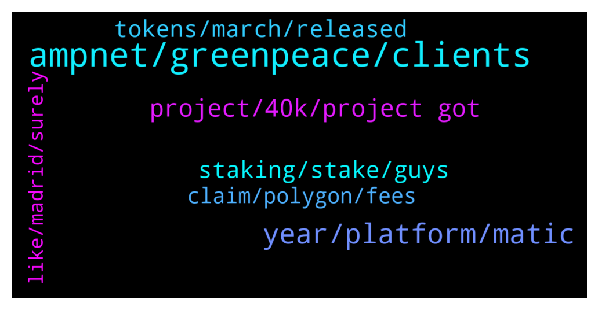

# **@ampnetapxchat**
 ## Analysis for **2022-01-04** - **2022-01-09**.

---

## 📊 **Basic Stats**

**n_messages_sent**: 103

---

---

## 🔝 **Top keywords and related messages**

1. **ampnet, greenpeace, clients**

    @Bob_Fosse --- *That was basically a very long winded statement that reads, “ampnet did nothing wrong, it’s everyone else’s fault”. Just awful (and not surprising).* **--->** [TG Discussion](https://t.me/ampnetapxchat/36017)

    @mislavjavor --- *Hey @IncogSen - the breakdown of Greenpeace partnership and the Aeternity attacks were all announced as they happened. The onboarding of new clients and the decision to develop AMPnet v2 was also communicated when it happened. There was no hiding of information from our side - when we had nothing to say, we stayed silent. When we had new partners or developments - we announced them, as was expected from us.   The optimism in our announcements was how we felt at the time, it was a genuine excitement that we felt - but we couldn’t know how things would end before they ended.  I understand the frustrations, but information was not witheld.* **--->** [TG Discussion](https://t.me/ampnetapxchat/36007)

    @IncogSen --- *Maybe they already knew about the greenpeace deal falling through behind the scenes* **--->** [TG Discussion](https://t.me/ampnetapxchat/36013)

    @mislavjavor --- *I agree, and the team finds ourselves more than accountable for things in and beyond our control. In the history of our company, there has never been an attitde of - “it must be somebody elses fault”. We should have acted sooner on red flags by Greenpeace, we should have moved on to Ethereum sooner, etc… Trust me when I say that we do not pat ourselves on the back saying “good job, it’s the fault of the clients”. On the other hand - it’s easy to look on things from hindsight - with all the extra information that hindsight provides.   The post was meant as an update to the community, that we are working hard, exploring new business models and new clients and that AAPX will be the token that’s backing these new developments.* **--->** [TG Discussion](https://t.me/ampnetapxchat/36027)

    @Hoetoevallig --- *AMPnet should be well funded, yet the level of participation and reciprocity seems to be at a minimum...* **--->** [TG Discussion](https://t.me/ampnetapxchat/35987)

    @mislavjavor --- *@IncogSen - I said before that I understand your frustrations, but the accusations truly are unfounded. If we had not believed in the Genervest story ourselves we would not have sunk so much time and money into it. The breakdown of reationships with Genervest was not a simple or short process - as we were constantly under the impression that they will gain access to the mailing lists and marketing which, imho - would make the campaigns a success.   We have previously muted or banned anyone insinuating stories of insider manipulation or providing false info. We have always worked with the facts we knew and presented them in such a way. There were no insider trades, no special knowledge we had about the project. We, the team, do not trade AAPX and hold it on a long term basis, locked in vesting (which starts unlocking in 2023). Because of the nature of these things, you can always doubt that something like this happened. It’s not true, it’s never been true and AMPnet is not that type of company, nor that type of project.   These things will not be repeated again and again ad-nauseum. It’s easy to get conspiratorial and find patterns when you’re losing money - everyone trading crypto has succumbed to it at some point. But this will be the end of these discussions because they serve absolutely zero purpose other than to pollute the discussion. Any further insinuations of this nature will be deleted.* **--->** [TG Discussion](https://t.me/ampnetapxchat/36020)

2. **year, platform, matic**

    @<UNK> --- *This is due to the fact that AAPX unlocks linearly and sites like CMC or CoinGecko have "unlock date" which we cannot use, cuz appx is unlocking every moment instead of a set date  But anyone can check circ. supply/max supply here -  https://claim.ampnet.io/app/dist/index.html* **--->** [TG Discussion](https://t.me/ampnetapxchat/36149)

    @E_Don --- *We need more pairs on Matic. Eth gas fee is crazy  Matic/AAPX. Eth/AAPX* **--->** [TG Discussion](https://t.me/ampnetapxchat/36085)

    @<UNK> --- *Here is the aapx network address  https://polygonscan.com/token/0x3fc8bd9b0d8054cbdc174c4ed4b41a95d3c6a427* **--->** [TG Discussion](https://t.me/ampnetapxchat/36087)

    @whimofnature --- *having a large partner helps a lot of course, but crypto-space itself can be fund-raising .. even for fund-raising technologies. IMO the main problem what keeps people from looking at AAPX is that there is no circulating supply visible for the AAPX token. this causes the token to be ranked somewhere in the >10000 rank area. nobody looks at this. if there was a circ. supply information it would be immediately ranked lower, and people would look what the project is about. and then they would be fascinated, because everyone knows real estate / equities on blockchain is the future. and then they would buy AAPX.* **--->** [TG Discussion](https://t.me/ampnetapxchat/36136)

    @matejmz --- *Matic/AAPX exists. You can swap ETH to Matic and then swap it for AAPX* **--->** [TG Discussion](https://t.me/ampnetapxchat/36086)

    @Tinus_Tussengas_1984 --- *So, what’s holding you back of getting more people into buying $aapx? Ah, you want to get paid for it. You either believe in it and spread the word by yourself or stfu and get out of here before I release my dogs 😉* **--->** [TG Discussion](https://t.me/ampnetapxchat/36121)

3. **project, 40k, project got**

    @bazzie123 --- *Ok so you failed basically everywhere* **--->** [TG Discussion](https://t.me/ampnetapxchat/36233)

    @Lord of the --- *Dude stop be crybaby it's history now* **--->** [TG Discussion](https://t.me/ampnetapxchat/36014)

    @IncogSen --- *But such a shame how it ended* **--->** [TG Discussion](https://t.me/ampnetapxchat/36006)

    @MelonHusk --- *Good god this project got fucking destroyed* **--->** [TG Discussion](https://t.me/ampnetapxchat/35955)

    @IncogSen --- *Ohhh sorry thought u were talking about me* **--->** [TG Discussion](https://t.me/ampnetapxchat/36022)

    @IncogSen --- *Some people lost 40k from this project* **--->** [TG Discussion](https://t.me/ampnetapxchat/36003)

4. **staking, stake, guys**

    @RUK2354 --- *Hi Guys! Is there a staking?* **--->** [TG Discussion](https://t.me/ampnetapxchat/36151)

    @BMontana3 --- *You guys should allow us to stake, the price has completely got destroyed. Atleast get some people hope again and reward them for still holding the coin..* **--->** [TG Discussion](https://t.me/ampnetapxchat/35971)

    @matejmz --- *Prepare for the "what is circulating supply?" questions 😆* **--->** [TG Discussion](https://t.me/ampnetapxchat/36139)

    @matejmz --- *I bought most coins at 50 cents. Hopefully that was really the bottom 😆* **--->** [TG Discussion](https://t.me/ampnetapxchat/36237)

    @<UNK> --- *Hey @RUK2354, currently there is no staking for aapx tokens* **--->** [TG Discussion](https://t.me/ampnetapxchat/36152)

    @MrCrypto504 --- *yeah i havent sold anything, staking would had been nice like yesterday* **--->** [TG Discussion](https://t.me/ampnetapxchat/35972)

5. **tokens, march, released**

    @PFCBLic --- *Can we put final date and final ammount of released tokens? Mcap wont be correct but it is better than nothing* **--->** [TG Discussion](https://t.me/ampnetapxchat/36153)

    @MarcusVieiraCosta --- *will there be the promised tokens for us that made the cryptobond with Sync?* **--->** [TG Discussion](https://t.me/ampnetapxchat/36114)

    @<UNK> --- *As @matejmz said, when all tokens are released in March, we will solve this vesting problem* **--->** [TG Discussion](https://t.me/ampnetapxchat/36168)

    @whimofnature --- *yeah, or just provide daily/weekly unlock dates to CMC & co, that mimic the linear release schedule ...* **--->** [TG Discussion](https://t.me/ampnetapxchat/36162)

    @matejmz --- *Also after 8th of March there will be no new tokens for whole year. It would be cool to have this visible.* **--->** [TG Discussion](https://t.me/ampnetapxchat/36147)

    @Hydayashi --- *will you be able to list the token on major exchanges soon? what are the plans for that? @mislavjavor* **--->** [TG Discussion](https://t.me/ampnetapxchat/36067)

6. **claim, polygon, fees**

    @<UNK> --- *You just need to provide transaction hash and you'll be compensated   https://docs.google.com/forms/d/e/1FAIpQLSf4GCX62RAfb0oZvGNPzNynTdHFlvoIw9KZqA0o1VOkEwG_Kw/viewform* **--->** [TG Discussion](https://t.me/ampnetapxchat/36040)

    @<UNK> --- *Sorry that was automatic, use this link to claim tokens 😅 https://claim.ampnet.io/app/dist/index.html* **--->** [TG Discussion](https://t.me/ampnetapxchat/36172)

    @BlinkmothNexus --- *Yeah I know this page. My question was If I can claim with polygon network, not eth mainnet* **--->** [TG Discussion](https://t.me/ampnetapxchat/36173)

    @BlinkmothNexus --- *Sorry but how does the polygon adresse helps me to claim my presale token?* **--->** [TG Discussion](https://t.me/ampnetapxchat/36171)

    @Tinus_Tussengas_1984 --- *Team should make it possible for us to claim tokens on poly and the ability to bridge. Will safe is a lot of gas fees* **--->** [TG Discussion](https://t.me/ampnetapxchat/36091)

    @E_Don --- *This polygon contract address should be pinned on twitter. Uniswap gas fees discourages potential buyers.  I lost almost 100usd on gas fees yesterday on a FAILED uniswap Eth/Aapx swap😡* **--->** [TG Discussion](https://t.me/ampnetapxchat/36089)

