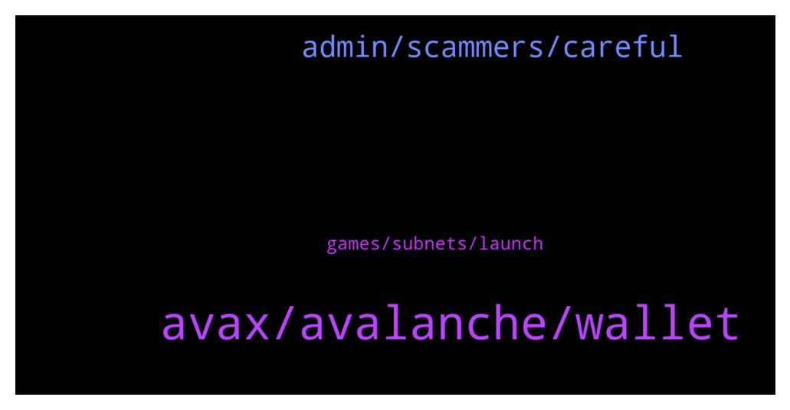

# **@avalancheavax**
 ## Analysis for **2022-01-08** - **2022-01-09**.

---

## 📊 **Basic Stats**

**n_messages_sent**: 165

---

---

## 🔝 **Top keywords and related messages**

1. **avax, avalanche, wallet**

    @Morei --- *when will AVAX MOOOOOONNNNN ? WHY THE PRICE IS SO BAD* **--->** [TG Discussion](https://t.me/avalancheavax/320986)

    @oathtobarbatos --- *ISA is on Avalaunch, right? Try talking about your case there http://t.me/avalaunch_app* **--->** [TG Discussion](https://t.me/avalancheavax/320819)

    @BjornSeal --- *Any new promising project on Avax ?* **--->** [TG Discussion](https://t.me/avalancheavax/320873)

    @BjornSeal --- *Ok. So anything less than 25 Avax is not gonna be staked?* **--->** [TG Discussion](https://t.me/avalancheavax/320889)

    @Izaiya --- *And how do I buy it; I see it on coinmarket but don’t know where to begin… scammer msg me* **--->** [TG Discussion](https://t.me/avalancheavax/320773)

    @Lucy6568 --- *Hi the market looks volatile today* **--->** [TG Discussion](https://t.me/avalancheavax/320933)

2. **admin, scammers, careful**

    @Dante --- *Any admin here ??? My swap is pending for a while* **--->** [TG Discussion](https://t.me/avalancheavax/320904)

    @daleetguy --- *Admins be careful. This group is full of scammers. As soon as you interact here you receive several DM pretending they're representing official support. I can provide screenshots if you want.  These guys should be banned.* **--->** [TG Discussion](https://t.me/avalancheavax/320734)

    @sonicblend --- *Best to use the website / app support. Too many scammers around.* **--->** [TG Discussion](https://t.me/avalancheavax/321035)

    @oathtobarbatos --- *Yup. Be careful with anyone's DM. Administrators won't ask you for money.* **--->** [TG Discussion](https://t.me/avalancheavax/321040)

    @BigRed --- *Is there usually this much scam and spam in this group?* **--->** [TG Discussion](https://t.me/avalancheavax/321108)

    @Yekscrypto --- *what is the chinese official group?* **--->** [TG Discussion](https://t.me/avalancheavax/321084)

3. **games, subnets, launch**

    @tontonq --- *games  may gonna to their own subnets with their own fees* **--->** [TG Discussion](https://t.me/avalancheavax/321053)

    @DanDK9 --- *Meaning anyone can launch a subnet without approval? Would there be any form of yes/no action required from someone else prior to launching the subnet?* **--->** [TG Discussion](https://t.me/avalancheavax/320867)

    @Nicolas_A --- *Anyone can launch, no approval required* **--->** [TG Discussion](https://t.me/avalancheavax/320875)

    @John --- *It would be pretty difficult if u ask me, lots of games in BSC trying to create their own side chain, which probably require another kind of in game token. That's why there aren't alot of good games launch in BSC due to the complicated nature of having to create another side chain.* **--->** [TG Discussion](https://t.me/avalancheavax/321057)

    @John --- *Like what most games are doing in BSC? Have their own side chains.* **--->** [TG Discussion](https://t.me/avalancheavax/321055)

    @HellenicAng3 --- *I would expect interesting things to happen once subnets are launched.* **--->** [TG Discussion](https://t.me/avalancheavax/321021)

