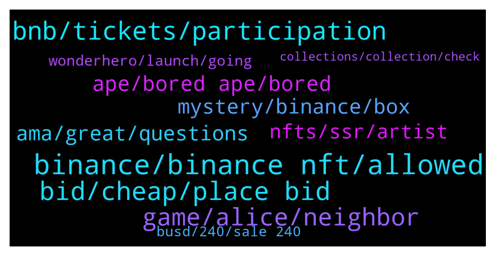

# **@binancenfts**
 ## Analysis for **2022-01-08** - **2022-01-09**.

---

## 📊 **Basic Stats**

**n_messages_sent**: 434

---

---

## 🔝 **Top keywords and related messages**

1. **binance, binance nft, allowed**

    @faruktuna --- *Why? This a cross chain nft and it will start on Binance too.* **--->** [TG Discussion](https://t.me/binancenfts/427883)

    @faruktuna --- *They’re preparing a seperate collection for Binance NFTs. This a cross chain nft project. Instead of a screenshot, this is the trailer of the video.* **--->** [TG Discussion](https://t.me/binancenfts/427885)

    @HaruGNL --- *Yes its on binance nft and other bsc marketplace* **--->** [TG Discussion](https://t.me/binancenfts/426956)

    @semeerkv --- *First of all I thanks BinanceNFT to equal opportunity to participate in the Binance NFT primary sales . My question  When will I know about the NFT allocation result? Every Participant will get Allocations?   @Yuanxiaote* **--->** [TG Discussion](https://t.me/binancenfts/426768)

    @revcrt27 --- *I mistakenly transferred NFT from Opensea to my Binance wallet address, can you help me get it back ? New Year's festival coming up in my country and I'm stuck with 6000$ worth of NFTs there, please help* **--->** [TG Discussion](https://t.me/binancenfts/427010)

    @semeerkv --- *Only BINANCE market place nfts screenshot allowed here* **--->** [TG Discussion](https://t.me/binancenfts/427884)

2. **bid, cheap, place bid**

    @rcliko --- *Wuu very nice and cheap 👋* **--->** [TG Discussion](https://t.me/binancenfts/426571)

    @EM --- *Cheapest price of 12 BUSD.  Search for "Bored Gorilla 07" to place your bid. 🤝* **--->** [TG Discussion](https://t.me/binancenfts/427337)

    @SAMSD7 --- *Last chance for limited edition BP Syn city* **--->** [TG Discussion](https://t.me/binancenfts/427708)

    @serzh11 --- *I give it at a low price* **--->** [TG Discussion](https://t.me/binancenfts/427162)

    @EM --- *Lowest price.  Search for "Bored Gorilla 08" to place your bid.* **--->** [TG Discussion](https://t.me/binancenfts/427565)

    @temurboy --- *the auction will end soon. this is your chance to buy cheap. who needs i send link. 80$* **--->** [TG Discussion](https://t.me/binancenfts/427556)

3. **bnb, tickets, participation**

    @c_hinmay --- *If I have 0.5 bnb in earn section and nothing in spot ... then? What amount will be locked?🤔* **--->** [TG Discussion](https://t.me/binancenfts/426865)

    @Yuanxiaote --- *sry to be confused. Hi, in this mechanism, BNB can have 2 usage, one is for holding calculations and then the other is for participation of the sale. During holding period, you don't need to specifically stake your BNB, it will auto calculate even its in earn wallet or others. And on the other hand, if you commit for participation of the sale, the tokens(BNB) will be locked for the moment before distribution. After final calculation, all unused BNB will be returned though. So in short, you are only paying for what you have successful committed to purchase.--- In a nut shell, In Alice drop, you use BNB to buy mystery box.* **--->** [TG Discussion](https://t.me/binancenfts/426826)

    @Ivan11338 --- *I have 1 BNB on my account since yesterday, but it shows my average is 0.1))))) Do i need to have 100 BNB on my account to participate in sale?)* **--->** [TG Discussion](https://t.me/binancenfts/426947)

    @c_hinmay --- *So we have to get tickets, by holding min of 0.5 bnb in spot(bnb which is not in use rn), right? And later which tokens will be locked, busd or the bnb that we hold? Quite confusing, as busd is used for buying most mystery boxes🙄👀 @Yuanxiaote* **--->** [TG Discussion](https://t.me/binancenfts/426766)

    @Yuanxiaote --- *Only the amount of committed participated tickets will affect the probability. The more participation tickets you commit, the higher probability to win. :) BNB holding amount will not affect the propability. Even though you might hold 100BNB, but the probability are same with others if you guys commit same amount of tickets* **--->** [TG Discussion](https://t.me/binancenfts/426733)

    @Kenikky --- *Effie, Do I stand a higher chance to win the NFT if I hold more BNB? 🙂* **--->** [TG Discussion](https://t.me/binancenfts/426729)

4. **game, alice, neighbor**

    @Kenikky --- *I bet you get a lot of requests to participate in the grant program! Let’s get back to the game development. Anastasia is there any recent updates, events that you would like to share?* **--->** [TG Discussion](https://t.me/binancenfts/426667)

    @anastasiaplane --- *Hi Amir! I see you follow Alice’s channels too 🤗 To answer your question, I would say we had our challenges too during the most horrible time of it. But we managed to stay strong, focus on DAO, and develop the game according to our roadmap.   I think people are more comfortable working from home in their comfortable environment, and how much better can it be to build a game in your pajamas?! 🙂  Thank you for being a part of our community!* **--->** [TG Discussion](https://t.me/binancenfts/426833)

    @Ivar_Boneless3 --- *Do we need to buy land in the Alice game and for what reasons we need to acquire it?* **--->** [TG Discussion](https://t.me/binancenfts/426800)

    @flyingsoner --- *I have been following for quite time probably since its beginning. I wonder if you guys plan to have any game for children or some people with physical disadvantage situations to improve their skills?* **--->** [TG Discussion](https://t.me/binancenfts/426785)

    @Oksure88 --- *Whitepaper indicates that the covid-19 and ensuing success of video games publishers have commercially inspired the development of My Neighbor Alice game. How relevant are these trends today?* **--->** [TG Discussion](https://t.me/binancenfts/426764)

    @anastasiaplane --- *We launched Metaverse Grant Program in November 2021. Founded in collaboration with Chromia and Mines of Dalarnia (blockchain-based, p2e game https://twitter.com/MinesOfDalarnia) the $80m program will provide support to the most promising ideas in an effort to expand the metaverse surrounding My Neighbor Alice and the Chromia ecosystem at large.   We have written the whole article highlighting all the benefits of the program: https://myneighboralice.medium.com/introducing-the-80m-metaverse-grant-program-107a00053dc1* **--->** [TG Discussion](https://t.me/binancenfts/426664)

5. **ape, bored ape, bored**

    @ICE2005 --- *there are other bored ape who sell for 30 eth* **--->** [TG Discussion](https://t.me/binancenfts/427264)

    @tareeb23 --- *A Photograph of the Several Paintings Of Unique Portraits describing Unique Cultures and Different Colors of life* **--->** [TG Discussion](https://t.me/binancenfts/427240)

    @Seller769 --- *BORED APE #10110▵36╳55 Your chance to buy )* **--->** [TG Discussion](https://t.me/binancenfts/427778)

    @Seller769 --- *BORED APE #10110▵36╳55▵NFT PRIDE U can buy, cheap price* **--->** [TG Discussion](https://t.me/binancenfts/427651)

    @Pierrotgt --- *Hello everyone, I will put my APE KIDs up for auction if someone cheers up, thank you very much for the support.* **--->** [TG Discussion](https://t.me/binancenfts/428053)

    @stylesses --- *THE BIGGEST COLLECTION FOR SALE  REAL KID APE #12027 PRICE $135   thanks* **--->** [TG Discussion](https://t.me/binancenfts/427658)

6. **mystery, binance, box**

    @Kenikky --- *Let’s talk about the MyNeighborAlice Mystery boxes first. Can you please introduce your project?* **--->** [TG Discussion](https://t.me/binancenfts/426639)

    @Kenikky --- *Anastasia, we all want to hear what theme you picked for the next NFT Sale on Binance Marketplace?* **--->** [TG Discussion](https://t.me/binancenfts/426653)

    @NeyNeySGD13 --- *Yo @anastasiaplane and @Yuanxiaote, With this #AMA, I understand better the purpose of #MyNeighborAlice and the new sales system developed by Binance NFT, it is rather interesting, I have 4 questions (3 for MyNeighborAlice and 1 for Binance):  - @BinanceNFTs chose you today to present #MyNeighborAlice, how do you see and interpret this opportunity ? Is it a consecration that shows you are  recognised worldwide, or rather a springboard for your to become more widely known ?  - How do you intend to make #MyNeighborAlice grow in the eyes of the world, partnerships planned without counting binance ?  - How do you plan to keep the hype going, so that #MyNeighborAlice continues to attract people in the next few months ?  I have a question for you too @Yuanxiaote, once the distribution is done, and the NFTs received will we be able to sell them normally as simple NFTs obtained as before ?  Thank you for yours answers* **--->** [TG Discussion](https://t.me/binancenfts/426753)

    @anastasiaplane --- *We invite you all to our Winter Holiday with Alice NFT Sale on Binance on January 10th at 12 PM UTC! https://bit.ly/31xzGqK   See you there 👋* **--->** [TG Discussion](https://t.me/binancenfts/426840)

    @anastasiaplane --- *We have prepared 12 seasonal handcrafted designs that are unique and exclusive to the Binance NFT platform. 🥳 And additionally, 3 Mysterious Seeds that you can use in our companion game (https://seed.myneighboralice.com) and later in the My Neighbor Alice main game. You can explore the upcoming collection here: https://bit.ly/31xzGqK* **--->** [TG Discussion](https://t.me/binancenfts/426657)

    @anastasiaplane --- *Upcoming Alice x Binance NFT Marketplace Mystery Box sale, that can’t be not exciting for us! https://t.me/AliceAnnouncements/351* **--->** [TG Discussion](https://t.me/binancenfts/426671)

7. **ama, great, questions**

    @Yuanxiaote --- *Friday evening, still got support from community, amazing~* **--->** [TG Discussion](https://t.me/binancenfts/426643)

    @Kenikky --- *It's really great to have you both here!* **--->** [TG Discussion](https://t.me/binancenfts/426638)

    @anastasiaplane --- *I see almost 8000 people here with us online, amazing! You’ve got a really wonderful community 🙂* **--->** [TG Discussion](https://t.me/binancenfts/426650)

    @Yuanxiaote --- *Thank you, all of you~~always support us since we launched, we will continuely hear from you guys and improve our user exprience~~~ Have a good night~~ Enjoy your weekend* **--->** [TG Discussion](https://t.me/binancenfts/426834)

    @anastasiaplane --- *Glad to be here 🙂 How are you doing today?* **--->** [TG Discussion](https://t.me/binancenfts/426640)

    @captainbnb --- *Congratulations Mytheria AMA winners  Please Dm me within 24 hours for submit your info.   @Sonersonerx @cocoteaaa @irfanecruz* **--->** [TG Discussion](https://t.me/binancenfts/427022)

8. **nfts, ssr, artist**

    @serzh11 --- *But if you think about it, I can pick it up for 150$ for a collection, as this nft looks really beautiful.* **--->** [TG Discussion](https://t.me/binancenfts/426601)

    @bngenterprises --- *Sell all 323+12 nft , all NFTs are different , including N,R,SR,SSR each nft is 25$* **--->** [TG Discussion](https://t.me/binancenfts/427813)

    @c_hinmay --- *What is in SSR? I'd like to buy at 25 busd* **--->** [TG Discussion](https://t.me/binancenfts/427814)

    @gluwa --- *that's a good price for such a rare nft* **--->** [TG Discussion](https://t.me/binancenfts/428118)

    @SaintJerrys --- *The more popular the artist  The more demand on the NFTs* **--->** [TG Discussion](https://t.me/binancenfts/428044)

    @SaintJerrys --- *Popularity depends on the artist   Nft is a corrupt platform that mainly favors the popular artist* **--->** [TG Discussion](https://t.me/binancenfts/428043)

9. **wonderhero, launch, going**

    @Eyub99 --- *It's wonderhero game's launch date bro* **--->** [TG Discussion](https://t.me/binancenfts/428092)

    @Kenikky --- *Very excited for the launch! It's going to be epic!* **--->** [TG Discussion](https://t.me/binancenfts/426649)

    @Eyub99 --- *I think the release of  game will not be delayed anymore, January 18 is my deadline 😡,* **--->** [TG Discussion](https://t.me/binancenfts/428094)

    @Gorillazio --- *🥳 no delay, it's a must for me!! I hope we finally get to the wnd. finally!* **--->** [TG Discussion](https://t.me/binancenfts/428093)

    @lisa_gwd --- *2022 - here we go! 🙈* **--->** [TG Discussion](https://t.me/binancenfts/428001)

    @anastasiaplane --- *We are preparing for the next Land Sale, that we are going to announce very soon! So please stay tuned on our channels 🙂* **--->** [TG Discussion](https://t.me/binancenfts/426670)

10. **busd, 240, sale 240**

    @MetaRoyWan --- *I have 100 SYNCITY, if you wanna buy, I will sell at discount price 4000 BUSD, then you can resell to have profit, hahaha* **--->** [TG Discussion](https://t.me/binancenfts/427655)

    @serzh11 --- *You idiot who bought it for 200* **--->** [TG Discussion](https://t.me/binancenfts/427263)

    @ICE2005 --- *mate, u dumb or something, I’ve just sad that I bought it for 200$* **--->** [TG Discussion](https://t.me/binancenfts/427262)

    @SAMSD7 --- *The higher price sold is 279000 Busd …and you give me 450 😂😂😂 no way no way* **--->** [TG Discussion](https://t.me/binancenfts/427702)

    @trustintolga --- **ALL OF THESE ON SALE* (240~260 BUSD)* **--->** [TG Discussion](https://t.me/binancenfts/427332)

    @serzh11 --- *Ready to buy for 10 busd* **--->** [TG Discussion](https://t.me/binancenfts/427206)

