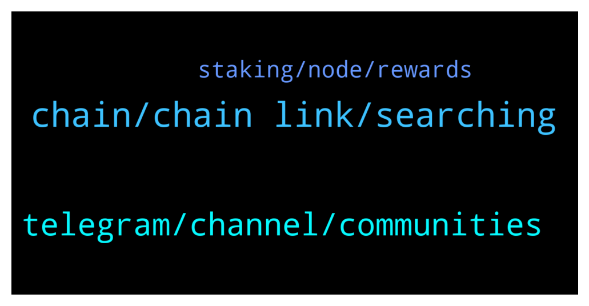

# **@chainlinkofficial**
 ## Analysis for **2022-01-08** - **2022-01-09**.

---

## 📊 **Basic Stats**

**n_messages_sent**: 63

---

---

## 🔝 **Top keywords and related messages**

1. **chain, chain link, searching**

    @lijia2022 --- *Does Chain link can be support others chain,expect ETH* **--->** [TG Discussion](https://t.me/chainlinkofficial/361888)

    @gigachadmuska --- *What does Chainlink team think about all the memes? serious question :D* **--->** [TG Discussion](https://t.me/chainlinkofficial/361693)

    @marchello --- *guys, one question - is there already any project who uses Chainlink to verify the value in real time of receivables from the real world? To use this as tokenized collateral for example for a liquidity pool/provider?* **--->** [TG Discussion](https://t.me/chainlinkofficial/361707)

    @Omoade --- *Is there any ongoing event @Sylvarantt @Sylvarant07 for Chainlink?* **--->** [TG Discussion](https://t.me/chainlinkofficial/361184)

    @swatkins67 --- *Where can you stake chain link?* **--->** [TG Discussion](https://t.me/chainlinkofficial/361172)

    @Zaynab --- *I have a suggestion regarding establishing an Arabic group for $Chainlink  With whom do I communicate?* **--->** [TG Discussion](https://t.me/chainlinkofficial/361819)

2. **telegram, channel, communities**

    @harrumphharrumph --- *Sorry, we do our best. If they are members of this group we can ban them otherwise the only thing we can do is encourage people to use the Report button in Telegram and/or send information to @notoscam ... We try to spread awareness with articles like this that Eric wrote.* **--->** [TG Discussion](https://t.me/chainlinkofficial/361511)

    @harrumphharrumph --- *Crypto P your messages are being removed by the bot. I think somebody is impersonating team members. They will never reach out with special offers. If somebody does reach out from the team it's likely to see if a project you are working on is a good fit for Chainlink technology. You would be able to verify their Telegram username (carefully!) with the list in the pinned message.* **--->** [TG Discussion](https://t.me/chainlinkofficial/361507)

    @Bee_crypt0 --- *Where is the link to the chatting channel* **--->** [TG Discussion](https://t.me/chainlinkofficial/361555)

    @Crypto P --- *Yeah now a guy called eric just text me on telegram. Since i joined this group 2hrs ago 5 people have messaged me from chainlink apparently* **--->** [TG Discussion](https://t.me/chainlinkofficial/361510)

    @marcromeron --- *Read pinned message for rules. Thank you.* **--->** [TG Discussion](https://t.me/chainlinkofficial/361207)

    @Natan --- *hello! is there a price discussion channel?* **--->** [TG Discussion](https://t.me/chainlinkofficial/361269)

3. **staking, node, rewards**

    @Crypto P --- *Hi there, admin?👋 Just a question what will the staking percentage be when chainlink brings out its official staking rewards?* **--->** [TG Discussion](https://t.me/chainlinkofficial/361463)

    @Kamran --- *Hi... can I ask dev when vrf v2 on BSC please.?* **--->** [TG Discussion](https://t.me/chainlinkofficial/361573)

    @Baskit_Case --- *Once staking is in affect we will do well. Very well.* **--->** [TG Discussion](https://t.me/chainlinkofficial/361679)

    @Sylvarantt --- *Hi there Crypto P, Chainlink staking is not like the average PoS chain staking system, therefore you can't predict any sort of rewards (they are not really rewards, but payments for fulfilling oracle requests), since the performance of a node will vary from node to node. A highly reputable and trusted team of node operators might have access to a wide range of high value jobs than a node that just started operating, for example.* **--->** [TG Discussion](https://t.me/chainlinkofficial/361474)

    @Cryptocoining --- *over the laste year / months* **--->** [TG Discussion](https://t.me/chainlinkofficial/361421)

    @Shogun187 --- *Staking isn't live yet; sometime this year 👍* **--->** [TG Discussion](https://t.me/chainlinkofficial/361173)

