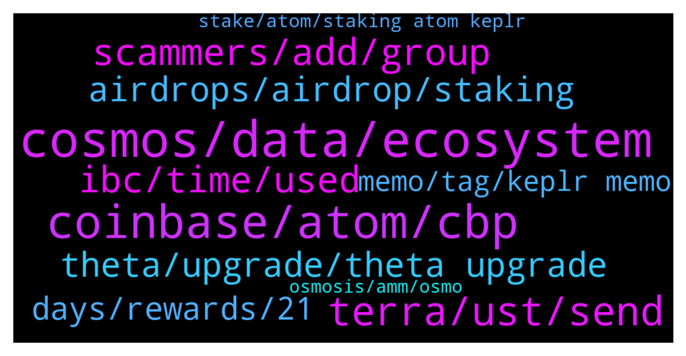

# **@cosmosproject**
 ## Analysis for **2022-01-08** - **2022-01-09**.

---

## 📊 **Basic Stats**

**n_messages_sent**: 358

---

---

## 🔝 **Top keywords and related messages**

1. **cosmos, data, ecosystem**

    @Crypto_V1 --- *Looks like the #Stargate upgrade is gaining traction! $SWTH 45% up in current market conditions thanks to the awesome Cosmos family! ⚛ 🚀  The community sponsored celebration giveaway is now worth $1,250. Looking forward to be part of the Cosmos ecosystem!   https://twitter.com/CryptoRanger9/status/1479800475222478849?s=20* **--->** [TG Discussion](https://t.me/cosmosproject/470729)

    @typerati --- *my friends been asking me if Vit eth tweet about multichain may be away/near from cosmos vision. What should I say in reply. I didnt have an idea. I only said tendermint's statements are more to me now than vit* **--->** [TG Discussion](https://t.me/cosmosproject/471423)

    @AtomJazz --- *Wdym exactly? I'd start my cosmos journey with https://medium.com/chainapsis/how-to-use-keplr-wallet-40afc80907f6?source=user_profile---------0----------------------------* **--->** [TG Discussion](https://t.me/cosmosproject/471324)

    @citizencosmos --- *It's feels amazing to see that what we initially set out to do with Citizen Cosmos is partially how it's working out. The idea behind Citizen Cosmos, as an ecosystem developer, was always to deliver (somewhat, and not only that 🙂) educational content that helps people, projects, developers, etc, onboard the Cosmos ecosystem and the interchain.   Yet it's still so hugely flattering, to receive 2, such amazing mentions in the space of 24 hours, from people, who in our opinion do such important work for the ecosystem themselves.   https://twitter.com/Cryptocito/status/1479569947743371272?t=ilxBdd3HgZelkoOghuvZsA&s=19  https://twitter.com/ticojohnny/status/1479625562251567104?t=SRC61DRscCFqTJJxHGJLfQ&s=19  Thanks. May the blocks be with you 🚀* **--->** [TG Discussion](https://t.me/cosmosproject/470757)

    @AtomJazz --- *Hehe, I don't know where you heard that but it's definitely wrong. Cosmos is creating tons of value and it's already the second biggest ecosystem in crypto. Growth in 2022 will be beyond anyone's imagination* **--->** [TG Discussion](https://t.me/cosmosproject/470928)

    @cosmicmatt --- *Hey guys, check out Tgrade. It’s founded by the founders of Cosmwasm and they’re bringing institutions to defi on Cosmos https://twitter.com/Cosmostarterio/status/1479505701420601359?s=20* **--->** [TG Discussion](https://t.me/cosmosproject/470181)

2. **coinbase, atom, cbp**

    @Graphicals --- *It is but coinbase isnt native, its mostly, if not, all ERC-20, not ideal haha* **--->** [TG Discussion](https://t.me/cosmosproject/470464)

    @TicoJohnny --- *I buy on Coinbase pro, it is native, it’s Binance that is not* **--->** [TG Discussion](https://t.me/cosmosproject/470465)

    @degen_salty_sam --- *You didn’t realize ATOM on coinbase/CBP is native and you didn’t realize CBP has cheaper fees. Just saying that you seem new and should probably read up more on diff methods of purchasing. Fiat to ATOM is not always the most ideal because exchanges leave paper trails. Keep things decentralized imo* **--->** [TG Discussion](https://t.me/cosmosproject/470499)

    @koriagi --- *admin welp how to buy atom?* **--->** [TG Discussion](https://t.me/cosmosproject/470534)

    @elpsy2019 --- *In the case I would like to transfer some Atom from Keplr back to Coinbase or other wallet, what gas fee I will be paying?* **--->** [TG Discussion](https://t.me/cosmosproject/470826)

    @Checkisp --- *can someone tell me why redelegating ATOM is not working, i have been trying since yesterday switch from SG1 to imperator but not working* **--->** [TG Discussion](https://t.me/cosmosproject/471210)

3. **terra, ust, send**

    @AtomJazz --- *Yeah you can't do that afaik, but I'm not an expert on Keplr related stuff tbh 😁* **--->** [TG Discussion](https://t.me/cosmosproject/470312)

    @DonFrogelione --- *does the one from google store works* **--->** [TG Discussion](https://t.me/cosmosproject/470984)

    @JoeD1rt --- *Go osmo, click deposit on terra ust under assets tab,  that will create a terra waller in your keplr with its own address.  Send ust from terra to terra.  You will also need to send a small amount of luna to that wallet to pay for gas fees.* **--->** [TG Discussion](https://t.me/cosmosproject/470187)

    @Hodl --- *oh nvm im an idiot.. I can click on the top of the chrome wallet and scroll down to Terra right.. and that is my KEPLR terra address? is that right* **--->** [TG Discussion](https://t.me/cosmosproject/470203)

    @Hodl --- *Okay i think i figured it out... Step 1. get the terra wallet onto keplr.. step 2. send luna from terra to the wallet on keplr... Step 3. send UST from terra to the wallet on keplr.... Step 4. Deposit UST onto osmosis from Keplr wallet using LUNA for fee... step 5. Do whatever you want w/ UST on osmosis* **--->** [TG Discussion](https://t.me/cosmosproject/470222)

    @Hodl --- *@JoeD1rt So I clicked on Terra IBC is Live on osmosis.  I think it did something to my keplre wallet (who knows). But where do I find the wallet adress to send UST from terra to this new wallet?* **--->** [TG Discussion](https://t.me/cosmosproject/470202)

4. **scammers, add, group**

    @Hodl --- *I'm also assuming all the ppl in my DMs since i posted a question here are scammers? Is that correct lol. Just stick to ppl talking to me in here* **--->** [TG Discussion](https://t.me/cosmosproject/470254)

    @Cordtus --- *also before i forget ignore all dms you get on this app they are all scam bots. they will come crawling out of the woodwork because of this conversation lol* **--->** [TG Discussion](https://t.me/cosmosproject/470986)

    @hbf000 --- *All launchpad on any l1 are 100% scams* **--->** [TG Discussion](https://t.me/cosmosproject/471108)

    @RyanB11 --- *Yes every single one of your DMs will be a scammer no matter how legit their screen name or reply is* **--->** [TG Discussion](https://t.me/cosmosproject/470261)

    @Artyom --- *Is it really usefull to report the scammers ? I just block them* **--->** [TG Discussion](https://t.me/cosmosproject/470910)

    @koriagi --- *Dear Cosmonauts🧑‍🚀👩‍🚀  🚨🚨🚨HOW TO STOP SCAMMERS TO ADD YOU TO THEIR GROUP🚨🚨🚨  🔘Please Click “Settings” 🔘After Click “Privacy And Security” 🔘Choose “Group&Channels”  🔘Change “WHO CAN ADD ME “ TO “My Contacts”  PLEASE DO THE SAME PROCEDURE FOR CALLS ⚠️* **--->** [TG Discussion](https://t.me/cosmosproject/471143)

5. **ibc, time, used**

    @UltraQuartz --- *fix ibc transaction time.. this is inexcusable* **--->** [TG Discussion](https://t.me/cosmosproject/470223)

    @Pastashooter105 --- *LOL. You never used a Bridge, obviously. IBC transfers are relatively smooth compared to bridges* **--->** [TG Discussion](https://t.me/cosmosproject/470248)

    @swiss_staking --- *Just crazy how fast IBC is growing. Love to see it.* **--->** [TG Discussion](https://t.me/cosmosproject/471246)

    @Hodl --- *wow the 2nd time i used the IBC it did it in second* **--->** [TG Discussion](https://t.me/cosmosproject/470264)

    @UltraQuartz --- *this is clearly a stress test on the ibc network* **--->** [TG Discussion](https://t.me/cosmosproject/470236)

    @UltraQuartz --- *im not buying its the that its the epoch time its most likely because there is a lot of ppl transfering through ibc* **--->** [TG Discussion](https://t.me/cosmosproject/470233)

6. **theta, upgrade, theta upgrade**

    @cosmicmatt --- *Got it. There’s several articles/posts going around with Mar 31st date. Though no hard date for now* **--->** [TG Discussion](https://t.me/cosmosproject/470211)

    @cryptodavG --- *Why? I saw around 31 march. Have you got any source of information?* **--->** [TG Discussion](https://t.me/cosmosproject/471381)

    @AtomJazz --- *Theta upgrade is coming in February most likely. This month is Evmos, Umee, Shade protocol launch and Kava joining IBC* **--->** [TG Discussion](https://t.me/cosmosproject/471236)

    @ZoltanAtom --- *This is wrong information.It hasn’t been scheduled it yet.* **--->** [TG Discussion](https://t.me/cosmosproject/470188)

    @AtomJazz --- *No idea where march 31 came from though* **--->** [TG Discussion](https://t.me/cosmosproject/471385)

    @AtomJazz --- *Yeah Billy said on a stream with Cryptocito that they're targeting February* **--->** [TG Discussion](https://t.me/cosmosproject/471384)

7. **airdrops, airdrop, staking**

    @MisterKeki --- *Seen some airdrop eligibility searchs where you could put in just 1 type of address, for example ATOM, and it would find if you had both ATOM and OSMO. Seems to me it has to be some way to do it. I dno* **--->** [TG Discussion](https://t.me/cosmosproject/470304)

    @Mhrdd --- *What has staking got to do with airdrops?* **--->** [TG Discussion](https://t.me/cosmosproject/471299)

    @benroth --- *Aswell as an airdrop wallet checker to see what i've missed?* **--->** [TG Discussion](https://t.me/cosmosproject/470206)

    @AtomJazz --- *There's no one rule but staking for sure is a good bet to receive airdrops* **--->** [TG Discussion](https://t.me/cosmosproject/470851)

    @JustAnotherNPC_001 --- *what's the difference between staking with osmosis chain vs staking with atom? Will I get more airdrops with osmosis?* **--->** [TG Discussion](https://t.me/cosmosproject/471297)

    @Ogechl --- *Hello please is there any ongoing Airdrop    Because I have one counting in my Dapps right now* **--->** [TG Discussion](https://t.me/cosmosproject/470385)

8. **days, rewards, 21**

    @Jah --- *Is there 28 days unbonding after unstaking in Keplr wallet?* **--->** [TG Discussion](https://t.me/cosmosproject/471342)

    @Checkisp --- *or i need to wait 21 days?* **--->** [TG Discussion](https://t.me/cosmosproject/471228)

    @angusmclachlan --- *Correct, the unbonding/unstaking period is ~21 days once you lock any amount up* **--->** [TG Discussion](https://t.me/cosmosproject/471230)

    @Chris_Ga1 --- *if i stake my ATOM thru keplr wallet , how many days needs the unstaking? I suppose isnt instant* **--->** [TG Discussion](https://t.me/cosmosproject/470841)

    @AtomJazz --- *Depends on you bag. Some do it ever day, some once a month* **--->** [TG Discussion](https://t.me/cosmosproject/470321)

    @Jokrogge --- *Is Always better get rewards from staking each day or someone wait 2/3 days for get rewards?* **--->** [TG Discussion](https://t.me/cosmosproject/470318)

9. **memo, tag, keplr memo**

    @annyusyd --- *Does anyone know when you send ATOM from gate io to keplr, do you need a tag? Thanks* **--->** [TG Discussion](https://t.me/cosmosproject/470411)

    @Shujarehman1 --- *Hi Do I need a memo to send atom from binance to keplr?* **--->** [TG Discussion](https://t.me/cosmosproject/470782)

    @Murilo --- *No, the memo is needed only from Keplr to Binance* **--->** [TG Discussion](https://t.me/cosmosproject/470807)

    @Shujarehman1 --- *Where can I find the memo tag in keplr* **--->** [TG Discussion](https://t.me/cosmosproject/470788)

    @soosan1377 --- *No for sending to kepler you don't need to memo or tags* **--->** [TG Discussion](https://t.me/cosmosproject/470435)

    @TicoJohnny --- *From exchanges to Keplr you don’t need a memo tag* **--->** [TG Discussion](https://t.me/cosmosproject/470412)

10. **stake, atom, staking atom keplr**

    @Wilder999 --- *is there any risk of our ATOM staked, get stolen by our validator??* **--->** [TG Discussion](https://t.me/cosmosproject/470579)

    @m00nm4chine --- *when you stake ATOM do you get a tradable receipt? like sATOM or something* **--->** [TG Discussion](https://t.me/cosmosproject/470390)

    @edoboi --- *How about if I want to stake ATOM?* **--->** [TG Discussion](https://t.me/cosmosproject/471198)

    @JustAnotherNPC_001 --- *can anyone reccomend a good validator for staking atom through keplr?* **--->** [TG Discussion](https://t.me/cosmosproject/471275)

    @AtomJazz --- *No because even when you delegate your ATOMs you're still in full control (and custody) of your assets.* **--->** [TG Discussion](https://t.me/cosmosproject/470606)

    @Daniel --- *Hi. I have some atom to stake for long period. Where to stake with good APY and it’s possible to use a ledger to create the wallet?* **--->** [TG Discussion](https://t.me/cosmosproject/471327)

