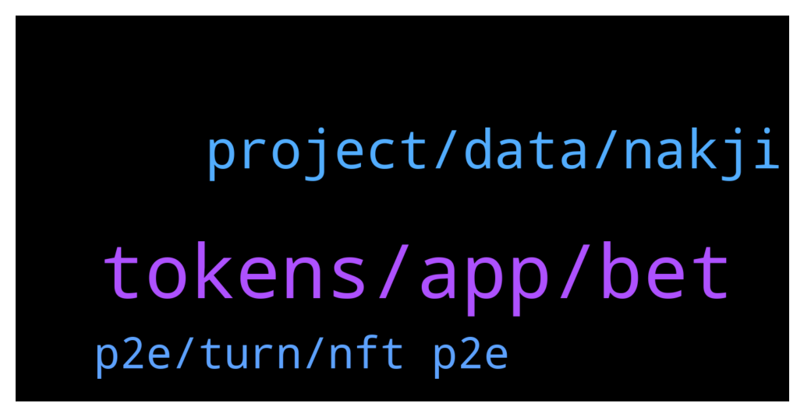

# **@defisearchpublic**
 ## Analysis for **2022-01-07** - **2022-01-09**.

---

## 📊 **Basic Stats**

**n_messages_sent**: 81

---

---

## 🔝 **Top keywords and related messages**

1. **tokens, app, bet**

    @mikaztirf --- *you are eligible to vote on which crypto assets should be put on the app next* **--->** [TG Discussion](https://t.me/defisearchpublic/240927)

    @mikaztirf --- *those tokens you earn can be stake to participate the governance in the future* **--->** [TG Discussion](https://t.me/defisearchpublic/240922)

    @danizsw --- *it is where you can create your tokens and have the latest news of tokens to be listed* **--->** [TG Discussion](https://t.me/defisearchpublic/240958)

    @GioFlorin --- *may I know whats their token first?* **--->** [TG Discussion](https://t.me/defisearchpublic/240929)

    @dionieP --- *ohh great! and how much tokens are we getting on every bet?* **--->** [TG Discussion](https://t.me/defisearchpublic/240930)

    @mikaztirf --- *project offers staking and a token rewards of every bet* **--->** [TG Discussion](https://t.me/defisearchpublic/240912)

2. **project, data, nakji**

    @danizsw --- *how does the project works I know its a blockchain lol* **--->** [TG Discussion](https://t.me/defisearchpublic/240973)

    @danizsw --- *what kind of project is this?* **--->** [TG Discussion](https://t.me/defisearchpublic/240968)

    @purestofpure --- *Nakji makes it fast and easy for decentralized apps (web 3.0) to get on-chain data from the past and present* **--->** [TG Discussion](https://t.me/defisearchpublic/240979)

    @purestofpure --- *Nakji's protocols relay information efficiently, safely, and quickly from blockchain to off-chain* **--->** [TG Discussion](https://t.me/defisearchpublic/240974)

    @purestofpure --- *Nakji Network, a blockchain big data focused startup has completed a capital raise of $8.8 million* **--->** [TG Discussion](https://t.me/defisearchpublic/240970)

    @purestofpure --- *you guys might want to check nakji network* **--->** [TG Discussion](https://t.me/defisearchpublic/240966)

3. **p2e, turn, nft p2e**

    @mykillandgelo --- *new game turn base p2e, ROI isn't that big but looks good since its freshly released* **--->** [TG Discussion](https://t.me/defisearchpublic/240963)

    @jwongjts --- *yup what p2e you're playing right now?* **--->** [TG Discussion](https://t.me/defisearchpublic/240902)

    @GioFlorin --- *what kind of p2e youre looking my friend?* **--->** [TG Discussion](https://t.me/defisearchpublic/240898)

    @mykillandgelo --- *what are you spotting right now?* **--->** [TG Discussion](https://t.me/defisearchpublic/240960)

    @purestofpure --- *new blockchain releasing its q1 in the next 3 months* **--->** [TG Discussion](https://t.me/defisearchpublic/240967)

    @GioFlorin --- *ohh its not got it already* **--->** [TG Discussion](https://t.me/defisearchpublic/240934)

