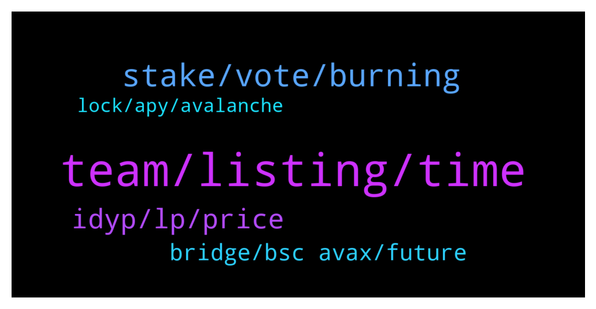

# **@dypfinance**
 ## Analysis for **2022-01-08** - **2022-01-09**.

---

## 📊 **Basic Stats**

**n_messages_sent**: 190

---

---

## 🔝 **Top keywords and related messages**

1. **team, listing, time**

    @alvindrajw --- *I have a doubt if the team planned tier 1 listing in December then they should be prepare all the details and apply it before right. But the admin said they gave all the details in dec 8. Is that proper way? And from starting October itself the team said listing will be on november or December* **--->** [TG Discussion](https://t.me/dypfinance/238145)

    @Oye_Blockchain_Writer --- *I'm experienced and skilled Blockchain/Metaverse/Nfts/Defi/Cryptocurrency PR and Wordsworth with impeccable service in writing style.  I am also an expert in writing whitepaper, Technical Writing, Copywriting, AI(Artificial Intelligence) and ICO marketing content composing.  I am optimistic that my technique set will shape and provide informative and instructional content for the blockchain/cryptocurrency community.* **--->** [TG Discussion](https://t.me/dypfinance/237962)

    @DhoniMSD516 --- *Launchpad is announced already first project coming soon this month https://dyp.finance/launchpad* **--->** [TG Discussion](https://t.me/dypfinance/238159)

    @iamJubi --- *Why do you claim that the team is not active when you are just new to the group? Your first message is jan. 1 and all you ask is about listing.  Check the update. we provided all the necessary documents/requirements its up to them now. https://t.me/dypfinance/235763  https://t.me/dypfinance/236800* **--->** [TG Discussion](https://t.me/dypfinance/238108)

    @DhoniMSD516 --- *Hey you can find tutorials here https://www.youtube.com/watch?v=SK-9PqZJM-I&list=PL8K0d30DJYVPmVy8aBOZratFGWKIBbthl* **--->** [TG Discussion](https://t.me/dypfinance/237856)

    @DhoniMSD516 --- *Hey mate do you know what really matters the devolpments and how team is active, we are active you can find our roadmap https://dyp.finance/roadmap the developments we made and more coming* **--->** [TG Discussion](https://t.me/dypfinance/238115)

2. **stake, vote, burning**

    @Vl_investor --- *We have the last governance proposal for burning some #DYP tokens on the #Avalanche pools V1.  Cast your vote right now! 🔥🔥 https://gov-avax.dyp.finance/proposals/2   Guys please vote to burn DYP coins 🔥🔥🔥🔥🔥🔥🔥🔥🔥🔥🔥🔥🔥* **--->** [TG Discussion](https://t.me/dypfinance/237992)

    @Disguy125 --- *How much may be burnt in avax pool?* **--->** [TG Discussion](https://t.me/dypfinance/238012)

    @hemanrock --- *By using Trustwallet you can STAKE your DYP tokens here https://dyp.finance/stakev2  STAKE on BSC Network video tutorial: https://www.youtube.com/watch?v=sYkoxGbpBi4* **--->** [TG Discussion](https://t.me/dypfinance/237767)

    @timdyp --- *We have the last governance proposal for burning some #DYP tokens on the #Avalanche pools V1.  Cast your vote right now! 🔥🔥 https://gov-avax.dyp.finance/proposals/2* **--->** [TG Discussion](https://t.me/dypfinance/237951)

    @Vl_investor --- *To be burnt / disbursed  9,163.898287 DYP* **--->** [TG Discussion](https://t.me/dypfinance/238014)

    @cryptocade --- *Quote from the roadmap- “DeFi Research and Integration for spending Interests via Debit Cards” Does that mean DYP will have its own debit card?”* **--->** [TG Discussion](https://t.me/dypfinance/237800)

3. **idyp, lp, price**

    @Fbm_Alpha --- *Thanks for replying I know it. The 25% part is Ok but the 75% part value is unblievable!! Is it OK to get to the half of value?? Since the price compare to one month ago is the same.* **--->** [TG Discussion](https://t.me/dypfinance/237913)

    @iamJubi --- *As the value of the tokens involved went down the LP value went down, vice versa if it goes high, your LP value goes high . You might have entered the farm when iDYP price is at peak.* **--->** [TG Discussion](https://t.me/dypfinance/237914)

    @iamJubi --- *hello. Bot Deleted it. Your deposit is converted into 75% LP(wavax-idyp pair) subject to IL and 25% DYP. The dollar value of your assets deposited depends on these token`s price movement.* **--->** [TG Discussion](https://t.me/dypfinance/237912)

    @Paulus --- *And will it affected by LP and TVL?* **--->** [TG Discussion](https://t.me/dypfinance/238177)

    @Paulus --- *I know, not fuding, I still hold, It just impermanent loss right* **--->** [TG Discussion](https://t.me/dypfinance/237976)

    @DhoniMSD516 --- *Trade iDYP tokens on PancakeSwap V2 https://pancakeswap.finance/swap?inputCurrency=0xBD100d061E120b2c67A24453CF6368E63f1Be056  Trade iDYP tokens on Pangolin DEX https://app.pangolin.exchange/#/swap?&outputCurrency=0xBD100d061E120b2c67A24453CF6368E63f1Be056  Trade iDYP tokens on Uniswap V2 https://v2.info.uniswap.org/token/0xbd100d061e120b2c67a24453cf6368e63f1be056* **--->** [TG Discussion](https://t.me/dypfinance/238190)

4. **bridge, bsc avax, future**

    @timdyp --- *Next week we are going to release the #iDYP Bridge  The bridge will create balance between the V2 pools and unique trading opportunities.  #DeFi #Ethereum #BinanceSmartChain #Avalanche  👉https://twitter.com/dypfinance/status/1480172181598396422* **--->** [TG Discussion](https://t.me/dypfinance/238219)

    @panda_999999 --- *This bridge is too inconvenient, hope it can be improved in the future* **--->** [TG Discussion](https://t.me/dypfinance/237864)

    @profit984 --- *is there also idyp matic bridge in the future?* **--->** [TG Discussion](https://t.me/dypfinance/238248)

    @DhoniMSD516 --- *Hey Matic expansion is not live yet, if we launched and yes bridge also might be possible* **--->** [TG Discussion](https://t.me/dypfinance/238249)

    @iamJubi --- *DYP is on 3 chains which is ETh, BSC, and Avalanche chain* **--->** [TG Discussion](https://t.me/dypfinance/237830)

    @BJevery632 --- *hi guys, noob here.  So this is in Eth mainnet?* **--->** [TG Discussion](https://t.me/dypfinance/237829)

5. **lock, apy, avalanche**

    @Paulus --- *Hmm, WAVAX farming 3 days lock seem keep losing.* **--->** [TG Discussion](https://t.me/dypfinance/237974)

    @iamJubi --- *Current highest APY on staking v2 avalanche is 57%.* **--->** [TG Discussion](https://t.me/dypfinance/237832)

    @Mike_Hodl --- *Does anyone know why I haven’t gotten weth rewards since Wednesday 5th morning on the eth no lock yield farm* **--->** [TG Discussion](https://t.me/dypfinance/237758)

    @BJevery632 --- *ok, if I deposit avalanche there, Ill get 336% APY? Also are you listed in exchanges like Binance or Kucoin?* **--->** [TG Discussion](https://t.me/dypfinance/237835)

    @BJevery632 --- *ook thanks, anhy starter links, am I understanding correctly that you give 300% apy for staking AVALANCHE?* **--->** [TG Discussion](https://t.me/dypfinance/237831)

    @Scrawny --- *Go peeps.   I'm not new to crypto but new to yield farming.* **--->** [TG Discussion](https://t.me/dypfinance/238088)

