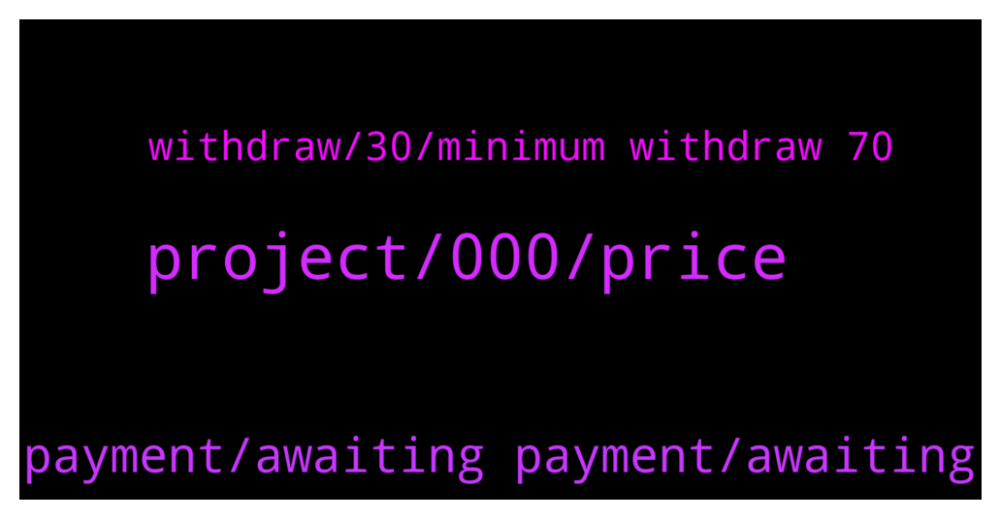

# **@iotatangle**
 ## Analysis for **2022-01-08** - **2022-01-09**.

---

## 📊 **Basic Stats**

**n_messages_sent**: 67

---

---

## 🔝 **Top keywords and related messages**

1. **project, 000, price**

    @Zebrin3 --- *What is shot of assembly one day getting to 2 dollars?* **--->** [TG Discussion](https://t.me/iotatangle/306271)

    @N1ghtBl00d --- *anyone have a rough idea at what price will SMR launch at roughly?* **--->** [TG Discussion](https://t.me/iotatangle/306293)

    @PiernasLocas --- *Nop. It is a network like IOTA but without coordinator and with more features than iota.  if you want to see a metaverse project for Shimmer you have  Sphere from IOTA Plus AG  let me see if this group allow the link* **--->** [TG Discussion](https://t.me/iotatangle/306389)

    @Tahmis --- *But I would maybe recommend Bitfinex as it has been working really well what I've heard* **--->** [TG Discussion](https://t.me/iotatangle/306374)

    @Tahmis --- *Very cheap on the pro side* **--->** [TG Discussion](https://t.me/iotatangle/306367)

    @Darius --- *I don't know how much will it be but it's a great project* **--->** [TG Discussion](https://t.me/iotatangle/306272)

2. **payment, awaiting payment, awaiting**

    @lbenheilo --- *anyone get nft succesfully? after 5 minutes, I tried again and could be able to make tranfer. But I am stucked an confirmation screen on website. I sent out 100 Mi* **--->** [TG Discussion](https://t.me/iotatangle/306185)

    @lbenheilo --- *nice, hope it was resolved soon* **--->** [TG Discussion](https://t.me/iotatangle/306203)

    @lbenheilo --- *I am still stuck at awaiting payment too* **--->** [TG Discussion](https://t.me/iotatangle/306199)

    @itsmedev --- *I am just stuck at awaiting payment* **--->** [TG Discussion](https://t.me/iotatangle/306197)

    @psych0dad --- *i cant mint nft, after sing, i get this arror message* **--->** [TG Discussion](https://t.me/iotatangle/306193)

    @itsmedev --- *Same awaiting payment page for me* **--->** [TG Discussion](https://t.me/iotatangle/306186)

3. **withdraw, 30, minimum withdraw 70**

    @davicico94 --- *Its ok, Minimum to withdraw 70 iotas* **--->** [TG Discussion](https://t.me/iotatangle/306319)

    @Chataign3 --- *hello, I would like to take some iota on binance.  do you know if the withdrawal to Firefly is ok?  or do I have to change the platform?  good to you* **--->** [TG Discussion](https://t.me/iotatangle/306292)

    @Badis --- *All i need is to purchase and withdraw 30 iota to external wallet* **--->** [TG Discussion](https://t.me/iotatangle/306373)

    @Chataign3 --- *Thanks David, it's ok for withdraw 👌* **--->** [TG Discussion](https://t.me/iotatangle/306323)

    @Tahmis --- *But the info might be wrong atm for the withdrawals as exchanges have been having maintenances* **--->** [TG Discussion](https://t.me/iotatangle/306360)

    @Tahmis --- *Yes you are welcome to do that* **--->** [TG Discussion](https://t.me/iotatangle/306237)

