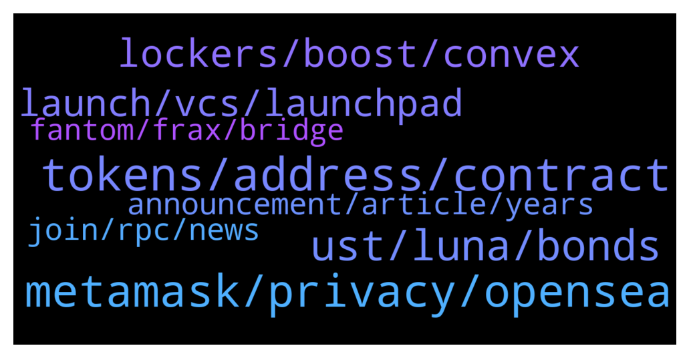

# **@lobsters_chat**
 ## Analysis for **2022-01-08** - **2022-01-09**.

---

## 📊 **Basic Stats**

**n_messages_sent**: 401

---

---

## 🔝 **Top keywords and related messages**

1. **tokens, address, contract**

    @b4ds3ct0r --- *https://etherscan.io/tx/0xb54ff2a1cb2eab290556a0adbc2b1af7a1cc59ab9463fef3eb977de030ddbcdd Let say in this example. Contract is buying 2 eth worth of MEME DAO coin and sends it to Binance 27 . When you look at the transaction list from outside seems like actually Binance 27 is buying this coin. This way people thinks Binance or some whale that they follow is buying this coin.     I followed the transactions and same address did this on a at least 4 different times . His latest one for reference only https://etherscan.io/token/0xebfc9d08f47b6b4411eaf5b97f1fd7d9b6d2929c* **--->** [TG Discussion](https://t.me/lobsters_chat/313877)

    @phil_muhbags --- *They signed a message or something. I forget the exact details. However people got their accounts drained* **--->** [TG Discussion](https://t.me/lobsters_chat/313565)

    @anisopteran --- *In reality you didn’t actually initiate the transfer, but that doesn’t matter. If the initiating address was the one that was shown to send the tokens on etherscan, then you’d see the uniswap contract (eg) sending tokens instead of whoever it really was.* **--->** [TG Discussion](https://t.me/lobsters_chat/313875)

    @anisopteran --- *The contract is in fact minting to those addresses* **--->** [TG Discussion](https://t.me/lobsters_chat/313870)

    @anisopteran --- *Oh, this is just a swap+send, it’s a feature of uniswap to send the result of your transaction somewhere other than the source* **--->** [TG Discussion](https://t.me/lobsters_chat/313880)

    @anisopteran --- *In this case the token owner sends a tx to call a function that mints tokens and then moves them around. The token contract is emitting the “proper” events that show the tokens being moved around.* **--->** [TG Discussion](https://t.me/lobsters_chat/313872)

2. **metamask, privacy, opensea**

    @JonathanDoe --- *Good read! Now the question is how do we change things?   For me, not being a software engineer, Web3 means that I am able to access dApps without having to create an username and a password, just with my private keys stored on a local “wallet” app.   But it is troublesome that MetaMask has the possibility to link my otherwise totally separated addresses, sending my privacy to shit. Or that OpenSea provides the API for viewing my jpeg NFTs, and that once they are removed from OpenSea, they cannot be viewed from my “wallet” app as well.   What is the solution? Does anyone of the leading devs in this space even care about these things? Or we’re all just chasing dough under the pretext of decentralized finance (no pun intended for our members here)?* **--->** [TG Discussion](https://t.me/lobsters_chat/313669)

    @alxdc --- *He still has a point. People in this community probably care of these things. And we're still majority in this space. However, if the usage spreads, average joe won't care about decentralization as written above. At that point, platforms having the best ease of use (at the cost of decentralization) will accumulate users. The more they grow the more power they get, to the point they can bend and dictate what gets developed next and which direction it takes, google-like.* **--->** [TG Discussion](https://t.me/lobsters_chat/313736)

    @anisopteran --- *so dont use metamask, use some other wallet that does similar, or keep your keys in separate apps or whatever. and you dont need opensea to show you your jpegs.* **--->** [TG Discussion](https://t.me/lobsters_chat/313685)

    @anisopteran --- *the point is that you don't need metamask or opensea or anyone.* **--->** [TG Discussion](https://t.me/lobsters_chat/313686)

    @juju1234534 --- *One difference is that we can now potentially provide LinkedIns, Facebooks and Mediums with some immutable base rules, e.g. that you can’t be deplatformed. Also, with „your community“ (followers and following) and content (posts, pictures etc.) being linked to yours and others‘ wallets instead of the platform‘s database.   Less crucial UX (rules) of those platforms can still be innovated on / changed by centralized platform owners/companies.* **--->** [TG Discussion](https://t.me/lobsters_chat/313775)

    @anisopteran --- *Metamask isn’t the only wallet in existence, and if you’re concerned that loading all of your keys into the same instance of an app allows them to be linked together, then don’t do that. Load them into separate instances of the app or different apps.* **--->** [TG Discussion](https://t.me/lobsters_chat/313723)

3. **ust, luna, bonds**

    @tiequan --- *yield only needs to drop ~2% APY to stabilize yield reserve.  No significant amount of capital is going to leave b/c of that.  Also there’s plenty of insurance options including ramping up of native ozone insurance for cheap if you’re worried about depeg or smart contract risk.  Anchor was never meant to permanently be at 20%, just at a fixed rate that represented the fixed staking rewards of the overcollateralized assets underlying.  Also in the nuke from ~55K to 42K BTC in an hour, the oracle for UST never went below 1* **--->** [TG Discussion](https://t.me/lobsters_chat/313574)

    @juju1234534 --- *UST is built on a house of Luna. Once people collectively (in panic) decide that they don’t want to hold Luna, this house transforms into a house of air -> no way down „to derisk“. Rather a Pop 🧼🪡* **--->** [TG Discussion](https://t.me/lobsters_chat/313633)

    @juju1234534 --- *The collapse of UST will be the biggest catastrophe that the space has seen yet.* **--->** [TG Discussion](https://t.me/lobsters_chat/313526)

    @juju1234534 --- *Lol, are you seriously comparing UST going to zero to ETH/BTC going to zero? :D  The former is supposed to be a non-speculative coin whilst the latter are speculative ones.* **--->** [TG Discussion](https://t.me/lobsters_chat/313639)

    @tiequan --- *yeah and I’m saying that unless you are aware of some other risk other than UST depeg + underlying smart contract exploit risk, that ozone will cover that for 2%.  So really it’s just current APR - 2% to be fully hedged.  I agree if / when UST stable pool grows faster than collateral, yields will compress.  I see 15% as probably the lowest it would need to go in the mid term.  They can do other things ala Badger where you need to stake x veANC to get full yield, or fiddle with LTV requirements, onboard bSOL and bATOM etc.  From a facts based POV, ever since they made changes since last May + addition of Kujira & liquidation queue, UST doesn’t even depeg to 0.99 in a 30% BTC move in minutes* **--->** [TG Discussion](https://t.me/lobsters_chat/313585)

    @tiequan --- *UST is literally just pegged expansions and contractions of LUNA to some pre-determined peg ie USD or KRW. At a minimum, staking LUNA entitles you to more than 1.5B USD that is being distributed through the next 2 years.   For example, Payment royalties through Chai in Korea from someone buying something in a store turns into TerraKRW to be distributed to Luna stalkers. So some sort of black swan event you are hypothesizing where simultaneously every single person in crypto suddenly loses faith in it and finds no “value” in it seems way less likely an event than some other similar black swan event happening to any other coin.   You can make the same edge cases for some crazy gensler rampage or some USA sanctions on any account that touches any specific coin they don’t like. Worldwide people could all of a sudden wake up and decide the same day that BTC and ETH are worth $0. Does it make sense there’s still 2 dog coins with 0 utility in the top 15 market cap? The power of collective belief in a narrative is harder than you’d believe to shake.   TL;DR these all remain edge cases to be cognizant of but statistically unlikely based on empirical analysis* **--->** [TG Discussion](https://t.me/lobsters_chat/313637)

4. **lockers, boost, convex**

    @ivangbi --- *Please help me understand.  In CRV despite big emissions, you pretty much need to lock up a major part to stay up with x2.5 boost and not lose your share. The “ve lockers get proportionally increased” pretty much nullifies that and makes sure I can have my stake being diluted much slower + just keep selling rewards, so not the same feedback loop. Or no?* **--->** [TG Discussion](https://t.me/lobsters_chat/313591)

    @tandeloff --- *Mb dumb question but why to buy veBoost from individual holder if more ve implies more boost always and convex exists as ve-whale?* **--->** [TG Discussion](https://t.me/lobsters_chat/313762)

    @ivangbi --- *When convex gets bribed to vote, where the bribes go? For cvxCRV stakers to claim, or just go intotreasury somehow? (so it is like in a joint pool you can’t redeem from or every cvxCRV staker can claim?)* **--->** [TG Discussion](https://t.me/lobsters_chat/313697)

    @ivangbi --- *How does this improve tho - you are using some veCRV to optimize and also take your own cut, but you don’t give any extra token… unless you just gib also a token then, which makes you convex?* **--->** [TG Discussion](https://t.me/lobsters_chat/313753)

    @Figu3 --- *No more wasted veCRV boost, now we go full optimization mode for holders* **--->** [TG Discussion](https://t.me/lobsters_chat/313747)

    @Figu3 --- *Up until now veCRV holders boosts were left to rot* **--->** [TG Discussion](https://t.me/lobsters_chat/313756)

5. **launch, vcs, launchpad**

    @bsc500x --- *Thanks for the advice! But what about P2E ? Our game in process, and what best solution for launch ?* **--->** [TG Discussion](https://t.me/lobsters_chat/314024)

    @eth2enthusiast --- *Contrary to Ivan I want to offer my opinion. I think it’s obvious most advanced investors and poor whales will not invest. But do it. You have nothing to loose. It takes money to launch on mainnet. Less so on sidechains. Sunflowers clogged up Matic for days with no raise.  Trying the copper launch will help you sus out your marketing.  Talking to vcs will help you refine the idea.  You only risk your deploy costs and a weak first round* **--->** [TG Discussion](https://t.me/lobsters_chat/314065)

    @ivangbi --- *I guess yoda is being nice, good good. All true btw. My first gut feeling was that if someone asks “what launchpad is best” they are not willing to build or contribute, but are willing to just launch a coin into hype. Asking the wrong questions kinda. As such, not really interested in such stuff* **--->** [TG Discussion](https://t.me/lobsters_chat/314085)

    @bsc500x --- *Our team looking for launchpads similar to (dxsale, unicrypt)* **--->** [TG Discussion](https://t.me/lobsters_chat/314004)

    @ivangbi --- *Make a protocol. Form a DAO. Have people start believing in the idea and contributing. Give them ownership. Let it fly by itself further* **--->** [TG Discussion](https://t.me/lobsters_chat/314022)

    @bsc500x --- *We look easy way to launch without "apply to IDO" and other bullshit.* **--->** [TG Discussion](https://t.me/lobsters_chat/314019)

6. **announcement, article, years**

    @YoSoyCarlos --- *is it bad to point out this article was published 12 years ago?* **--->** [TG Discussion](https://t.me/lobsters_chat/313836)

    @zhongfu --- *last updated in may... 2020, lol https://github.com/ethhub-io/ethhub/blob/master/docs/ethereum-roadmap/ethereum-2.0/eth-2.0-economics.md* **--->** [TG Discussion](https://t.me/lobsters_chat/314109)

    @mdzor --- *On their discord 1h ago. That says a lot about the usage I mean, if 1h downtime cause 3 messages in their channel by the same ppl and no announcement on Twitter 🙈 L2s aren't around the corner in terms of prod readiness* **--->** [TG Discussion](https://t.me/lobsters_chat/314033)

    @mdzor --- *You're right   https://twitter.com/midasthefool/status/1480136347125829635?s=21  There are few mentions about it in Twitter but no announcement from the team as per now, weird!* **--->** [TG Discussion](https://t.me/lobsters_chat/314032)

    @adrianleb --- *Sir, two tweets down he admits it’s a joke* **--->** [TG Discussion](https://t.me/lobsters_chat/314060)

    @deranzxc --- *Did they announce somewhere or just gone?* **--->** [TG Discussion](https://t.me/lobsters_chat/313549)

7. **join, rpc, news**

    @Jon --- *Sounds amazing. How do I get this? Thx* **--->** [TG Discussion](https://t.me/lobsters_chat/313854)

    @ivangbi --- *Will listen in background while working and let u know if worth it* **--->** [TG Discussion](https://t.me/lobsters_chat/313828)

    @bsc500x --- *Thanks, but what platform you recommend ?* **--->** [TG Discussion](https://t.me/lobsters_chat/314079)

    @farm42 --- *A very useful service indeed, check out as well:  https://officercia.medium.com/tenderly-app-a-swiss-pocketknife-for-the-web3-developer-89bb904bee46* **--->** [TG Discussion](https://t.me/lobsters_chat/313892)

    @Darrenlautf --- *https://twitter.com/PatrickAlphaC/status/1435981334502064131 heres a soldiity one thats pretty good* **--->** [TG Discussion](https://t.me/lobsters_chat/313700)

    @MorriganIV --- *Lately I suggest https://www.web3.university/ for beginners as it has updated and organized info* **--->** [TG Discussion](https://t.me/lobsters_chat/313690)

