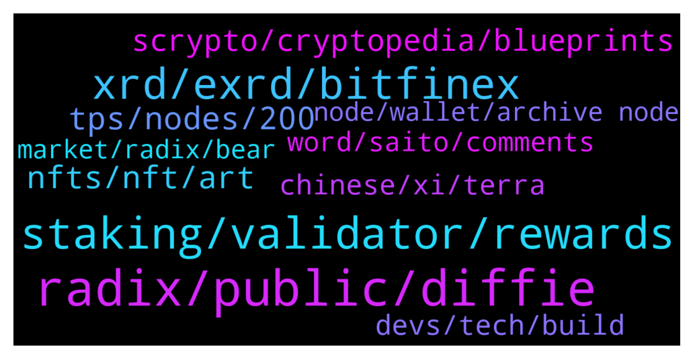

# **@radix_dlt**
 ## Analysis for **2022-01-08** - **2022-01-09**.

---

## 📊 **Basic Stats**

**n_messages_sent**: 519

---

---

## 🔝 **Top keywords and related messages**

1. **radix, public, diffie**

    @Amit_K1 --- *Details of how the Radix emissions work can be found here: https://www.radixdlt.com/post/radix-staking-and-incentive-rewards-guide* **--->** [TG Discussion](https://t.me/radix_dlt/336346)

    @bonafideplug --- *Hey Radix folks. I noticed the community is growing and decided to make public the project me and @hanisome are working on: Radish.  A community driven token that will be available in your local farm … real soon.  We decided to put our feet in the mud considering more people are showcasing their creativity within the network and claim our “spot”  A follow is most definitely appreciated. As well as a share/retweet* **--->** [TG Discussion](https://t.me/radix_dlt/336913)

    @DefiYields --- *I am a Radix super maxi. Also have very little tolerance for FUD, even borderline. Not going to apologise for that.* **--->** [TG Discussion](https://t.me/radix_dlt/336303)

    @Shang En --- *A very stupid question here. The final phase is Xi’an. Does radix a blockchain? (I know it’s stupid but I know some crypto use dag but still become a blockchain.)* **--->** [TG Discussion](https://t.me/radix_dlt/336245)

    @saeglopur10 --- *Does anyone have a comparison of Radix to Phantasma? Some of the crypto personalities are hyping phantasma as having the best tech with infinite scalability, want to know whether that's just their attempt to pump a small cap coin* **--->** [TG Discussion](https://t.me/radix_dlt/336115)

    @VladoBurevestnik --- *This is a very good read from a person who has proven his capability in software, I think Radix people can draw an inspiration from the points he raises, too. @danhughes* **--->** [TG Discussion](https://t.me/radix_dlt/336776)

2. **staking, validator, rewards**

    @imyourbossnow --- *it sounds staking still have a risk for staking... i want 100% safe for staking. Can you help me? because i want hold XRD for long term for staking* **--->** [TG Discussion](https://t.me/radix_dlt/336605)

    @imyourbossnow --- *how to choose good validator atm? tips please* **--->** [TG Discussion](https://t.me/radix_dlt/336856)

    @Taco_Bell_London --- *Stupid question: can somebody explain why staking is necessary to keep the network running? I am trying to understand why (in the long term) my staking rewards are “justified” and not just a Ponzi like idea that I will get paid from an ever larger base of fomo-ing  investors. I’m sure there’s an answer but can somebody articulate it?* **--->** [TG Discussion](https://t.me/radix_dlt/336348)

    @LowKep --- *How can I see what a good validator is? What should I be aware of?* **--->** [TG Discussion](https://t.me/radix_dlt/336783)

    @Avaunt --- *🦂🦂Avaunt Staking - Abandoned Scorpion Air Drop🦂🦂  To celebrate 2022, the year of Babylon we will be air dropping  an Abandoned Scorpion 🦂 to every new delegator who stakes 1000 XRD or more with Avaunt Staking until the 13th of Feb, 2022 or until our stocks last.  SECONDLY, as a thankyou we will also be airdropping TWO!! Abandoned Scorpions 🦂🦂to all existing Avaunt Staking Delegators. A snapshot of all existing delegator addresses was taken on the 8th Jan 2022 @ 1000 UTC.  Avaunt Staking Validator ID: rv1qdn4mwharah5c3w5sw4zfyagvkftrj47ruwatjfr6z2r7pmvk5uuu84j45v Staking Guide: https://avaunt-staking.com/radix-delegation-guide/    Note: Both existing and new delegators will receive their Scorpions 🦂 after the end of the promotion in late February. Avaunt Staking has reserved 500 scorpions 🦂 and the eligible participants will receive a random scorpion(s) 🦂🦂 from this pool. https://radstrike.com/scorpions/wallet/?addr=rdx1qsptwk20ultcmjc3h9f53ftrztj8kvccgv8emjwynr99vyq7ygf5jdg078he8* **--->** [TG Discussion](https://t.me/radix_dlt/336928)

    @LowKep --- *Oké, I chose 6 validators now. Thanks for all your help 😃* **--->** [TG Discussion](https://t.me/radix_dlt/336810)

3. **xrd, exrd, bitfinex**

    @Azmaray --- *Someone told me you can swap your crypto to USD on Bitfinex (not USDT)* **--->** [TG Discussion](https://t.me/radix_dlt/336002)

    @Hasan --- *Is buying eXrd directly through usdt in kU coin a bad strategy if then guide plz* **--->** [TG Discussion](https://t.me/radix_dlt/336081)

    @ellispritchard --- *Yeah, without KYC you can't use USD(TC) etc.... but DAI doesn't count as a stablecoin for some reason, so you use that if you don't want to use 'crypto', but you then have to swap for BTC to trade XRD...* **--->** [TG Discussion](https://t.me/radix_dlt/336000)

    @Azmaray --- *I heard you can buy via Bitfinex without doing KYC if you only transfer crypto to your Bitfinex wallet, is there a limit?* **--->** [TG Discussion](https://t.me/radix_dlt/335997)

    @Azmaray --- *The cheapest way to buy eXRD on KuCoin is to buy LTC or XRP via another exchange and then sending it to your KuCoin LTC or XRP wallet and after that swapping the XRP or LTC to USDT to buy eXRD on spot right?* **--->** [TG Discussion](https://t.me/radix_dlt/335983)

    @Azmaray --- *Anyone here experience in buying eXRD on KuCoin?* **--->** [TG Discussion](https://t.me/radix_dlt/335968)

4. **tps, nodes, 200**

    @Shang En --- *Thank you for the reply. I just take some rough calculate Every node will have different situation  But in 2023  At least 1 million tps is what I believe* **--->** [TG Discussion](https://t.me/radix_dlt/336478)

    @Blind5ight --- *No, this is incorrect There have been numbers of floating in the past, but we are not sure of the actual throughput per *shard group* (which is served by a validator set of, as things stand, 100 nodes) Cerberus enables practically infinite linear scaling which means more nodes = more scale (in both throughput and storage) But the ratio node -> tps is uncertain* **--->** [TG Discussion](https://t.me/radix_dlt/336356)

    @Shang En --- *I remembered community mod said there’s 200+nodes now. When xi’an launch, how much tps will it be by 200+nodes?* **--->** [TG Discussion](https://t.me/radix_dlt/336219)

    @Shang En --- *If the nodes being more it would be crazy But does 200 nodes is enough for million tps?* **--->** [TG Discussion](https://t.me/radix_dlt/336222)

    @Shang En --- *So one node equals 1k tps?* **--->** [TG Discussion](https://t.me/radix_dlt/336224)

    @Sunalex083 --- *how many TPS can radix process?* **--->** [TG Discussion](https://t.me/radix_dlt/336529)

5. **nfts, nft, art**

    @S --- *NFTs are also great if you just want to support an artist* **--->** [TG Discussion](https://t.me/radix_dlt/336580)

    @No_Goats_No_Glory --- *Does anyone has the url from that NFT project with those spinning NFT's* **--->** [TG Discussion](https://t.me/radix_dlt/336632)

    @ITProfligate --- *Well one of the issues is the information asymetry that @fpieper mentions just above. An NFT creates an approachable sense of community or belonging. So, as such, it is easier to get into crypto through the NFT. Of course is has echoes of art collection and game piece collection, intuitively understood. So this deals with some information asymetry. But only up to a point. Many people have many other problems which do involve collabrotative effort to work through, but for which by an NFT just wouldn’t cut it. This is the majority of people. But I think we should hang on to the idea of community, or group identification while other solutions, perhaps DOAs, are concocted.* **--->** [TG Discussion](https://t.me/radix_dlt/336577)

    @mattiabe98 --- *Not sure which one you're talking about, but I made a list of all (at least the ones I know about) the NFTs available on Radix here: https://radixtalk.com/t/what-nfts-are-avaliable-on-radix/219* **--->** [TG Discussion](https://t.me/radix_dlt/336633)

    @BlAzAk --- *@RadixCollection is the first decentralized collectible game living on #RadixDLT. More than 30 challenges based on your network activity ! Come Join the badge hunt ! 🥈🥇🥉  Every month, depending on your leaderboard ranking, win $RADC ! Annoucement is coming ! 🏆  Participate to our next social challenges to get a chance to win $RADC on twitter : https://twitter.com/RadixCollection 🤩🍀  Be BADASS and totally anonymous with our new customization feature ! 😎 If you have more than 20 badges, we sent you an AIRDROP ! 🚀🚀 So... customize for free !!! https://radix-collection.com/customization  Aside, we are really proud to announce that we released our brand new NFTs collection : https://radix-collection.com/nfts !!! 🔥🔥🔥  More is coming... NFT marketplace, address merge (if you have multiple addresses), new badges, challenges, tokenomics, ... 👀* **--->** [TG Discussion](https://t.me/radix_dlt/336933)

    @korone_stan --- *trying to gift him a very rare halo scorp nft if anyone wants to give this a like/rt https://twitter.com/korone_stan/status/1479940238982139915* **--->** [TG Discussion](https://t.me/radix_dlt/336668)

6. **scrypto, cryptopedia, blueprints**

    @Blind5ight --- *Scrypto blueprints created by community devs will be published here: https://developers.radixdlt.com/ecosystem  The dev hangouts are here: https://developers.radixdlt.com/#join-community* **--->** [TG Discussion](https://t.me/radix_dlt/336483)

    @chrisijoyah --- *Has anyone heard of Cryptoland? They plan on building a physical island for crypto enthusiasts https://youtu.be/jf3ajS5me78* **--->** [TG Discussion](https://t.me/radix_dlt/336912)

    @mx471 --- *Do you think I should put t.me/radix_dlt/336147 in the Cryptopedia? Or is that a bit too harsh?* **--->** [TG Discussion](https://t.me/radix_dlt/336541)

    @Ja_mie --- *I'm not sure but I would expect so. Should get these guys over to Scrypto and show them the way.* **--->** [TG Discussion](https://t.me/radix_dlt/336391)

    @Blind5ight --- *Follow Scrypto blueprints commits by the community here: https://developers.radixdlt.com/ecosystem* **--->** [TG Discussion](https://t.me/radix_dlt/336375)

    @Crypto_Ginax --- *I just read this post and I found it quite enlightening. It is a great insight on how things work especially regarding the real level low decentralisation. Above all, the last point he does right at the end, it seems calling for the power of Scrypto. Overall, very interesting article.* **--->** [TG Discussion](https://t.me/radix_dlt/336782)

7. **devs, tech, build**

    @fpieper --- *Right, they have at least 100M$ https://cryptobriefing.com/cardano-ecosystem-receives-100m-fund-defi-nfts/ to support devs.  You WILL find devs trying to build for that :D* **--->** [TG Discussion](https://t.me/radix_dlt/336392)

    @Blind5ight --- *The devs that are more about the tech will move on before that happens* **--->** [TG Discussion](https://t.me/radix_dlt/336409)

    @fpieper --- *Tbh it is probably very frustrating for the devs trying to build Cardano devs. Do they have a developer fund btw?* **--->** [TG Discussion](https://t.me/radix_dlt/336386)

    @Blind5ight --- *They will put up with it until the dev fund runs out* **--->** [TG Discussion](https://t.me/radix_dlt/336408)

    @Ja_mie --- *Sad though isn't it. Devs incentivised to build on something inferior because of subsidies. Feels like how governments interfere with free markets. Devs would otherwise go to where they can build the best. When the funds run out, most will leave if they lack commitment to Cardano tech* **--->** [TG Discussion](https://t.me/radix_dlt/336393)

    @synth_man --- *hopefully one day, more power to the people, less power to the VCs* **--->** [TG Discussion](https://t.me/radix_dlt/336019)

8. **chinese, xi, terra**

    @Tomffy --- *These Chinese projects always something happen to them* **--->** [TG Discussion](https://t.me/radix_dlt/336247)

    @Blitz300 --- *I also find it a bit odd to name it Xian because the chinese banned all crypto.* **--->** [TG Discussion](https://t.me/radix_dlt/335949)

    @Blitz300 --- *Xian is/was none of the classic Seven Wonders.* **--->** [TG Discussion](https://t.me/radix_dlt/335953)

    @Tomffy --- *Xi an as the Chinese city ? Is this another Chinese project ?* **--->** [TG Discussion](https://t.me/radix_dlt/336246)

    @daxter889 --- *I believe each release was named after the wonders of the world* **--->** [TG Discussion](https://t.me/radix_dlt/335951)

    @radixmatt --- *The result of blatant western bias! The terra cotta warriors entirely qualify Xi'an.* **--->** [TG Discussion](https://t.me/radix_dlt/335955)

9. **word, saito, comments**

    @Jacob_XRD --- *@DefiYields you are free to discuss Satio, but not in the manner you have done so above. Keep it respectful. If you can’t do that please don’t comment at all.* **--->** [TG Discussion](https://t.me/radix_dlt/336199)

    @bridgeburner001 --- *I just saw the chat and he was referring to a saito livestream where people were trolling and made those offensive comments. He was calling it out as bad behaviour. Stop trying to twist facts.    I’m done now no need to ban I’ll leave.* **--->** [TG Discussion](https://t.me/radix_dlt/336196)

    @bridgeburner001 --- *Yep. Proves my point. Goodbye James I don’t know how others here can stand you.* **--->** [TG Discussion](https://t.me/radix_dlt/336181)

    @bridgeburner001 --- *Are you joking right now? You joined the saito TG and started trying to tell the team that they should pay for alt coin daily and other influencers. Then you got pissed when people didn’t like your ideas.    You regularly pick fights with other communities in the space. Saito isn’t the only one.   Get a grip mate. I follow both projects but you’ve been way out of line many times.   Ever think you’re the toxic one?* **--->** [TG Discussion](https://t.me/radix_dlt/336005)

    @DefiYields --- *OK, sorry for my behaviour.   I think people would understand if they knew the full story, and I can’t respect anyone who thinks it’s ok to use the n-word.  But still, I apologise.* **--->** [TG Discussion](https://t.me/radix_dlt/336202)

    @DefiYields --- *@bridgeburner001   Last word on Saito. Had a quick look and I can only find prominent members of Saito using the n-word and saying other outrageously offensive things. Can post screenshots if needed.* **--->** [TG Discussion](https://t.me/radix_dlt/336187)

10. **node, wallet, archive node**

    @thebtchodler --- *Hi all - Anyone seen this error message before? I'm on wallet 1.2.6 and connected to Mainnet, with sufficient balance available.* **--->** [TG Discussion](https://t.me/radix_dlt/336500)

    @Blind5ight --- *#walletissue - If you are having issues connecting with the Radix wallet, you can try to use an alternative community node in the wallet settings (see image for example)  Archive Node Addresses: https://radixtalk.com/t/what-community-archive-nodes-can-i-use-with-the-radix-desktop-wallet/156  Explorer Alternatives: https://radixscan.io* **--->** [TG Discussion](https://t.me/radix_dlt/336630)

    @DCdesert --- *Are there issues with wallet? I’m having trouble getting in* **--->** [TG Discussion](https://t.me/radix_dlt/336628)

    @Radstakes --- *Hi, it may be that the transaction has succeeded but the wallet isn't showing the latest status. Check your address on explorer.radixdlt.com and also try restarting the wallet* **--->** [TG Discussion](https://t.me/radix_dlt/336504)

    @thebtchodler --- *Thank you, but no it doesn’t look like it has gone through - no sign of the transaction, and hasn’t even gotten to the point of asking me for my pin. Would changing to a different archive node perhaps be worth doing? I’ve also restarted the wallet but will try again. Thanks* **--->** [TG Discussion](https://t.me/radix_dlt/336507)

    @thebtchodler --- *OK, I think I’ve found the problem. I’ve got quite a long Message in my transaction, when I remove it then it appears to work …* **--->** [TG Discussion](https://t.me/radix_dlt/336520)

