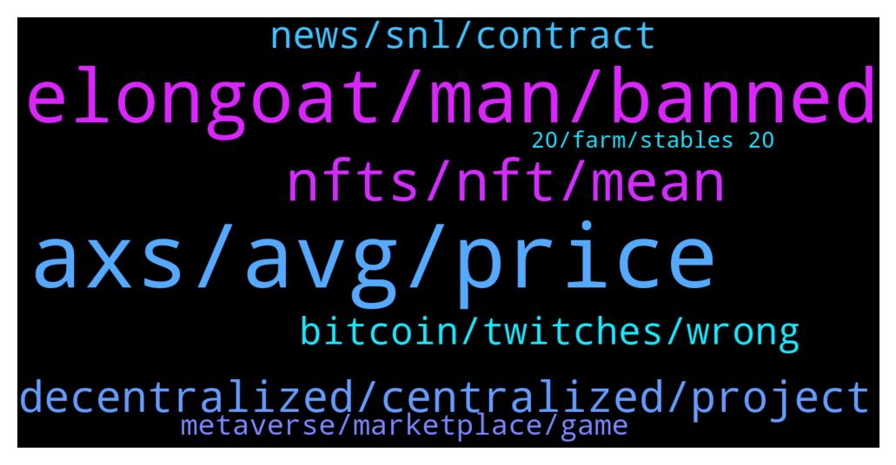

# **@shitpool**
 ## Analysis for **2022-01-08** - **2022-01-09**.

---

## 📊 **Basic Stats**

**n_messages_sent**: 204

---

---

## 🔝 **Top keywords and related messages**

1. **axs, avg, price**

    @OxZilla --- *Imagine being early to SOL but investing in eco system . Srm is currently at .02* **--->** [TG Discussion](https://t.me/shitpool/715259)

    @CharliePolite --- *Man… Everytime you mention a coin I’m impressed. It’s always bottom of the barrel* **--->** [TG Discussion](https://t.me/shitpool/715142)

    @OxZilla --- *Feel bad that all the Philippinos that quit their jobs to play axie* **--->** [TG Discussion](https://t.me/shitpool/715373)

    @da0man --- *Axs is good coin people will regret selling* **--->** [TG Discussion](https://t.me/shitpool/715139)

    @Dannysparks --- *What's the next Shitcoin to buy* **--->** [TG Discussion](https://t.me/shitpool/715017)

    @da0man --- *I’m holding my axie. It will go back up. Not listening to FUDer* **--->** [TG Discussion](https://t.me/shitpool/715148)

2. **elongoat, man, banned**

    @michael_ssss --- *He’s at the Heart Attack Grill. They make you wear a hospital gown when you eat there. Also anyone that weighs more than 350 lb eats for free* **--->** [TG Discussion](https://t.me/shitpool/715246)

    @Horselorde --- *How do you know if he’s a strange little man? He could weigh 500lbs and be the life of the party* **--->** [TG Discussion](https://t.me/shitpool/715114)

    @rocket_fuel --- *why is he wearing a hospital gown* **--->** [TG Discussion](https://t.me/shitpool/715073)

    @SupreemKai --- *I don’t understand why you’re coming for me you strange little man* **--->** [TG Discussion](https://t.me/shitpool/715106)

    @SupreemKai --- *You might not be getting what I’m saying. It’s cool* **--->** [TG Discussion](https://t.me/shitpool/715100)

    @R0mster --- *There is no Reasoning Faculty when you shill something like Elongoat. Nobody fucking cares.* **--->** [TG Discussion](https://t.me/shitpool/715098)

3. **nfts, nft, mean**

    @Buena_Fiesta --- *who actually makes money with nfts* **--->** [TG Discussion](https://t.me/shitpool/715125)

    @wojackdegreate --- *NFTs are doing quite well right now* **--->** [TG Discussion](https://t.me/shitpool/715200)

    @MoneroPal --- *Absolutely, the word NFT in itself is absolutely cringeworthy every lowly wage cuck commoner repeats it yet is clueless about it and takes part in none of it, if they do, it’s at a loss...* **--->** [TG Discussion](https://t.me/shitpool/715128)

    @Buena_Fiesta --- *i feel like 99% is not making money with buying nfts* **--->** [TG Discussion](https://t.me/shitpool/715126)

    @sumtemm --- *just because you guys dont make any money on nfts doesnt mean nobody does. I have a lot of friends who kill it on solana ones, 170x on boryoku dragons, 70x on shadowy super coders etc, solsteins 30x* **--->** [TG Discussion](https://t.me/shitpool/715150)

    @R0mster --- *NFTS don’t seem like they will do well in a bear market. The farming special incentive ones perhaps.* **--->** [TG Discussion](https://t.me/shitpool/715129)

4. **decentralized, centralized, project**

    @da0man --- *one year in crypto is like 10 years on wall st.* **--->** [TG Discussion](https://t.me/shitpool/715177)

    @mochomojo --- *Cere network is built from ground up fully decentralized.. Even the team is split up in many parts of countries so there is no full centralization.* **--->** [TG Discussion](https://t.me/shitpool/715120)

    @MoneroPal --- *decentralized technology, centralized leadership and development = fail, decentralized all around = win* **--->** [TG Discussion](https://t.me/shitpool/715119)

    @SupreemKai --- *its quite scary what crypto can do to investors reasoning faculties* **--->** [TG Discussion](https://t.me/shitpool/715080)

    @luckycat --- *shill me crypto gems with low mcap* **--->** [TG Discussion](https://t.me/shitpool/715048)

    @notdao --- *Did a weird omisego flashback there, oof* **--->** [TG Discussion](https://t.me/shitpool/715044)

5. **bitcoin, twitches, wrong**

    @da0man --- *Arthur in 2018 said bitcoin go 50k. is this latest 20k call like that or honest?* **--->** [TG Discussion](https://t.me/shitpool/715360)

    @michael_ssss --- *According to my degen sense, I firmly believe DOGE will hit $1 some time this year or next* **--->** [TG Discussion](https://t.me/shitpool/715403)

    @grammi --- *Yeah I don’t examine the leaderboard but he’s still got a lot of UPNL profit last I saw* **--->** [TG Discussion](https://t.me/shitpool/715197)

    @Antonioalcantara --- *john brown is losing 100 millions right now in bitfinex* **--->** [TG Discussion](https://t.me/shitpool/715196)

    @grammi --- *But his bonds and share price will suffer* **--->** [TG Discussion](https://t.me/shitpool/715193)

    @grammi --- *Even saylor should be “ok” for a bit if he gets underwater Bc his loans aren’t due till 2024 iirc* **--->** [TG Discussion](https://t.me/shitpool/715192)

6. **news, snl, contract**

    @da0man --- *I trust this man. Stay bullish. Stay strong.* **--->** [TG Discussion](https://t.me/shitpool/715212)

    @wanker007 --- *Dump the news in this case was the ultimate "news" hype bs looool* **--->** [TG Discussion](https://t.me/shitpool/715415)

    @wanker007 --- *I set all my doge sells from 50c to 1usd the weeks leading up to Elon on snl* **--->** [TG Discussion](https://t.me/shitpool/715408)

    @wojackdegreate --- *Back then when he was bull posting they were running everyones stops and liquidating on bitmex* **--->** [TG Discussion](https://t.me/shitpool/715379)

    @Gregoranus --- *I’m in another channel that only posts bullish news, there used to be posts almost every day. Nothing since September the 17th.* **--->** [TG Discussion](https://t.me/shitpool/715348)

    @wojackdegreate --- *Can’t have a sell the news event if the smart contracts never work* **--->** [TG Discussion](https://t.me/shitpool/715062)

7. **metaverse, marketplace, game**

    @Blazmeen --- *People need to remind themselves that this is a P2E game and it is no longer fun or profitable for the average user. Of course it's dumping.* **--->** [TG Discussion](https://t.me/shitpool/715179)

    @sumtemm --- *right now just the niche p2e/metaverse marketplace is live* **--->** [TG Discussion](https://t.me/shitpool/715232)

    @da0man --- *just need the devs to quit then it will be golden* **--->** [TG Discussion](https://t.me/shitpool/715181)

    @Breddao --- *Not fun not profitable not productive, great buy* **--->** [TG Discussion](https://t.me/shitpool/715180)

    @Buena_Fiesta --- *i also think the projects funny about metaverse. projects create a game where you can just buy your own land or just play around. it is only a fucking game and not the metaverse* **--->** [TG Discussion](https://t.me/shitpool/715132)

    @sumtemm --- *but playing around with it should give a good sense of what the UI and speeds/costs are gonna be on the generalized marketplace* **--->** [TG Discussion](https://t.me/shitpool/715233)

