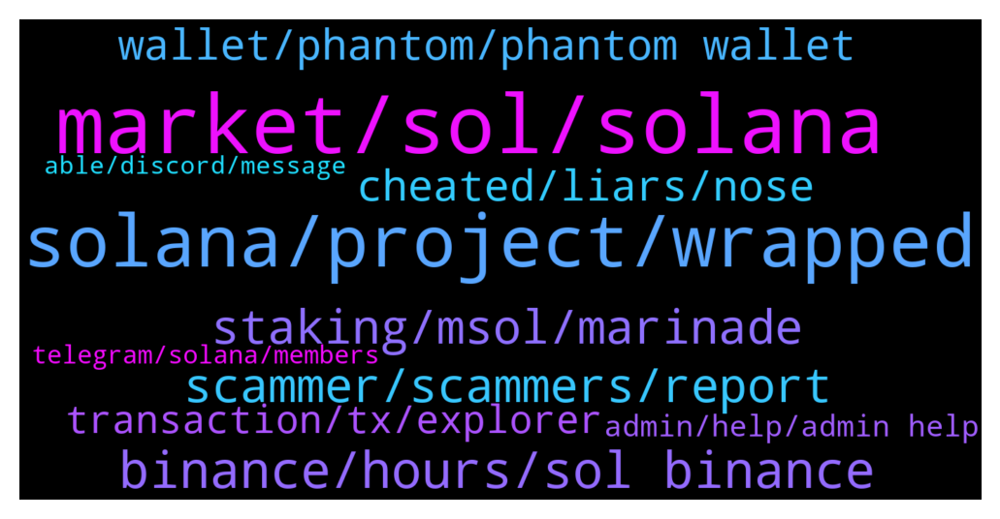

# **@solana**
 ## Analysis for **2022-01-08** - **2022-01-09**.

---

## 📊 **Basic Stats**

**n_messages_sent**: 586

---

---

## 🔝 **Top keywords and related messages**

1. **market, sol, solana**

    @cartier234 --- *So why the increase in the value of the currency? I believe that the increase of an asset must be accompanied by a solid performance. Things that must agree.* **--->** [TG Discussion](https://t.me/solana/894826)

    @Julie0318 --- *today. How do you feel about the recent market volatility?* **--->** [TG Discussion](https://t.me/solana/896888)

    @Mabbioroma --- *is there a chance that it will collapse again?* **--->** [TG Discussion](https://t.me/solana/896941)

    @Aliendreamz --- *It needs to grow like a much mature & responsible blockchain now.people have high hopes from Sol..whats the use of such speed if it keeps failing repeatedly.* **--->** [TG Discussion](https://t.me/solana/896062)

    @B_sh999 --- *digital asset marketplace Bakkt found in its U.S. Consumer Crypto Survey that 48% of American investors invested money in cryptocurrency during the first half of 2021. Another 32% of respondents who haven't invested in virtual currency yet plan to do so in the next six months.* **--->** [TG Discussion](https://t.me/solana/894958)

    @SymboliahELENA --- *The downward trend will not change until the unemployment rate rises to its maximum* **--->** [TG Discussion](https://t.me/solana/896949)

2. **solana, project, wrapped**

    @Mabbioroma --- *do you believe in solana? serious question. or do you think it ends up like dash or the like?* **--->** [TG Discussion](https://t.me/solana/897266)

    @S --- *Is it true that the problem is fixed in Solana? There is a New version and the bugs are out. It should work much bether now* **--->** [TG Discussion](https://t.me/solana/894882)

    @Llyonsa --- *Solana has just officially announced problems with high compute txs* **--->** [TG Discussion](https://t.me/solana/895530)

    @zangvogel --- *hello is there a problem with solona?? has not been possible to send them for several days is constantly under maintenance on kucoin* **--->** [TG Discussion](https://t.me/solana/895612)

    @Folaross --- *Please monitor Solana network here - https://status.solana.com/* **--->** [TG Discussion](https://t.me/solana/896453)

    @cryptolover1987 --- *Hello! there is no docs or articles that talk about Solana roadmap. Check out docs.solana.com to get knowledge on the future goals and aims of the project.  You can also check out Solana latest releases here -  https://github.com/solana-labs/solana/releases for latest releases.* **--->** [TG Discussion](https://t.me/solana/897138)

3. **binance, hours, sol binance**

    @jacek_bernatek --- *Binance send SOL - 3h+ i waiting* **--->** [TG Discussion](https://t.me/solana/894617)

    @bercik97 --- *hello guys, anyone knows why my transaction takes so long? I wanted to withdraw some solana to phantom from binance and it takes already 40min ~* **--->** [TG Discussion](https://t.me/solana/895831)

    @Stecco --- *Is it normal that my transfer from binance to kucoin is still processing after 4 hours?* **--->** [TG Discussion](https://t.me/solana/896302)

    @cryptolover1987 --- *It’s working perfectly fine for me.. I just transferred my SOL from trust wallet to Binance.* **--->** [TG Discussion](https://t.me/solana/895304)

    @Mick --- *On the binance smart chain extension.  Added sol  Showing 0* **--->** [TG Discussion](https://t.me/solana/895804)

    @CoinsBlT_Listing --- *Usually shouldn’t be a problem depositing SOL to Binance. Wait it out maybe* **--->** [TG Discussion](https://t.me/solana/897136)

4. **staking, msol, marinade**

    @R --- *OK thanks for your help. I'm currently staking through "ChainFlow". Not made much with them at the moment* **--->** [TG Discussion](https://t.me/solana/896667)

    @Javier --- *That’s liquid staking token you get when staking Sol on marinade* **--->** [TG Discussion](https://t.me/solana/896644)

    @R --- *OK. Is it worth it?? I'm already staking SOL* **--->** [TG Discussion](https://t.me/solana/896657)

    @cryptolover1987 --- *You can stake and earn.  Staking options are:  https://t.me/solana/758519* **--->** [TG Discussion](https://t.me/solana/895744)

    @cryptolover1987 --- *It’s marinade staked SOL.   Please refer this 👇🏻 🔗 https://blog.saber.so/saber-partners-with-marinade-finance-to-make-staking-liquid-throughmsol-pool-1d5c75f63eb9?gi=d3d9b3e5385d* **--->** [TG Discussion](https://t.me/solana/896695)

    @callq --- *It simply makes staking a bit easier because you don't have to choose a validator. On the other hand, you put your trust into some 3rd part entity which is holding your SOL for you.* **--->** [TG Discussion](https://t.me/solana/896663)

5. **scammer, scammers, report**

    @lian0x31 --- *5 scammers blocked and reported, keep it coming~* **--->** [TG Discussion](https://t.me/solana/895584)

    @vrdistrica --- *Guys I was scammed and need to get the word out.* **--->** [TG Discussion](https://t.me/solana/894893)

    @Fthai028 --- *So sad this channel is full of scammer like Sharon Cox, but nobody can do something about it* **--->** [TG Discussion](https://t.me/solana/896747)

    @George --- *Unfortunately that's very common. With scammers  lurking like sharks every step of the way* **--->** [TG Discussion](https://t.me/solana/894922)

    @Monterrey_Rice --- *Please beware of scammers and bad actors* **--->** [TG Discussion](https://t.me/solana/897149)

    @DeepThoughtFortyTwo --- *Not just this channel, all crypto forums are full of scammers. Block, report, repeat.* **--->** [TG Discussion](https://t.me/solana/896753)

6. **cheated, liars, nose**

    @Sharon_892 --- *I am a living person, and you are a liar. You don't even have an avatar* **--->** [TG Discussion](https://t.me/solana/896510)

    @Sharon_892 --- *Why don't you be fooled by a liar to drive you crazy?* **--->** [TG Discussion](https://t.me/solana/896604)

    @Sharon_892 --- *You can't even eat. Who wants to lie to you, pauper?* **--->** [TG Discussion](https://t.me/solana/896523)

    @sellagram1 --- *Yes you must be super intelligent to know that I am a nose* **--->** [TG Discussion](https://t.me/solana/896284)

    @pamelacurry --- *So you just speak whatever your mouth wants to ?* **--->** [TG Discussion](https://t.me/solana/897318)

    @Sharon_892 --- *People who have no brains will be cheated by liars, which shows that you just have no brains haha* **--->** [TG Discussion](https://t.me/solana/896610)

7. **wallet, phantom, phantom wallet**

    @Punitkp --- *Need 0.0005$ in solana to withdraw usdt from phantom wallet* **--->** [TG Discussion](https://t.me/solana/895460)

    @Fullmeta1alchemist --- *is there anyway that i can transac on phantom wallet even tho i dont have any sol on the wallet?* **--->** [TG Discussion](https://t.me/solana/894654)

    @Yoyo --- *Like can I swap my ETH for sol on 1inch or polygon* **--->** [TG Discussion](https://t.me/solana/896395)

    @Fullmeta1alchemist --- *is there anyone that have a dollar of sol to lend me please?* **--->** [TG Discussion](https://t.me/solana/894622)

    @Mhr2172 --- *Hello, I will use raydium swap, how much do I pay for swap sol fee?* **--->** [TG Discussion](https://t.me/solana/895527)

    @George --- *If I mint a random nft with my phantom wallet* **--->** [TG Discussion](https://t.me/solana/894780)

8. **transaction, tx, explorer**

    @Crypto_G11 --- *Hey guys I made a transaction but it's not showing in my explorer  What may be the cause? Has anyone faced that problem before? @admin   No DM please* **--->** [TG Discussion](https://t.me/solana/896866)

    @CS_Digifox --- *You won't see anything, as it says "no transaction found"* **--->** [TG Discussion](https://t.me/solana/895916)

    @cryptolover1987 --- *Have you checked your transaction detail on explorer?* **--->** [TG Discussion](https://t.me/solana/895308)

    @CS_Digifox --- *Is there a timeout? My transaction stucks since over 2 hours, tx id shows nothing.* **--->** [TG Discussion](https://t.me/solana/895898)

    @TheOfficialAUVA --- *Any update on the network delays?  My transaction is still showing as processing since this morning.* **--->** [TG Discussion](https://t.me/solana/895013)

    @mahib45 --- *Hello 👋  You need to have SOL in your wallet to make the transaction!* **--->** [TG Discussion](https://t.me/solana/894663)

9. **admin, help, admin help**

    @nguyenquangthach --- *hi admin i need your help* **--->** [TG Discussion](https://t.me/solana/896736)

    @Robert --- *Admin and support are not responsible for system development issues guys please.* **--->** [TG Discussion](https://t.me/solana/897043)

    @Mick --- *How do I do this (sorry)* **--->** [TG Discussion](https://t.me/solana/895784)

    @Crypto_G11 --- *Is there any admin here ? I really need help please* **--->** [TG Discussion](https://t.me/solana/896862)

    @nguyenquangthach --- *o i fixed them admin thankls* **--->** [TG Discussion](https://t.me/solana/896768)

    @Zyxter11 --- *Please admin make this server good* **--->** [TG Discussion](https://t.me/solana/896627)

10. **telegram, solana, members**

    @callq --- *Yeah it will never end. Telegram is like a swamp...* **--->** [TG Discussion](https://t.me/solana/895597)

    @DeepThoughtFortyTwo --- *It’s been going on this whole week. Also, be ready to be DM’ed by scammers from “Solana Tech Support” as soon as you post here. Telegram is a failing platform.* **--->** [TG Discussion](https://t.me/solana/895233)

    @mahib45 --- *Hello to all the newcomers! 👋    Welcome to Solana official community! As you just entered in #Solana, in case you have a question about what is #Solana?  Solana is a fast, secure, and censorship-resistant blockchain providing the open infrastructure required for crypto to scale to global adoption.   To read more about Solana please visit  Website: www.solana.com Document: https://docs.solana.com/introduction  ⚠️ Please be aware of fraudulent actors posing as Solana team members on Telegram. If you do receive suspicious messages, do not respond, click on links or follow any instructions. ✅ We recommend changing your telegram privacy settings to avoid being added to scam groups. ❗️There is no Solana airdrop or free giveaway!* **--->** [TG Discussion](https://t.me/solana/897258)

    @mahib45 --- *🚨🚨🚨 Scammer alert 🚨🚨🚨  ⚠️ Please be aware of fraudulent accounts posing as Solana team members on Telegram. If you receive suspicious messages, do not respond to them, click on links or follow any instructions. ⚠️ Please also be aware of "giveaways" promoted by bots, YouTube, in Medium articles or fake Telegram groups. Scammers are very creative, however the standard rule is never send funds to strangers or share your private key. ❗️There is no Solana airdrop or free giveaway! Do not send SOL anywhere with the expectation that you will receive more back.  ✅ We recommend changing your telegram privacy settings to avoid being added to scam groups.* **--->** [TG Discussion](https://t.me/solana/896906)

    @Folaross --- *Use Multichain on Trust wallet to import your phrase words then add Solana to your assets list for you to send to any wallet of your choice.  ⚠️ Please be aware of fraudulent actors posing as Solana team members on Telegram. If you do receive suspicious messages, do not respond, click on links or follow any instructions. ⚠️ Please also be aware of giveaways promoted on YouTube, in Medium articles or fake Telegram groups. ❗️There is no Solana airdrop or free giveaway! Do not send SOL anywhere with the expectation that you will receive more back.  ✅ We recommend changing your telegram privacy settings to avoid being added to scam groups.* **--->** [TG Discussion](https://t.me/solana/896457)

    @Alyy85 --- *Used solfare wallet...and I'm fed up with these (f***) scammers who messaging me .* **--->** [TG Discussion](https://t.me/solana/897120)

