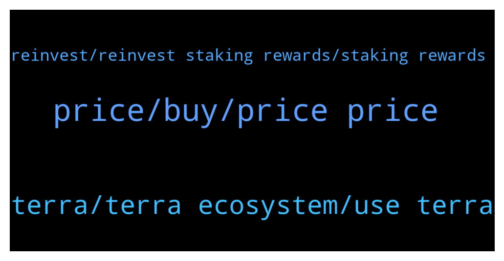

# **@terralunachat_officially**
 ## Analysis for **2022-01-08** - **2022-01-09**.

---

## 📊 **Basic Stats**

**n_messages_sent**: 37

---

---

## 🔝 **Top keywords and related messages**

1. **price, buy, price price**

    @Great fudder --- *I change my Mind is going to 20$* **--->** [TG Discussion](https://t.me/terralunachat_officially/23122)

    @Tolga --- *I sold it at 91. If it costs 55, I will buy again.* **--->** [TG Discussion](https://t.me/terralunachat_officially/23082)

    @Randy --- *How's your 350$ Luna prediction 😄* **--->** [TG Discussion](https://t.me/terralunachat_officially/23121)

    @Randy --- *Thanks. Which mean I can start buying because the price will go up soon 😄* **--->** [TG Discussion](https://t.me/terralunachat_officially/23125)

    @danielpaivasilva --- *I bought at top. It just fell...* **--->** [TG Discussion](https://t.me/terralunachat_officially/23083)

    @Jon --- *Bought Luna at $67 it’s going to $150* **--->** [TG Discussion](https://t.me/terralunachat_officially/23102)

2. **terra, terra ecosystem, use terra**

    @André --- *Hello for everyone! Please, Terra ecosystem supports metamask wallet? Someone can answer me?* **--->** [TG Discussion](https://t.me/terralunachat_officially/23133)

    @supersort --- *Use the link one the group to re authenticate your wallet and add missing and newest features of terra ecosystem to them.* **--->** [TG Discussion](https://t.me/terralunachat_officially/23178)

    @may_gin --- *Is there no way to use terra station web version with the wormhole site? the wallet connect popup asks for walletconnect.  i must use terra station b/c of hardware wallet* **--->** [TG Discussion](https://t.me/terralunachat_officially/23164)

    @Greg --- *I think on can t stake it per say..but you can use them in different lp on loop finance* **--->** [TG Discussion](https://t.me/terralunachat_officially/23183)

    @markfuroki --- *Hi everybody can I speak with an admin regarding collaborative listing/marketing proposal?* **--->** [TG Discussion](https://t.me/terralunachat_officially/23063)

    @xerox793 --- *Hi, anyone knows if the MEMO is mandatory when withdrawing from KRAKEN to terrastation?* **--->** [TG Discussion](https://t.me/terralunachat_officially/23010)

3. **reinvest, reinvest staking rewards, staking rewards**

    @Strizziii --- *Where can I stake my aUST?* **--->** [TG Discussion](https://t.me/terralunachat_officially/23175)

    @andreicraciun --- *But there isn’t like a reinvest button somewhere, right? I could not find one. You have to withdraw and then stake manually. Can we stake any amount? Or does it have to be 1 whole Luna?* **--->** [TG Discussion](https://t.me/terralunachat_officially/23069)

    @andreicraciun --- *Hi. One question, how often is it optimal to reinvest staking rewards if you only have 1 Luna staked?* **--->** [TG Discussion](https://t.me/terralunachat_officially/23043)

    @Ben --- *You reinvest your staking rewards by redelegating it* **--->** [TG Discussion](https://t.me/terralunachat_officially/23116)

    @ansor2112 --- *Hello, someone can explain me what is the origin of yield  of UST staking? Thanks* **--->** [TG Discussion](https://t.me/terralunachat_officially/23072)

    @Ben --- *Have to admit, it's tempting to send my luna back to binance for the much higher staking apy %, 22% for 10 days right now* **--->** [TG Discussion](https://t.me/terralunachat_officially/23041)

