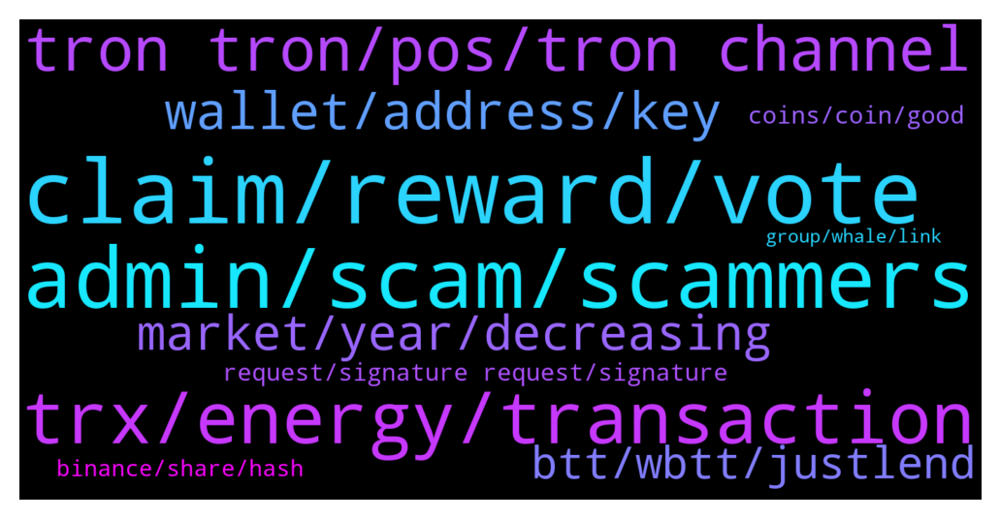

# **@tronnetworkEN**
 ## Analysis for **2022-01-08** - **2022-01-09**.

---

## 📊 **Basic Stats**

**n_messages_sent**: 321

---

---

## 🔝 **Top keywords and related messages**

1. **claim, reward, vote**

    @Carlos_TRX --- *no, there is no danger while you freeze mate 👍🏻* **--->** [TG Discussion](https://t.me/tronnetworkEN/3817997)

    @Carlos_TRX --- *then first you have to unstake from justlend* **--->** [TG Discussion](https://t.me/tronnetworkEN/3817588)

    @HBIHBI64 --- *thats New for me. I bought tron in 2019. I change vote with tronscan org and ledger. Is there a claim Button too? or can i see - unclaimed Rewards in tronscan* **--->** [TG Discussion](https://t.me/tronnetworkEN/3815418)

    @aubreyxcx --- *Is there a limit i can freeze daily* **--->** [TG Discussion](https://t.me/tronnetworkEN/3818000)

    @HBIHBI64 --- *When i checked my wallet on 31.12 to Check my rewards for 2021 i saw rewards from tron europe (terc) Till 31.12 but cannot find tron europe group in Telegram   Because i was afraid i change my votes with tronscan org to polionex on 31.12.21  After i got no reward till 3.1.22 i change vote to tron.alliance but have the same - no reward - Problem.   The 2 transaction of change votes were sucessfull.   I think i need help 😪* **--->** [TG Discussion](https://t.me/tronnetworkEN/3815407)

    @agentpiki --- *You can claim reward once a day* **--->** [TG Discussion](https://t.me/tronnetworkEN/3816663)

2. **admin, scam, scammers**

    @Samsonioc --- *Admin block this user name  @Anglela_TRON* **--->** [TG Discussion](https://t.me/tronnetworkEN/3817151)

    @Daniello_DestinyWorld_Fortis --- *First close your mouse, it's only a star not verified account And secondly I asked admins, not you* **--->** [TG Discussion](https://t.me/tronnetworkEN/3817270)

    @Pawanrangila --- *Admin will you help us one Please* **--->** [TG Discussion](https://t.me/tronnetworkEN/3816332)

    @simon866 --- *Pure scam bro report and block him* **--->** [TG Discussion](https://t.me/tronnetworkEN/3817206)

    @PiterSpain --- *There is no mining, don't fall in such scams* **--->** [TG Discussion](https://t.me/tronnetworkEN/3819105)

    @templariotuga --- *Then you should reach their support* **--->** [TG Discussion](https://t.me/tronnetworkEN/3815711)

3. **trx, energy, transaction**

    @Gaziz --- *Then how to do it legal. I have 10210 dec it is about 560 trx* **--->** [TG Discussion](https://t.me/tronnetworkEN/3819180)

    @xPommepote --- *You can buy TRX on exchanges and stake in TronLink* **--->** [TG Discussion](https://t.me/tronnetworkEN/3815988)

    @Anthony --- *Can anyone help me about TRX* **--->** [TG Discussion](https://t.me/tronnetworkEN/3817962)

    @Bhavin --- *How can I reverse my TRX?* **--->** [TG Discussion](https://t.me/tronnetworkEN/3819280)

    @Carlos_TRX --- *He answered you before, You not only have to have 100k TRX but also be a participatory person and an authentic member of the community, you have to be a trustworthy user.* **--->** [TG Discussion](https://t.me/tronnetworkEN/3816637)

    @agentpiki --- *It says failed out of energy. Means you don't have enough trx for transaction* **--->** [TG Discussion](https://t.me/tronnetworkEN/3819083)

4. **tron tron, pos, tron channel**

    @Carlos_TRX --- *company disolve? TRON was decentralized since the beginning TRON Foundation was one more actor mate, nothing changed mate* **--->** [TG Discussion](https://t.me/tronnetworkEN/3817504)

    @agentpiki --- *No, tron channel only talk about tron.* **--->** [TG Discussion](https://t.me/tronnetworkEN/3817279)

    @suPerJack0 --- *Ask here and keep it related to tron* **--->** [TG Discussion](https://t.me/tronnetworkEN/3816333)

    @<UNK> --- *Tron is a type of crypto okkk* **--->** [TG Discussion](https://t.me/tronnetworkEN/3817283)

    @agentpiki --- *Tron is not mined is tron network use POS, not POW.   Go mine your ETH* **--->** [TG Discussion](https://t.me/tronnetworkEN/3817264)

    @Terra1001 --- *tron channel only talk about tron* **--->** [TG Discussion](https://t.me/tronnetworkEN/3817281)

5. **wallet, address, key**

    @suPerJack0 --- *If u have private key u can recover it.if not U can't do anything.* **--->** [TG Discussion](https://t.me/tronnetworkEN/3819271)

    @suPerJack0 --- *If u still have accces to wallet u can recover memonic with password in tronlink. If u don't have accces to Wallet or if u don't have memonic u can't do anything. Your wallet is gone* **--->** [TG Discussion](https://t.me/tronnetworkEN/3819279)

    @Avie12 --- *Hw will I know my wallet is activated?* **--->** [TG Discussion](https://t.me/tronnetworkEN/3816419)

    @Tronearner11 --- *I have  tron  address  and password  I  forget my memonic  key  how can I transfer  trx  to other wallet* **--->** [TG Discussion](https://t.me/tronnetworkEN/3819269)

    @Tronearner11 --- *In watch wallet acces i have* **--->** [TG Discussion](https://t.me/tronnetworkEN/3819281)

    @xPommepote --- *After you can use your wallet to do whatever you want* **--->** [TG Discussion](https://t.me/tronnetworkEN/3815980)

6. **market, year, decreasing**

    @Himanshu --- *Am i the only one thinking that company will dissolve this year look at the bear destroying tron. Still i am buying every dip.😅* **--->** [TG Discussion](https://t.me/tronnetworkEN/3817497)

    @Paul 🎭 --- *There's a reason for this 4 year cycle. It's related to BTC halving* **--->** [TG Discussion](https://t.me/tronnetworkEN/3818826)

    @xPommepote --- *JustStake and earn more 💪🏻 till the market gets better* **--->** [TG Discussion](https://t.me/tronnetworkEN/3817569)

    @Himanshu --- *But reputation of the coin is decreasing day by day. Instead of attracting new customers i belive some old are closing and leaving. If i was the new customer i'll first go to reviews (leave market cap) and those are not good. Though i use wrong word dissolve.😅 sorry for that.* **--->** [TG Discussion](https://t.me/tronnetworkEN/3817522)

    @maddy1308 --- *Compare with last week, TRON coin rate is decreasing* **--->** [TG Discussion](https://t.me/tronnetworkEN/3818834)

    @KingsDove_TRX --- *If you think it'll be this high in 2023, then my suggestion is to buy at these levels* **--->** [TG Discussion](https://t.me/tronnetworkEN/3815582)

7. **btt, wbtt, justlend**

    @xPommepote --- *No you can let your wbtt there* **--->** [TG Discussion](https://t.me/tronnetworkEN/3817698)

    @Carlos_TRX --- *Obviously they are different BTT only WBTT works in justlend* **--->** [TG Discussion](https://t.me/tronnetworkEN/3817629)

    @Carlos_TRX --- *WBTT to OLDBTT and then to new BTT* **--->** [TG Discussion](https://t.me/tronnetworkEN/3817553)

    @hamed00000007 --- *Launch new btt, no problem for my wbtt in justlend?* **--->** [TG Discussion](https://t.me/tronnetworkEN/3817722)

    @hamed00000007 --- *I have a wbtt token, do I need to convert it to a new btt?* **--->** [TG Discussion](https://t.me/tronnetworkEN/3817542)

    @hamed00000007 --- *I can not put the new btt in justlend* **--->** [TG Discussion](https://t.me/tronnetworkEN/3817592)

8. **request, signature request, signature**

    @goblinex --- *when i deployed a trc20 contract i set it the fees to be user ..can i now change it* **--->** [TG Discussion](https://t.me/tronnetworkEN/3817092)

    @xPommepote --- *There is a lot of warning on binance to send only TRC-10 BTT and not TRC-20 🤷🏼‍♂️* **--->** [TG Discussion](https://t.me/tronnetworkEN/3815948)

    @templariotuga --- *Don't think this is a transaction in tron or btt chain* **--->** [TG Discussion](https://t.me/tronnetworkEN/3815732)

    @hiul78 --- *really? what can they do, the transaction is stuck on the tron blockchain* **--->** [TG Discussion](https://t.me/tronnetworkEN/3819055)

    @only1980 --- *I was suppose to get a signature request from Tron wallet in order to accept the bridged token but i didn't receive the signature request. Now the tokens are stuck because i don't know how to get that signature request* **--->** [TG Discussion](https://t.me/tronnetworkEN/3815715)

    @only1980 --- *You can see that the btt was sent but and transaction was successful but nothing received on Tron wallet* **--->** [TG Discussion](https://t.me/tronnetworkEN/3815723)

9. **coins, coin, good**

    @PiterSpain --- *Use Chrome and the bridge is normal, something common for all coins since time ago.* **--->** [TG Discussion](https://t.me/tronnetworkEN/3815632)

    @eraycolak --- *I have a coin left on the tron ​​network* **--->** [TG Discussion](https://t.me/tronnetworkEN/3815880)

    @Skyetimz --- *How can I trade my coins?? And make profit* **--->** [TG Discussion](https://t.me/tronnetworkEN/3816561)

    @Brito --- *Suggest some good coin to invest now* **--->** [TG Discussion](https://t.me/tronnetworkEN/3819509)

    @PHHH13 --- *this is the adress which witdrew my coins : TVKGoqdkitzk6LL6ig2Zpb3e7AJKmrWErb* **--->** [TG Discussion](https://t.me/tronnetworkEN/3817453)

    @agentpiki --- *Coinmarketcap.com  Go there to check full listing* **--->** [TG Discussion](https://t.me/tronnetworkEN/3816973)

10. **binance, share, hash**

    @xPommepote --- *Contact binance support and ask them.* **--->** [TG Discussion](https://t.me/tronnetworkEN/3815952)

    @eraycolak --- *transfer from gate io exchange to binance exchange* **--->** [TG Discussion](https://t.me/tronnetworkEN/3815929)

    @xPommepote --- *Can you please share the transaction hash ? Did you transferred BTT ?* **--->** [TG Discussion](https://t.me/tronnetworkEN/3815932)

    @xPommepote --- *Can you share the hash ? What action did you do ?* **--->** [TG Discussion](https://t.me/tronnetworkEN/3815908)

    @eraycolak --- *I transferred it, it got network approval but it wasn't transferred to my binance account.* **--->** [TG Discussion](https://t.me/tronnetworkEN/3815933)

    @xPommepote --- *Share the transaction hash but coin can’t be « stuck » on the network.* **--->** [TG Discussion](https://t.me/tronnetworkEN/3815886)

