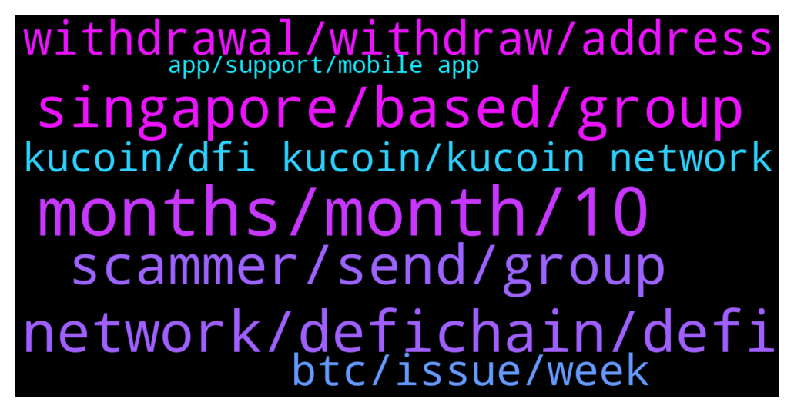

# **@CakeDeFi_EN**
 ## Analysis for **2022-01-09** - **2022-01-10**.

---

## 📊 **Basic Stats**

**n_messages_sent**: 253

---

---

## 🔝 **Top keywords and related messages**

1. **months, month, 10**

    @Stephan --- *So that means 36*1.658% = ~50% APY that I esentially lose in a year? If I stake for 45% APY, don't I have a loss at the end of the year? Assuming everything stays constant, no price increase, no freezing etc.* **--->** [TG Discussion](https://t.me/CakeDeFi_EN/162933)

    @EyeBig --- *Hello admin. I have question about staking and freezing. I currently have 10 dfi  If I freeze for 1 month, the expected return with bonus around 29usd.   If I freeze for 60 months, the expected return with bonus around 70usd.  So isn't it better to just freeze for 1 month and auto renew? Or I'm missing something?* **--->** [TG Discussion](https://t.me/CakeDeFi_EN/162488)

    @EyeBig --- *Estimated return with bonus 1 month - 29 usd 60 months - 70 usd  That's what I got from the website.  So I will get 29 usd after 1 month of freezing or 70 usd after 60 months of freezing. Am I correct?* **--->** [TG Discussion](https://t.me/CakeDeFi_EN/162506)

    @Stephan --- *How exactly does the freezer calculation work? Seems super odd that the development of capital in DFI takes on a logarithmic function instead of an exponential one. Why would it start saturating after 10 years? Also, an APY of 100% is about 70% APR, yet Freezer's calculations boil down to merely about 100% increase of DFI for the ENTIRE 10 years. Assuming constant APY of 100%, I'd expect 100*(1,7^10) percent increase of capital. Where am I wrong?* **--->** [TG Discussion](https://t.me/CakeDeFi_EN/162927)

    @Stephan --- *I see, but how come that reduction is so high? I would assume the last year (year 10) to yield most rewards, yet one basically makes no rewards in the calculation of the freezer for the last year.* **--->** [TG Discussion](https://t.me/CakeDeFi_EN/162931)

    @Razali --- *Your 10.7663579 DFI will become 11.1 DFI after freezing for a month..   Your 10.7663579 DFI will become 28.2 DFI after freezing for 60 months..   Perhaps that might be clearer..?   Also, the calculator takes into account the decreasing rewards.. so it takes into account a larger decrease in rewards when u calculate for 60 months than when u do the 1 month..* **--->** [TG Discussion](https://t.me/CakeDeFi_EN/162510)

2. **network, defichain, defi**

    @Sahin --- *So if I follow your info. Then for depositing Bitcoin to cake defi from binance. I choose the DFI network. For withdrawing btc to binance i choose the native network and that is BTC network.* **--->** [TG Discussion](https://t.me/CakeDeFi_EN/162808)

    @Sahin --- *Thanks for the chart. I think I get it now. Last example. If I deposit Ethereum from an exchange to cake defi. Then I choose the native network and that is the Ethereum Network. When I move inside the defichain ecosystem than it is dfi network. When I withdraw Ethereum out of cake defi i need to use the native network and that is Ethereum Network.* **--->** [TG Discussion](https://t.me/CakeDeFi_EN/162813)

    @Sahin --- *This is the part where I am stuck. Because on cake for the defichain network it says. 'use this network to send to a defichain wallet'. Kucoin is not a defichain? The only defichain wallet I know is 'defichain wallet' on the Google play store.* **--->** [TG Discussion](https://t.me/CakeDeFi_EN/162794)

    @James --- *But when you move it out make sure to choose their native blockchain so those tokens can be unwrapped by cake* **--->** [TG Discussion](https://t.me/CakeDeFi_EN/162807)

    @Kassius84 --- *BTC deposits are still possible and will appear in your Cake wallet.  Only adding to liquidity mining via Cake DeFi or transferring to the DeFiChain network is not possible at the moment.  You can use the BTC in lending, for example.* **--->** [TG Discussion](https://t.me/CakeDeFi_EN/162377)

    @Kassius84 --- *Sure, you can deposit BTC on Cake DeFi and swap into DFI. Or check other exchanges running an BTC-DFI market. https://coinmarketcap.com/currencies/defichain/markets/* **--->** [TG Discussion](https://t.me/CakeDeFi_EN/162545)

3. **singapore, based, group**

    @TwoDsireCrypto --- *Most are Euro & Singapore based I am only mod from Aust but I have not been as active as I was* **--->** [TG Discussion](https://t.me/CakeDeFi_EN/162509)

    @JonD26 --- *Why can't people chat when it's daytime in their timezone? Are all the mods from the same country?* **--->** [TG Discussion](https://t.me/CakeDeFi_EN/162486)

    @senyorkripto --- *Will the group be opened for Turkey?* **--->** [TG Discussion](https://t.me/CakeDeFi_EN/162580)

    @fabioandreatta --- *For some users it arrives later* **--->** [TG Discussion](https://t.me/CakeDeFi_EN/163045)

    @默默啃书小凳子~ --- *is based in singapore, if you dunno singapore, then can google map ya* **--->** [TG Discussion](https://t.me/CakeDeFi_EN/162585)

    @Gjves --- *Why is it on the list of countries* **--->** [TG Discussion](https://t.me/CakeDeFi_EN/162366)

4. **scammer, send, group**

    @JonD26 --- *Cheers for the reply. Seems a bit strange to shut down chat. Along with the ban on DMs doesn't instill confidence to be honest.* **--->** [TG Discussion](https://t.me/CakeDeFi_EN/162518)

    @GionB --- *Please REMOVE this Scammer!!! All fucking bastards!! Its for sure nothing wrong with my wallet 🤬🤬🤬☝️☝️☝️☝️* **--->** [TG Discussion](https://t.me/CakeDeFi_EN/162410)

    @Kassius84 --- *It's scam, check the details of the account and you will see, this account impersonates the Profil of the real @Michael_Schredl.* **--->** [TG Discussion](https://t.me/CakeDeFi_EN/162541)

    @zcpmv --- *Yeah he suddenly block me, wow* **--->** [TG Discussion](https://t.me/CakeDeFi_EN/162762)

    @onur_yz --- *By the way, someone with your name and profile photo sent a private message. He sent me a link.  Everyone be careful. @Michael_Schredl* **--->** [TG Discussion](https://t.me/CakeDeFi_EN/162726)

    @zcpmv --- *Omg its so difficult to write in this group, my massages are deleted as soon as I send them* **--->** [TG Discussion](https://t.me/CakeDeFi_EN/162746)

5. **withdrawal, withdraw, address**

    @Levent --- *how to withdraw 5 dollars in promotion* **--->** [TG Discussion](https://t.me/CakeDeFi_EN/162770)

    @Michael_Schredl --- *You can just withdraw them if they are not locked* **--->** [TG Discussion](https://t.me/CakeDeFi_EN/162771)

    @Keymtl --- *yes, the withdrawal seems to have taken place* **--->** [TG Discussion](https://t.me/CakeDeFi_EN/162439)

    @Brayan Coleman --- *What is the problem with your withdraw?* **--->** [TG Discussion](https://t.me/CakeDeFi_EN/162687)

    @Keymtl --- *Dear admin, I made a withdrawal to the hotbit exchange, she gave the withdrawal address, my tokens were locked after I made the withdrawal, I wonder what is the reason?* **--->** [TG Discussion](https://t.me/CakeDeFi_EN/162437)

    @₿o₿ ₿ Y --- *Hello I deposited LTC and it has over 13 confirms and I am 100% the address is correct yet its not even on my transactions as pending....* **--->** [TG Discussion](https://t.me/CakeDeFi_EN/162383)

6. **btc, issue, week**

    @PeterL1 --- *When is this btc_dfi issue solved ?  It is more as a week since i tried to remove my liquidity pair and so i missed 200 euro of income. Stop saying it is maintenance because of issues at other exchanges.* **--->** [TG Discussion](https://t.me/CakeDeFi_EN/163019)

    @PeterL1 --- *Waiting for a week now, this should have been communicated on the website. This bad joke that i cant remove my btc_dfi liqudity already cost me 200 euros since last week* **--->** [TG Discussion](https://t.me/CakeDeFi_EN/163023)

    @Michael --- *When can I remove Btc-DFi LM again? I see it’s not possible right now* **--->** [TG Discussion](https://t.me/CakeDeFi_EN/162558)

    @turbo1o1 --- *When will it be possible again to swap BTC for dBTC?* **--->** [TG Discussion](https://t.me/CakeDeFi_EN/162400)

    @Dany --- *Any 1 got News about the liquidity mining btc/dfi?* **--->** [TG Discussion](https://t.me/CakeDeFi_EN/162968)

    @fadfunky --- *We expected to see LTC will be dropped until mid year 2022 before it will rebound* **--->** [TG Discussion](https://t.me/CakeDeFi_EN/163037)

7. **kucoin, dfi kucoin, kucoin network**

    @mm_phoenix --- *Kucoin has a defichain address (defichain wallet) but there deposits and withdrawals are currently suspended* **--->** [TG Discussion](https://t.me/CakeDeFi_EN/162795)

    @cybearir --- *asking if i would wanna send some DFI from kucoin what network do i choose* **--->** [TG Discussion](https://t.me/CakeDeFi_EN/162395)

    @bestbytest --- *Is there any exchange up for depositing DFI?* **--->** [TG Discussion](https://t.me/CakeDeFi_EN/162694)

    @BlurBil --- *Can i buy dfi with bitcoin?* **--->** [TG Discussion](https://t.me/CakeDeFi_EN/162544)

    @Keymtl --- *I asked the stock market but they directed me to you* **--->** [TG Discussion](https://t.me/CakeDeFi_EN/162447)

    @cybearir --- *How is DFI token blockchain called ?* **--->** [TG Discussion](https://t.me/CakeDeFi_EN/162388)

