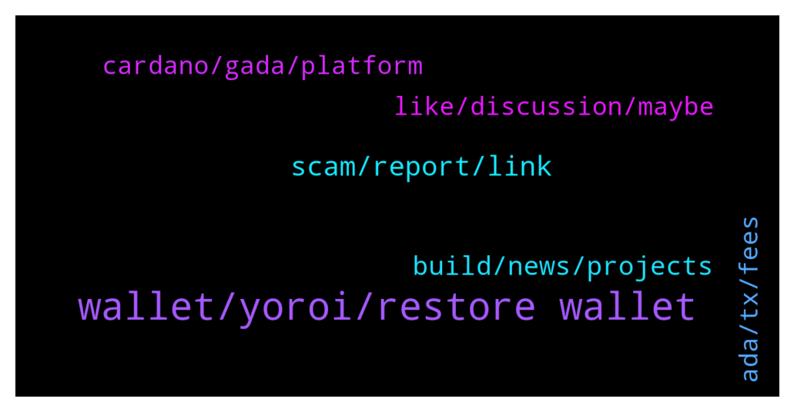

# **@Cardano**
 ## Analysis for **2022-01-09** - **2022-01-10**.

---

## 📊 **Basic Stats**

**n_messages_sent**: 88

---

---

## 🔝 **Top keywords and related messages**

1. **wallet, yoroi, restore wallet**

    @addcrypto3 --- *What is open source. Yoroi should have use some part transaction fee to enhance their product* **--->** [TG Discussion](https://t.me/Cardano/767199)

    @joelouisBTC --- *Does a wallet created in Daedalus old version can be restored with seedphrase in a new wallet in Yoroi?* **--->** [TG Discussion](https://t.me/Cardano/767106)

    @Thomas --- *Hey, do you know a wallet which shows all NFTs?* **--->** [TG Discussion](https://t.me/Cardano/767136)

    @UleC0 --- *Do u have notices abouth HYDRA?* **--->** [TG Discussion](https://t.me/Cardano/767183)

    @addcrypto3 --- *When yoroi will be compatible with dapps?* **--->** [TG Discussion](https://t.me/Cardano/767184)

    @mostudio --- *Any updates on Yoroi working with Sundae yet?* **--->** [TG Discussion](https://t.me/Cardano/767287)

2. **scam, report, link**

    @apex_pool_spo --- *no, verify at least before saying it's a scam, or don't say anything.* **--->** [TG Discussion](https://t.me/Cardano/767335)

    @apex_pool_spo --- *it is not, and you should not say about everything that it is a scam if you don't know what you are talking about.* **--->** [TG Discussion](https://t.me/Cardano/767332)

    @yosweetmama --- *Honestly i didnt even check the link, but links are mostly scam so i said this, sorry if its not a scam😂* **--->** [TG Discussion](https://t.me/Cardano/767327)

    @matt_artano --- *Thank you! I'd like to reach out to the people behind Fibo because bots don't just spam competitors themselves* **--->** [TG Discussion](https://t.me/Cardano/767271)

    @yosweetmama --- *So should i say sorry for 800 times or something?* **--->** [TG Discussion](https://t.me/Cardano/767333)

    @glitch04 --- *@matt_artano forwarded that information to the moderation group (the bot has deleted it from the included links), however that is not related to this telegram or the Cardano reddit as these are moderated by the Cardano foundation which all are independent. Thank you for the report and I will have the foundation and others look into it for you.* **--->** [TG Discussion](https://t.me/Cardano/767268)

3. **build, news, projects**

    @glitch04 --- *Not sure that is the goal, both are on their own path and there is plenty of room for multiple projects in the space* **--->** [TG Discussion](https://t.me/Cardano/767209)

    @glitch04 --- *That's the thing about being opensource others have time to build their own projects while the core focuses on building the core* **--->** [TG Discussion](https://t.me/Cardano/767193)

    @glitch04 --- *It already happens with some development as they build to bridge networks* **--->** [TG Discussion](https://t.me/Cardano/767220)

    @glitch04 --- *Doesn't mean that it will continue or others won't join to make improvements to advance blockchain tech forward* **--->** [TG Discussion](https://t.me/Cardano/767219)

    @glitch04 --- *Personal opinion if projects worked together they could make it further faster vs trying to be individuals* **--->** [TG Discussion](https://t.me/Cardano/767210)

    @glitch04 --- *Not everything is going to be built first or best by anyone there are always options and updates* **--->** [TG Discussion](https://t.me/Cardano/767194)

4. **like, discussion, maybe**

    @Roland --- *maybe you are and just dont know it* **--->** [TG Discussion](https://t.me/Cardano/767632)

    @yosweetmama --- *It's ridiculous that you're still continuing this discussion. I said something and I apologized for it, if you have a talent for turning back time, tell me your secret, maybe I'll make it up* **--->** [TG Discussion](https://t.me/Cardano/767337)

    @glitch04 --- *Well whatever "this" is not related to here, and the best course of action is direct with the people behind it* **--->** [TG Discussion](https://t.me/Cardano/767273)

    @apex_pool_spo --- *this does not look like an appology to me: https://t.me/Cardano/767327 and I'm out of the discussion.* **--->** [TG Discussion](https://t.me/Cardano/767338)

    @full_measure --- *don't know man, I feel like I'm not 😕* **--->** [TG Discussion](https://t.me/Cardano/767633)

    @matt_artano --- *It's just very disappointing, I thought we were better than this...* **--->** [TG Discussion](https://t.me/Cardano/767272)

5. **ada, tx, fees**

    @Alex --- *Any one know any thing about being able to stake and lend Ada at the same time ?* **--->** [TG Discussion](https://t.me/Cardano/767563)

    @ZeusZolta --- *Hello. I need recommendations, where I should hold my ada? Metamask Ledger* **--->** [TG Discussion](https://t.me/Cardano/767751)

    @IchinoseChizuruu --- *Hello. I need recommendations, where I should stake my ada? To binance or yoroi?* **--->** [TG Discussion](https://t.me/Cardano/767710)

    @PipSqueak --- *I think ADA tx fees used fixed at 0.16. I now see it sometimes 0.18, 0.19. Updated for fluctuating fees???* **--->** [TG Discussion](https://t.me/Cardano/767544)

    @apex_pool_spo --- *my understanding: you will be able to lend ADA by sending it to a smart contract. the owner of the smart contract will be able to stake it and get the rewards for staking and do with them what he wants (keep them or share them with the owner of the ADA).* **--->** [TG Discussion](https://t.me/Cardano/767580)

    @Alain_Finis --- *I want to participate in planting 🎄🌴🎄, how can I be part in donating ?* **--->** [TG Discussion](https://t.me/Cardano/767524)

6. **cardano, gada, platform**

    @addcrypto3 --- *It  is very poor from cardano side that private wallet is ready with dapps connector but cardano supported and funded wallet has no timeline yet.* **--->** [TG Discussion](https://t.me/Cardano/767189)

    @klausinthehaus --- *when do you guys think cardano will be a true competitor to eth? You think this year is possible?* **--->** [TG Discussion](https://t.me/Cardano/767206)

    @matt_artano --- *I would argue it's pretty relevant if we're talking about permissionless and decentralization. We have a branch of Cardano essentially curating reddit in the direction they like, whether it's stiftung, emurgo or whoever, they're still tied to Cardano.* **--->** [TG Discussion](https://t.me/Cardano/767340)

    @😊 --- *https://cnft.io/token/61dc5d26adb53a1c767c8550 hey all... check this out #infinitysunset of cardano block chain* **--->** [TG Discussion](https://t.me/Cardano/767742)

    @matiwinnetou --- *Cardano Blockchain Insights, product developed by CRFA has now twitter page, please follow us: https://twitter.com/InsightsCardano* **--->** [TG Discussion](https://t.me/Cardano/767117)

    @G12345444 --- *Hi, there are cardano certification that I should take to become cardano developer? Thanks* **--->** [TG Discussion](https://t.me/Cardano/767727)

