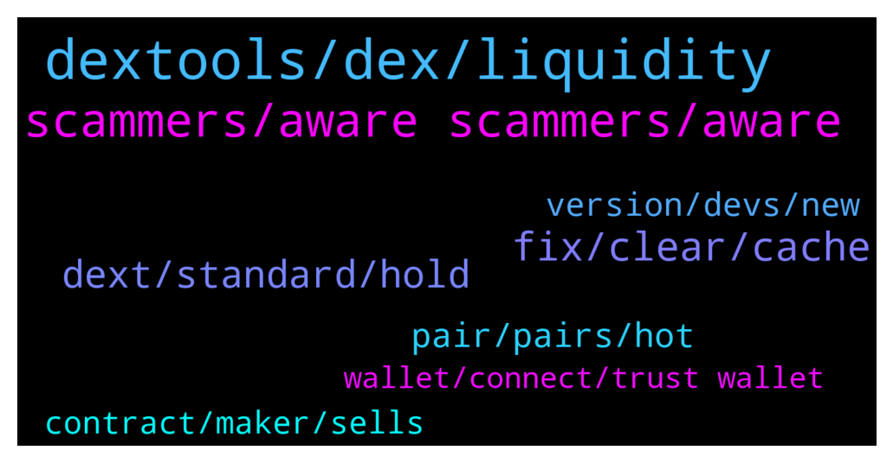

# **@DEXToolsCommunity**
 ## Analysis for **2022-01-08** - **2022-01-10**.

---

## 📊 **Basic Stats**

**n_messages_sent**: 330

---

---

## 🔝 **Top keywords and related messages**

1. **dextools, dex, liquidity**

    @Bantio Kuete --- *How to download the application I did not see the procedure in the application Aidé my please* **--->** [TG Discussion](https://t.me/DEXToolsCommunity/323786)

    @creatstep --- *Who should I dm to get promoted on dextools?* **--->** [TG Discussion](https://t.me/DEXToolsCommunity/323568)

    @chmmmnn --- *How long does it take for Bsc dext to show in the dextool dapp ,* **--->** [TG Discussion](https://t.me/DEXToolsCommunity/322963)

    @bonetky --- *But Dextools runs very well always, todays was an exception* **--->** [TG Discussion](https://t.me/DEXToolsCommunity/323268)

    @Dragonhunter9 --- *Hey  Can someone update bsc information on dextools: Contract: 0xe2ebe6e2358720e5baffecd8d06dd505dd4e898f* **--->** [TG Discussion](https://t.me/DEXToolsCommunity/323333)

    @Bladepool --- *Hello all, I made a mistake and send my dextools tokens to the contract.* **--->** [TG Discussion](https://t.me/DEXToolsCommunity/323187)

2. **scammers, aware scammers, aware**

    @stanes --- *Please DM @guillermorodriguez78 he is the person-in-charge.  Be aware of scammers, HE WILL NEVER DM YOU FIRST.* **--->** [TG Discussion](https://t.me/DEXToolsCommunity/323828)

    @CryptoCrumbs --- *Got a few dms now from a couple people.* **--->** [TG Discussion](https://t.me/DEXToolsCommunity/323757)

    @creatstep --- *Guys, there are so much scammers out there who trying to pretend you . My gosh 🤦‍♂️* **--->** [TG Discussion](https://t.me/DEXToolsCommunity/323599)

    @FredericDEXT --- *Dm @guillermorodriguez78 he is in charge of ads.* **--->** [TG Discussion](https://t.me/DEXToolsCommunity/323594)

    @duehzk_ndbb_Crejd --- *I’ve got heaps of admin messages* **--->** [TG Discussion](https://t.me/DEXToolsCommunity/323379)

    @creatstep --- *Could you check DM? I hope its not too late :)* **--->** [TG Discussion](https://t.me/DEXToolsCommunity/323593)

3. **fix, clear, cache**

    @bonetky --- *Okay, because does not load since a few hours. I can load the rest of webpages* **--->** [TG Discussion](https://t.me/DEXToolsCommunity/323246)

    @napascual --- *Nice, we're looking into that issue closely, we will be changing some cache policies soon to fix that* **--->** [TG Discussion](https://t.me/DEXToolsCommunity/323269)

    @bastardganpunk --- *you might need to clear your cache and try again. but the way you tried to do it is correct* **--->** [TG Discussion](https://t.me/DEXToolsCommunity/322894)

    @bonetky --- *Okay the solution was clear cookies and site data* **--->** [TG Discussion](https://t.me/DEXToolsCommunity/323249)

    @napascual --- *First try hard refreshing, no need to clear site data (we don't use cookies). Its usually requested to browsers ignoring web worker updates, thus not forcing a resources refresh* **--->** [TG Discussion](https://t.me/DEXToolsCommunity/323254)

    @AlexeiM84 --- *It’s a problem with mobile version or…?* **--->** [TG Discussion](https://t.me/DEXToolsCommunity/323520)

4. **dext, standard, hold**

    @AlinCZ --- *guys do i need to do something else beside holding more than 1k DEXT tokens in my wallet to get the benefits of the Standard tier?  because i have more than 1k in my wallet but i still have only 10 favorite pairs* **--->** [TG Discussion](https://t.me/DEXToolsCommunity/323316)

    @zhengshui1977 --- *I don't have to pay a monthly fee for holding 1000 dexts, does that mean? thanks* **--->** [TG Discussion](https://t.me/DEXToolsCommunity/323438)

    @zhengshui1977 --- *OK, thanks. This tool is pretty easy to use. If I only need to hold 1000, I am willing to buy it. I probably wouldn't consider it if it had to be paid monthly, thanks for the help* **--->** [TG Discussion](https://t.me/DEXToolsCommunity/323441)

    @wadon1 --- *Ok, but why should I pay for it?* **--->** [TG Discussion](https://t.me/DEXToolsCommunity/322881)

    @stanes --- *Hi. If you don't have 1k DEXT in your wallet you should have a message telling you how many DEXT you have to send to an address to activate the standard plan.* **--->** [TG Discussion](https://t.me/DEXToolsCommunity/322910)

    @zhengshui1977 --- *I already hold 1010 DEXT but I'm still on the free plan, what else do I need to do?* **--->** [TG Discussion](https://t.me/DEXToolsCommunity/323452)

5. **pair, pairs, hot**

    @napascual --- *Our bsc backend server has been restarted for maintenance and some pairs are updating* **--->** [TG Discussion](https://t.me/DEXToolsCommunity/323802)

    @rpoole69 --- *In general both desktop and mobile (without wifi), seems like all, but this one in particular /bsc/pair-explorer/0x4cb29498595a733c4b0d710e766bb89345ee945b* **--->** [TG Discussion](https://t.me/DEXToolsCommunity/323799)

    @rpoole69 --- *can you take a look at /app/bsc/pair-explorer/0x4cb29498595a733c4b0d710e766bb89345ee945b the chart is going but the transaction history isn't updating* **--->** [TG Discussion](https://t.me/DEXToolsCommunity/322911)

    @InFer_Dev --- *That’s not our coin but thanks for the response! Gotcha and I saw that you offer hot pairs I can read those! Hope to do Business soon!* **--->** [TG Discussion](https://t.me/DEXToolsCommunity/322704)

    @王多鱼 --- *It keeps coming up Pair not found* **--->** [TG Discussion](https://t.me/DEXToolsCommunity/323065)

    @FredericDEXT --- *Ok, brave, and it happens with every pair?* **--->** [TG Discussion](https://t.me/DEXToolsCommunity/323288)

6. **version, devs, new**

    @bastardganpunk --- *sure in incognito you can also try it* **--->** [TG Discussion](https://t.me/DEXToolsCommunity/322896)

    @cactusjimm --- *Hi, did the dev's come back on this one?* **--->** [TG Discussion](https://t.me/DEXToolsCommunity/323774)

    @z123456789zzn --- *How to switch the old version of the interface* **--->** [TG Discussion](https://t.me/DEXToolsCommunity/323807)

    @stanes --- *Which launchpad are you talking about? We never had any...* **--->** [TG Discussion](https://t.me/DEXToolsCommunity/323382)

    @bastardganpunk --- *The devs want to enable them in the next 2 weeks 🙂* **--->** [TG Discussion](https://t.me/DEXToolsCommunity/323778)

    @zhengshui1977 --- *Hope the dev team will push out an update, thanks* **--->** [TG Discussion](https://t.me/DEXToolsCommunity/323474)

7. **contract, maker, sells**

    @mr_tapity_tap --- *Contract is doing 3 sells. A wallet initiated the sell. But the router or liquidity pool for rewards token is listed as maker.* **--->** [TG Discussion](https://t.me/DEXToolsCommunity/323678)

    @mr_tapity_tap --- *Hi,  I see there are some issues reported with Maker already.  I'm with a project where almost all sells seems to have the same maker, and in this case it's the pool for the rewards tokens which gets extracted as maker. WBNB/BTCB.  Is it possible to take a look at this? Afaik it would be a common issue with all baby token clones. (Seen it in at least two that I've been involved with)  I might cause panic when investors think it's a whale selling.* **--->** [TG Discussion](https://t.me/DEXToolsCommunity/323663)

    @stanes --- *Same with this one, contract is doing 4 sells.* **--->** [TG Discussion](https://t.me/DEXToolsCommunity/323679)

    @stanes --- *Thanks, for so this one you can see that the contract is indeed doing 4 different sell for one tx.* **--->** [TG Discussion](https://t.me/DEXToolsCommunity/323676)

    @stanes --- *You first need to give the autorisation to the contract to spend your tokens.  You only need to approve it once for each token.* **--->** [TG Discussion](https://t.me/DEXToolsCommunity/322880)

    @stanes --- *Yes, you are correct about the maker, I will see with the devs. But about the number of tx I am not sure they can/should do something.* **--->** [TG Discussion](https://t.me/DEXToolsCommunity/323681)

