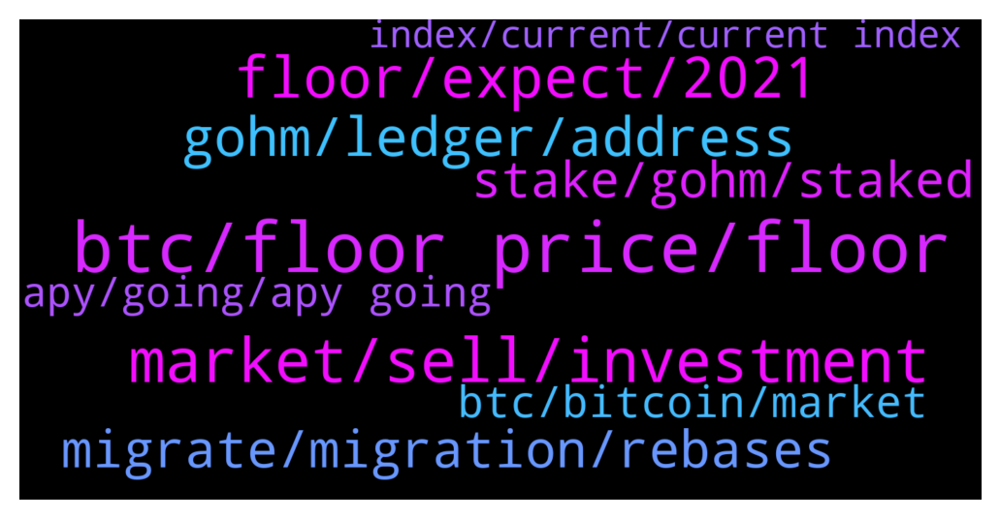

# **@OlympusTG**
 ## Analysis for **2022-01-09** - **2022-01-10**.

---

## 📊 **Basic Stats**

**n_messages_sent**: 537

---

---

## 🔝 **Top keywords and related messages**

1. **btc, floor price, floor**

    @mario_99990 --- *For example If btc raised by 40 %  Ohm will raise by 75%   Is it right or iam mistaken?* **--->** [TG Discussion](https://t.me/OlympusTG/145765)

    @Shane (4,4) (🍉,🍉) --- *OHM is down I think around 80% since November 1st....that is what bothers me* **--->** [TG Discussion](https://t.me/OlympusTG/145909)

    @Adam_H123 --- *Not really, I understood how ohm worked* **--->** [TG Discussion](https://t.me/OlympusTG/145004)

    @Shane (4,4) (🍉,🍉) --- *if you look at both from the beginning of november.....btc is down around 40% and Ohm around 75%* **--->** [TG Discussion](https://t.me/OlympusTG/145764)

    @mphilli --- *Who else bought ohm in early November 😢* **--->** [TG Discussion](https://t.me/OlympusTG/145907)

    @hootie1233 --- *so we need a bounce from ohm v2 to get this thing moving* **--->** [TG Discussion](https://t.me/OlympusTG/145236)

2. **market, sell, investment**

    @Eli --- *Good time to buy more ? Thanks sir* **--->** [TG Discussion](https://t.me/OlympusTG/145602)

    @onehundredsh0tz --- *Gonna have to sell my ass* **--->** [TG Discussion](https://t.me/OlympusTG/145107)

    @cdp279 --- *Only problem is we all probably kept buying the dips. Now we have nothing to but with* **--->** [TG Discussion](https://t.me/OlympusTG/145804)

    @Zhang --- *A lot of investors feel sad* **--->** [TG Discussion](https://t.me/OlympusTG/145520)

    @nfwaple --- *imagine coming here to complain when your investment is down, grow up bro* **--->** [TG Discussion](https://t.me/OlympusTG/145512)

    @picthtower --- *I will not passively wait for the rise or fall of the market. I like to watch news and judge the future trend of the market with some inside information, so as to earn income with the most stable and lowest risk. What I am doing now is passive income, with no risk and very stable* **--->** [TG Discussion](https://t.me/OlympusTG/144939)

3. **floor, expect, 2021**

    @xGod3 --- *Why those massive Price drops? I went all in when it was on 1.1k USD$* **--->** [TG Discussion](https://t.me/OlympusTG/145390)

    @nfwaple --- *buying at lower price is certainly better than buying at higher price though* **--->** [TG Discussion](https://t.me/OlympusTG/145604)

    @Zhang --- *No , I just to say why they don’t adopt some methods to stop the price descending.* **--->** [TG Discussion](https://t.me/OlympusTG/145513)

    @mario_99990 --- *Is price will fall more ?* **--->** [TG Discussion](https://t.me/OlympusTG/145049)

    @Zhang --- *But a lot of things have no effect on price* **--->** [TG Discussion](https://t.me/OlympusTG/145519)

    @CHOUChiehLUN --- *Why I saw the price decrease dramatically?* **--->** [TG Discussion](https://t.me/OlympusTG/145643)

4. **gohm, ledger, address**

    @Keshavlrk --- *Just One last. What will i get by buying gohm* **--->** [TG Discussion](https://t.me/OlympusTG/145302)

    @mario_99990 --- *What is ath of gohm ?* **--->** [TG Discussion](https://t.me/OlympusTG/145751)

    @Adam_H123 --- *I still don’t understand gOHM 🤣* **--->** [TG Discussion](https://t.me/OlympusTG/145000)

    @stacyd82d --- *You have to migrate your sohm to gohm* **--->** [TG Discussion](https://t.me/OlympusTG/145862)

    @Ryan --- *Which network will be most beneficial to hold my GOHM on while accumulating* **--->** [TG Discussion](https://t.me/OlympusTG/145159)

    @magona4 --- *I’m not able to export or even see sOHM holder addresses from dune, can someone help me? I’m ok with cpying the addresses or even pay for dune in order to export, but I could not find the holder addresses at all* **--->** [TG Discussion](https://t.me/OlympusTG/145090)

5. **migrate, migration, rebases**

    @rothschild1992 --- *What do we have to do for migration? I staked my ohm a whole back is there anything I need to do?* **--->** [TG Discussion](https://t.me/OlympusTG/145830)

    @Eli --- *Guys , do I have to migrate? Am happy just staking and chill* **--->** [TG Discussion](https://t.me/OlympusTG/145698)

    @nfwaple --- *you don't have to, but v1 has no liquidity now and you won't see your staking rewards till you migrate. Your missed rebases will be given to you at once when you migrate* **--->** [TG Discussion](https://t.me/OlympusTG/145699)

    @onehundredsh0tz --- *Can you claim all your rewards when you migrate to v2* **--->** [TG Discussion](https://t.me/OlympusTG/145096)

    @nfwaple --- *the webstite stake page should prompt you to migrate, if not there are some messages in pinned message about migration steps* **--->** [TG Discussion](https://t.me/OlympusTG/145831)

    @nfwaple --- *two steps though, approve, then migrate* **--->** [TG Discussion](https://t.me/OlympusTG/145705)

6. **stake, gohm, staked**

    @nfwaple --- *correct, holding gOHM is enough, no need to stake* **--->** [TG Discussion](https://t.me/OlympusTG/145296)

    @LiviuRt --- *Do i stake to recive Sohm or Gohm, i know nothing about gohm* **--->** [TG Discussion](https://t.me/OlympusTG/145309)

    @Keshavlrk --- *Gohm is already staked meaning? If i buy gohm i dont have to stake it anymore?* **--->** [TG Discussion](https://t.me/OlympusTG/145295)

    @cdp279 --- *You can’t stake gohm ser. It is auto staking.* **--->** [TG Discussion](https://t.me/OlympusTG/145036)

    @theMagicUnicorn --- *the actual website(https://www.olympusdao.finance/), not the staking page* **--->** [TG Discussion](https://t.me/OlympusTG/145552)

    @GableCoin --- *I was able to stake my gohm on website using avalanche network. But now when i go to stake more gohm it takes me off the stake page to the migration page?* **--->** [TG Discussion](https://t.me/OlympusTG/145034)

7. **btc, bitcoin, market**

    @Lily886 --- *When will the crypto market start to recover, it feels like Bitcoin will fall to 40,000😅* **--->** [TG Discussion](https://t.me/OlympusTG/145783)

    @Anipe11 --- *Inflation  is gradually killing the value of paper money buy crypto now😊, I wonder how it will look like in 2022..* **--->** [TG Discussion](https://t.me/OlympusTG/145582)

    @pedAn78 --- *Inflation  is gradually killing the value of paper money buy crypto now😊, I wonder how it will look like in 2022..* **--->** [TG Discussion](https://t.me/OlympusTG/145186)

    @xtechnologylimited --- *Its based on Bitcoin trend, just follow the charts* **--->** [TG Discussion](https://t.me/OlympusTG/145051)

    @xGod3 --- *Not here to fud just wanting to know why this pull back happend ? Bc. of Migration or bc. whole crypto just dropping R.n.* **--->** [TG Discussion](https://t.me/OlympusTG/145394)

    @picthtower --- *There are reasons for each decline. China has a high proportion of users in the cryptocurrency market. When the Chinese government announced that it would ban Chinese citizens from buying and trading cryptocurrencies, many people panicked and started to sell a large number of cryptocurrencies, which led to the turbulence of the cryptocurrency market for several months* **--->** [TG Discussion](https://t.me/OlympusTG/144923)

8. **apy, going, apy going**

    @Crypto --- *I was under the impression that as the Token price dropped you would be covered by the APY going up.   THAT DRASTICLY has not happened.  Did i miss something?* **--->** [TG Discussion](https://t.me/OlympusTG/145363)

    @Andr3w_1 --- *So with the new reward rate adjustment does anyone know what the approximate apy will be?* **--->** [TG Discussion](https://t.me/OlympusTG/145492)

    @cdp279 --- *Obviously bro. A coin Thats at its floor price with 1000% apy. No brainer* **--->** [TG Discussion](https://t.me/OlympusTG/145019)

    @Avishjn --- *i heard they are stopping to give apy at some point and its going down the coin is bieng migrated and blah blah?* **--->** [TG Discussion](https://t.me/OlympusTG/144931)

    @Franck --- *I don’t understand what we gain with lower APY? Could somebody explain to me. With actual scenario of price down , apy down , what is the benefits of that ?* **--->** [TG Discussion](https://t.me/OlympusTG/145465)

    @Marco --- *So basically the people that got in early can reap the rewards of a 7000% apy I see   The later investors will never see that* **--->** [TG Discussion](https://t.me/OlympusTG/145480)

