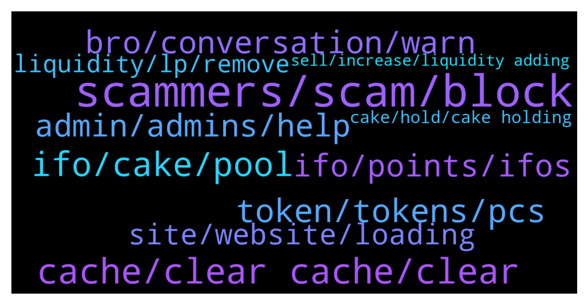

# **@PancakeSwap**
 ## Analysis for **2022-01-09** - **2022-01-10**.

---

## 📊 **Basic Stats**

**n_messages_sent**: 1067

---

---

## 🔝 **Top keywords and related messages**

1. **scammers, scam, block**

    @RangerApos --- *What’s the problem ask in this chat ignor all DMs they are scammers* **--->** [TG Discussion](https://t.me/PancakeSwap/2259527)

    @Ayb --- *The site was end by org i get scam i think 2 time 200 dollrs hhh thanks sir* **--->** [TG Discussion](https://t.me/PancakeSwap/2256999)

    @Slavi --- *Can someone help me with scam* **--->** [TG Discussion](https://t.me/PancakeSwap/2260624)

    @Tyz49 --- *didn't sound female, and asked it I bought cake, I said no, I was just reporting a scam and he hung up, so I blocked it* **--->** [TG Discussion](https://t.me/PancakeSwap/2257445)

    @Rush_lover --- *No, just block and report them.* **--->** [TG Discussion](https://t.me/PancakeSwap/2259757)

    @RangerApos --- *What’s the problem? Please ask in this chat ignor all DMs they are scammers* **--->** [TG Discussion](https://t.me/PancakeSwap/2261265)

2. **cache, clear cache, clear**

    @QV_zz --- *works fine, try clearing your cache/restarting* **--->** [TG Discussion](https://t.me/PancakeSwap/2260382)

    @_ --- *I did but nothing worked and i tried 2 diff devices :(* **--->** [TG Discussion](https://t.me/PancakeSwap/2261256)

    @Ceddi200 --- *Clear cache and cookies and try again* **--->** [TG Discussion](https://t.me/PancakeSwap/2259144)

    @w17843 --- *maybe you didnt clear your cache because im trying on multiple devices and in incognito mode* **--->** [TG Discussion](https://t.me/PancakeSwap/2261262)

    @QV_zz --- *You can delete and add the network again or accept the prompt when you visit the site* **--->** [TG Discussion](https://t.me/PancakeSwap/2259731)

    @🙂 --- *Thank u for ur advice Ill try asap* **--->** [TG Discussion](https://t.me/PancakeSwap/2257391)

3. **ifo, cake, pool**

    @kineticmass --- *My cake is still in the IFO pool. Do I need to unstake and re-stake for the new timer starting tomorrow?* **--->** [TG Discussion](https://t.me/PancakeSwap/2260650)

    @Frankjankjink --- *Chefs pls It's high time you make the requirements for IFO very strict, in order to reduce the number of participants. So that we can also have a meaningful IFO that is worth it.  1. Anyone without up to 1000points won't be able to participate in the IFO 2. You have to stake your cake for atleast 30days to be able to partake in the IFO 3. You must have atleast 3NFTs in your wallet to participate in the IFO. ETC.  These are samples on how to make the IFO strict. And It  definitely increase the price of cake* **--->** [TG Discussion](https://t.me/PancakeSwap/2260225)

    @Ceddi200 --- *Your cake tokens spent in IFO is your price to get the tokens of the IFO project   So you only get a refund of your unspent fund if there was an overflow plus ifo tokens* **--->** [TG Discussion](https://t.me/PancakeSwap/2260651)

    @TomorrowlandForLife --- *AUTO Pool = Get CAKE AUTO IFO Pool = Get CAKE + IFO Tickets* **--->** [TG Discussion](https://t.me/PancakeSwap/2260609)

    @kctrippy --- *If I have cake staked in the IFO pool can I still activate my account or do I need to unstake first?* **--->** [TG Discussion](https://t.me/PancakeSwap/2258555)

    @gp9997 --- *My avg balance is 100 cake   Can i unstake 5 cake from pool for commit in ifo??* **--->** [TG Discussion](https://t.me/PancakeSwap/2260661)

4. **token, tokens, pcs**

    @Chandana1437 --- *Just check if there is tax on that token. Ask the respective project team* **--->** [TG Discussion](https://t.me/PancakeSwap/2257238)

    @HAITIENLK --- *ask project of that token/ ask who told you buy that token bro.* **--->** [TG Discussion](https://t.me/PancakeSwap/2259966)

    @TomorrowlandForLife --- *ask on token's community... The token is not PCS's aosciated project* **--->** [TG Discussion](https://t.me/PancakeSwap/2258406)

    @Aosh1ma --- *ftm, metis, avax and matic is’nt bep20 tokens...* **--->** [TG Discussion](https://t.me/PancakeSwap/2256517)

    @alooosh662322 --- *Someone tell us about terk token* **--->** [TG Discussion](https://t.me/PancakeSwap/2257382)

    @TomorrowlandForLife --- *ask on token's community sir this is not related to PCS Probably you bought a rebase token* **--->** [TG Discussion](https://t.me/PancakeSwap/2257874)

5. **bro, conversation, warn**

    @CakeCompounder --- *Please bro. You have written this 3 or 4 times today.* **--->** [TG Discussion](https://t.me/PancakeSwap/2260959)

    @Ahlawat_AJ --- *I know, i message here to make everyone warn about it. I am not complaining to you.* **--->** [TG Discussion](https://t.me/PancakeSwap/2259354)

    @Aosh1ma --- *Warnin for protect you ser! read it please  https://t.me/PancakeSwap/2258593* **--->** [TG Discussion](https://t.me/PancakeSwap/2258598)

    @TomorrowlandForLife --- *I know you're not complainig We're just having a conversation* **--->** [TG Discussion](https://t.me/PancakeSwap/2259355)

    @roeerr --- *you mean the gif? its a joke!* **--->** [TG Discussion](https://t.me/PancakeSwap/2256417)

    @TomorrowlandForLife --- *Yes, I mean that...and it's not funny* **--->** [TG Discussion](https://t.me/PancakeSwap/2256419)

6. **admin, admins, help**

    @ninahaus --- *We always thank the users, especially who help the others!* **--->** [TG Discussion](https://t.me/PancakeSwap/2258922)

    @CryptoBDINC --- *Is there any admin available who is responsible for AMA proposal?* **--->** [TG Discussion](https://t.me/PancakeSwap/2256759)

    @Akanonu --- *how do I chat with  the admin the?* **--->** [TG Discussion](https://t.me/PancakeSwap/2257220)

    @Ceo --- *The Admin have retricted me from sending a media here* **--->** [TG Discussion](https://t.me/PancakeSwap/2259921)

    @CakeCompounder --- *And wasting time of the admins that reply to you thinking you are needing real Help 👍🏽* **--->** [TG Discussion](https://t.me/PancakeSwap/2260860)

    @CakeCompounder --- *Admins always try and help, but you have to meet us in the middle by doing so reading/research yourself. ❤️* **--->** [TG Discussion](https://t.me/PancakeSwap/2260692)

7. **ifo, points, ifos**

    @TNrafi2109 --- *Any specific date, the ifo end?* **--->** [TG Discussion](https://t.me/PancakeSwap/2260378)

    @Ashishsharma4 --- *I can't understand the article😭   I want to participate in ifo* **--->** [TG Discussion](https://t.me/PancakeSwap/2260579)

    @NuttyBDC --- *I can't understand the article😭   I want to participate in ifo   Is there any risk in the info pool or any loss of funds Admin please explain* **--->** [TG Discussion](https://t.me/PancakeSwap/2260644)

    @Ashishsharma4 --- *Is ifo profitable for me a small investor* **--->** [TG Discussion](https://t.me/PancakeSwap/2261464)

    @beeper2005 --- *Sure, provide at least three ways to gain 1k points rn, without participating in ifo* **--->** [TG Discussion](https://t.me/PancakeSwap/2260246)

    @kctrippy --- *Activate my Profile to take part in the IFO* **--->** [TG Discussion](https://t.me/PancakeSwap/2258566)

8. **site, website, loading**

    @BCventure --- *Is the website back on yet? It was down and I saw the announcement* **--->** [TG Discussion](https://t.me/PancakeSwap/2259287)

    @TomorrowlandForLife --- *the website is working ok now.  It was not hacked* **--->** [TG Discussion](https://t.me/PancakeSwap/2259130)

    @gugoguy --- *Please fix your web page. Each time I open my laptop the pcs site is frozen. Not even a refresh is working. Have to close whole tab and reopen again. Very bad user experience.* **--->** [TG Discussion](https://t.me/PancakeSwap/2261137)

    @ALIie1993 --- *Ok because i saw massage that website is down in several area...* **--->** [TG Discussion](https://t.me/PancakeSwap/2259132)

    @Dockters --- *play porn 4K vids no buffering btw, i think website is down* **--->** [TG Discussion](https://t.me/PancakeSwap/2258739)

    @Dockters --- *website down ? my internet is good* **--->** [TG Discussion](https://t.me/PancakeSwap/2258733)

9. **liquidity, lp, remove**

    @LORD REVAMP --- *We cannot remove liquidity? How come? Changed to WBNB and also changed slippage* **--->** [TG Discussion](https://t.me/PancakeSwap/2257625)

    @ManBlyat --- *fees so hight when i try remove my liquidity on write smart contract rounter pancakeswap* **--->** [TG Discussion](https://t.me/PancakeSwap/2258677)

    @Aosh1ma --- *because you can't remove your liquidity, please check your token contract first* **--->** [TG Discussion](https://t.me/PancakeSwap/2258698)

    @ManBlyat --- *i add liquidity with other pair, mean TOKEN A + TOKEN B Not Token A + WBNB* **--->** [TG Discussion](https://t.me/PancakeSwap/2258704)

    @Ceddi200 --- *If you’re a project that locked your liquidity in V1 via #UniCrypt (like Safemoon), you can now migrate it to V2!  Here’s how you do it: 🔐 https://docs.unicrypt.network/liquidity-lockers/migration-of-pancakeswap-liquidity-from-v1-to-v2  https://twitter.com/uncx_token/status/1395450651551965185?s=21* **--->** [TG Discussion](https://t.me/PancakeSwap/2260289)

    @LearningBean --- *Hi  Can anyone advice how to redeem chess-usdc LP ?  When i go to Trade / Liquidity, I do not see this pool shown : but clearly I have a chess-usdc position in the FARMS section* **--->** [TG Discussion](https://t.me/PancakeSwap/2258410)

10. **cake, hold, cake holding**

    @creeptogrinch --- *I will repeat. Cake was already down before this bears* **--->** [TG Discussion](https://t.me/PancakeSwap/2257323)

    @CLD_Callum --- *All my CAKE is in the pool so I'm chilling 😎* **--->** [TG Discussion](https://t.me/PancakeSwap/2258786)

    @crytsy --- *I can hold you cake, can you hold me?* **--->** [TG Discussion](https://t.me/PancakeSwap/2258296)

    @TOOLSCUBE --- *Cake is holding as a brave.. 👍👍👍👍👍😍😍😍😍😍* **--->** [TG Discussion](https://t.me/PancakeSwap/2261350)

    @SemperFi69 --- *woooo Cake holding the line beautifully!🦾🦾* **--->** [TG Discussion](https://t.me/PancakeSwap/2260723)

    @cubanacuba --- *very soon, am bullish about Cake!!* **--->** [TG Discussion](https://t.me/PancakeSwap/2257516)

