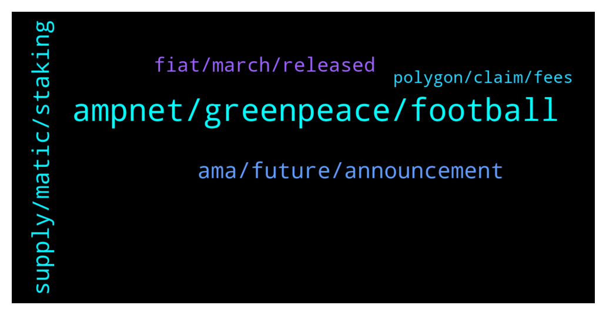

# **@ampnetapxchat**
 ## Analysis for **2022-01-05** - **2022-01-10**.

---

## 📊 **Basic Stats**

**n_messages_sent**: 169

---

---

## 🔝 **Top keywords and related messages**

1. **ampnet, greenpeace, football**

    @matejmz --- *I am wondering how you can become a main sponsor of a club with such a large following while being only a small start up with rather bad start. 🤔* **--->** [TG Discussion](https://t.me/ampnetapxchat/36078)

    @Bob_Fosse --- *That was basically a very long winded statement that reads, “ampnet did nothing wrong, it’s everyone else’s fault”. Just awful (and not surprising).* **--->** [TG Discussion](https://t.me/ampnetapxchat/36017)

    @AvanaLu --- *Hey mate, congrats. How easy is it for a football club to create their fan/loyalty token on AMPnet? I know many clubs are exploring possibilities.* **--->** [TG Discussion](https://t.me/ampnetapxchat/36397)

    @matejmz --- *It could be also e-sport 😅* **--->** [TG Discussion](https://t.me/ampnetapxchat/36098)

    @North --- *Thanks. Do you think there may be potential for AmpNet to do on an international stage what Chiliz is doing with professional football teams? Chiliz work with a lot of big clubs like Juventus, Atheltico Madrid etc. Their platform and token really took off from this* **--->** [TG Discussion](https://t.me/ampnetapxchat/36391)

    @mislavjavor --- *I agree, and the team finds ourselves more than accountable for things in and beyond our control. In the history of our company, there has never been an attitde of - “it must be somebody elses fault”. We should have acted sooner on red flags by Greenpeace, we should have moved on to Ethereum sooner, etc… Trust me when I say that we do not pat ourselves on the back saying “good job, it’s the fault of the clients”. On the other hand - it’s easy to look on things from hindsight - with all the extra information that hindsight provides.   The post was meant as an update to the community, that we are working hard, exploring new business models and new clients and that AAPX will be the token that’s backing these new developments.* **--->** [TG Discussion](https://t.me/ampnetapxchat/36027)

2. **supply, matic, staking**

    @<UNK> --- *This is due to the fact that AAPX unlocks linearly and sites like CMC or CoinGecko have "unlock date" which we cannot use, cuz appx is unlocking every moment instead of a set date  But anyone can check circ. supply/max supply here -  https://claim.ampnet.io/app/dist/index.html* **--->** [TG Discussion](https://t.me/ampnetapxchat/36149)

    @North --- *I really hope so. There are no details on how it benefits AAPX holders yet though which is unfortunate, but at least we have a great partner and some exposure now* **--->** [TG Discussion](https://t.me/ampnetapxchat/36339)

    @E_Don --- *We need more pairs on Matic. Eth gas fee is crazy  Matic/AAPX. Eth/AAPX* **--->** [TG Discussion](https://t.me/ampnetapxchat/36085)

    @<UNK> --- *Here is the aapx network address  https://polygonscan.com/token/0x3fc8bd9b0d8054cbdc174c4ed4b41a95d3c6a427* **--->** [TG Discussion](https://t.me/ampnetapxchat/36087)

    @scemodonore --- *guess aapx will benefit from buybacks but let's wait for the ama later* **--->** [TG Discussion](https://t.me/ampnetapxchat/36341)

    @whimofnature --- *having a large partner helps a lot of course, but crypto-space itself can be fund-raising .. even for fund-raising technologies. IMO the main problem what keeps people from looking at AAPX is that there is no circulating supply visible for the AAPX token. this causes the token to be ranked somewhere in the >10000 rank area. nobody looks at this. if there was a circ. supply information it would be immediately ranked lower, and people would look what the project is about. and then they would be fascinated, because everyone knows real estate / equities on blockchain is the future. and then they would buy AAPX.* **--->** [TG Discussion](https://t.me/ampnetapxchat/36136)

3. **ama, future, announcement**

    @matejmz --- *@IncogSen you might like this too 😆* **--->** [TG Discussion](https://t.me/ampnetapxchat/36219)

    @mislavjavor --- *Yes - details still being panned out, don’t want to rush with announcement* **--->** [TG Discussion](https://t.me/ampnetapxchat/36388)

    @bazzie123 --- *Ok so you failed basically everywhere* **--->** [TG Discussion](https://t.me/ampnetapxchat/36233)

    @BryanRA1 --- *Same, been sleeping outside the lambo dealership watching CMC* **--->** [TG Discussion](https://t.me/ampnetapxchat/36271)

    @Humb3rto_ON_tECh --- *Thanks for the update boss now we need stacking* **--->** [TG Discussion](https://t.me/ampnetapxchat/35997)

    @Nic_Klose --- *Thanks, very interesting read. Also thanks for the openess about failures and your resilience in light of the obstacle/disappointments* **--->** [TG Discussion](https://t.me/ampnetapxchat/36008)

4. **fiat, march, released**

    @PFCBLic --- *Can we put final date and final ammount of released tokens? Mcap wont be correct but it is better than nothing* **--->** [TG Discussion](https://t.me/ampnetapxchat/36153)

    @Hydayashi --- *Will the foobal token be sold for crypto or only for fiat? it doesnt say anywhere...* **--->** [TG Discussion](https://t.me/ampnetapxchat/36382)

    @MarcusVieiraCosta --- *will there be the promised tokens for us that made the cryptobond with Sync?* **--->** [TG Discussion](https://t.me/ampnetapxchat/36114)

    @matejmz --- *How many tokens are going to be sold during this ICO? I only found total supply info.* **--->** [TG Discussion](https://t.me/ampnetapxchat/36373)

    @North --- *That answers partially, thanks. And the fees from VATRENI are collected on each token transaction or some other way?* **--->** [TG Discussion](https://t.me/ampnetapxchat/36384)

    @matejmz --- *Is this token first of its kind in region?* **--->** [TG Discussion](https://t.me/ampnetapxchat/36389)

5. **polygon, claim, fees**

    @<UNK> --- *Sorry that was automatic, use this link to claim tokens 😅 https://claim.ampnet.io/app/dist/index.html* **--->** [TG Discussion](https://t.me/ampnetapxchat/36172)

    @<UNK> --- *You just need to provide transaction hash and you'll be compensated   https://docs.google.com/forms/d/e/1FAIpQLSf4GCX62RAfb0oZvGNPzNynTdHFlvoIw9KZqA0o1VOkEwG_Kw/viewform* **--->** [TG Discussion](https://t.me/ampnetapxchat/36040)

    @mislavjavor --- *Agreed, for low fees at this time, though - I can recommend the Polygon network* **--->** [TG Discussion](https://t.me/ampnetapxchat/36387)

    @BlinkmothNexus --- *Yeah I know this page. My question was If I can claim with polygon network, not eth mainnet* **--->** [TG Discussion](https://t.me/ampnetapxchat/36173)

    @TL170x --- *You kinda answered to this already, but I'd like to recommend atleast some CEX since ETH is congested all the time. I understand that something like Kucoin is now "pointless" until there is enough progression from this "new start", but there is some smaller CEXes like MEXC or AscendEX where you can get listed quite easily and can have decent userbase & volume* **--->** [TG Discussion](https://t.me/ampnetapxchat/36383)

    @BlinkmothNexus --- *Sorry but how does the polygon adresse helps me to claim my presale token?* **--->** [TG Discussion](https://t.me/ampnetapxchat/36171)

