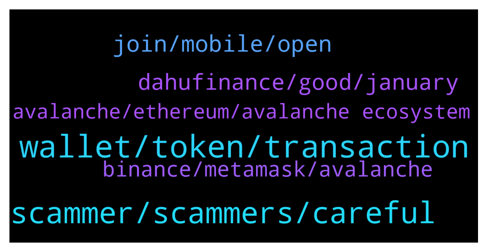

# **@avalancheavax**
 ## Analysis for **2022-01-09** - **2022-01-10**.

---

## 📊 **Basic Stats**

**n_messages_sent**: 152

---

---

## 🔝 **Top keywords and related messages**

1. **wallet, token, transaction**

    @Morei --- *when will AVAX MOOOOOONNNNN ? WHY THE PRICE IS SO BAD* **--->** [TG Discussion](https://t.me/avalancheavax/320986)

    @CRinvF --- *Hey, im new to Avax. What is the best/ cheapest way to get liquidity to the avax chain? I could bridge from erc, bsc or Polygon* **--->** [TG Discussion](https://t.me/avalancheavax/321206)

    @BinanceApe --- *If you interact with Ava native bridge ETH fee is minimized incase you can’t find a simple Route* **--->** [TG Discussion](https://t.me/avalancheavax/321059)

    @John --- *Hi, I understand the transaction fees are quite low for now in avax. But in gaming, we will have to making lots of micro transaction, which will add up to quite alot. How is avax going to solve this issues. Of cos there are chains that are fractions of a cent in transaction fees, thus making them more attractive for gamin dapps. How's avax going to solve this issue?* **--->** [TG Discussion](https://t.me/avalancheavax/321052)

    @georgebour --- *Hi noob question. Where to stake my 150 avax? I saw 17% apr on nexo. Worth it?* **--->** [TG Discussion](https://t.me/avalancheavax/321442)

    @agnuscastus48 --- *Hi everyone ! Transaction fees spent in the avax ecosystem are burned. For this reason, would the price of avax increase too much in the long run with many people using it? And would the new transaction fees be too expensive? so will it end up like eth?* **--->** [TG Discussion](https://t.me/avalancheavax/321190)

2. **scammer, scammers, careful**

    @sonicblend --- *Best to use the website / app support. Too many scammers around.* **--->** [TG Discussion](https://t.me/avalancheavax/321035)

    @BigRed --- *Is there usually this much scam and spam in this group?* **--->** [TG Discussion](https://t.me/avalancheavax/321108)

    @oathtobarbatos --- *Yup. Be careful with anyone's DM. Administrators won't ask you for money.* **--->** [TG Discussion](https://t.me/avalancheavax/321040)

    @jazavax --- *Scammer guy. Number 1 bullshit guy* **--->** [TG Discussion](https://t.me/avalancheavax/321424)

    @Deeski --- *How are we going to know those scams* **--->** [TG Discussion](https://t.me/avalancheavax/321123)

    @daboia1 --- *Oh ya, at least 10 scammers messaged me just now to "help me" 😂🤣😭* **--->** [TG Discussion](https://t.me/avalancheavax/321042)

3. **join, mobile, open**

    @wanderellaco --- *but PC works too. The official invite link doesn't work for me* **--->** [TG Discussion](https://t.me/avalancheavax/321250)

    @wanderellaco --- *my account is 2 yr old. and it doesn't have any of the ban words* **--->** [TG Discussion](https://t.me/avalancheavax/321264)

    @daboia1 --- *Thank you, I just submitted a ticket* **--->** [TG Discussion](https://t.me/avalancheavax/321039)

    @wanderellaco --- *The official invite link says “invalid or expired”* **--->** [TG Discussion](https://t.me/avalancheavax/321243)

    @smtrmn --- *Solved dude thanks. Worked on mobile. So weird not open on chrome desktop but can open on mobile 😅* **--->** [TG Discussion](https://t.me/avalancheavax/321203)

    @smtrmn --- *Worked on mobile. So weird not open on chrome desktop but can open on mobile 😅* **--->** [TG Discussion](https://t.me/avalancheavax/321180)

4. **dahufinance, good, january**

    @kingston520 --- *Hello, everyone. Does anyone have any good projects that you can recommend?* **--->** [TG Discussion](https://t.me/avalancheavax/321356)

    @Nicolas_A --- *Not sure there is something similar out there* **--->** [TG Discussion](https://t.me/avalancheavax/321172)

    @John --- *Like a layer 2? In avax?* **--->** [TG Discussion](https://t.me/avalancheavax/321054)

    @Yekscrypto --- *DahuFinance / dyor. launch will be in january* **--->** [TG Discussion](https://t.me/avalancheavax/321368)

    @daleetguy --- *I got here the recommendation of DahuFinance and it seems good. Team is really active* **--->** [TG Discussion](https://t.me/avalancheavax/321367)

    @HellenicAng3 --- *I would expect interesting things to happen once subnets are launched.* **--->** [TG Discussion](https://t.me/avalancheavax/321021)

5. **binance, metamask, avalanche**

    @daboia1 --- *Hello, I accidentally sent some usdc.e from my metamask wallet to my AVAX c-chain Kucoin wallet  Is there any way to get it back?  Any help would be appreciated (and scammers DO NOT dm me, asking for my seed phrase, or to connect my wallet)* **--->** [TG Discussion](https://t.me/avalancheavax/321028)

    @tibgram --- *Hello do you know if binance will support usdc.e?* **--->** [TG Discussion](https://t.me/avalancheavax/321390)

    @michaelzogot --- *Hello folks, It will be great to have some help from Avalanche experts here. I have a following problem: I have sent AVAX from binance to my Metamask wallet. But I have done that to the Avalanche FUJI C-Chain. Is it possible to get them back to the mainnet? Thanks in advice for any hint.* **--->** [TG Discussion](https://t.me/avalancheavax/321314)

    @Nicolas_A --- *There is no direct stablecoin withdrawal from Binance to Avalanche at the moment if I'm not mistaken* **--->** [TG Discussion](https://t.me/avalancheavax/321010)

    @Nicolas_A --- *Need to withdraw to Polygon / BSC and then bridge the stable to Avalanche through Synapse protocol / Celer Network* **--->** [TG Discussion](https://t.me/avalancheavax/321009)

    @januszbtc --- *I want to send stablecoin from binance to metamask on avax network* **--->** [TG Discussion](https://t.me/avalancheavax/321008)

6. **avalanche, ethereum, avalanche ecosystem**

    @Andy_oi1 --- *What's the average processing time for an ethereum token to be deployed on Avalanche? @don_wonton @Nicolilas_A  Seeing as Avalanche controls the bridge* **--->** [TG Discussion](https://t.me/avalancheavax/321228)

    @Andy_oi1 --- *Not that. I mean if there's a project on Ethereum, and you want to get it listed on Avalanche, you need the bridge and whitelisting from the Avalanche team because you guys control that process. How long does that usually take?* **--->** [TG Discussion](https://t.me/avalancheavax/321230)

    @wanderellaco --- *lol so many fake avalanche mods just messaged me* **--->** [TG Discussion](https://t.me/avalancheavax/321254)

    @oathtobarbatos --- *The Ethereum transaction should take 10 - 15 minutes. The Avalanche transaction takes a few seconds* **--->** [TG Discussion](https://t.me/avalancheavax/321229)

    @oathtobarbatos --- *Have you joined the Avalanche discord server before?* **--->** [TG Discussion](https://t.me/avalancheavax/321265)

    @oathtobarbatos --- *It cannot have any name of the Avalanche's employees by the way* **--->** [TG Discussion](https://t.me/avalancheavax/321266)

