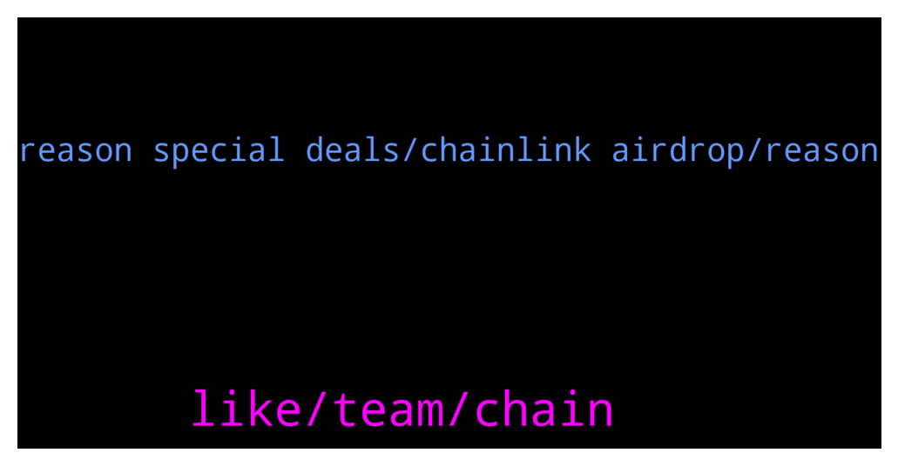

# **@chainlinkofficial**
 ## Analysis for **2022-01-09** - **2022-01-10**.

---

## 📊 **Basic Stats**

**n_messages_sent**: 40

---

---

## 🔝 **Top keywords and related messages**

1. **like, team, chain**

    @lijia2022 --- *Does Chain link can be support others chain,expect ETH* **--->** [TG Discussion](https://t.me/chainlinkofficial/361888)

    @gigachadmuska --- *What does Chainlink team think about all the memes? serious question :D* **--->** [TG Discussion](https://t.me/chainlinkofficial/361693)

    @marchello --- *guys, one question - is there already any project who uses Chainlink to verify the value in real time of receivables from the real world? To use this as tokenized collateral for example for a liquidity pool/provider?* **--->** [TG Discussion](https://t.me/chainlinkofficial/361707)

    @r0derik --- *hi all, I'm trying to have a local setup for a contract that uses a chainlink price oracle. I can make it work using hardhat mainnet forking. But at the same time I want to have blocks to automine every 2 seconds, for The Graph integrations. Those two conflict. I would like to try my contract without mainnet forking. But i would need to check some way in my contract if the pricefeed address is not a contract, to use a fixed value. Any idea how I can set this up?* **--->** [TG Discussion](https://t.me/chainlinkofficial/362261)

    @Zaynab --- *I have a suggestion regarding establishing an Arabic group for $Chainlink  With whom do I communicate?* **--->** [TG Discussion](https://t.me/chainlinkofficial/361819)

    @prince99721 --- *Hey!  I am a dev looking to use Chainlink vrf. I am looking at the docs and the major chains are showing like fantom, arbitrum, harmony, etc   Will chainlink vrf work on Métis ?* **--->** [TG Discussion](https://t.me/chainlinkofficial/362334)

2. **reason special deals, chainlink airdrop, reason**

    @nicoleadams11 --- *I need help with coins to buy* **--->** [TG Discussion](https://t.me/chainlinkofficial/361971)

    @Crypto --- *I need help with my Bitwire App* **--->** [TG Discussion](https://t.me/chainlinkofficial/361917)

    @r0derik --- *lol, so many scammer bots in here 😉 you can stop calling and messaging me, not going to pick up...* **--->** [TG Discussion](https://t.me/chainlinkofficial/362271)

    @marcromeron --- *Welcome new members to the Official Chainlink Telegram Community!  Please review the pinned post for our community rules and resources.   Be aware that price/trading discussion is strictly prohibited.  New to Chainlink? Check out these resources:  - What is Chainlink? - Chainlink 2.0 Whitepaper Overview - The Community Factsheet - Explicit Staking in Chainlink 2.0  - 77 Smart Contract Use Cases Enabled By Chainlink  - The Ultimate Chainlink Deep Dive: Completing The God Protocols: A Comprehensive Overview of Chainlink in 2021   ‼️Remember: We will not PM you first. We will never ask for your passwords, keys, or funds for any reason. We don’t have special deals to offer you and there is not now nor will there ever be a Chainlink airdrop. See this article to learn how to avoid the most common scams.* **--->** [TG Discussion](https://t.me/chainlinkofficial/362233)

    @marcromeron --- *No price/market discussion is allowed here. Please read the pinned message for more info and rules. Be aware of scammers.* **--->** [TG Discussion](https://t.me/chainlinkofficial/361980)

    @Sylvarantt --- *Feel free to share what do you need help with here. Don't trust anyone DM'ing you since they might be scammers and admin impersonators* **--->** [TG Discussion](https://t.me/chainlinkofficial/361925)

