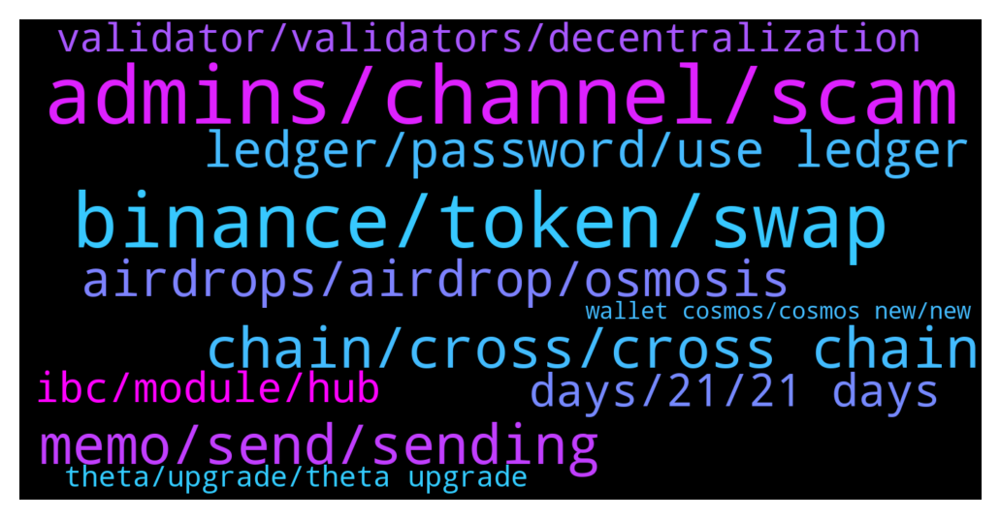

# **@cosmosproject**
 ## Analysis for **2022-01-09** - **2022-01-10**.

---

## 📊 **Basic Stats**

**n_messages_sent**: 238

---

---

## 🔝 **Top keywords and related messages**

1. **admins, channel, scam**

    @Cordtus --- *also before i forget ignore all dms you get on this app they are all scam bots. they will come crawling out of the woodwork because of this conversation lol* **--->** [TG Discussion](https://t.me/cosmosproject/470986)

    @hbf000 --- *All launchpad on any l1 are 100% scams* **--->** [TG Discussion](https://t.me/cosmosproject/471108)

    @JLiBercrypto --- *Please @zakimanian can you unban me on https://t.me/getsomm official Sommelier community ? and please check my dm when you can 🙏* **--->** [TG Discussion](https://t.me/cosmosproject/471503)

    @JLiBercrypto --- *Hi @jackzampolin can you check my dm please? when you can... 🙏* **--->** [TG Discussion](https://t.me/cosmosproject/471490)

    @shinepaul --- *🙏  @AtomJazz I will try my luck there* **--->** [TG Discussion](https://t.me/cosmosproject/471282)

    @badcapitan02 --- *😂😂 i am iranian  so my english speaking is not well* **--->** [TG Discussion](https://t.me/cosmosproject/471306)

2. **binance, token, swap**

    @hopehill_15 --- *Yes, the interoperability and growth of the ecosystem is great. But what about the usecase and token economy of ATOM? - also good?* **--->** [TG Discussion](https://t.me/cosmosproject/470931)

    @AtomJazz --- *Atom doesn't have max supply defined. It uses dynamic inflation model to keep high staking %* **--->** [TG Discussion](https://t.me/cosmosproject/470922)

    @edoboi --- *How about if I want to stake ATOM?* **--->** [TG Discussion](https://t.me/cosmosproject/471198)

    @RedPill --- *I wanted to set up an account so I can invest in ethereum and atom is it required to register in either coinbase or Binance for withdrawals for example?* **--->** [TG Discussion](https://t.me/cosmosproject/471837)

    @rMalakaib --- *Finding ATOM's true value - Ending discourse on ATOM value accrual - Fundamental Analysis  YouTube: https://youtu.be/z661r9XzVQo Document: https://docsend.com/view/683z3s53wubmzxdi  Welcome to the Elitists!   These Papers will discuss why and how ATOM and the Cosmos Blockchain extract value from the Cosmos Ecosystem.  Enjoy!* **--->** [TG Discussion](https://t.me/cosmosproject/471521)

    @valetramo --- *There is an exchange for trade crypto on atom chain ?* **--->** [TG Discussion](https://t.me/cosmosproject/471339)

3. **chain, cross, cross chain**

    @typerati --- *my friends been asking me if Vit eth tweet about multichain may be away/near from cosmos vision. What should I say in reply. I didnt have an idea. I only said tendermint's statements are more to me now than vit* **--->** [TG Discussion](https://t.me/cosmosproject/471423)

    @Phantasma Punks --- *Is there an nft place for cosmos.* **--->** [TG Discussion](https://t.me/cosmosproject/471546)

    @AtomJazz --- *Hehe, I don't know where you heard that but it's definitely wrong. Cosmos is creating tons of value and it's already the second biggest ecosystem in crypto. Growth in 2022 will be beyond anyone's imagination* **--->** [TG Discussion](https://t.me/cosmosproject/470928)

    @AtomJazz --- *Wdym exactly? I'd start my cosmos journey with https://medium.com/chainapsis/how-to-use-keplr-wallet-40afc80907f6?source=user_profile---------0----------------------------* **--->** [TG Discussion](https://t.me/cosmosproject/471324)

    @TicoJohnny --- *Pretty much, unless it’s built with Cosmos tech, it’s generally not a good signal. There have been a few projects that have moved from older tech, like Sentinel and BitCanna for example. But “launchpad, baby, or safe” and built on BSC or as an ERC-20 are pretty good signals that it isn’t super legit. There are a ton of tools and resources to make a chain in the Cosmos, documentation for days, and with Starport and Juno and many other Smart Contract methods like Archway and Agoric coming up, there is literally almost no excuse to make a “Cosmos platform” that isn’t built with Cosmos tech.* **--->** [TG Discussion](https://t.me/cosmosproject/471121)

    @AtomJazz --- *Cosmos is a decentralized network. Doubt such thing or position in Cosmos exists 😁* **--->** [TG Discussion](https://t.me/cosmosproject/471207)

4. **memo, send, sending**

    @FredericoPletz --- *Hi, I would like to withdrawn atom from binance to the keplr wallet, but binance requests the MEMO. What should I fill in?* **--->** [TG Discussion](https://t.me/cosmosproject/471524)

    @AtomJazz --- *You only need memo when you're transferring ATOMs to centralized exchanges* **--->** [TG Discussion](https://t.me/cosmosproject/471287)

    @Silky --- *Hey Guys, got a q, I want to withdraw my $Atom from Gate.io to Keplr Wallet and then pool at Sifchain. Do I need a ‘memo’?😊* **--->** [TG Discussion](https://t.me/cosmosproject/471660)

    @nqt416 --- *You don't need a memo for sending atom to kepler.   When in doubt always send a small test transaction* **--->** [TG Discussion](https://t.me/cosmosproject/471722)

    @Cordtus --- *No memo is only for sending to centralized exchanges* **--->** [TG Discussion](https://t.me/cosmosproject/471662)

    @mathieumae --- *Only use a memo when sending to an exchange* **--->** [TG Discussion](https://t.me/cosmosproject/471533)

5. **airdrops, airdrop, osmosis**

    @JCFishing --- *I just realized I can delegate directly from my ledger live.  Will I still qualify for future airdrops?  will research how to get them.  Do I need to save some atom for fees?* **--->** [TG Discussion](https://t.me/cosmosproject/471556)

    @AtomJazz --- *Every airdrop is different, but in some recent airdrops 0% commission validators have been excluded correct. You'll find all details regarding airdrops in https://t.me/CosmosAirdrops* **--->** [TG Discussion](https://t.me/cosmosproject/471786)

    @Cordtus --- *You will get the airdrop as long as you are eligible as per the check tool but you won't be able to see it unless you use an ibc compatible wallet - keplr and cosmostation are the only 2 currently.  Oh also its not currently available to claim anyway.* **--->** [TG Discussion](https://t.me/cosmosproject/471510)

    @richwxx --- *I have a question, I pledged my atom here, will I get an airdrop in the future? Some people say that nodes with 0 commission cannot be pledged. Is it true?* **--->** [TG Discussion](https://t.me/cosmosproject/471783)

    @Mhrdd --- *What has staking got to do with airdrops?* **--->** [TG Discussion](https://t.me/cosmosproject/471299)

    @Tony77600 --- *Hello, I have a Citadel account where I stack my Atom on it. I received an AirDrop (Shade) which I cannot claim at the moment. I would like to know if I must create a Kepler account to receive these AirDrop or if I can receive them on my cytadel account. And if so, how my question is long sorry but I will not want to miss these AirDrop. Thank you for your reply.* **--->** [TG Discussion](https://t.me/cosmosproject/471509)

6. **ledger, password, use ledger**

    @mill189 --- *@AtomJazz , i have atom staked on my local keplr wallet. Can i migrate them to ledger kepler wallet without unstaki g them ?* **--->** [TG Discussion](https://t.me/cosmosproject/471896)

    @NegoMalter --- *It's a wallet login. Like metamask. After that you use the ledger for all transactions* **--->** [TG Discussion](https://t.me/cosmosproject/471572)

    @JCFishing --- *I tried to connect my ledger to kepler but it asked me to setup new username and password.  From my experience, I don't need to enter these info if using ledger.  thanks!* **--->** [TG Discussion](https://t.me/cosmosproject/471561)

    @TicoJohnny --- *Well the instance on Keplr is connected to Ledger but you do have to create a "new" wallet on Keplr. Maybe this article will help: https://medium.com/chainapsis/how-to-use-ledger-nano-hardware-wallet-with-keplr-9ea7f07826c2* **--->** [TG Discussion](https://t.me/cosmosproject/471564)

    @Graphicals --- *question, out of all the hardware wallets, would ledger be one of the better if jot the best option out there for both the price and security?* **--->** [TG Discussion](https://t.me/cosmosproject/471562)

    @Graphicals --- *imma cop that Ledger backup bundle pack no cap* **--->** [TG Discussion](https://t.me/cosmosproject/471622)

7. **days, 21, 21 days**

    @Allexcs776 --- *But there's no limit to how many times can I do that, right? If I wanted to redelegate every month, for example.. (I'll not do that just for me to know 😄)* **--->** [TG Discussion](https://t.me/cosmosproject/471592)

    @Cordtus --- *Very very limited as in 'everstake only' lol* **--->** [TG Discussion](https://t.me/cosmosproject/471501)

    @Checkisp --- *or i need to wait 21 days?* **--->** [TG Discussion](https://t.me/cosmosproject/471228)

    @Jah --- *Is there 28 days unbonding after unstaking in Keplr wallet?* **--->** [TG Discussion](https://t.me/cosmosproject/471342)

    @angusmclachlan --- *Correct, the unbonding/unstaking period is ~21 days once you lock any amount up* **--->** [TG Discussion](https://t.me/cosmosproject/471230)

    @TicoJohnny --- *There’s no limit, just once every 21 days* **--->** [TG Discussion](https://t.me/cosmosproject/471597)

8. **ibc, module, hub**

    @AtomJazz --- *No IBC functionalities, limited validator set, no governance* **--->** [TG Discussion](https://t.me/cosmosproject/471493)

    @Cordtus --- *you can buy from dex or cex, and send to keplr or cosmostation they are the recommended ibc wallets. that will have all the staking/voting/ibc features for the different networks here* **--->** [TG Discussion](https://t.me/cosmosproject/470982)

    @Cordtus --- *No keplr is for ibc tokens in this system only so far.   For staking generally don't pick a centralized exchange or a 100% or 0% commission validator. It's wise to split your stake amongst a few also. It's also suggested to stay away from the top bunch just to maintain decentralization.  Many validators are present and active on these tg channels too, and if you want more detailed stats you can see them all on mintscan.io for nearly all IBC chains. Some (like Terra) have their own block explorer.  Unstaking there is a wait period during which you do not receive rewards. Unlock period ranges per network I've seen anywhere from 8 to 28 days. Redelegating existing stake to a different validator is instant but can only be done once per (however long the unlock period on that network is).   And last but not least 99.9% of DMs on telegram are scam bots. There are also full blown scam groups. Be aware of that.* **--->** [TG Discussion](https://t.me/cosmosproject/471551)

    @AtomJazz --- *Chains have to upgrade to IBC manually. There's no forcing them or whatever.* **--->** [TG Discussion](https://t.me/cosmosproject/471874)

    @AtomJazz --- *Theta Upgrade (expected Q1 2022) Cosmos SDK v0.45 Groups module: Enables higher-level multisig permissioned accounts, e.g., weight-based voting policies Meta-Transactions Allows transactions to be submitted by separate accounts that receive tips. Gov Module Improvements Execution of arbitraty transactions instead of just governance proposals. Enables much more expressive governance module. NFT module Enable simple management of NFT identifiers, their owners, and associated data, such as URIs, content, and provenance An extensible base module for extensions including collectibles, custody, provenance, and marketplaces Tendermint v0.35 Interchain accounts A requirement in order to manage accounts across multiple blockchains Aims to provide locking/unlocking mechanisms across IBC-enabled blockchains Would allow custody providers to service any IBC connected blockchain through a common interface on the Hub. Liquid Staking Frees secure and low-risk delegations for use in other parts of the Cosmos ecosystem Features include enabling transfer of rewards and voting rights Items still being discussed: Governance permissioned CosmWASM instance on the hub Cosmos <> Ethereum Gravity Bridge Transfer ATOM, ETH, ERC-20, and tokens on the Cosmos Hub between Ethereum- and Cosmos-compatible chains Fee and reward model hosted across Cosmos and Ethereum Adds light-weight infrastructure and operational requirements with minimal slashing conditions to all Hub validators Budget Module Inflation funding directed to arbitrary module and account addresses Farming Module Rewards for locked tokens, especially LP tokens for different trading pair pools* **--->** [TG Discussion](https://t.me/cosmosproject/471377)

    @Kryptoswe --- *Research interchain staking and IBC routing.* **--->** [TG Discussion](https://t.me/cosmosproject/470934)

9. **validator, validators, decentralization**

    @ZoltanAtom --- *Make sure you avoid exchange validators! Other than that...The best validator is always subjective, here are some factors that might help:   - Commission Rate:  This is the % of earned rewards that go to the validator. Not the % of your total stake, just to eliminate that confusion.   - Self-Bonded rate:  This is the % of bonded ATOM that belong to the validator. Think of this as their skin in the game.   - Decentralization:  Choosing the smaller validators helps to decentralize the network which improves security overall. Again, decentralization should be a priority. On this point, centralized exchanges are not the best choice as they don't really support the network at all.   You can learn more about each validator in their profiles on the wallets and explorers.  The 8-10% is almost for everyone, feel free to use this reward calculator  https://www.stakingrewards.com/earn/cosmos  Commissions can be changed anytime so keep an eye on your validator via telegram or twitter* **--->** [TG Discussion](https://t.me/cosmosproject/471415)

    @GoldenRain9 --- *Well it's a top validator so what do you think lol* **--->** [TG Discussion](https://t.me/cosmosproject/471586)

    @GoldenRain9 --- *You want to help decentralize the staking % so one validator doesn't get too much control, am I wrong?* **--->** [TG Discussion](https://t.me/cosmosproject/471588)

    @marcolinux46 --- *hi, how can i choose a very good validator?* **--->** [TG Discussion](https://t.me/cosmosproject/471410)

    @AtomJazz --- *Make sure you avoid exchange validators! Other than that...The best validator is always subjective, here are some factors that might help:   - Commission Rate:  This is the % of earned rewards that go to the validator. Not the % of your total stake, just to eliminate that confusion.   - Self-Bonded rate:  This is the % of bonded ATOM that belong to the validator. Think of this as their skin in the game.   - Decentralization:  Choosing the smaller validators helps to decentralize the network which improves security overall. Again, decentralization should be a priority. On this point, centralized exchanges are not the best choice as they don't really support the network at all.   You can learn more about each validator in their profiles on the wallets and explorers.  The 8-10% is almost for everyone, feel free to use this reward calculator  https://www.stakingrewards.com/earn/cosmos  Commissions can be changed anytime so keep an eye on your validator via telegram or twitter* **--->** [TG Discussion](https://t.me/cosmosproject/471279)

    @TicoJohnny --- *SG1 is good, but consider putting some in lower validators to improve decentralization* **--->** [TG Discussion](https://t.me/cosmosproject/471590)

10. **theta, upgrade, theta upgrade**

    @AtomJazz --- *Theta upgrade is coming in February most likely. This month is Evmos, Umee, Shade protocol launch and Kava joining IBC* **--->** [TG Discussion](https://t.me/cosmosproject/471236)

    @cryptodavG --- *I saw theta upgrade will be around 31march* **--->** [TG Discussion](https://t.me/cosmosproject/471371)

    @cryptodavG --- *Cosmos Theta Upgrade will *potentially* enable: 1. Meta-transactions 2. NFT modules 3. Interchain accounts 4. Liquid staking 5. CosmWASM instance on the Hub 6. Upgrades to Gravity Bridge* **--->** [TG Discussion](https://t.me/cosmosproject/471375)

    @Mordrew --- *Carbon (SWTH) mainnet - Stargate upgrade goes live Jan 11.  Non-KYC DEX with spot trading and futures.  #IBCGangFTW* **--->** [TG Discussion](https://t.me/cosmosproject/471678)

    @TicoJohnny --- *We've got Pylons in the works, Iris' Uptick is in Beta and Stargaze coming up as well.* **--->** [TG Discussion](https://t.me/cosmosproject/471553)

    @catdotfish --- *The mobile version is new so they prefer testing everything before adding new networks* **--->** [TG Discussion](https://t.me/cosmosproject/471064)

