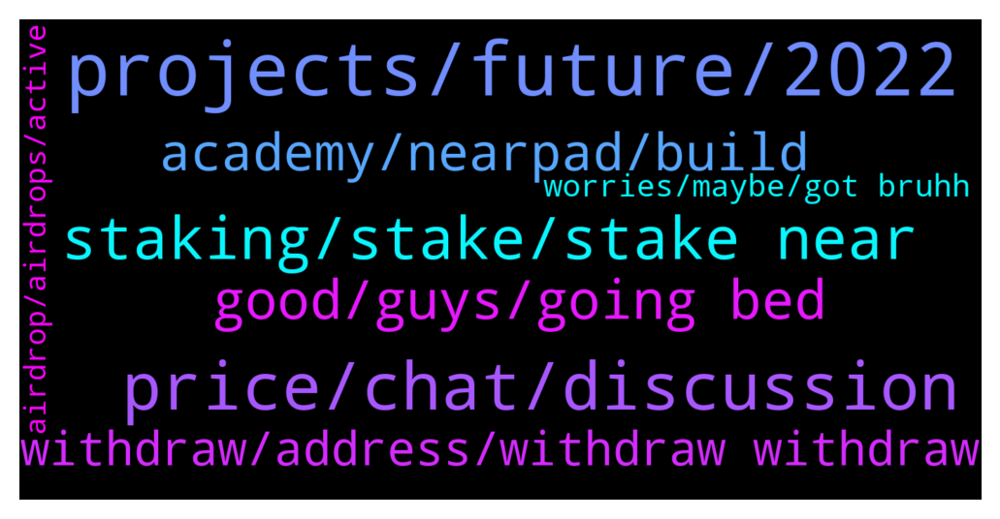

# **@cryptonear**
 ## Analysis for **2022-01-09** - **2022-01-10**.

---

## 📊 **Basic Stats**

**n_messages_sent**: 369

---

---

## 🔝 **Top keywords and related messages**

1. **projects, future, 2022**

    @xerophyte --- *this is off topic just wanna know yes or no (answer) these olympus ohm kind of projects . are they pryamid scam or any other scam? .. if you don't like the question you can delete* **--->** [TG Discussion](https://t.me/cryptonear/281396)

    @SMuratt --- *Hi, is near in metaverse universe? Will we be able to get metaverse fields like in the future?* **--->** [TG Discussion](https://t.me/cryptonear/281577)

    @NEARverse_xd --- *Both are different. Elrond is more into finance field* **--->** [TG Discussion](https://t.me/cryptonear/281363)

    @xerophyte --- *does it solve in all they way compare to dot-parachains .. just wondering or lacks on something* **--->** [TG Discussion](https://t.me/cryptonear/281391)

    @xerophyte --- *??? actually its projects like metaverse (RIDE)  .. looks like near seems has lots of project adopting .. i guess near better .. i don't know much about sharding* **--->** [TG Discussion](https://t.me/cryptonear/281369)

    @iamkemoo --- *Yes, the ecosystem is growing fast and there are launching project launching on a weekly basis.* **--->** [TG Discussion](https://t.me/cryptonear/280785)

2. **price, chat, discussion**

    @hieukool --- *I sell NEAR 17.5 big profit and I am waiting for NEAR price 8$-11$ buy back I trust NEAR* **--->** [TG Discussion](https://t.me/cryptonear/280799)

    @iamkemoo --- *For price related discussion please join the unofficial price chat: https://t.me/merchantsofnear* **--->** [TG Discussion](https://t.me/cryptonear/280704)

    @iamkemoo --- *For price discussion please join the unofficial price chat: https://t.me/merchantsofnear* **--->** [TG Discussion](https://t.me/cryptonear/280808)

    @TheGo1denBull --- *https://t.me/merchantsofnear if you want to discuss prices* **--->** [TG Discussion](https://t.me/cryptonear/281007)

    @iamkemoo --- *Zoom out. But let's not talk about prices here please. Thx* **--->** [TG Discussion](https://t.me/cryptonear/280796)

    @iamkemoo --- *For price and investment discussion please join the unofficial price chat: https://t.me/merchantsofnear* **--->** [TG Discussion](https://t.me/cryptonear/280820)

3. **staking, stake, stake near**

    @Flo --- *Why I have a option on binance apy of 30% and 10 days staking?* **--->** [TG Discussion](https://t.me/cryptonear/280354)

    @iamruark --- *Aweh!  New NEAR user here. Got my first small bag last night and was blown away at how fast the transaction was.  Quick question: With Staking, is it a stake and forget kinda thing, or is the recommendation to constantly switch and swap staking pools as the reward changes?* **--->** [TG Discussion](https://t.me/cryptonear/281450)

    @Ajen --- *Then how could they offer 11 percent staking yield?* **--->** [TG Discussion](https://t.me/cryptonear/281310)

    @MayHaBuoi --- *Does Anyone have the information about crafting finance and near staking ? Thank you* **--->** [TG Discussion](https://t.me/cryptonear/280992)

    @rahulgoel007 --- *I don't think so  It's like normal staking but it's just for 10 days and max u can stake is 30N* **--->** [TG Discussion](https://t.me/cryptonear/280360)

    @larry_lang --- *the goals is to stake NEAR inreturn of stNEAR, u can still use those stNEAR to unstake whenever u want* **--->** [TG Discussion](https://t.me/cryptonear/281458)

4. **good, guys, going bed**

    @SymboliahELENA --- *Not  good, I didn't beat u🤣* **--->** [TG Discussion](https://t.me/cryptonear/280880)

    @TheGo1denBull --- *Good night guys. Time to get more rest to fight this virus* **--->** [TG Discussion](https://t.me/cryptonear/281160)

    @FritzWagner --- *Good morning chief, just passing by. ✌* **--->** [TG Discussion](https://t.me/cryptonear/281616)

    @thanano46 --- *I guess it's morning in Vietnam right now* **--->** [TG Discussion](https://t.me/cryptonear/281124)

    @FritzWagner --- *Hehehe good back up, I am going to bed now, gn, see you tomorrow fam.* **--->** [TG Discussion](https://t.me/cryptonear/280465)

    @iamkemoo --- *Hey mate, how are u doing?!* **--->** [TG Discussion](https://t.me/cryptonear/280721)

5. **academy, nearpad, build**

    @joaquimley --- *Oh yes I'm also enrolled on the 1o1 course was looking for more resources on the near dot academy website* **--->** [TG Discussion](https://t.me/cryptonear/280865)

    @iamkemoo --- *We already have Launchpad: https://app.skyward.finance/ on Near* **--->** [TG Discussion](https://t.me/cryptonear/280779)

    @Kaiguy69 --- *near pad looks kinda cool too* **--->** [TG Discussion](https://t.me/cryptonear/280610)

    @joaquimley --- *Quick question as I'm feeling a bit confused with the near academy website. There is only one course available now right? (museum thing)* **--->** [TG Discussion](https://t.me/cryptonear/280713)

    @bailey_12 --- *you can look more for resources on https://learnnear.club/ . It is the same thing with Near University* **--->** [TG Discussion](https://t.me/cryptonear/280870)

    @iamkemoo --- *My fault, I meant our university: https://www.near.university/. You get payed for learning to build on Near.* **--->** [TG Discussion](https://t.me/cryptonear/280864)

6. **withdraw, address, withdraw withdraw**

    @goforfr --- *hi, how to tranfer out NEAR "Reserved for storage"?* **--->** [TG Discussion](https://t.me/cryptonear/280482)

    @bailey_12 --- *There is a way to transfer out the remaining fund which is DELETE your wallet with Near-CLI. This will require some programming knowledge so not sure it is worth the efforts* **--->** [TG Discussion](https://t.me/cryptonear/280508)

    @iamkemoo --- *Sure, you can go to wallet.near.org and create a wallet now, for free.* **--->** [TG Discussion](https://t.me/cryptonear/280765)

    @PlatypusPunk --- *Yeah I Deposited 17N recently and it doesn't . appear on my acc* **--->** [TG Discussion](https://t.me/cryptonear/281708)

    @butola_ravi --- *No u need to deposit from site* **--->** [TG Discussion](https://t.me/cryptonear/281212)

    @bailey_12 --- *Oh it is the account you want to transfer the remaining fund to* **--->** [TG Discussion](https://t.me/cryptonear/280515)

7. **worries, maybe, got bruhh**

    @Kaiguy69 --- *no worries there are 7 other words do you mind if i write their descriptions? maybe we can get the others. i already got one on my own lmao* **--->** [TG Discussion](https://t.me/cryptonear/281251)

    @larry_lang --- *=]] they will get to you dont worry, maybe they just busy* **--->** [TG Discussion](https://t.me/cryptonear/280591)

    @supersaiyan_goku --- *now send it back to me i'm poor* **--->** [TG Discussion](https://t.me/cryptonear/281353)

    @butola_ravi --- *What u trying to do btw* **--->** [TG Discussion](https://t.me/cryptonear/281348)

    @larry_lang --- *bruhh i lost too much brain cell i cant even type correclyyysf   ò* **--->** [TG Discussion](https://t.me/cryptonear/281236)

    @supersaiyan_goku --- *Just 4 fun bro, no worries 🤣🤣🤣* **--->** [TG Discussion](https://t.me/cryptonear/280798)

