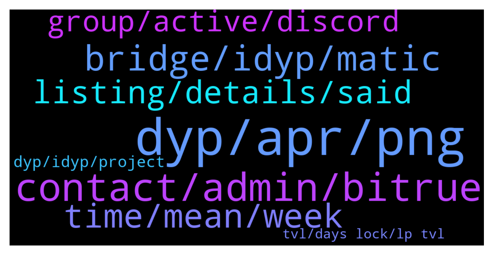

# **@dypfinance**
 ## Analysis for **2022-01-09** - **2022-01-10**.

---

## 📊 **Basic Stats**

**n_messages_sent**: 128

---

---

## 🔝 **Top keywords and related messages**

1. **dyp, apr, png**

    @Paulus --- *Yes and it auto switch about 25% to DYP. i mean what if we withdraw the DYP, does it affect the share* **--->** [TG Discussion](https://t.me/dypfinance/238471)

    @Paulus --- *In farming, the % share just base on the asset we farm or include Dyp.* **--->** [TG Discussion](https://t.me/dypfinance/238469)

    @Paulus --- *So the profit base on 75% of what we deposit?* **--->** [TG Discussion](https://t.me/dypfinance/238473)

    @Paulus --- *I know but what the APR for DYP? equal with LP* **--->** [TG Discussion](https://t.me/dypfinance/238477)

    @Paulus --- *So it may lower than the LP APR then it may not attracting investors, we just wait till the lock time done then move as much as we can from DYP back to LP and keep DYP at minimum. Sound not so good for DYP right?* **--->** [TG Discussion](https://t.me/dypfinance/238479)

    @Craig --- *I funded my first DYP farming pool on Oct. 24, 2021. On Dec. 16th I withdrew my funds. The DYP and WETH from my LP was first sent to the contract address, but then, as you can see from the transfers, the WETH was not sent to my wallet, only the DYP. Can anyone shed some light on why I didn't receive my WETH?* **--->** [TG Discussion](https://t.me/dypfinance/238258)

2. **contact, admin, bitrue**

    @kimchiboo --- *hello, i want to ask something. who can I contact regarding marketing proposal? thanks!* **--->** [TG Discussion](https://t.me/dypfinance/238220)

    @dimasdep --- *Hi, Defi Yield Protocol Team! Anyway, who is the admin in this group? Or anyone can introduce me to the admin/pic for listing business?* **--->** [TG Discussion](https://t.me/dypfinance/238385)

    @dreamdev55 --- *@timdyp Here is an experienced smart contract (solidity, rust) develoer worked on some nice DeFi, NFT and blockchain game development. I have found this project has very good potentiality and I like to work in the dev team. Please let me know whom should I contract for a dev position.* **--->** [TG Discussion](https://t.me/dypfinance/238282)

    @jc6868 --- *Hi! Not so clear what need to be done . It mentioned to be whitelisted and not sure where to do this. Pls advise . Thanks* **--->** [TG Discussion](https://t.me/dypfinance/238487)

    @iamJubi --- *Hello. Please email your proposal to contact@dyp.finance* **--->** [TG Discussion](https://t.me/dypfinance/238388)

    @dimasdep --- *If you need some verification, I can arrange our operation team to send you a message from Bitrue Offical Twitter Account. Thanks!* **--->** [TG Discussion](https://t.me/dypfinance/238387)

3. **bridge, idyp, matic**

    @timdyp --- *Next week we are going to release the #iDYP Bridge  The bridge will create balance between the V2 pools and unique trading opportunities.  #DeFi #Ethereum #BinanceSmartChain #Avalanche  👉https://twitter.com/dypfinance/status/1480172181598396422* **--->** [TG Discussion](https://t.me/dypfinance/238219)

    @DhoniMSD516 --- *Hey Matic expansion is not live yet, if we launched and yes bridge also might be possible* **--->** [TG Discussion](https://t.me/dypfinance/238249)

    @Disguy125 --- *Can't ready for a IDYP pump on the BSC chain boy buy now for a 5x pump with the bridge!!!!!! Coming this week!!!!!!* **--->** [TG Discussion](https://t.me/dypfinance/238355)

    @profit984 --- *is there also idyp matic bridge in the future?* **--->** [TG Discussion](https://t.me/dypfinance/238248)

    @iamJubi --- *Hello. We have farms for 3 chains  BSC- https://dyp.finance/farmv2/bsc AVAX- https://dyp.finance/farmv2/avax ETH- https://dyp.finance/farmv2/eth  Kindly read these announcements and the articles for more info   https://t.me/dypannouncements/694 https://t.me/dypannouncements/748 https://t.me/dypannouncements/763  You can check our tutorial https://youtube.com/playlist?list=PL8K0d30DJYVPKtu_gWiu7vm73k_TnZOs4* **--->** [TG Discussion](https://t.me/dypfinance/238090)

    @DhoniMSD516 --- *As of now no infos on this bridge yet* **--->** [TG Discussion](https://t.me/dypfinance/238276)

4. **time, mean, week**

    @timdyp --- *Not sure Tyler, maybe Monday or Wednesday the latest.* **--->** [TG Discussion](https://t.me/dypfinance/238228)

    @tamtamkanto --- *By next week, do you mean the 16th-22nd?* **--->** [TG Discussion](https://t.me/dypfinance/238378)

    @Disguy125 --- *What day do you expect ?* **--->** [TG Discussion](https://t.me/dypfinance/238222)

    @Nji_jalen --- *One by one good news will coming. Stay tuned HODLers* **--->** [TG Discussion](https://t.me/dypfinance/238241)

    @DhoniMSD516 --- *This announcement made yesterday so next week he mean this week* **--->** [TG Discussion](https://t.me/dypfinance/238379)

    @Disguy125 --- *This will happen between now and Friday.* **--->** [TG Discussion](https://t.me/dypfinance/238358)

5. **listing, details, said**

    @alvindrajw --- *I have a doubt if the team planned tier 1 listing in December then they should be prepare all the details and apply it before right. But the admin said they gave all the details in dec 8. Is that proper way? And from starting October itself the team said listing will be on november or December* **--->** [TG Discussion](https://t.me/dypfinance/238145)

    @timdyp --- *Hey, we will release soon more details about the whitelist process.* **--->** [TG Discussion](https://t.me/dypfinance/238489)

    @ahuman516 --- *People who are asking for listing are nothing but noobs, listing in this market conditions do no good* **--->** [TG Discussion](https://t.me/dypfinance/238198)

    @Ali pajoo --- *Listing was planed for end of 2021,yet we are in 2022 and nothing is happening. Why?* **--->** [TG Discussion](https://t.me/dypfinance/238194)

    @DhoniMSD516 --- *Mate follow our updates we are providing to community in this regard and have some knowledge how listing process works* **--->** [TG Discussion](https://t.me/dypfinance/238197)

    @DhoniMSD516 --- *Hey mate just like everyone else we are waiting for listing to announce about listing we provided all the infos to exchanges and there is nothing else we can do instead of just wait, have some patience and listing will be happened* **--->** [TG Discussion](https://t.me/dypfinance/238195)

6. **group, active, discord**

    @iamJubi --- *Why do you claim that the team is not active when you are just new to the group? Your first message is jan. 1 and all you ask is about listing.  Check the update. we provided all the necessary documents/requirements its up to them now. https://t.me/dypfinance/235763  https://t.me/dypfinance/236800* **--->** [TG Discussion](https://t.me/dypfinance/238108)

    @DhoniMSD516 --- *Hey mate do you know what really matters the devolpments and how team is active, we are active you can find our roadmap https://dyp.finance/roadmap the developments we made and more coming* **--->** [TG Discussion](https://t.me/dypfinance/238115)

    @DhoniMSD516 --- *Nope this and Price group are only official group* **--->** [TG Discussion](https://t.me/dypfinance/238172)

    @Captain_Snowball_Bull --- *Team cannot manage exchange in listing🙏. Not team fault* **--->** [TG Discussion](https://t.me/dypfinance/238149)

    @j2021000 --- *I understand...but why suddenly a discussion about members count...i think it's quite normal in every group* **--->** [TG Discussion](https://t.me/dypfinance/238123)

    @DhoniMSD516 --- *Nothing abnormal, some ppl leave and some join* **--->** [TG Discussion](https://t.me/dypfinance/238122)

7. **dyp, idyp, project**

    @Nji_jalen --- *Dont forget about dyp too. Lol* **--->** [TG Discussion](https://t.me/dypfinance/238366)

    @trader_broi --- *Yeah these people are now back of idyp... If there was no idyp then we see the pump only in dyp token* **--->** [TG Discussion](https://t.me/dypfinance/238370)

    @DhoniMSD516 --- *Hello welcome :) You can start by jumping here https://t.me/dypfinance/229271 to read about DYP* **--->** [TG Discussion](https://t.me/dypfinance/238461)

    @InGoyalWeTrust --- *I wondered to see a hidden project that's no where trending on DYP* **--->** [TG Discussion](https://t.me/dypfinance/238435)

    @DhoniMSD516 --- *Looks like you have so much hatred towards iDYP, but let you know that team introduced iDYP to help DYP and these results will be known longterm* **--->** [TG Discussion](https://t.me/dypfinance/238371)

    @Joe --- *I got Strong faith in dyp* **--->** [TG Discussion](https://t.me/dypfinance/238242)

8. **tvl, days lock, lp tvl**

    @Paulus --- *And will it affected by LP and TVL?* **--->** [TG Discussion](https://t.me/dypfinance/238177)

    @Paulus --- *I know that the market is reding but wow, WAVAX farming 3 days lock fall so hard than others, even you guys can x30 your asset with that, much more than the 60 days lock* **--->** [TG Discussion](https://t.me/dypfinance/238297)

    @Paulus --- *I understand that even WAVAX is up but th iDYP keep down, the LP still down right* **--->** [TG Discussion](https://t.me/dypfinance/238183)

    @DhoniMSD516 --- *TVL too increases and decreased based on token prices* **--->** [TG Discussion](https://t.me/dypfinance/238180)

    @Nji_jalen --- *If we are invest to long/mid term. Dont look price every day. But wait until a month/years later. You will see that* **--->** [TG Discussion](https://t.me/dypfinance/238075)

    @Paulus --- *What if TVL down? Does the asset down too?* **--->** [TG Discussion](https://t.me/dypfinance/238178)

