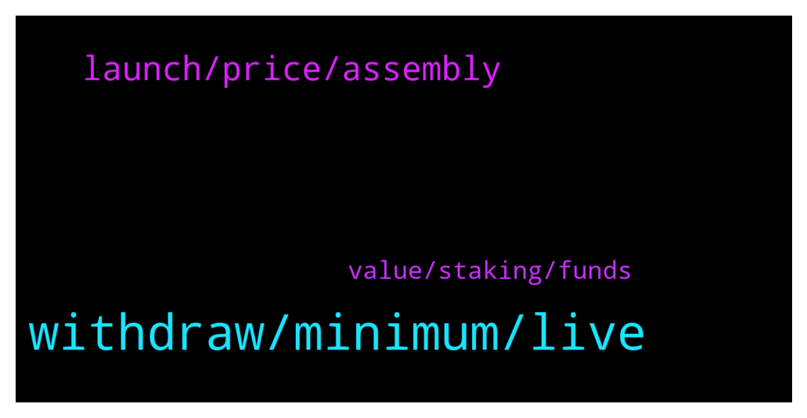

# **@iotatangle**
 ## Analysis for **2022-01-09** - **2022-01-10**.

---

## 📊 **Basic Stats**

**n_messages_sent**: 53

---

---

## 🔝 **Top keywords and related messages**

1. **withdraw, minimum, live**

    @danieltapa --- *i don't think *prefer to continue trading* is a case.. all exchanges that support iota did the migration process, right?* **--->** [TG Discussion](https://t.me/iotatangle/306427)

    @davicico94 --- *Its ok, Minimum to withdraw 70 iotas* **--->** [TG Discussion](https://t.me/iotatangle/306319)

    @Chataign3 --- *hello, I would like to take some iota on binance.  do you know if the withdrawal to Firefly is ok?  or do I have to change the platform?  good to you* **--->** [TG Discussion](https://t.me/iotatangle/306292)

    @antonionardella --- *A friend of mine still has to migrate 🤷* **--->** [TG Discussion](https://t.me/iotatangle/306431)

    @mohsen --- *After prolong time about 11% didn't migrate, maby They're lost... something such as burning* **--->** [TG Discussion](https://t.me/iotatangle/306411)

    @Tahmis --- *But I would maybe recommend Bitfinex as it has been working really well what I've heard* **--->** [TG Discussion](https://t.me/iotatangle/306374)

2. **launch, price, assembly**

    @N1ghtBl00d --- *anyone have a rough idea at what price will SMR launch at roughly?* **--->** [TG Discussion](https://t.me/iotatangle/306293)

    @Zebrin3 --- *What is shot of assembly one day getting to 2 dollars?* **--->** [TG Discussion](https://t.me/iotatangle/306271)

    @Darius --- *I don't know how much will it be but it's a great project* **--->** [TG Discussion](https://t.me/iotatangle/306272)

    @Tahmis --- *Very cheap on the pro side* **--->** [TG Discussion](https://t.me/iotatangle/306367)

    @N1ghtBl00d --- *i see most metaverse good project launch btween $0.001 - $40.00* **--->** [TG Discussion](https://t.me/iotatangle/306294)

    @waseem_jh --- *what is the potential price at the end of 2022?* **--->** [TG Discussion](https://t.me/iotatangle/306385)

3. **value, staking, funds**

    @⠠⠵ Lucas! --- *NOT STAKING funds are an heterogeneous mix of cases. People who ... * don't believe new tokens will have value * their value don't compensate the mess of completing the process necessary to participate * do not actively follow the project or its news feeds * are still procrastinating * prefer to continue trading * still has to migrate * lost access to their funds * Etcetera* **--->** [TG Discussion](https://t.me/iotatangle/306414)

    @Holli --- *Correct... but MC will be very much lower at beginning and I expect huge drop at beginning because many ff staker will cash out the "gifted" tokens as soon as possible... from this bottom it may rise very good... jmho* **--->** [TG Discussion](https://t.me/iotatangle/306346)

    @catfase --- *smrs per coin value will be lower than every single bsc shitcoin lol* **--->** [TG Discussion](https://t.me/iotatangle/306310)

    @Razali --- *If SMR is $1 I would be a multi millionaire by the time staking ends..* **--->** [TG Discussion](https://t.me/iotatangle/306297)

    @Zebrin3 --- *Worth getting these staking rewards on downtrend?* **--->** [TG Discussion](https://t.me/iotatangle/306270)

