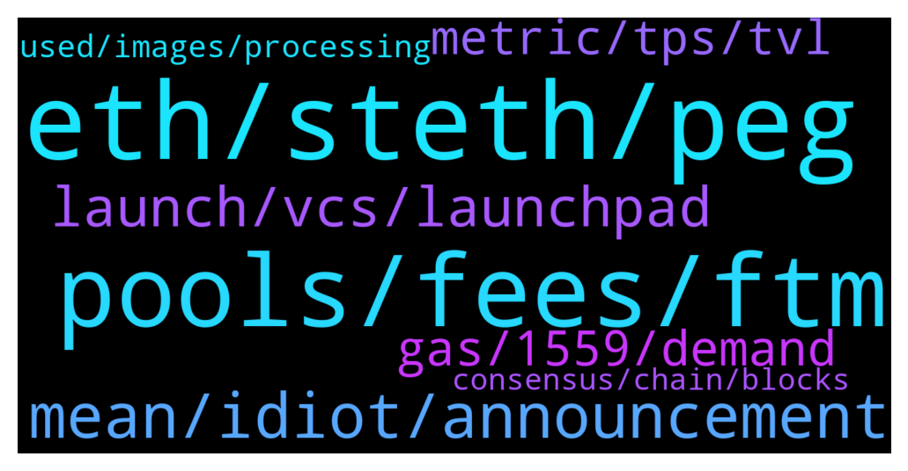

# **@lobsters_chat**
 ## Analysis for **2022-01-09** - **2022-01-10**.

---

## 📊 **Basic Stats**

**n_messages_sent**: 335

---

---

## 🔝 **Top keywords and related messages**

1. **eth, steth, peg**

    @sashatsereteli --- *Has anyone noticed any dependencies in the stETH-eth exchange rate on curve? Eg during which events is it most unequal and how often should I check?   I exited briefly to do something with my eth when it was at 1.0056 and am looking to buy back now but it just keeps falling and I don’t want to lose a couple of weeks of staking rewards worth* **--->** [TG Discussion](https://t.me/lobsters_chat/313936)

    @litlife4 --- *In the deflationary majors like eth and bnb , what are they trying to achieve  by burning the native token in a long term perspective* **--->** [TG Discussion](https://t.me/lobsters_chat/313956)

    @batduck73 --- *« Transaction fees being burned due to EIP 1559 (estimate ~10k ETH/year initially while usage is still low, ramping up to hopefully hundreds of thousands of ETH/year eventually) »* **--->** [TG Discussion](https://t.me/lobsters_chat/314104)

    @tmmae --- *stETH lost its 1:1 peg on curve when Lido had introduced the open LDO referral rewards. Users took the LDO rewards and stakers exited stETH through curve. Then came the whitelist etc. However, it never went badly off-peg. Mid-term with the merge approaching it's not unlikely that stETH will begin to trade at a premium to ETH because of the validator queue, see e.g. here: https://mobile.twitter.com/RyanBerckmans/status/1396591138895769615* **--->** [TG Discussion](https://t.me/lobsters_chat/313994)

    @litlife4 --- *Do they wish to burn all their tokens to zero* **--->** [TG Discussion](https://t.me/lobsters_chat/313957)

    @anisopteran --- *Burning is another word for buyback. It’s the same effect as when people lose their bitcoin wallet - it’s a “donation to everyone”.* **--->** [TG Discussion](https://t.me/lobsters_chat/313985)

2. **pools, fees, ftm**

    @kapur_sanat --- *so simple but so cool - elegantly helps mitigate the CRV problem where pools like FRAX earn $100k in fees but $3.6mn in emissions vs pools like 3pool which generate $450k in fees but only get $450k in emissions* **--->** [TG Discussion](https://t.me/lobsters_chat/314208)

    @tesslerc --- *Going over the explanation for ouroboros by @andrecronje . Why even have people vote and not let the system automatically adjust incentives?  If it's an AMM provide rewards based on a "weighed time weighed average volume".  If the goal is lending, incentivize based on the borrow APY or similar.* **--->** [TG Discussion](https://t.me/lobsters_chat/314260)

    @garydefi --- *AC's ve(3,3). So the idea is to align voting/bribing with fee performance? We were just wondering about that in bribing protocols, where bribing may lead to suboptimal fee performance. so AC says earn only from those your voted for? I'd think Tokemak etc would have it that way already, but maybe not https://andrecronje.medium.com/ve-3-3-ouroboros-part-1-fee-distribution-5dcf131dc82e* **--->** [TG Discussion](https://t.me/lobsters_chat/314357)

    @tesslerc --- *Let's take gearbox as an example. If GEAR tokens were distributed to borrowers based on the inverse borrow rate (incentivize borrowing from pools without much borrowing) and lenders based on the borrow APY (provide more liquidity for pools with a lot of demand).  How would one go about gaming such a system without getting rekt on fees?* **--->** [TG Discussion](https://t.me/lobsters_chat/314262)

    @ivangbi --- *-> Emissions will promote the highest fee earning pools, which will increase liquidity on those pools to allow for better rates.  Correct me if I am wrong, but if the fees in notional USD are smaller than emissions (and there is like what, a 10x more markup on that across the board now) it doesn’t change it much? I would still vote for lw utilization pools?* **--->** [TG Discussion](https://t.me/lobsters_chat/314214)

    @kapur_sanat --- *yeah, i think you are mostly correct -> for right now this ratio is too skewed in CRV ecosystem, but eventually would help  also helps at the margins e.g. right now, i doubt a pool like 3pool on CRV would benefit from this, but could help in a battle like mim pool vs frax pool (both heavily incentivized, but mim pool does a lot more volume than frax and generates a lot more fees since mim leverage generates trading; however, frax owns way more CVX so gets lots more emissions)* **--->** [TG Discussion](https://t.me/lobsters_chat/314215)

3. **mean, idiot, announcement**

    @zhongfu --- *last updated in may... 2020, lol https://github.com/ethhub-io/ethhub/blob/master/docs/ethereum-roadmap/ethereum-2.0/eth-2.0-economics.md* **--->** [TG Discussion](https://t.me/lobsters_chat/314109)

    @mdzor --- *On their discord 1h ago. That says a lot about the usage I mean, if 1h downtime cause 3 messages in their channel by the same ppl and no announcement on Twitter 🙈 L2s aren't around the corner in terms of prod readiness* **--->** [TG Discussion](https://t.me/lobsters_chat/314033)

    @river0x --- *From collating nearly every hack in DeFi they often seem to happen Saturday night US time* **--->** [TG Discussion](https://t.me/lobsters_chat/313907)

    @Joel_john --- *thank you kind sir, im an idiot* **--->** [TG Discussion](https://t.me/lobsters_chat/314256)

    @juju1234534 --- *You literally say nothing on topic. :)* **--->** [TG Discussion](https://t.me/lobsters_chat/314051)

    @mdzor --- *You're right   https://twitter.com/midasthefool/status/1480136347125829635?s=21  There are few mentions about it in Twitter but no announcement from the team as per now, weird!* **--->** [TG Discussion](https://t.me/lobsters_chat/314032)

4. **launch, vcs, launchpad**

    @bsc500x --- *Thanks for the advice! But what about P2E ? Our game in process, and what best solution for launch ?* **--->** [TG Discussion](https://t.me/lobsters_chat/314024)

    @Clint_Ma --- *Do any of you build the dApps with wordpress? I think that probably won't be the best alternative* **--->** [TG Discussion](https://t.me/lobsters_chat/314193)

    @ivangbi --- *I guess yoda is being nice, good good. All true btw. My first gut feeling was that if someone asks “what launchpad is best” they are not willing to build or contribute, but are willing to just launch a coin into hype. Asking the wrong questions kinda. As such, not really interested in such stuff* **--->** [TG Discussion](https://t.me/lobsters_chat/314085)

    @bsc500x --- *Our team looking for launchpads similar to (dxsale, unicrypt)* **--->** [TG Discussion](https://t.me/lobsters_chat/314004)

    @eth2enthusiast --- *Depends on the chain you launch. No single platform will help you find a wide audience, marketing comes in there as well. Vcs reach out to me first but you can always cold approach vcs in the space with some research. And use whatever launch pad or big platforms exist in your target chain to find advice friends snd money. If you search in this chat there’s also a excel sheet of vcs ranked by stuff* **--->** [TG Discussion](https://t.me/lobsters_chat/314082)

    @limfx8 --- *We do for the new product - not launched yet* **--->** [TG Discussion](https://t.me/lobsters_chat/313980)

5. **gas, 1559, demand**

    @coine_r --- *Depends on what you mean by predictable. It's predictably, consistently higher than what I paid prior to the upgrade, and some traded picture sale pulls the rug out from under me every so often* **--->** [TG Discussion](https://t.me/lobsters_chat/314052)

    @adrianleb --- *Gas in general increased with more participation, arguably a less crazy increase with the timing of 1559, this is a valid UX argument still* **--->** [TG Discussion](https://t.me/lobsters_chat/314054)

    @coine_r --- *Because the only thing that "upgrade" improved is giving certain bagholders one more rationalization to excuse Ethereum's ridiculous gas fees* **--->** [TG Discussion](https://t.me/lobsters_chat/314046)

    @unialpha --- *gas is still high on average but more predictable right?* **--->** [TG Discussion](https://t.me/lobsters_chat/314049)

    @coine_r --- *There is this: https://twitter.com/jadler0/status/1427627499983343633?s=20  Personally, I miss my cheap gas weekends but I limit my Ethereum interactions to every other blue moon to make it hurt less lol* **--->** [TG Discussion](https://t.me/lobsters_chat/314059)

    @Rrrrotten --- *https://etherscan.io/gastracker  Check the top gas Guzzlers. usually shiitty NFT minting causes this* **--->** [TG Discussion](https://t.me/lobsters_chat/314128)

6. **metric, tps, tvl**

    @andrecronje --- *TVL is a more commonly accepted metric I believe, but I'm a defillama fanboy, so I'm bias* **--->** [TG Discussion](https://t.me/lobsters_chat/314290)

    @t1mur --- *When we compare performance of blockchains, the main metric is max transactions per second, right? But exactly what type of transactions is meant and do blockchain developers tend to mean the same thing?* **--->** [TG Discussion](https://t.me/lobsters_chat/314289)

    @andrecronje --- *There was never agreement on TPS as a metric, as it can be interpreted too easily* **--->** [TG Discussion](https://t.me/lobsters_chat/314292)

    @Sunny --- *Also fwiw defi llama does not measure staked assets as tvl, meaning avalanche is not as prolific as kevin siqniki might mislead you to believe* **--->** [TG Discussion](https://t.me/lobsters_chat/314305)

    @jiji0x --- *I echo what people above have said, and just wanted to add that the one thing people do seem to agree on in terms of blockchain “performance” is that you tend to make trade-offs across three different verticals: decentralization, scalability, and security  TPS to some degree fall under scalability here, but my point is that there are other metrics you should be concerned about as well when you evaluate a chain for its performance* **--->** [TG Discussion](https://t.me/lobsters_chat/314304)

    @tesslerc --- *TVL might measure current success, issue is that it's easy to game.  "X platform launches new 1 billion $ incentives program" leading to short term movement of capital over to them.* **--->** [TG Discussion](https://t.me/lobsters_chat/314302)

7. **used, images, processing**

    @tatai_007 --- *Hey, anyone knows of how these NFT projects generate 10000 unique looking art? Because I was seeing some of the mutant apes NFTs and they look incredibly detailed.* **--->** [TG Discussion](https://t.me/lobsters_chat/314313)

    @Jon --- *Sounds amazing. How do I get this? Thx* **--->** [TG Discussion](https://t.me/lobsters_chat/313854)

    @Don_Luv --- *Basically layering of images which break all the components into different images so they can be combined. I used Python pillow library for this, but you could use whatever alternative. Some image processing  might be involved depending on the project, 2 I’ve been on used natron (open source tool) for some effect (refraction through glasses).  Beside that, just creating exclusions for certain combinations of traits based on the obvious one which won’t work together, and/or testing.* **--->** [TG Discussion](https://t.me/lobsters_chat/314318)

    @tatai_007 --- *I am just curious what the process looks like for generating art for a series like that.* **--->** [TG Discussion](https://t.me/lobsters_chat/314314)

    @farm42 --- *A very useful service indeed, check out as well:  https://officercia.medium.com/tenderly-app-a-swiss-pocketknife-for-the-web3-developer-89bb904bee46* **--->** [TG Discussion](https://t.me/lobsters_chat/313892)

    @tmmae --- *I just used coingecko for ease of use: https://www.coingecko.com/en/coins/lido-staked-ether/eth* **--->** [TG Discussion](https://t.me/lobsters_chat/314029)

