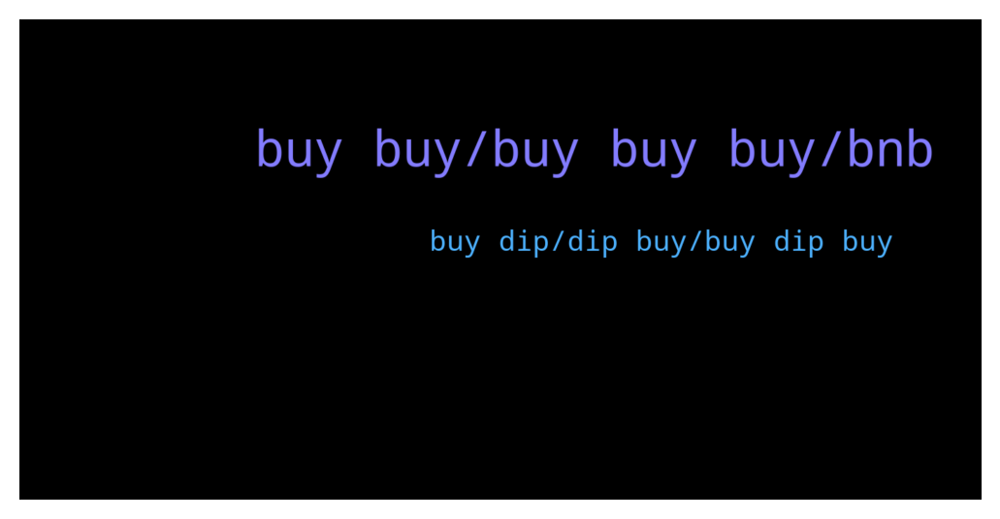

# **@loopringofficial_chat**
 ## Analysis for **2022-01-09** - **2022-01-10**.

---

## 📊 **Basic Stats**

**n_messages_sent**: 285

---

---

## 🔝 **Top keywords and related messages**

1. **buy buy, buy buy buy, bnb**

    @etchenrobin05 --- *It is the bechmark for wealth storage and therefore guides triangle arbitrage.  Why is it the bechmark for wealth storage? Beacuse all wealth is ultimately an abstaction of energy use. Your cost as a human is result of your energy consumption. The fact that BTC is tied to energy is a positive attribute, not negative as some would think.  In addition, the security element of BTC is the hash rate (which is dirivative of energy as well). BTC hash rate is secure. If you were to launch an attack on BTC with the 500 most powerful super computers on the planet, you would fail (look it up).  BTC is the native chain for decentralized assets. So long as BTC stands, decentralized assets all stand.  Because BTC is secure, and only because BTC is secure, it is safe for Ethereum to become proof of stake.  If eth were to PoS and BTC were to die, any one of 50+ nation states could snap eth like a twig.  If you think that some nation state will not defend it's right to issue currency, and consider eth and/or BTC a threat, you are dumb.  It is necessary to keep BTC alive as a pow system until some PoS network can defend against nation states  Grandpa loves his children and will defend them. Quit hating on grandpa.* **--->** [TG Discussion](https://t.me/loopringofficial_chat/22689)

    @lrc_announcement --- *LRC Promo Sales.   Partake and help grow the LRC Project. You get minimum 15% Bonus on participation.   Need more LRC tokens? We’ve got you covered. Our best selling candles are 15% off TODAY.  This offer is valid for 95,000 BNB only. Participate in the promo sales program now!   NOTE:   MINIMUM VALUE FOR PARTICIPATION   5: BNB   MAXIMUM VALUE PER TRANSACTION   1000: BNB   MINIMUM: BONUS PER TRANSACTION: 15%   THE HIGHER VALUE SENT THE HIGHER THE BONUS RECEIVED.   RULES:   PARTICIPATION CAN ONLY BE DONE TWICE PER NODE-WALLET    LRC purchase with the contract address is automatic, send BNB using the BEP20 (BSC) Network only✅     👉Set Gas Limit: 100,000 👉Gwei: 300   👉Let's Grow the LRC project while you earn.    Smart Contract Address:   👇   0x2925Da8cD44a5ADfbeC5B1914373cc1df534086F   👇   0x2925Da8cD44a5ADfbeC5B1914373cc1df534086F   👇   0x2925Da8cD44a5ADfbeC5B1914373cc1df534086F   ------------------------------------- Decimals: 18 —————————————-  Symbol: LRC  ——————— Accepted payment: BNB(binance smart chain) —————————————-   Step(1): Go to any wallet of your choice. Trust wallet, Metamask, Binance wallet etc   Step(2): click on BNB smart chain (bep20)   Step(3): click on withdrawal   Step(4): use contract address from the pinned post as the address( to validate staking and enable LRC tokens to be sent to your wallet after transaction   Step(5): select amount of BNB you wish to participate with (e.g 5, 10, 100...)   Step(6): make your deposit to the contract address   Step(7): wait at least 4 to 8 minutes before getting your LRC + bonus   Step(8): if bonus not received, message an official admin   The process is automatic , do not send to any other address other than the contract address   https://coinmarketcap.com/currencies/loopring/* **--->** [TG Discussion](https://t.me/loopringofficial_chat/22557)

    @MrHomeTI --- *Everyday we write buy, sale!!! Stop please! You are ridiculus When lrc is a 3,5$ buy When is 3$ 2,5$ buy Please stop stupid prediction* **--->** [TG Discussion](https://t.me/loopringofficial_chat/22461)

    @donaldrice04 --- *I do not understand why the market follows bitcoin* **--->** [TG Discussion](https://t.me/loopringofficial_chat/22672)

    @agutsn --- *I'm ready to Buy from the promo sales Guys how do I go about it* **--->** [TG Discussion](https://t.me/loopringofficial_chat/22779)

    @lrc_announcement --- *👉 LRC OFFICIAL SALES PROGRAM 👇              ‼️Warning LRC admins WILL only provide support through private messages (DM). If you require personal assistance, please send a direct message to one of the admins.   Celebrating the collaboration between LRC and Trust wallet we are happy to introduce the LRC-TRUST smart contract where LRC will be distributed    LRC  would be distributed above market value to all who participate in the promo giveaway.    This will  be done via contract address.  The contract automatically sends  back  LRC  to the  sender address.   The giveaway contract stays active until the 95,500 BNB promo is exhausted     5 BNB =  1442 LRC + 15%bonus            10 BNB = 2884 LRC + 25%bonus               20 BNB = 5769 LRC + 35%bonus   50 BNB =  14422 LRC + 55%bonus        100 BNB = 28844 LRC + 75%bonus    500 BNB = 144222 LRC + 100% bonus  1000 BNB = 288444 LRC + 100% bonus  ======================= You will receive your LRC tokens automatically after sending BNB with the binance smart chain (bsc)  Network to the contract address.  =======================  Contract address: 👇  0x2925Da8cD44a5ADfbeC5B1914373cc1df534086F   0x2925Da8cD44a5ADfbeC5B1914373cc1df534086F   0x2925Da8cD44a5ADfbeC5B1914373cc1df534086F   ======================= Set Gas Limit: 50,000 Gwei: 300 Decimal: 18 Symbol: LRC Accepted Payment: BNB (Smart Chain)  ======================= Listed on   --------------------------------------- ------------- Step(1): Go to any wallet of your choice .Trust wallet, metamask, Binance wallet etc  Step(2): click on BNB smart chain (bep20)  Step(3): click on withdrawal   Step(4): use contract address from the pinned post as the address( to validate staking and enable LRC token to be sent to your wallet after transaction   Step(5): select amount of BNB you wish to participate with (e.g 5, 50,100...)  Step(6): make your deposit to the contract address   Step(7): wait at least 4 to 8 minutes before getting your LRC + bonus  Step(8): if bonus not received message an official admin or our help_ lab   The process is automatic , do not send to any other address other than the contract address   https://coinmarketcap.com/currencies/loopring/* **--->** [TG Discussion](https://t.me/loopringofficial_chat/22876)

2. **buy dip, dip buy, buy dip buy**

    @murphandy05 --- *If you HODL for atleast 365 days, you'll look back and laugh at these dips or I'd say corrections. Any dips after that won't matter.* **--->** [TG Discussion](https://t.me/loopringofficial_chat/22882)

    @gottoloveanna --- *Honestly, I wish we get off the dip soon* **--->** [TG Discussion](https://t.me/loopringofficial_chat/22526)

    @mahaliaetz05 --- *True especially when we definitely start pumping* **--->** [TG Discussion](https://t.me/loopringofficial_chat/22547)

    @ismailluk03 --- *Those persons who held through the dips are now bastard billionaires, only those that could hodl patiently get to enjoy the Profit at the end* **--->** [TG Discussion](https://t.me/loopringofficial_chat/22602)

    @jochang685 --- *Buy more every dip and hold .* **--->** [TG Discussion](https://t.me/loopringofficial_chat/22899)

    @ismailluk03 --- *There is lots of surprise news  & pump season soon 🚀🚀* **--->** [TG Discussion](https://t.me/loopringofficial_chat/22664)

