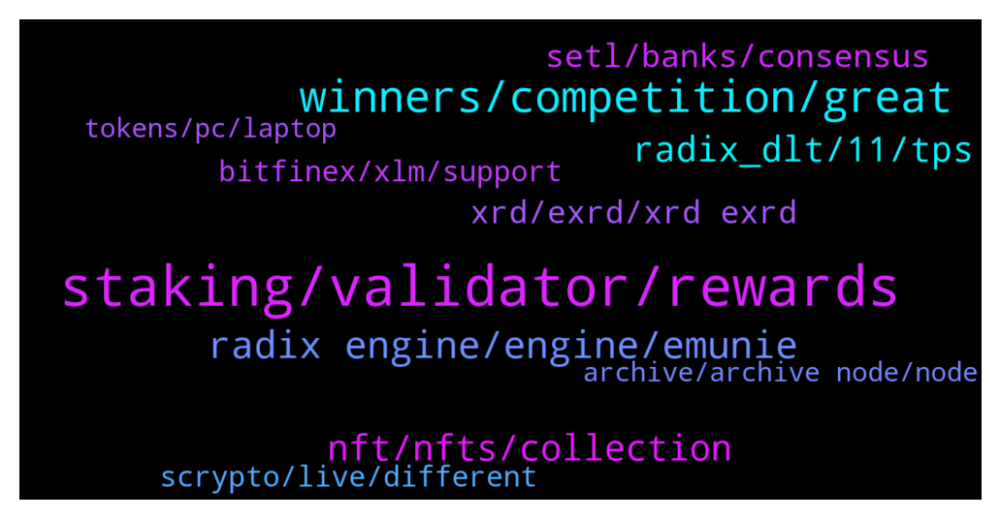

# **@radix_dlt**
 ## Analysis for **2022-01-09** - **2022-01-10**.

---

## 📊 **Basic Stats**

**n_messages_sent**: 373

---

---

## 🔝 **Top keywords and related messages**

1. **staking, validator, rewards**

    @imyourbossnow --- *it sounds staking still have a risk for staking... i want 100% safe for staking. Can you help me? because i want hold XRD for long term for staking* **--->** [TG Discussion](https://t.me/radix_dlt/336605)

    @imyourbossnow --- *how to choose good validator atm? tips please* **--->** [TG Discussion](https://t.me/radix_dlt/336856)

    @LowKep --- *So I just have to look for the lowest fee and the uptime?* **--->** [TG Discussion](https://t.me/radix_dlt/336798)

    @conorbyrne1234 --- *Quick question: xrd rewards are compounded, so do those staking rewards go back to your wallet prior to being given back to the validator or do they stay with the validator.  The end question is, if emission rewards can be lost, are we talking 1 emission worth or can it be the entire time you're staking on a validator.* **--->** [TG Discussion](https://t.me/radix_dlt/336855)

    @LowKep --- *How can I see what a good validator is? What should I be aware of?* **--->** [TG Discussion](https://t.me/radix_dlt/336783)

    @Peter (HAM) --- *The fee is not as important as some might think. And uptime good for all so far... https://www.radixscan.io/ValidatorTable.shtml* **--->** [TG Discussion](https://t.me/radix_dlt/336799)

2. **winners, competition, great**

    @AjiRajor --- *https://twitter.com/ganiat_54/status/1478749062874611713?s=21  Why me not winners meme contest sir* **--->** [TG Discussion](https://t.me/radix_dlt/337326)

    @Jazzer9F --- *New Competition has just launched!🚀  Memes, poems, paintings, or stage plays. The choices are endless.  Let's see what you can do!  Full Details: https://www.radixdlt.com/post/alexandria-launch-creative-competition* **--->** [TG Discussion](https://t.me/radix_dlt/337198)

    @Jacob_XRD --- *The competition has ended, winners announced shortly!  But keep watching, we will do more in the future :}* **--->** [TG Discussion](https://t.me/radix_dlt/337205)

    @Amit_K1 --- *Many congrats, to all of the creative competition winners! Honored to have made the top 10, for this truly awesome project 🙂😊👍👌* **--->** [TG Discussion](https://t.me/radix_dlt/337352)

    @Magal36 --- *Ok, no complaining or will be muted. The judges have chosen the winners.* **--->** [TG Discussion](https://t.me/radix_dlt/337329)

    @aus87 --- *well done to the competition winners!* **--->** [TG Discussion](https://t.me/radix_dlt/337216)

3. **radix engine, engine, emunie**

    @daxter889 --- *This channel has a list of radix projects https://t.me/RadixBox* **--->** [TG Discussion](https://t.me/radix_dlt/337089)

    @Fcrypto2021 --- *What's the difference between EVM and radix engine?* **--->** [TG Discussion](https://t.me/radix_dlt/336713)

    @DavidGr03 --- *Who runs RadixBox? They say to DM them with other projects, but there is no one to DM and you can’t write in their channel 🤷‍♂️* **--->** [TG Discussion](https://t.me/radix_dlt/337118)

    @TevinTodd2 --- *Hi admin, is Radix renamed from eMunie?* **--->** [TG Discussion](https://t.me/radix_dlt/337138)

    @imyourbossnow --- *when you launch radix wallet on smartphone sir?* **--->** [TG Discussion](https://t.me/radix_dlt/337317)

    @wiz_oz --- *#AMA - Question on Radix backwards compatibility position  https://t.me/RadixDevelopers/19333* **--->** [TG Discussion](https://t.me/radix_dlt/336774)

4. **nft, nfts, collection**

    @S --- *NFTs are also great if you just want to support an artist* **--->** [TG Discussion](https://t.me/radix_dlt/336580)

    @mattiabe98 --- *Not sure which one you're talking about, but I made a list of all (at least the ones I know about) the NFTs available on Radix here: https://radixtalk.com/t/what-nfts-are-avaliable-on-radix/219* **--->** [TG Discussion](https://t.me/radix_dlt/336633)

    @mattiabe98 --- *Followed! Hit me up if you ever want your future NFTs added to this list here: https://radixtalk.com/t/what-nfts-are-avaliable-on-radix/219* **--->** [TG Discussion](https://t.me/radix_dlt/336918)

    @Blind5ight --- *A Belgian artist attached 20% royalty revenue of his newest single onto NFTs: https://raptop.nl/daniel-busser-kondigt-nft-drop-aan-voor-eerstvolgende-release/* **--->** [TG Discussion](https://t.me/radix_dlt/336627)

    @No_Goats_No_Glory --- *Does anyone has the url from that NFT project with those spinning NFT's* **--->** [TG Discussion](https://t.me/radix_dlt/336632)

    @korone_stan --- *trying to gift him a very rare halo scorp nft if anyone wants to give this a like/rt https://twitter.com/korone_stan/status/1479940238982139915* **--->** [TG Discussion](https://t.me/radix_dlt/336668)

5. **radix_dlt, 11, tps**

    @soulkiller7 --- *And we need to be honest with ourselves about this information asymmetry. General public will NEVER know what atomic composability means or sharding for that matter.   We need to just show confidence in what we’re saying and when saying it make sure it’s logically sound with respect to growth and future potential.   After trying to explain to someone new why you have invested In Radix over anything else all they will understand is “ crypto needs to be faster and only radix can do it”   I’m not trying to be pompous In anyway but it’s the truth.* **--->** [TG Discussion](https://t.me/radix_dlt/336581)

    @lwtel --- *Just realized they don't have plans to shard(inevitable scaling issues) and they're a dag, even though they're using a novel variant of honeybadger bft, because the consensus isn't cross-shard by default, when they realize they'll need to shard in order to scale other stuff breaks(atomicity).  tl;dr unsharded dag won't scale imo  I was told this by a quite smart member of the radix community who took a look at azero* **--->** [TG Discussion](https://t.me/radix_dlt/337074)

    @undenil --- *@fpieper any comparison with Azero (Aleph Zero)?* **--->** [TG Discussion](https://t.me/radix_dlt/337063)

    @Jazzer9F --- *Announcing the Cerberus Infographic Series!  Learn how Radix's consensus algorithm will provide unlimited scalability & power the future of global finance & #DeFi.  Chapter 1 is live now:  🚀 Introduction & Summary 📉 Why Blockchain Can't Scale  https://twitter.com/radixdlt/status/1403391572423684099?s=20* **--->** [TG Discussion](https://t.me/radix_dlt/337297)

    @mx471 --- *Other networks  Abbreviations: CS = Cross Shard AC =  Atomic Composability SC = Smart Contract TPS = Transactions per second PoW = Proof of Work PoS = Proof of Stake dPoS = Delegated Proof of Stake BC = Blockchain DLT = Distributed Ledger Technology  Internet Computer (#ICP) / Dfinity: t.me/radix_dlt/127683 13.01. Dfinity more like a decentralized cloud t.me/radix_dlt/175334 14.04. Sharded DLT, higher latency, no AC t.me/radix_dlt/191153 12.05. ICP Token Supply and Tokenomics t.me/radix_dlt/194179 17.05. Smart Contracts & limitations t.me/radix_dlt/195743 22.05. Dfinity consensus model t.me/radix_dlt/231566 11.08. No CS-AC, Florian convo with ICP founder Dominic t.me/radix_dlt/275304 19.10. TCP/IP will contine to exist, ICP offer services on top  IOTA (#MIOTA): t.me/radix_dlt/127797 13.01. Not solving the problem t.me/radix_dlt/131272 17.01. Scaling problems, DAG weaknesses t.me/radix_dlt/159456 04.03. Central Coordinator IOTA t.me/radix_dlt/324013 19.12. Good Discussion about IOTA selfclaimed AC  Mina (#MINA): t.me/radix_dlt/167451 21.03. 22KB explanation, unsharded, no SC, high finality time  Holo (#HOLO): t.me/radix_dlt/126674 12.01. Not a DLT, p2p network  Nervos Network (#CKB): t.me/radix_dlt/334245 05.01.2022  Nano (#XNO): t.me/radix_dlt/138075 29.01. Unsharded DAG t.me/radix_dlt/192918 15.05. Bottlenecks sooner or later, TPS, no SC yet  Casper (#CSPR): t.me/radix_dlt/156743 27.02. Design enables sharding,   COTI (#COTI): t.me/radix_dlt/303332 18.11. Unsharded DAG, Trustchain, "proprietary consensus algorithm based on machine learning"  Constellation (#DAG): t.me/radix_dlt/198347 29.05. Different DLT, centralised bridges to other L1 t.me/radix_dlt/251897 13.09. not suitable for DeFi, p2p-Network t.me/radix_dlt/319008 11.12. Good Discussion about Constellation t.me/radix_dlt/319073 Constellation DAG Exyplanation t.me/radix_dlt/319099 Discussion End  NKN (#NKN): t.me/radix_dlt/210290 04.07. Purpose is sending messages, no SC, unsharded  QuarkChain (#QKC): t.me/radix_dlt/183019 29.04. Supports sharding, SCs deployed in only one shard, only CS token transfers  Glitch (#GLCH): t.me/radix_dlt/274835 18.10. Unsharded Blockchain, scalability problems  Zenon (#ZNN): t.me/radix_dlt/148807 15.02. Unsharded t.me/radix_dlt/148989 15.02. Zenon different shards (1 DeFi shard, 1 Gaming Shard etc.)  Saito (#SAITO): t.me/radix_dlt/175726 15.04. Unsharded Blockchain  t.me/radix_dlt/310339 27.11. Diffie Hellman Exchange, not needed in DLT, not solving the trilemma t.me/radix_dlt/310425 27.11. Not scalable long-term t.me/radix_dlt/336376 08.01.2022 Unsharded, claim "don't need sharding", sharding as a concept  Elastos (#ELA): t.me/radix_dlt/252944 14.09. dApps on sidechains, media/data on storage solution Hive, not suited for DeFi  Cellframe (#CELL): t.me/radix_dlt/331281 01.01.2022 Framework to create blockchains, no unified scalable ledger  QANplatform (#QANX): t.me/radix_dlt/304196 19.11. Unsharded Blockchain, 1600 TPS  Koinos (#KOIN): t.me/radix_dlt/289486 07.11. Blockchain Framework, limited scalability & composability  Shardus (#ULT): t.me/radix_dlt/312934 30.11. Proof of Quorum, p2p network  Cypherium (#CPH): t.me/radix_dlt/127828 13.01. Blockchain with hybrid construction, limited scaling & no sharding  Xeta Reality (#XETA): t.me/radix_dlt/275337 19.10. Highly centralized, unsharded with 50 validators, no SC  Hypergraph (#HGT): t.me/radix_dlt/198287 29.05. Long text, headache warning  No rank:  #ParallelChain: t.me/radix_dlt/324866 20.12. Mainnet unsharded, uses BFT, plan to scale with permissioned rollups, broken AC  #T3RN: t.me/radix_dlt/146609 12.02. Solution isn't atomic and not single step  Facebook #Diem / #Libra: t.me/radix_dlt/275241 19.10. Unsharded, 1000 simple TPS  Pulsechain (#PLS): t.me/radix_dlt/213380 16.07. Copy of entire EVM state, PoS, low fees & deflationary t.me/radix_dlt/213384* **--->** [TG Discussion](https://t.me/radix_dlt/336973)

    @ITProfligate --- *#L2 Please comment if interested. TPS and fees, my understanding is the ETH L2 have solved congestion up to something like 20000 TPS (18000 is the given figue) for transfers. I do not know what this means about communicating with other L2s or about recursive scaling as suggested by Starkware. I do not know how this applies to ETH2  L2 solutions seem to me to break various things PoS -> this may matter in terms of skin in the game and decentralisation Looking at the Starkware contract (which is actually self-contradictory or inconsistant) we seem to be looking at a territory governed by the law as exists in that contract. I would think this makes creating, for instance, DOAs, very complex since while expressing their own rules they also have to comply with the pre-existing set of legal agreements.  Cross chain or cross L2 solutions Subject to technical difficulties concerning resolving final state on L1 - which is the security guarantor There is at least one chain that acts across L2’s - I haven’t looked into it but believe it cannot escape the fundamental constraints unless it is a non ETH implementation? But then it would not have solved the trillema, as our researches (@fpieper and collated by @Markus) show.  These solutions are also subject to the issues outlined below.  Assets - I am uncertain of the status of assets within the L2 territory. Is an asset represented by hashes of its state? But, for anything to happen to that asset, the hash of its state is much like a wrapper for that asset token. How are transaction fees measured in this territory? How are they recorded?  Tax -  This subject should be discussed more since much activity is taxable. If the asset is ETH or ERC20 wrapped then what are the tax implications? Is that wrap action taken by tax authorities in various jurisdictions as a purchase? If it is, how would it be tracked?  Attraction of L2 The most obvious attraction is that L2 is simply there, seeming to grow organically out of the ETH ecosystem. Therefore people will follow along. The more complicated version of this is to do with existing commitment to ETH. There is also the argument that it seems fees will be lower - that in turn detracts from the value of ETH becuase it is burning less gas.  We can also see that people may be attracted to L2 specifically because they think it helps with the sorts of liabilities I’ve mentioned. They may think they are protected within the L2 territory if not across L2 territories. It seems like a complicated and uncertain path to me.* **--->** [TG Discussion](https://t.me/radix_dlt/337269)

6. **setl, banks, consensus**

    @Avaunt --- *Without digging too much into this and if my memory serves me correctly SETL is a permissioned Blockchain. ie. It's not decentralised to run on public infrastructure* **--->** [TG Discussion](https://t.me/radix_dlt/337162)

    @imyourbossnow --- *why auto restake when can auto compound? im so little bit confusing* **--->** [TG Discussion](https://t.me/radix_dlt/336888)

    @pimdev --- *Is the “DLT” naming just for marketing? Can someone explain to me the difference between a DLT and a blockchain?* **--->** [TG Discussion](https://t.me/radix_dlt/336656)

    @S --- *"In this technology, the inclusion of a transaction is determined by the participants in that transaction each of whom has a veto. This is orders of magnitude more efficient than proof-of-work or proof-of-stake." Seems like a strange way to define consensus. As if what slows down bitcoin is the fact that not every transaction is multi-sig...* **--->** [TG Discussion](https://t.me/radix_dlt/337194)

    @BRWTRADING --- *Have y'all heard about SETL? They have reach to 1 million tps* **--->** [TG Discussion](https://t.me/radix_dlt/337158)

    @BRWTRADING --- *Yeah, as i saw they are working with banks, not truely decentralized* **--->** [TG Discussion](https://t.me/radix_dlt/337163)

7. **xrd, exrd, xrd exrd**

    @lwtel --- *waiting multiple hours for them to credit my deposit so I can buy xrd* **--->** [TG Discussion](https://t.me/radix_dlt/337050)

    @s4f4r1 --- *🦾🌑🕛🏚🦂💙  #MidnightScorpion   2 MIDNIGHTS TO GO. #scroplife $xrd   ⬇️ https://twitter.com/midnightxrdclub/status/1476856786086989824?s=21* **--->** [TG Discussion](https://t.me/radix_dlt/336957)

    @Gaboulos --- *So, what's the deal with the required KYC for bridging eXRD to XRD? This goes against everything in DeFi and is quite offputting.* **--->** [TG Discussion](https://t.me/radix_dlt/337288)

    @BeLikeWater00 --- *I need to send some XRD to my wallet lol oh well* **--->** [TG Discussion](https://t.me/radix_dlt/336728)

    @M --- *Is Exrd good as Xrd to hodl?* **--->** [TG Discussion](https://t.me/radix_dlt/336646)

    @Mik3ology --- *Thanx Jacob. Just one question. If I use my xrd address linked to my insta-pass, would this auto clear me for the KYC?* **--->** [TG Discussion](https://t.me/radix_dlt/337220)

8. **scrypto, live, different**

    @chrisijoyah --- *Has anyone heard of Cryptoland? They plan on building a physical island for crypto enthusiasts https://youtu.be/jf3ajS5me78* **--->** [TG Discussion](https://t.me/radix_dlt/336912)

    @Blind5ight --- *I can relate Just take little nibbles out of the crypto cake and you'll know a ton as time goes by* **--->** [TG Discussion](https://t.me/radix_dlt/336643)

    @Crypto_Ginax --- *I just read this post and I found it quite enlightening. It is a great insight on how things work especially regarding the real level low decentralisation. Above all, the last point he does right at the end, it seems calling for the power of Scrypto. Overall, very interesting article.* **--->** [TG Discussion](https://t.me/radix_dlt/336782)

    @Jazzer9F --- *The third instalment in the blog series focusing on our new programming language, Scrypto, is now live on the blog!  https://www.radixdlt.com/post/scrypto-an-asset-oriented-smart-contract-language* **--->** [TG Discussion](https://t.me/radix_dlt/336702)

    @Jazzer9F --- *We’re pleased to announce that Radix Alexandria has launched!  Scrypto is a game-changer for DeFi, developers, you can get started with Scrypto now.  Full Announcement: https://www.radixdlt.com/post/alexandria-scrypto-is-here* **--->** [TG Discussion](https://t.me/radix_dlt/337133)

    @Jazzer9F --- *The November Radix Roundtable is now live.   Catch up with Piers, Russell, Matt, & Adam from RDX Works as they talk about:  🖥 The Scrypto Debut ✅ Community Scrypto code examples 🛠 Radix API refactor 📣 2022 marketing plans & more!  Watch now: https://youtu.be/HUTBCoz5esE* **--->** [TG Discussion](https://t.me/radix_dlt/337048)

9. **bitfinex, xlm, support**

    @Davor --- *The tx is completed but still not on Bitfinex* **--->** [TG Discussion](https://t.me/radix_dlt/337241)

    @Taswegian --- *Contact bitfinex support, had that happen with XLM once and they had it sorted within about 2-3 days from memory.* **--->** [TG Discussion](https://t.me/radix_dlt/337244)

    @Davor --- *Anyone having issues with bitfinex deposit today? I did as usual, buying XLM and sending to Bitfinex so I could buy XRD but XLM still didn't arrive.. It is almost 5h since then.. usually everything goes in matters of minutes..* **--->** [TG Discussion](https://t.me/radix_dlt/337234)

    @Magal36 --- *I suggest reaching Bitfinex support if takes too long* **--->** [TG Discussion](https://t.me/radix_dlt/336993)

    @Gaboulos --- *Just swapped on BitFinex. It went much better than I expected. Thank you!* **--->** [TG Discussion](https://t.me/radix_dlt/337325)

    @Davor --- *Thanks, already done it. I was afraid it will be a few days. Hope that XLM doesn't drop to much :'(* **--->** [TG Discussion](https://t.me/radix_dlt/337245)

10. **archive, archive node, node**

    @MarkVuong94 --- *Can someone send me a link to help me troubleshoot the connection to the mainnet on the desktop wallet. Thank you very much* **--->** [TG Discussion](https://t.me/radix_dlt/337313)

    @DCdesert --- *Appreciate it. Was a bit slow on both mainnet and archive node for about 5 mins. All good!* **--->** [TG Discussion](https://t.me/radix_dlt/336631)

    @DCdesert --- *Are there issues with wallet? I’m having trouble getting in* **--->** [TG Discussion](https://t.me/radix_dlt/336628)

    @Magal36 --- *update to version 1.2.6 then try this: https://t.me/radix_dlt/336630* **--->** [TG Discussion](https://t.me/radix_dlt/337314)

    @Blind5ight --- *#walletissue - If you are having issues connecting with the Radix wallet, you can try to use an alternative community node in the wallet settings (see image for example)  Archive Node Addresses: https://radixtalk.com/t/what-community-archive-nodes-can-i-use-with-the-radix-desktop-wallet/156  Explorer Alternatives: https://radixscan.io* **--->** [TG Discussion](https://t.me/radix_dlt/336630)

    @Matus1682 --- *hello, does anyone experience peoblems with the wallet at the moment? i cannot seem to be able to get to send tokens screen... it just hangs with a spinning circle. tried different VPN settings ( asia/europe/US) as well as switched between community archive nodes and radix nodes and the same issue. 😞* **--->** [TG Discussion](https://t.me/radix_dlt/337071)

