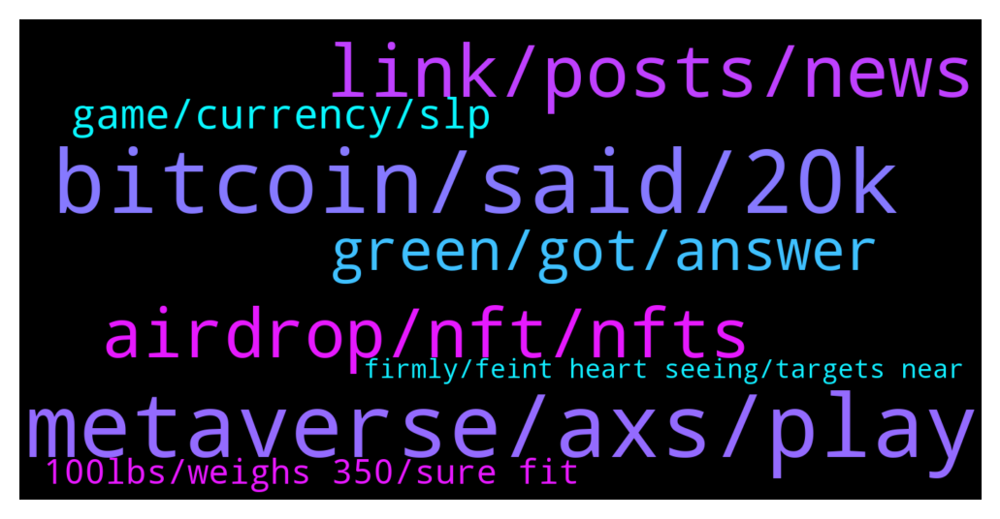

# **@shitpool**
 ## Analysis for **2022-01-09** - **2022-01-10**.

---

## 📊 **Basic Stats**

**n_messages_sent**: 191

---

---

## 🔝 **Top keywords and related messages**

1. **metaverse, axs, play**

    @MoneroPal --- *Can someone explain how variosu cities around the world are being added to the metaverse, what is stopping another project using another chain from just recreating those said cities in their own metaverse or version of it? It seems extremely stupid at this point...* **--->** [TG Discussion](https://t.me/shitpool/715489)

    @OxZilla --- *Feel bad that all the Philippinos that quit their jobs to play axie* **--->** [TG Discussion](https://t.me/shitpool/715373)

    @Blazmeen --- *People need to remind themselves that this is a P2E game and it is no longer fun or profitable for the average user. Of course it's dumping.* **--->** [TG Discussion](https://t.me/shitpool/715179)

    @da0man --- *even if you could copy paste the entire game, it would be dead shortly* **--->** [TG Discussion](https://t.me/shitpool/715502)

    @MoneroPal --- *So it’s a good play to buy and rent out the metaverse to players?* **--->** [TG Discussion](https://t.me/shitpool/715529)

    @Blazmeen --- *Tbh I'm surprised ppl don't generally consider the market audience for metaverses. Assuming we're talking about gamers - are they really going to dole out $100k-$2.5M to buy land off an investor? Or $XXX to rent it?* **--->** [TG Discussion](https://t.me/shitpool/715527)

2. **bitcoin, said, 20k**

    @da0man --- *one year in crypto is like 10 years on wall st.* **--->** [TG Discussion](https://t.me/shitpool/715177)

    @p3mvH --- *imagine losing money on cryptocurrency . even incels make it* **--->** [TG Discussion](https://t.me/shitpool/715355)

    @R0mster --- *In gains not knowledge you douche monster.* **--->** [TG Discussion](https://t.me/shitpool/715182)

    @MoneroPal --- *These uneducated clueless clowns blathering how crypto is some sort of messah that will topple world governments and the financial system just don’t get it...* **--->** [TG Discussion](https://t.me/shitpool/715587)

    @grammi --- *One thing that always mystified me is why are people only good at “trading” or “investing” if number go up?* **--->** [TG Discussion](https://t.me/shitpool/715184)

    @da0man --- *Arthur in 2018 said bitcoin go 50k. is this latest 20k call like that or honest?* **--->** [TG Discussion](https://t.me/shitpool/715360)

3. **link, posts, news**

    @BeAMightyKing --- *Here's how I'd play Chainlink today, as I'd found much more consistent levels on the BTC pair back when I'd traded it from its mainnet (April 2019) thru late 2020. It might see trouble around the 0.618 fib retracement from ATH in sats, ~0.0012. That's around $51 - $52 according to BTC's current price, coincidentally at prior USD ATH @brendanplayford   LINK-BTC:  https://www.tradingview.com/x/YQa455vt/* **--->** [TG Discussion](https://t.me/shitpool/715473)

    @da0man --- *I trust this man. Stay bullish. Stay strong.* **--->** [TG Discussion](https://t.me/shitpool/715212)

    @monkey993 --- *I am about 75% Chainlink right now* **--->** [TG Discussion](https://t.me/shitpool/715420)

    @CBcrypto80 --- *I dunno if its ok to post this - but I have made a new channel that is just for hopium re-posts.  No coin shills, no referals no nothing.  I just post the hopium stuff I see* **--->** [TG Discussion](https://t.me/shitpool/715338)

    @MoneroPal --- *Balsy, why so, LINK hasn’t really ever seriously pumped, yes from a few cents to a few bucks, but so did everything* **--->** [TG Discussion](https://t.me/shitpool/715449)

    @SupreemKai --- *bro thank you so much for your TIME shill. im up about 15x in a month. youre a fucking gangster man, i love you* **--->** [TG Discussion](https://t.me/shitpool/715599)

4. **airdrop, nft, nfts**

    @wojackdegreate --- *NFTs are doing quite well right now* **--->** [TG Discussion](https://t.me/shitpool/715200)

    @dianawhitfield --- *Have you tried using opensea ?* **--->** [TG Discussion](https://t.me/shitpool/715229)

    @MoneroPal --- *Is the airdrop legit? Yes, it’s been announced Jan 6th. It will take place next week.* **--->** [TG Discussion](https://t.me/shitpool/715635)

    @wojackdegreate --- *There was a time when it was almost impossible to lose if you minted the NFTs and sold the next day but that’s over now* **--->** [TG Discussion](https://t.me/shitpool/715201)

    @grammi --- *95% of nft charts look like this:* **--->** [TG Discussion](https://t.me/shitpool/715202)

    @dianawhitfield --- *But there are no specific exchange for NFT buy and sell yet* **--->** [TG Discussion](https://t.me/shitpool/715204)

5. **green, got, answer**

    @Horselorde --- *You got rekt just say it* **--->** [TG Discussion](https://t.me/shitpool/715629)

    @wanker007 --- *Or we rekt this Fri again lol* **--->** [TG Discussion](https://t.me/shitpool/715525)

    @monkey993 --- *I can’t remember tbh waiting on answer* **--->** [TG Discussion](https://t.me/shitpool/715456)

    @da0man --- *Stop sending my messages to rektplebs!!!* **--->** [TG Discussion](https://t.me/shitpool/715243)

    @wojackdegreate --- *Just chill and wait for confirmation  topkek* **--->** [TG Discussion](https://t.me/shitpool/715237)

    @luckycat --- *who's ready for the explosion? 😁* **--->** [TG Discussion](https://t.me/shitpool/715335)

6. **game, currency, slp**

    @OxZilla --- *Imagine being early to SOL but investing in eco system . Srm is currently at .02* **--->** [TG Discussion](https://t.me/shitpool/715259)

    @OxZilla --- *Most people would be better farming stables for 20%* **--->** [TG Discussion](https://t.me/shitpool/715356)

    @OxZilla --- *Look at the SLP chart if you want to see what happens to an in game currency that is farmed/earned at a rate higher than people playing the game consume* **--->** [TG Discussion](https://t.me/shitpool/715539)

    @OxZilla --- *There has to be buyers on the other side the buy the in game assets/currency the players are farming.* **--->** [TG Discussion](https://t.me/shitpool/715538)

    @da0man --- *SOL ecosystem will look like SLP* **--->** [TG Discussion](https://t.me/shitpool/715372)

    @fololomololo --- *Where does one farm stables for 20% now?* **--->** [TG Discussion](https://t.me/shitpool/715361)

7. **100lbs, weighs 350, sure fit**

    @michael_ssss --- *He’s at the Heart Attack Grill. They make you wear a hospital gown when you eat there. Also anyone that weighs more than 350 lb eats for free* **--->** [TG Discussion](https://t.me/shitpool/715246)

    @MoneroPal --- *Daniel’s clown bubble is truely remarkable* **--->** [TG Discussion](https://t.me/shitpool/715628)

    @Breddao --- *they do, they just want to pump their bags* **--->** [TG Discussion](https://t.me/shitpool/715588)

    @AsianFever --- *they cant bench more then 100lbs lol together* **--->** [TG Discussion](https://t.me/shitpool/715618)

    @pizza_dog --- *It’s like a mark of shame. Like a dunce cap. Might as well put them on a stage and have everyone else in the restaurant call them fatty* **--->** [TG Discussion](https://t.me/shitpool/715294)

    @rocket_fuel --- *they probably made sure you cannot fit thru the door* **--->** [TG Discussion](https://t.me/shitpool/715254)

