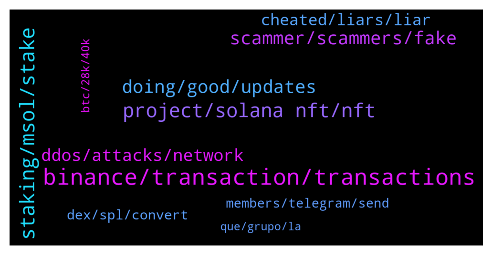

# **@solana**
 ## Analysis for **2022-01-09** - **2022-01-10**.

---

## 📊 **Basic Stats**

**n_messages_sent**: 516

---

---

## 🔝 **Top keywords and related messages**

1. **binance, transaction, transactions**

    @jcr712 --- *Same thing happened with me a few times also* **--->** [TG Discussion](https://t.me/solana/896489)

    @Stecco --- *Is it normal that my transfer from binance to kucoin is still processing after 4 hours?* **--->** [TG Discussion](https://t.me/solana/896302)

    @agregortrader --- *hi all. any trouble with solchain? 60 mins waiting usdc ( sol ) senting* **--->** [TG Discussion](https://t.me/solana/898353)

    @germanvalverde86 --- *Hi. I mad a mistake yesterday and i send from my phantom wallet solchicks but.. To my address of solana on binance.. I understand wrong and i dont know i must before exchange to usdt.. Any idea? Or i loose my money? Thanks!* **--->** [TG Discussion](https://t.me/solana/896173)

    @Alyy85 --- *My coins got stuck and i didn't know msol is not listed on binance* **--->** [TG Discussion](https://t.me/solana/898322)

    @Alyy85 --- *Admin any info about Msol will list on binance* **--->** [TG Discussion](https://t.me/solana/898320)

2. **staking, msol, stake**

    @Javier --- *That’s liquid staking token you get when staking Sol on marinade* **--->** [TG Discussion](https://t.me/solana/896644)

    @R --- *OK. Is it worth it?? I'm already staking SOL* **--->** [TG Discussion](https://t.me/solana/896657)

    @R --- *OK thanks for your help. I'm currently staking through "ChainFlow". Not made much with them at the moment* **--->** [TG Discussion](https://t.me/solana/896667)

    @cryptolover1987 --- *It’s marinade staked SOL.   Please refer this 👇🏻 🔗 https://blog.saber.so/saber-partners-with-marinade-finance-to-make-staking-liquid-throughmsol-pool-1d5c75f63eb9?gi=d3d9b3e5385d* **--->** [TG Discussion](https://t.me/solana/896695)

    @callq --- *When do I see when the next epoch ends (and I get my mSOL marinade rewards)? Also how/where will rewards be paid out to mSOL holders, how does that work?* **--->** [TG Discussion](https://t.me/solana/897787)

    @callq --- *It simply makes staking a bit easier because you don't have to choose a validator. On the other hand, you put your trust into some 3rd part entity which is holding your SOL for you.* **--->** [TG Discussion](https://t.me/solana/896663)

3. **project, solana nft, nft**

    @donomanji --- *I think we need to get confirmation that both Codi and p2pb2b are in fact integrating with Solana, as they have been stating that its problems with the Solana integration, which obviously is not good for Solana to be associated if it is not in fact being done* **--->** [TG Discussion](https://t.me/solana/897216)

    @g0d007 --- *Hey admin, I have a question about a project build on your system. CODI  They are trying to list on p2pb2b  but they need to integrate the SOL network on P2pb2b first.  Is it that hard to integrate your network ?  And can’t you help them with that 🤷🏼‍♂️ We ( CODI ) investors postponed for the 3th time and p2pb2b keep telling its their fault, but people are getting annoyed and think we got scammed by CODI 🤦🏼‍♂️. Please help 😂* **--->** [TG Discussion](https://t.me/solana/897193)

    @arj_lab --- *Hello guys. How can I access my project on solana ecosystem? I want to change some information* **--->** [TG Discussion](https://t.me/solana/897166)

    @Nonsy --- *Where can we get new legit Solana projects, that are yet to launch?* **--->** [TG Discussion](https://t.me/solana/896339)

    @Dawg32 --- *Have I finally found the official Solana page* **--->** [TG Discussion](https://t.me/solana/896336)

    @daffyogonwa --- *Hello, can I get the roadmap 2022 for solana* **--->** [TG Discussion](https://t.me/solana/897122)

4. **scammer, scammers, fake**

    @Fthai028 --- *So sad this channel is full of scammer like Sharon Cox, but nobody can do something about it* **--->** [TG Discussion](https://t.me/solana/896747)

    @crptix --- *Scammers ask you to sync your wallet with their fake website and ask you to provide your recovery phrase or private key, so that they can steal your funds* **--->** [TG Discussion](https://t.me/solana/897371)

    @B_To_The_Izzo --- *So many scammets want to help me...lmao, hopefully someone real will soon* **--->** [TG Discussion](https://t.me/solana/897498)

    @Monterrey_Rice --- *Please beware of scammers and bad actors* **--->** [TG Discussion](https://t.me/solana/897149)

    @crptix --- *They are Nigerian scammers with fake profile pictures. Well mostly Nigerian* **--->** [TG Discussion](https://t.me/solana/897334)

    @Fthai028 --- *She is a scammer, please BAN ASAP* **--->** [TG Discussion](https://t.me/solana/896711)

5. **doing, good, updates**

    @chaingirl --- *Good morning all, how's your weekend going?* **--->** [TG Discussion](https://t.me/solana/896040)

    @Monterrey_Rice --- *how is your day going @mahib45 ?* **--->** [TG Discussion](https://t.me/solana/898377)

    @Monterrey_Rice --- *How we doing today SOL fam??* **--->** [TG Discussion](https://t.me/solana/897536)

    @mahib45 --- *Hello dear  I am doing good! How are you doing? ❤* **--->** [TG Discussion](https://t.me/solana/898386)

    @Annie9988 --- *I wish you all good health and prosperity Goodnight friend* **--->** [TG Discussion](https://t.me/solana/897473)

    @Goddessofluck1 --- *I wish you a pleasant weekend, I hope I can bring you good luck.* **--->** [TG Discussion](https://t.me/solana/896913)

6. **ddos, attacks, network**

    @Zyxter11 --- *I am always talk about that and the developer don't respon to me* **--->** [TG Discussion](https://t.me/solana/896828)

    @Robert --- *The network is under DDOS attacks, that's the reason for the slow and problematic transactions in recent times.* **--->** [TG Discussion](https://t.me/solana/896822)

    @Zyxter11 --- *This answer : - target of attack? No, not an intentional, malicious attack. - how many? Several, because they're not attacks, they're bots spamming IDOs - Whenever there's an NFT drop or an IDO bots spam the launch to try mint/buy as many as possible. Combined with a bug in the codebase that is causing on-chain programs to drop out of cache and require constant recompilation, driving up replay times and pushing out other transactions from being included in blocks - big transactions consumed all available compute resources leaving no space for other transactions, TPS dropped from 2,500-3,000 to 500-1000 as validators prioritized votes to maintain consensus - a fix for the cache thrashing is currently being deployed to mainnet as part of version 1.8.12, so far about 13% of stake have it, the target is for 15% to upgrade today, if things remain stable we'll see further stake upgrading in the coming days, can't yolo changes to mainnet - not a concern for longevity, just growing pains* **--->** [TG Discussion](https://t.me/solana/897028)

    @B_sh999 --- *If the issue doesn't about proof of history concept then fixing it should be easy.* **--->** [TG Discussion](https://t.me/solana/896070)

    @PowerCosMike --- *Does the team have any ideas to stop DDoS* **--->** [TG Discussion](https://t.me/solana/896091)

    @tobe001 --- *My own worry is they are not communicating on what progress they are making to mitigate the outages. . Which makes one want to believe its am overwhelming challenge to the developers...* **--->** [TG Discussion](https://t.me/solana/897004)

7. **cheated, liars, liar**

    @Sharon_892 --- *I am a living person, and you are a liar. You don't even have an avatar* **--->** [TG Discussion](https://t.me/solana/896510)

    @pamelacurry --- *So you just speak whatever your mouth wants to ?* **--->** [TG Discussion](https://t.me/solana/897318)

    @Sharon_892 --- *Why don't you be fooled by a liar to drive you crazy?* **--->** [TG Discussion](https://t.me/solana/896604)

    @Sharon_892 --- *You can't even eat. Who wants to lie to you, pauper?* **--->** [TG Discussion](https://t.me/solana/896523)

    @sellagram1 --- *Yes you must be super intelligent to know that I am a nose* **--->** [TG Discussion](https://t.me/solana/896284)

    @Robert --- *That thought came fr your brain. 😂* **--->** [TG Discussion](https://t.me/solana/897285)

8. **dex, spl, convert**

    @mahib45 --- *Check it out link below on how you can buy SOL here - https://coinmarketcap.com/currencies/solana/markets/  Or https://www.coingecko.com/en/coins/solana#markets  You can also buy on DEXs by connecting your wallet with DEXs. For DEXs - https://t.me/solana/481292   Please note that our admins won't DM you first* **--->** [TG Discussion](https://t.me/solana/897457)

    @Innervision0021 --- *Not sure about their dex sorry man, but the coin is worth looking into* **--->** [TG Discussion](https://t.me/solana/897756)

    @Yoyo --- *Like can I swap my ETH for sol on 1inch or polygon* **--->** [TG Discussion](https://t.me/solana/896395)

    @Yoyo --- *How do I add sol to MM ?* **--->** [TG Discussion](https://t.me/solana/896370)

    @Jordan --- *Different ecosystem tho right? I do have some FTM tho. Is there a DEX you recommend?* **--->** [TG Discussion](https://t.me/solana/897723)

    @magnusthemagnus --- *yo can i get a little sol to bridge over?* **--->** [TG Discussion](https://t.me/solana/897880)

9. **members, telegram, send**

    @iLovedonpaul --- *Please does solana have any airdrop not on telegram? Because there are some bots claiming to solana airdropbot* **--->** [TG Discussion](https://t.me/solana/896870)

    @mahib45 --- *Hello to all the newcomers! 👋    Welcome to Solana official community! As you just entered in #Solana, in case you have a question about what is #Solana?  Solana is a fast, secure, and censorship-resistant blockchain providing the open infrastructure required for crypto to scale to global adoption.   To read more about Solana please visit  Website: www.solana.com Document: https://docs.solana.com/introduction  ⚠️ Please be aware of fraudulent actors posing as Solana team members on Telegram. If you do receive suspicious messages, do not respond, click on links or follow any instructions. ✅ We recommend changing your telegram privacy settings to avoid being added to scam groups. ❗️There is no Solana airdrop or free giveaway!* **--->** [TG Discussion](https://t.me/solana/897258)

    @B_To_The_Izzo --- *Hey guys, im just getting into Solana/Solanium now and just have a couple questions if thats ok? So if I stake SLIM through Solanium to participate in a launch I am given xSLIM as the governance token and thats what I use to buy the token if I'm selected through the whitelist lottery? Or do I need to stake and then also have extra SLIM to make my purchase with?* **--->** [TG Discussion](https://t.me/solana/897491)

    @Z --- *After joining the group, too many scammers sending personal messages and pretending to be from solana customer support. Blocking and reporting them as spam. Anyways, thanks guys... I'll buy then* **--->** [TG Discussion](https://t.me/solana/898137)

    @mahib45 --- *⚠️  Community Rules  ⚠️  ☀️We are a friendly community - please treat each other with respect. ☀️Personal attacks, harassment, racism, bigotry, doxing and harmful slurs of any kind will not be tolerated. ☀️No spam, shilling advertising or referral links ☀️To maintain the integrity of this group, posts that are repetitive, irrelevant or for personal gain will be deleted. ☀️Please write only in English -  check out our international communities for a Solana group in your region! ☀️Buying and selling, OTC discussion between community members is not allowed. ☀️Members who post short statements about price or volume without any context or reasoning will be given a warning; if you continue, you will be banned.  ☀️Admins are happy to help, so don't hesitate to ask. ⚠️Please be aware of scammers. Admin will never send you direct messages first nor ask you to send funds. Be sure to check the admin tag before you send a DM to any of the admins. ⚠️The safety of the community is a top priority for Solana. With this in mind, please do not use the Solana logo in your account profile or otherwise impersonate Solana or Solana team members. Any infringement of this nature may result in the removal of your account from this group, without notice.* **--->** [TG Discussion](https://t.me/solana/897396)

    @Folaross --- *Use Multichain on Trust wallet to import your phrase words then add Solana to your assets list for you to send to any wallet of your choice.  ⚠️ Please be aware of fraudulent actors posing as Solana team members on Telegram. If you do receive suspicious messages, do not respond, click on links or follow any instructions. ⚠️ Please also be aware of giveaways promoted on YouTube, in Medium articles or fake Telegram groups. ❗️There is no Solana airdrop or free giveaway! Do not send SOL anywhere with the expectation that you will receive more back.  ✅ We recommend changing your telegram privacy settings to avoid being added to scam groups.* **--->** [TG Discussion](https://t.me/solana/896457)

10. **btc, 28k, 40k**

    @C --- *BTC is at a support of 40k, if it breaks the support of 40K the next support is 28K, in my opinion this is bearmarkt signs, but again a cycle like that never happened that it fell to 3rd. Don’t take this as financial advice but aslong as BTC floats between 40K+ you’re safe* **--->** [TG Discussion](https://t.me/solana/898200)

    @Julie0318 --- *today. How do you feel about the recent market volatility?* **--->** [TG Discussion](https://t.me/solana/896888)

    @jugador654 --- *Which one? I just want to know why btc will drop to 28k I think it’s a lot* **--->** [TG Discussion](https://t.me/solana/898339)

    @jugador654 --- *In Argentina you can buy btc for 41k* **--->** [TG Discussion](https://t.me/solana/898336)

    @Benn2550 --- *Wait for btc 28k to buy anything* **--->** [TG Discussion](https://t.me/solana/898223)

    @marthinae --- *Currently, both ETH/BTC & ETH/USDT pairs are extremely bearish for the entire week.  The BTC pair showcase a remarkable bullish momentum in the long term.* **--->** [TG Discussion](https://t.me/solana/897986)

