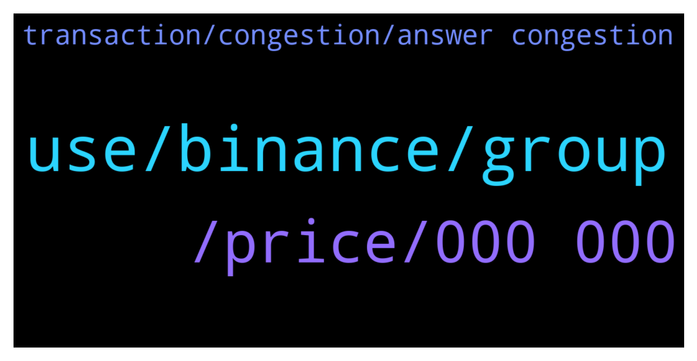

# **@terralunachat_officially**
 ## Analysis for **2022-01-09** - **2022-01-10**.

---

## 📊 **Basic Stats**

**n_messages_sent**: 47

---

---

## 🔝 **Top keywords and related messages**

1. **use, binance, group**

    @Adilsabr777 --- *Bro I want to Widhraw Binance Terra Luna to Terra Station wallet In Terra Station It's not have any Momo Then we can send without any problem?* **--->** [TG Discussion](https://t.me/terralunachat_officially/23285)

    @André --- *Hello for everyone! Please, Terra ecosystem supports metamask wallet? Someone can answer me?* **--->** [TG Discussion](https://t.me/terralunachat_officially/23133)

    @Mayginn --- *You can withdraw from binance to terra station without memo…. It is very important to use memo when sending from terra station to binance .  I hope that answer your question.* **--->** [TG Discussion](https://t.me/terralunachat_officially/23288)

    @Gate5569 --- *Has anyone tried to withdraw UST from Kucoin to Terrastation today?* **--->** [TG Discussion](https://t.me/terralunachat_officially/23135)

    @Don_Papichul0 --- *Go to your station wallet and copy the address.   On binance make sure you read the instructions if they ask for a memo then provide it. You’ll find the memo on the Terra station usually in the same area as your wallet address.   Copy your Terra station wallet address and paste it into Luna on binance.   Remember you withdraw on binance and receiving it on Terra station walllet.* **--->** [TG Discussion](https://t.me/terralunachat_officially/23290)

    @Ludovic_coin --- *hi, I have an issue with terra bridge to transfer funds from terra to osmosis* **--->** [TG Discussion](https://t.me/terralunachat_officially/23268)

2. **, price, 000 000**

    @Great fudder --- *I change my Mind is going to 20$* **--->** [TG Discussion](https://t.me/terralunachat_officially/23122)

    @Randy --- *How's your 350$ Luna prediction 😄* **--->** [TG Discussion](https://t.me/terralunachat_officially/23121)

    @saramorgana6 --- *hello! I bought Luna yesterday ... but I saw that a Luna alone is somewhat expensive. do you think it will go down? is it too late to upload to the project !?* **--->** [TG Discussion](https://t.me/terralunachat_officially/23243)

    @MDC33 --- *Buy shiba inu😂 1000x in one year* **--->** [TG Discussion](https://t.me/terralunachat_officially/23148)

    @edwardc --- *Luna is going to $0.000 😭😭😭* **--->** [TG Discussion](https://t.me/terralunachat_officially/23126)

    @Jon --- *Bought Luna at $67 it’s going to $150* **--->** [TG Discussion](https://t.me/terralunachat_officially/23102)

3. **transaction, congestion, answer congestion**

    @Ludovic_coin --- *after confirm, I have got an error message.* **--->** [TG Discussion](https://t.me/terralunachat_officially/23270)

    @supersort --- *Congestion,You can try again after clearing your browser cookiesz* **--->** [TG Discussion](https://t.me/terralunachat_officially/23279)

    @Giulio --- *Good morning, why does the translation not close? I tried to swap Luna to Ust on Terra Station.. can i delete the transaction?* **--->** [TG Discussion](https://t.me/terralunachat_officially/23249)

    @Gate5569 --- *Yeah it was just congestion. Cleared after a couple hours* **--->** [TG Discussion](https://t.me/terralunachat_officially/23218)

    @Brian --- *Yes I did It with no problem* **--->** [TG Discussion](https://t.me/terralunachat_officially/23217)

    @supernis --- *My transaction was suck on Harmony side because of insufficient gas fee. I guess it could happen from time to time* **--->** [TG Discussion](https://t.me/terralunachat_officially/23163)

