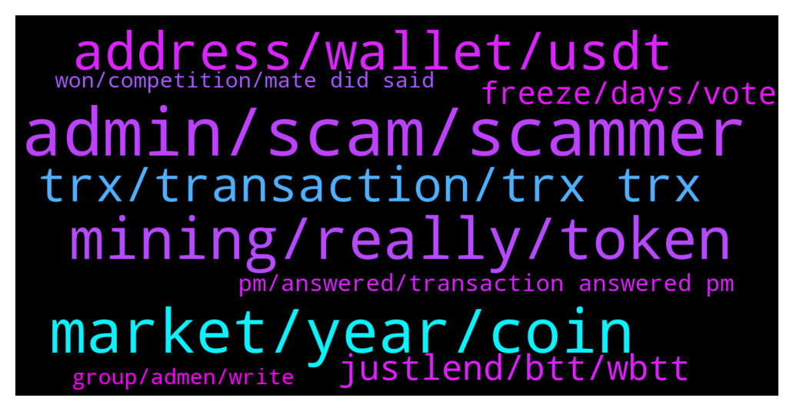

# **@tronnetworkEN**
 ## Analysis for **2022-01-09** - **2022-01-10**.

---

## 📊 **Basic Stats**

**n_messages_sent**: 338

---

---

## 🔝 **Top keywords and related messages**

1. **admin, scam, scammer**

    @Magnavox_Business --- *Are you the admin? I didn't ask you. 🥴* **--->** [TG Discussion](https://t.me/tronnetworkEN/3821296)

    @Magnavox_Business --- *He blocked me. I can't see the tag; or he doesn't have username.* **--->** [TG Discussion](https://t.me/tronnetworkEN/3821315)

    @Himanshu --- *Unknown person stealing from you and pretending to help* **--->** [TG Discussion](https://t.me/tronnetworkEN/3819885)

    @فيراس --- *Keep wondering... Do they really gain any profit? The scam busines 😕* **--->** [TG Discussion](https://t.me/tronnetworkEN/3821407)

    @Chethan --- *admin please ban tron guardian he is doing scam* **--->** [TG Discussion](https://t.me/tronnetworkEN/3821156)

    @simon866 --- *Check on his tag please and if so send the tag here and we will ban him 👍* **--->** [TG Discussion](https://t.me/tronnetworkEN/3821313)

2. **market, year, coin**

    @Himanshu --- *Am i the only one thinking that company will dissolve this year look at the bear destroying tron. Still i am buying every dip.😅* **--->** [TG Discussion](https://t.me/tronnetworkEN/3817497)

    @Himanshu --- *But reputation of the coin is decreasing day by day. Instead of attracting new customers i belive some old are closing and leaving. If i was the new customer i'll first go to reviews (leave market cap) and those are not good. Though i use wrong word dissolve.😅 sorry for that.* **--->** [TG Discussion](https://t.me/tronnetworkEN/3817522)

    @xPommepote --- *JustStake and earn more 💪🏻 till the market gets better* **--->** [TG Discussion](https://t.me/tronnetworkEN/3817569)

    @Paul 🎭 --- *There's a reason for this 4 year cycle. It's related to BTC halving* **--->** [TG Discussion](https://t.me/tronnetworkEN/3818826)

    @maddy1308 --- *Compare with last week, TRON coin rate is decreasing* **--->** [TG Discussion](https://t.me/tronnetworkEN/3818834)

    @Brito --- *Suggest some good coin to invest now* **--->** [TG Discussion](https://t.me/tronnetworkEN/3819509)

3. **mining, really, token**

    @Carlos_TRX --- *company disolve? TRON was decentralized since the beginning TRON Foundation was one more actor mate, nothing changed mate* **--->** [TG Discussion](https://t.me/tronnetworkEN/3817504)

    @Sagar --- *can anyone explain about tron mining app* **--->** [TG Discussion](https://t.me/tronnetworkEN/3820988)

    @Tronpromoter --- *are you guys loving the Smart Contracts on TRON right ?* **--->** [TG Discussion](https://t.me/tronnetworkEN/3819542)

    @Puru --- *Should i buy tron what are future long term targets?* **--->** [TG Discussion](https://t.me/tronnetworkEN/3821734)

    @PiterSpain --- *TRC10 is a TRON token protocol, a kind of token. It is something that will always exist, what I mean is that it is not something that can be removed from TRON Network, it is a feature of TRON  Maybe you could reformulate your question 😅* **--->** [TG Discussion](https://t.me/tronnetworkEN/3819992)

    @hiul78 --- *really? what can they do, the transaction is stuck on the tron blockchain* **--->** [TG Discussion](https://t.me/tronnetworkEN/3819055)

4. **address, wallet, usdt**

    @Surajzero --- *Someone stole my 3950trx 😢 from tronLink wallet Is there any chance to get it back  Please help meSomeone stole my 3950trx 😢 from tronLink wallet Is there any chance to get it back  Please help me* **--->** [TG Discussion](https://t.me/tronnetworkEN/3821224)

    @Đỗ --- *@agentpiki hello. my friend transferred usdt to me. His address is a private address, so the transaction was made through a public address. TQNheVnmrtnJ2KRUuePBhJWQWhFmPjX7iH.  There was an error that caused me to automatically refund to that address. Can I get it back?* **--->** [TG Discussion](https://t.me/tronnetworkEN/3820302)

    @suPerJack0 --- *If u have private key u can recover it.if not U can't do anything.* **--->** [TG Discussion](https://t.me/tronnetworkEN/3819271)

    @Siva --- *Sir i send usdt to wrong address  it possible to reback my usdts* **--->** [TG Discussion](https://t.me/tronnetworkEN/3820902)

    @xPommepote --- *If you send to the wrong address then you can not do anything.* **--->** [TG Discussion](https://t.me/tronnetworkEN/3819272)

    @agentpiki --- *It doesn't matter if I look into hash. The funds will not come back  Did you click on something* **--->** [TG Discussion](https://t.me/tronnetworkEN/3820880)

5. **trx, transaction, trx trx**

    @Gaziz --- *Then how to do it legal. I have 10210 dec it is about 560 trx* **--->** [TG Discussion](https://t.me/tronnetworkEN/3819180)

    @MilNoslen --- *Loooool they better Fing list TRX* **--->** [TG Discussion](https://t.me/tronnetworkEN/3820203)

    @Anthony --- *Can anyone help me about TRX* **--->** [TG Discussion](https://t.me/tronnetworkEN/3817962)

    @Guy --- *Now that Justin moved on, what's the plan for TRX?* **--->** [TG Discussion](https://t.me/tronnetworkEN/3820421)

    @xPommepote --- *No, TRX can’t be mined. Every website/app of cloud mining or mining are scams* **--->** [TG Discussion](https://t.me/tronnetworkEN/3819657)

    @Bhavin --- *How can I reverse my TRX?* **--->** [TG Discussion](https://t.me/tronnetworkEN/3819280)

6. **justlend, btt, wbtt**

    @Carlos_TRX --- *then first you have to unstake from justlend* **--->** [TG Discussion](https://t.me/tronnetworkEN/3817588)

    @hamed00000007 --- *I can not put the new btt in justlend* **--->** [TG Discussion](https://t.me/tronnetworkEN/3817592)

    @hamed00000007 --- *Yes exactly. Now my question is this wbtt that I have in justlend will not be a problem in the future?* **--->** [TG Discussion](https://t.me/tronnetworkEN/3817696)

    @hamed00000007 --- *I have a wbtt token, do I need to convert it to a new btt?* **--->** [TG Discussion](https://t.me/tronnetworkEN/3817542)

    @hamed00000007 --- *Launch new btt, no problem for my wbtt in justlend?* **--->** [TG Discussion](https://t.me/tronnetworkEN/3817722)

    @Carlos_TRX --- *WBTT to OLDBTT and then to new BTT* **--->** [TG Discussion](https://t.me/tronnetworkEN/3817553)

7. **freeze, days, vote**

    @aubreyxcx --- *Is there a limit i can freeze daily* **--->** [TG Discussion](https://t.me/tronnetworkEN/3818000)

    @Carlos_TRX --- *no, there is no danger while you freeze mate 👍🏻* **--->** [TG Discussion](https://t.me/tronnetworkEN/3817997)

    @turbo_tutone --- *3 days... if you want to witdraw you cant...every time you freeze it gets prolonged...* **--->** [TG Discussion](https://t.me/tronnetworkEN/3821435)

    @Shea --- *How do I freeze my tron* **--->** [TG Discussion](https://t.me/tronnetworkEN/3818503)

    @aubreyxcx --- *Okay you mean to say All Freezed amount of Tron will not get liquidated or loss while frozen* **--->** [TG Discussion](https://t.me/tronnetworkEN/3817995)

    @turbo_tutone --- *no limit there buddy...but every time you freeze, 3 days "cant unfreeze time" will be prolonged.* **--->** [TG Discussion](https://t.me/tronnetworkEN/3818140)

8. **pm, answered, transaction answered pm**

    @Carlos_TRX --- *feel free to ask what you need* **--->** [TG Discussion](https://t.me/tronnetworkEN/3817981)

    @simon866 --- *As mentioned send both and we can see them on back end 👍* **--->** [TG Discussion](https://t.me/tronnetworkEN/3821307)

    @Carlos_TRX --- *ask here what you need, no pm.* **--->** [TG Discussion](https://t.me/tronnetworkEN/3821052)

    @Carlos_TRX --- *I answered you in your pm mate* **--->** [TG Discussion](https://t.me/tronnetworkEN/3819427)

    @Magnavox_Business --- *Yeah, you can find @Carlos_TRX here.* **--->** [TG Discussion](https://t.me/tronnetworkEN/3819305)

    @I_Am_Mamal --- *OK thank you very very much bro* **--->** [TG Discussion](https://t.me/tronnetworkEN/3817571)

9. **won, competition, mate did said**

    @Carlos_TRX --- *Yes, he was trolling mate 🤦🏻‍♂* **--->** [TG Discussion](https://t.me/tronnetworkEN/3820903)

    @agentpiki --- *Did you read what I just said* **--->** [TG Discussion](https://t.me/tronnetworkEN/3820884)

    @simon866 --- *Yep, we won fair and square, now they gonna just pretend it never happened? 🤦‍♂️* **--->** [TG Discussion](https://t.me/tronnetworkEN/3820838)

    @simon866 --- *Exactly, like to know what's going on with the competition we won 🤔* **--->** [TG Discussion](https://t.me/tronnetworkEN/3820837)

    @WEALTH1122 --- *No not at all. I am smarter than that* **--->** [TG Discussion](https://t.me/tronnetworkEN/3819910)

    @Carlos_TRX --- *nothing to do with us mate* **--->** [TG Discussion](https://t.me/tronnetworkEN/3817487)

10. **group, admen, write**

    @firmam12 --- *carlos ( S) not Carloz (Z)* **--->** [TG Discussion](https://t.me/tronnetworkEN/3819335)

    @simon866 --- *This is the only official group as mentioned 👍* **--->** [TG Discussion](https://t.me/tronnetworkEN/3821254)

    @Laura Jp --- *Write your problem on the group* **--->** [TG Discussion](https://t.me/tronnetworkEN/3820985)

    @xhng3 --- *Admen, what's the first two Korean words* **--->** [TG Discussion](https://t.me/tronnetworkEN/3820581)

    @suPerJack0 --- *He is not present in this group* **--->** [TG Discussion](https://t.me/tronnetworkEN/3819316)

    @Alio598233 --- *Ouh best is to Check their Website or TG when questions are ^_^ but feel free to ask here as well  :p (to stay safe)* **--->** [TG Discussion](https://t.me/tronnetworkEN/3819526)

