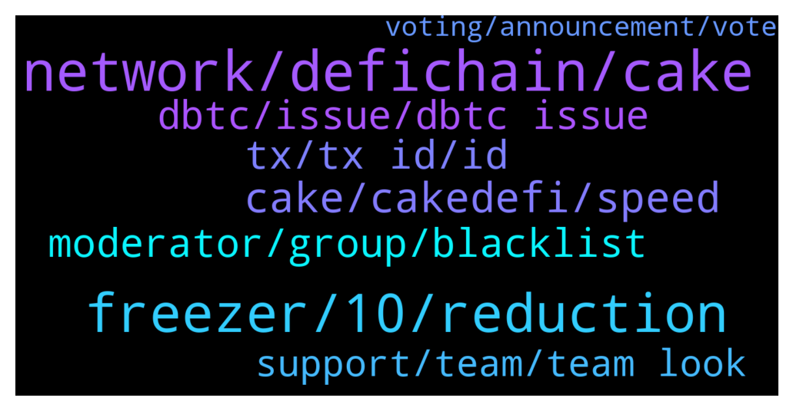

# **@CakeDeFi_EN**
 ## Analysis for **2022-01-10** - **2022-01-11**.

---

## 📊 **Basic Stats**

**n_messages_sent**: 284

---

---

## 🔝 **Top keywords and related messages**

1. **network, defichain, cake**

    @Sahin --- *So if I follow your info. Then for depositing Bitcoin to cake defi from binance. I choose the DFI network. For withdrawing btc to binance i choose the native network and that is BTC network.* **--->** [TG Discussion](https://t.me/CakeDeFi_EN/162808)

    @Sahin --- *Hello guys I still don't understand when to chose the right network... I think I might be stupid or something😜* **--->** [TG Discussion](https://t.me/CakeDeFi_EN/162803)

    @Sahin --- *This is the part where I am stuck. Because on cake for the defichain network it says. 'use this network to send to a defichain wallet'. Kucoin is not a defichain? The only defichain wallet I know is 'defichain wallet' on the Google play store.* **--->** [TG Discussion](https://t.me/CakeDeFi_EN/162794)

    @Sahin --- *Thanks for the chart. I think I get it now. Last example. If I deposit Ethereum from an exchange to cake defi. Then I choose the native network and that is the Ethereum Network. When I move inside the defichain ecosystem than it is dfi network. When I withdraw Ethereum out of cake defi i need to use the native network and that is Ethereum Network.* **--->** [TG Discussion](https://t.me/CakeDeFi_EN/162813)

    @senfhend --- *Hey Team, does it work to send eth directly from cake to Bittrex? Since it is sent via smart contract…* **--->** [TG Discussion](https://t.me/CakeDeFi_EN/163234)

    @Tomaz --- *Hello. Is it possible to transfer eth or usdt to defi chain wallet and back to cake? Is there than autoic change to deth and vice versa?* **--->** [TG Discussion](https://t.me/CakeDeFi_EN/162996)

2. **freezer, 10, reduction**

    @Stephan --- *Ah I see now, thank you! So rewards will be quite small in a few years if we reduce them every cycle 🙁* **--->** [TG Discussion](https://t.me/CakeDeFi_EN/162938)

    @andreasisaak --- *You don't consider the reduction of block rewards that's happening over time to reduce inflation (similar to Bitcoin's halvings).* **--->** [TG Discussion](https://t.me/CakeDeFi_EN/162928)

    @Stephan --- *I see, but how come that reduction is so high? I would assume the last year (year 10) to yield most rewards, yet one basically makes no rewards in the calculation of the freezer for the last year.* **--->** [TG Discussion](https://t.me/CakeDeFi_EN/162931)

    @Stephan --- *So that means 36*1.658% = ~50% APY that I esentially lose in a year? If I stake for 45% APY, don't I have a loss at the end of the year? Assuming everything stays constant, no price increase, no freezing etc.* **--->** [TG Discussion](https://t.me/CakeDeFi_EN/162933)

    @Stephan --- *How exactly does the freezer calculation work? Seems super odd that the development of capital in DFI takes on a logarithmic function instead of an exponential one. Why would it start saturating after 10 years? Also, an APY of 100% is about 70% APR, yet Freezer's calculations boil down to merely about 100% increase of DFI for the ENTIRE 10 years. Assuming constant APY of 100%, I'd expect 100*(1,7^10) percent increase of capital. Where am I wrong?* **--->** [TG Discussion](https://t.me/CakeDeFi_EN/162927)

    @Michael_Schredl --- *They DFI are frozen, take a look at the Freezer page* **--->** [TG Discussion](https://t.me/CakeDeFi_EN/162711)

3. **cake, cakedefi, speed**

    @Sacha --- *Hey moderators, My phone is broken and I have no backup of my Google Authenticator… so I am not able to login to cake. Is there a way to reset it?* **--->** [TG Discussion](https://t.me/CakeDeFi_EN/162907)

    @DmgBautista --- *You can contact support if you wish to speed up the process. By Cake website or if more directly, you can contact the below email  https://cake.zendesk.com/hc/en-us/requests/new* **--->** [TG Discussion](https://t.me/CakeDeFi_EN/163422)

    @DmgBautista --- *Hi! Any user with 20k DFI frozen at Cake may cast a vote. If thats your case, you will have received an email alerting you from the possibility and how to do it :)* **--->** [TG Discussion](https://t.me/CakeDeFi_EN/163473)

    @Michael_Schredl --- *Please write the Cake Support a ticket, they have to check that* **--->** [TG Discussion](https://t.me/CakeDeFi_EN/163227)

    @enalettin --- *Speed up cake speed up 🐢* **--->** [TG Discussion](https://t.me/CakeDeFi_EN/163201)

    @BerndMack --- *are you sure you are right here? cakedefi.com* **--->** [TG Discussion](https://t.me/CakeDeFi_EN/162753)

4. **tx, tx id, id**

    @yeahright22 --- *Admin what about tx ids of dfi withdrawals which seems to only completed on the site, but nothing appears on blockchain for 8 hours.So the dfi withdrawal is working only on "site" in reality is not?!* **--->** [TG Discussion](https://t.me/CakeDeFi_EN/163292)

    @yeahright22 --- *hi, what about confirmed (paid out) DFI transaction, have tx ID, but the tx id does not exist for 4 hours. So after succesful withdrawal of DFI , no withdrawal 4 hours now?!* **--->** [TG Discussion](https://t.me/CakeDeFi_EN/163226)

    @yeahright22 --- *Im not the only one who has this kind of error, sais completed, but not even exist on chain.Please forward it.Missing 10k$ for 10hours* **--->** [TG Discussion](https://t.me/CakeDeFi_EN/163440)

    @Dan --- *Anyone else withdraw dfi and the website says tx went thru but it's not in your defi wallet?* **--->** [TG Discussion](https://t.me/CakeDeFi_EN/163376)

    @yeahright22 --- *Its 2 withdraw, not above.as clearly u can see, the tx jd not existing.Thx for the help* **--->** [TG Discussion](https://t.me/CakeDeFi_EN/163444)

    @yeahright22 --- *I have two txid , but its not exist on chain for 10 hours now..* **--->** [TG Discussion](https://t.me/CakeDeFi_EN/163432)

5. **moderator, group, blacklist**

    @Misko --- *he has already contacted me(the moderator) about the issue* **--->** [TG Discussion](https://t.me/CakeDeFi_EN/163104)

    @zcpmv --- *Yeah he suddenly block me, wow* **--->** [TG Discussion](https://t.me/CakeDeFi_EN/162762)

    @Kassius84 --- *Did you started the direct conversation or the mod? No Moderator will contact you you first. Be aware of scammers, they will impersonates moderators* **--->** [TG Discussion](https://t.me/CakeDeFi_EN/163107)

    @onur_yz --- *By the way, someone with your name and profile photo sent a private message. He sent me a link.  Everyone be careful. @Michael_Schredl* **--->** [TG Discussion](https://t.me/CakeDeFi_EN/162726)

    @Kassius84 --- *You can send the screenshot to a moderator. If this person is in the group and his behavior is against the community rules, he will left the group* **--->** [TG Discussion](https://t.me/CakeDeFi_EN/163103)

    @mm_phoenix --- *Click on his Name. Was it really him? Scammer use names from Moderator and ask people somethink like this* **--->** [TG Discussion](https://t.me/CakeDeFi_EN/162761)

6. **dbtc, issue, dbtc issue**

    @Sebastian --- *You are right,  but nowbody told me, that the DeFi Line is death for dBTC* **--->** [TG Discussion](https://t.me/CakeDeFi_EN/163212)

    @Vincent --- *Hallo kann ich dbtc eigentlich auch an eine btc adresse senden?* **--->** [TG Discussion](https://t.me/CakeDeFi_EN/163407)

    @Sebastian --- *How long does it take, that dBTC work?* **--->** [TG Discussion](https://t.me/CakeDeFi_EN/163207)

    @Albert --- *This will wrap the BTC to dbtc?* **--->** [TG Discussion](https://t.me/CakeDeFi_EN/163165)

    @AivernT --- *They're not gonna care coz it's "defi" nobody's accountable lol* **--->** [TG Discussion](https://t.me/CakeDeFi_EN/163237)

    @fabioandreatta --- *It has nothing to do with a bug. The dBTC issue is a DeFiChain issue, there has be an exploit/bug on the DeFiChain Blockchain that affects locked dBTC, to protect our customers Cake haulted all dBTC deposits and withdrawals. We can only open up again, when they finish their voting and implement the soloution to it. This is probably at the end of this week.   Please note: Bitcoin BTC deposits and withdrawals work fine and there is no issue. You can always deposit and withdrawal your Bitcoin, there has never been an issue affecting it. Only dBTC is affected* **--->** [TG Discussion](https://t.me/CakeDeFi_EN/163284)

7. **support, team, team look**

    @kramredaol84 --- *Nevermind. I'll just close the account* **--->** [TG Discussion](https://t.me/CakeDeFi_EN/163418)

    @Bongani --- *Hi how does this thing work ?* **--->** [TG Discussion](https://t.me/CakeDeFi_EN/163068)

    @andreasisaak --- *Contact support to sort it out, please. https://support.cakedefi.com* **--->** [TG Discussion](https://t.me/CakeDeFi_EN/163013)

    @jezzkng --- *you may submit a ticket to our support team, so they will look into it.   https://cake.zendesk.com/hc/en-us/requests/new* **--->** [TG Discussion](https://t.me/CakeDeFi_EN/162963)

    @jezzkng --- *you may write an email to our support team, follow the instructions https://cake.zendesk.com/hc/en-us/articles/900002785666-Lost-access-to-my-2FA-Two-factor-authentication-* **--->** [TG Discussion](https://t.me/CakeDeFi_EN/162913)

    @fabioandreatta --- *!Support please contact our CS team so they can look into this for you* **--->** [TG Discussion](https://t.me/CakeDeFi_EN/163293)

