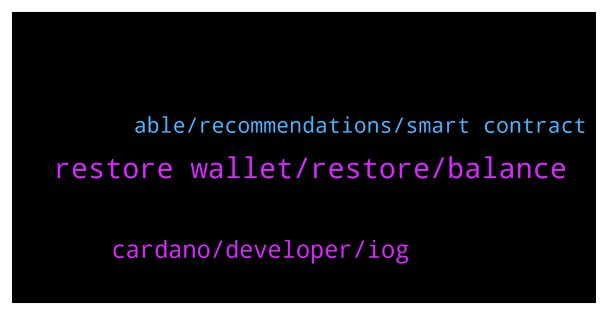

# **@Cardano**
 ## Analysis for **2022-01-10** - **2022-01-11**.

---

## 📊 **Basic Stats**

**n_messages_sent**: 52

---

---

## 🔝 **Top keywords and related messages**

1. **restore wallet, restore, balance**

    @MarkMorenz --- *Anyone having issues with yoroi wallet* **--->** [TG Discussion](https://t.me/Cardano/767863)

    @😊 --- *Yoroi... for mobile Pc in chromebrowser extensions yoroi ccvault , nami , gero wallets  ☝light wallets  daedalus(node +wallet) needs 12gb ram and 30gb disk space and 2 core processor and high speed internet* **--->** [TG Discussion](https://t.me/Cardano/767772)

    @HawaiiStevo --- *Q: when claiming rewards u are prompted for a spending password* **--->** [TG Discussion](https://t.me/Cardano/767636)

    @HawaiiStevo --- *I don’t remember setting one or need to reset how do I do this ? Tks* **--->** [TG Discussion](https://t.me/Cardano/767637)

    @soup34 --- *Hi Can I send coins to my Used Addresses? Or do I always need to go to a new address?* **--->** [TG Discussion](https://t.me/Cardano/767980)

    @ekimetrof --- *Any updates on Yoroi not syncing? Not showing balance etc? Thanks* **--->** [TG Discussion](https://t.me/Cardano/767977)

2. **cardano, developer, iog**

    @invivekworld --- *Thanks, can we stake cardano or its better to stake at binance?* **--->** [TG Discussion](https://t.me/Cardano/767946)

    @G12345444 --- *Hi, there are cardano certification that I should take to become cardano developer? Thanks* **--->** [TG Discussion](https://t.me/Cardano/767727)

    @CardanoGoldDragon --- *Cardano developer looking for the job?* **--->** [TG Discussion](https://t.me/Cardano/767809)

    @veriumfellow --- *Please vote for Ergo my Cardano friends https://twitter.com/nicehashmining/status/1480630789264093191?s=21* **--->** [TG Discussion](https://t.me/Cardano/767968)

    @DimkaT --- *Yes, both of them can stake cardano.  What is better is up to you to decide. :) In cardano wallets it is safer as only you know the private key.* **--->** [TG Discussion](https://t.me/Cardano/767947)

    @CardanoGoldDragon --- *Invite for Cardano discord expired :)* **--->** [TG Discussion](https://t.me/Cardano/767867)

3. **able, recommendations, smart contract**

    @ZeusZolta --- *Hello. I need recommendations, where I should hold my ada? Metamask Ledger* **--->** [TG Discussion](https://t.me/Cardano/767751)

    @Alex --- *Any one know any thing about being able to stake and lend Ada at the same time ?* **--->** [TG Discussion](https://t.me/Cardano/767563)

    @mostudio --- *If you stake using one of the Ada wallets mentioned and add your ada to an official sundaeswap scooper pool, you will also receive sundae tokens.* **--->** [TG Discussion](https://t.me/Cardano/767986)

    @IchinoseChizuruu --- *Hello. I need recommendations, where I should stake my ada? To binance or yoroi?* **--->** [TG Discussion](https://t.me/Cardano/767710)

    @apex_pool_spo --- *my understanding: you will be able to lend ADA by sending it to a smart contract. the owner of the smart contract will be able to stake it and get the rewards for staking and do with them what he wants (keep them or share them with the owner of the ADA).* **--->** [TG Discussion](https://t.me/Cardano/767580)

    @Alain_Finis --- *I want to participate in planting 🎄🌴🎄, how can I be part in donating ?* **--->** [TG Discussion](https://t.me/Cardano/767524)

